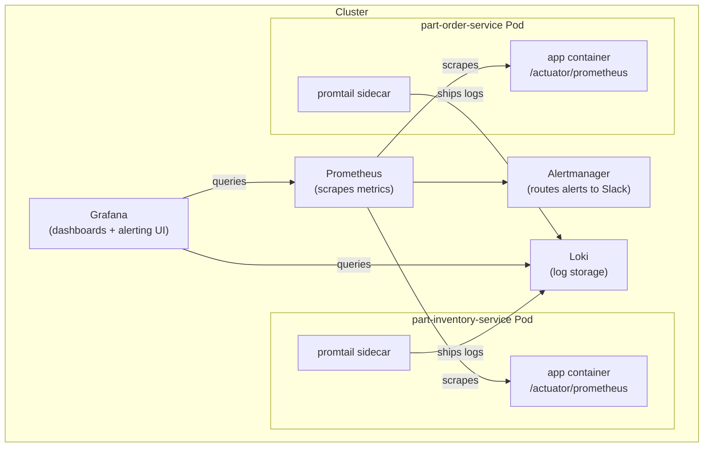
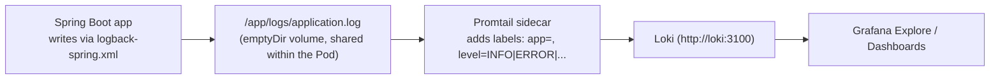

# Monitoring & Logging for part-order-app-java (Prometheus, Grafana, Loki)

A fourth variant alongside [`part-order-app-java/k8s`](../part-order-app-java/k8s/NOTES.md),
[`k8s-with-mysql`](../part-order-app-java/k8s-with-mysql/NOTES.md), and
[`k8s-istio`](../part-order-app-java/k8s-istio/README.md) — this one doesn't
change how the app runs, it adds an **observability stack** alongside it:
metrics via Prometheus, dashboards via Grafana, and log aggregation via
Loki + a Promtail sidecar per Pod.

Background reading: [05-sidecars.md](../../kubernetes/kubernetes-intermediate/05-sidecars.md)
covers the sidecar pattern this stack leans on for shipping logs;
[01-debugging-common-issues.md](../../kubernetes/kubernetes-intermediate/01-debugging-common-issues.md)
is the manual-inspection counterpart to what this stack automates.

> **Namespace note:** the commands and PromQL queries below use whatever
> namespace the app is actually deployed to when this stack was written
> (`inventory-service`/`order-service` show up in some queries, plain
> `default` in others) — this is independent of the `part-order-app` /
> `part-order-app-mysql` / `part-order-app-istio` namespaces used by the
> other three variants. Swap the `-n <namespace>` flags below for
> whichever namespace you actually deployed `part-inventory-service` /
> `part-order-service` into.

---

## Verified: log shipping actually works end-to-end

This stack was stood up on a real (Docker Desktop) cluster and checked
past the "Pods are Running" stage: the app writes to
`/app/logs/application.log`, the `promtail` sidecar log shows it
`watching new directory`/`tail routine: started` on that exact file, and
querying **Loki directly** (`/loki/api/v1/label/app/values`) confirms
both `part-inventory-service` and `part-order-service` log lines actually
landed, with `level` labels (`INFO`/`WARN`/`ERROR`) correctly extracted
by Promtail's regex pipeline stage.

Two things worth knowing if you're reproducing this on a small local
cluster (Docker Desktop / kind / minikube):

- **`prometheus-node-exporter` crash-loops** with `path / is mounted on /
  but it is not a shared or slave mount` — Docker Desktop's VM doesn't
  support the mount propagation `node-exporter` needs for its `/`
  hostPath mount. This is an environment limitation, not a chart or
  config problem; it only breaks node-level CPU/memory metrics and the
  `NodeHighCPU`/`NodeHighMemory` alerts — everything else in this stack
  (app metrics, logs, dashboards) is unaffected.
- **`loki-chunks-cache` couldn't schedule** (`Insufficient memory`) on a
  single-node cluster — the chart defaults `chunksCache.allocatedMemory`
  to **8Gi**. [loki-values.yaml](loki-values.yaml) now disables
  `chunksCache`/`resultsCache` outright: they're pure read-side
  performance optimizations (memcached in front of the object store),
  not needed for correctness at dev/test log volumes, and skipping them
  keeps this stack's total footprint small enough for a laptop cluster.

---

## What gets installed



| Component | Installed via | Purpose |
| --- | --- | --- |
| Prometheus | `prometheus-community/prometheus` Helm chart | scrapes `/actuator/prometheus` on both Spring Boot services, plus cluster metrics (`kube-state-metrics`, `node-exporter`, both bundled in the chart) |
| Grafana | `grafana/grafana` Helm chart | dashboards, Explore, and its own alerting engine |
| Loki | `grafana/loki` Helm chart, single-binary mode | stores logs shipped by Promtail |
| Promtail | sidecar container added to each app Deployment | tails `/app/logs/*.log` inside the Pod and pushes to Loki |
| Alertmanager | bundled with the `prometheus` chart | routes firing Prometheus alerts to Slack channels by severity |

Nothing here touches the Spring Boot services' own code — metrics come
from the `micrometer-registry-prometheus` dependency already in
`pom.xml`, and logs come from whatever `logback-spring.xml` already
writes to disk. This stack only adds the scraping/shipping/visualizing
layer on top.

---

## The four golden signals

Every service is monitored through the same four signals, regardless of
what the service actually does:

| Signal | What it measures | Prometheus metric |
| --- | --- | --- |
| **Latency** | how long requests take | `http_server_requests_seconds` |
| **Traffic** | requests per second | `http_server_requests_seconds_count` |
| **Errors** | rate of failed requests | `http_server_requests_seconds_count{status=~"5.."}` |
| **Saturation** | how full a resource is | `container_cpu_usage_seconds_total`, `container_memory_working_set_bytes` |

---

## Logs: why a sidecar instead of scraping stdout



Promtail runs as a second container in the same Pod as each Spring Boot
app, sharing an `emptyDir` volume mounted at `/app/logs`. The app writes
there because `application-dev.yml` sets `logging.file.name:
logs/application.log` — a relative path that resolves against the
container's working directory (`WORKDIR /app` in each `Dockerfile`),
landing at `/app/logs/application.log`. No env var controls this; it's
baked into the active `dev` profile's config, which is why the `prod`
profile needed the same `logging.file.name` added (see
[application-prod.yml](../part-order-app-java/part-inventory-service/src/main/resources/application-prod.yml))
— its `logback-spring.xml` also references `${LOG_FILE}` for file
logging, but only `application-dev.yml` used to set it. Promtail tails
the resulting file and ships every line to Loki with `app`/`level`
labels attached. Multi-line Java stack traces are collapsed into a
single log entry by a `multiline` pipeline stage keyed on the logback
timestamp pattern, so a 500-line exception doesn't show up as 500
separate log entries in Loki.

---

## Layout

```text
k8s-cluster-monitoring-logging/
  README.md                          # this file — what and why
  setup-and-run.md                   # ordered steps — how to stand it up and verify it
  grafana-values.yaml                # Grafana Helm values: admin creds, Prometheus + Loki datasources
  grafana-nodeport.yaml              # NodePort Service exposing Grafana outside the cluster
  loki-values.yaml                   # Loki Helm values: single-binary mode, filesystem storage
  promtail-configmap.yaml            # Promtail scrape/pipeline config, mounted into each app Pod
  part-inventory-deployment.yaml     # part-inventory-service Deployment + promtail sidecar
  part-inventory-service.yaml        # part-inventory-service Service (NodePort)
  part-order-deployment.yaml         # part-order-service Deployment + promtail sidecar
  part-order-service.yaml            # part-order-service Service (NodePort)
  prometheus-rules.yaml              # PrometheusRule CRD — needs kube-prometheus-stack
  prometheus-rules-values.yaml       # same rules, as Helm values for the standalone chart used here
  spring-boot-services-dashboard.json  # custom Grafana dashboard for both services
```

---

## Alerting rules included

| Alert | Fires when | Severity |
| --- | --- | --- |
| `PodNotReady` | a Pod's readiness has been `false` for 2m | warning |
| `DeploymentReplicasMismatch` | ready replicas ≠ desired replicas for 5m | warning |
| `HighErrorRate` | >1% of requests are 5xx for 2m | critical |
| `HighLatency` | p95 latency above 1s for 5m | warning |
| `PodOOMKilled` | a container's last termination reason was `OOMKilled` | critical |
| `ContainerFrequentRestarts` | more than 3 restarts in 15m | warning |
| `NodeHighCPU` | node CPU above 85% for 5m | warning |
| `NodeHighMemory` | node memory above 90% for 5m | critical |

Routed through Alertmanager to two Slack channels — `#alerts-critical`
for `severity: critical`, `#alerts-warnings` for everything else — see
[setup-and-run.md](setup-and-run.md) for the exact routing config.

---

## Health checks: the other half of "observability"

Prometheus/Grafana/Loki tell you something is wrong; liveness/readiness/
startup probes are what Kubernetes itself uses to *act* on health,
independent of whether anyone's watching a dashboard:

| Probe | On failure | Effect |
| --- | --- | --- |
| `startupProbe` | blocks liveness/readiness until it passes | protects a slow-starting JVM from a premature liveness kill |
| `livenessProbe` | container is killed and restarted | recovers from deadlocks / unresponsive state |
| `readinessProbe` | Pod removed from Service endpoints | zero-downtime rollouts; stops routing traffic to an unhealthy Pod |

Spring Boot Actuator exposes these as separate health groups
(`/actuator/health/liveness`, `/actuator/health/readiness`) — readiness
checks the database connection too, liveness doesn't, which is exactly
why a DB outage removes a Pod from load balancing without triggering a
pointless restart loop. Full probe YAML and the reasoning behind each
`failureThreshold`/`periodSeconds` value is in
[setup-and-run.md](setup-and-run.md#health-checks-liveness-readiness-and-startup-probes).

---

## Takeaway

This stack answers three different questions about the same two
services: Prometheus + Grafana answer "how is it performing" (the four
golden signals), Loki + Promtail answer "what did it actually log when
something went wrong," and liveness/readiness probes answer "should
Kubernetes itself route around or restart this Pod right now" — three
tools, no changes to application code, wired on top of Deployments that
otherwise look identical to [`k8s/`](../part-order-app-java/k8s/NOTES.md).
