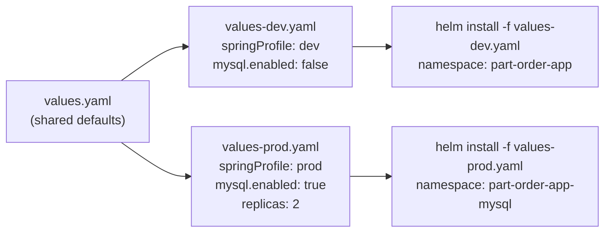

# part-order-app Helm chart

One chart, two environments. `values.yaml` holds the shared defaults (dev/H2
shape); `values-dev.yaml` and `values-prod.yaml` are thin overlays that pick
between the two stacks documented in [../../k8s/NOTES.md](../../k8s/NOTES.md)
and [../../k8s-with-mysql/NOTES.md](../../k8s-with-mysql/NOTES.md) — read
those first for architecture/request-flow diagrams, this file only covers the
Helm-specific parts.



## Layout

```
part-order-app/
  Chart.yaml
  values.yaml            # shared defaults (dev/H2 shape)
  values-dev.yaml         # dev overlay - explicit, symmetric with values-prod.yaml
  values-prod.yaml        # prod overlay - enables the mysql/ StatefulSet, 2 replicas
  templates/
    _helpers.tpl
    NOTES.txt
    part-inventory-service/  # configmap, deployment, service (ClusterIP)
    part-order-service/      # configmap, deployment, service (NodePort)
    mysql/                   # secret, init-configmap, headless service, statefulset
                              # - all gated on .Values.mysql.enabled
```

## Install

```bash
# dev - H2, no MySQL, NodePort 30080
helm install part-order-app . \
  -f values-dev.yaml \
  --namespace part-order-app --create-namespace

# prod - shared MySQL StatefulSet, 2 replicas per service, NodePort 30081
helm install part-order-app . \
  -f values-prod.yaml \
  --namespace part-order-app-mysql --create-namespace
```

Both releases can be installed side by side (different namespaces, different
NodePorts), same as the two plain-manifest stacks.

Preview rendered manifests without applying:

```bash
helm template part-order-app . -f values-dev.yaml
helm lint . -f values-prod.yaml
```

## Upgrading images

Images are tagged `:latest` (no digest change to trigger a rollout), so after
`build-commands-mac.sh` pushes new code, either bump `partInventoryService.image.tag`
/ `partOrderService.image.tag` and `helm upgrade`, or force a rollout directly:

```bash
kubectl rollout restart deploy/part-order-app-part-inventory-service -n <namespace>
kubectl rollout restart deploy/part-order-app-part-order-service -n <namespace>
```

## Key values

| Key | Default | Purpose |
| --- | --- | --- |
| `springProfile` | `dev` | `dev` (H2) or `prod` (MySQL) — must match `mysql.enabled` |
| `partInventoryService.replicaCount` | `1` | `2` in values-prod.yaml — safe once state is in MySQL |
| `partOrderService.service.nodePort` | `30080` | `30081` in values-prod.yaml, to allow both stacks at once |
| `mysql.enabled` | `false` | Deploys the MySQL StatefulSet + Secret + init ConfigMap |
| `mysql.existingSecret` | `""` | Point at a pre-created Secret instead of the generated one |
| `mysql.auth.*` | dev-safe placeholders | Override via `--set` or a secret-manager-generated values file for anything beyond local learning use |

## Uninstall

```bash
helm uninstall part-order-app -n part-order-app        # dev
helm uninstall part-order-app -n part-order-app-mysql   # prod
```

`helm uninstall` does not delete the namespace (it was created out-of-band via
`--create-namespace`) or the MySQL PVC (StatefulSet volumeClaimTemplates are
intentionally left behind) — remove those manually if you want a clean slate:

```bash
kubectl delete pvc -l app.kubernetes.io/component=mysql -n part-order-app-mysql
kubectl delete namespace part-order-app-mysql
```
