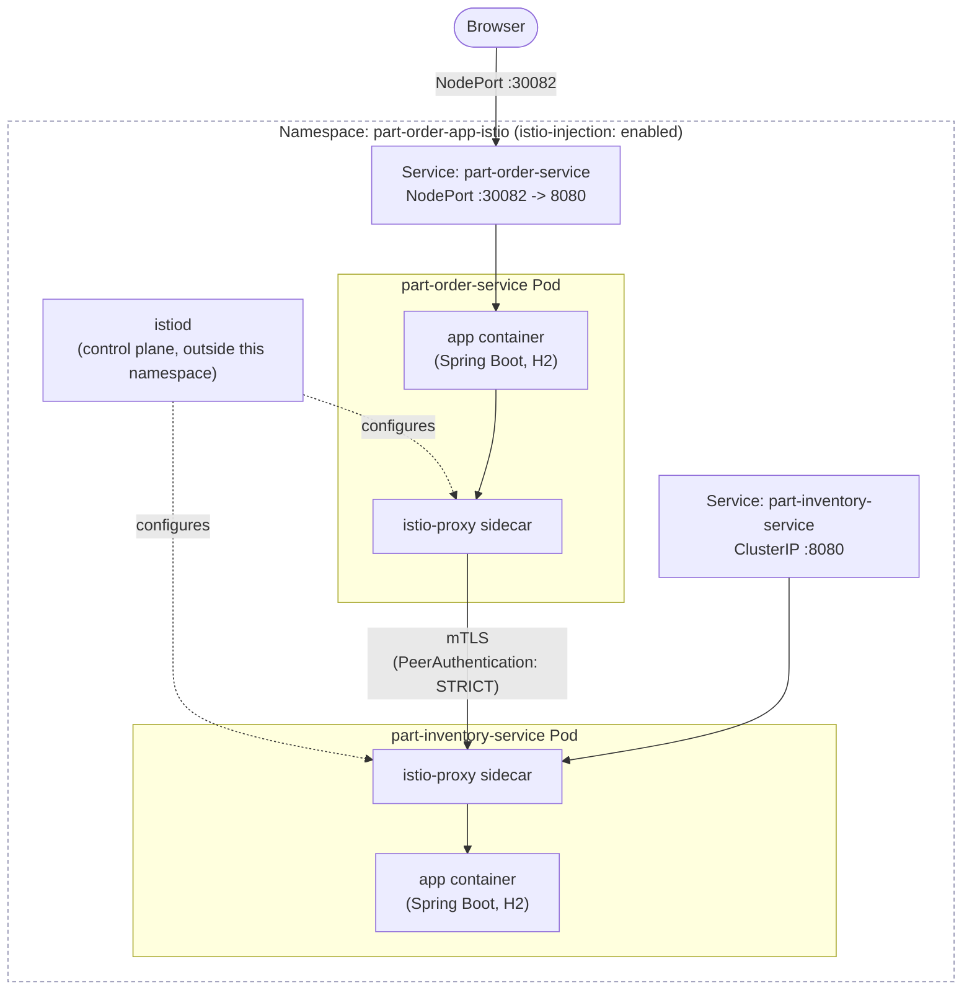

# part-order-app-java on Kubernetes (Istio service mesh)

Third variant, alongside [`../k8s`](../k8s/NOTES.md) (dev/H2, plain
Kubernetes) and [`../k8s-with-mysql`](../k8s-with-mysql/NOTES.md)
(prod/MySQL). This one reuses the exact same `dev`/H2 setup as `../k8s` —
**no MySQL** — and adds one thing on top: an Istio service mesh sidecar
next to every Pod, with mutual TLS enforced between the two services.

Background reading: [service-mesh.md](../../../kubernetes/kubernetes-advanced/03-service-mesh.md)
covers *why* a mesh exists and walks through this exact app as its
example — this directory is that doc made runnable.

## Architecture



Same two services, same Feign call, same H2-per-pod database as `../k8s`.
The only addition is the `istio-proxy` container in each Pod and the
`PeerAuthentication` object — neither Spring Boot app was changed or even
rebuilt.

## What's different from `../k8s`

| | `../k8s` (plain) | `../k8s-istio` (mesh) |
| --- | --- | --- |
| Namespace | `part-order-app` | `part-order-app-istio` |
| Profile / database | `dev`, H2 in-memory | `dev`, H2 in-memory — unchanged |
| Containers per Pod | 1 (just the app) | 2 (app + `istio-proxy`, auto-injected) |
| `part-order-service` → `part-inventory-service` traffic | plain HTTP | mutually authenticated TLS (mTLS), transparently |
| `part-order-service` NodePort | `30080` | `30082` |
| Extra manifests | — | `istio/peer-authentication.yaml` |
| Extra cluster prerequisite | none | Istio installed (`istioctl install`) |

## Layout

```text
k8s-istio/
  namespace.yaml
  istio/
    peer-authentication.yaml
  part-inventory-service/
    configmap.yaml
    deployment.yaml
    service.yaml
  part-order-service/
    configmap.yaml
    deployment.yaml
    service.yaml
```

## How the pieces fit together

- **Sidecar injection**: `namespace.yaml` carries the label
  `istio-injection: enabled`. That's the entire trigger — Istio's
  mutating admission webhook watches for Pods created in a labeled
  namespace and adds the `istio-proxy` container automatically. Nothing
  in the Deployment YAMLs asks for it explicitly.
- **mTLS**: `istio/peer-authentication.yaml` sets `mode: STRICT` for the
  namespace, so every mesh-to-mesh call must be mutually authenticated
  TLS. `istiod` issues and rotates the certificates each sidecar uses —
  neither `part-order-service` nor `part-inventory-service`'s code is
  aware TLS is involved; they still write and receive plain HTTP, same
  code as `../k8s`.
- **Everything else is identical to `../k8s`**: same images, same H2
  `dev` profile, same ConfigMaps, same single-replica reasoning (H2 is
  per-pod, in-memory — see `../k8s/NOTES.md` for why that caps replicas
  at 1), same Feign call from `part-order-service` to
  `part-inventory-service` over the Service's short DNS name.
- **Distinct namespace + NodePort**: `part-order-app-istio` and `30082`
  don't collide with `../k8s` (`part-order-app`, `30080`) or
  `../k8s-with-mysql` (`part-order-app-mysql`, `30081`) — all three
  stacks can run on the same cluster at once.

## Prerequisites

Istio itself has to be installed on the cluster before applying anything
here — it's not something `kubectl apply -f` on this directory sets up:

```bash
istioctl install --set profile=demo -y
```

## Applying

```bash
kubectl apply -f k8s-istio/namespace.yaml
kubectl apply -f k8s-istio/istio/
kubectl apply -f k8s-istio/part-inventory-service/
kubectl apply -f k8s-istio/part-order-service/
```

Check status — the `2/2` in `READY` is the sidecar proof:

```bash
kubectl -n part-order-app-istio get pods
# part-inventory-service-xxxx   2/2   Running
# part-order-service-xxxx       2/2   Running
```

If a Pod shows `1/1` instead of `2/2`, sidecar injection didn't happen —
almost always because it was created before the namespace label was
applied, or Istio isn't installed yet. Delete the Pod (the Deployment
recreates it) once the label/install is in place.

## Verifying mTLS is actually happening

```bash
istioctl proxy-status
# both Pods should show SYNCED

kubectl exec -n part-order-app-istio deploy/part-order-service -c istio-proxy -- \
  openssl s_client -connect part-inventory-service:8080 -brief
# certificate details show istiod as the issuer — this is the mTLS handshake
```

## Reaching the app

Same as `../k8s`, different port:

- **minikube**: `minikube service part-order-service -n part-order-app-istio`
- **kind / Docker Desktop**: `kubectl -n part-order-app-istio port-forward svc/part-order-service 8080:8080`
  then open `http://localhost:8080`
- Direct NodePort: `http://<node-ip>:30082`

## Deliberately left out (keeping this simple)

This directory demonstrates exactly one mesh feature — mTLS — since it's
the smallest, single-object way to show a mesh doing something real.
[service-mesh.md](../../../kubernetes/kubernetes-advanced/03-service-mesh.md)
covers the rest of what Istio can do against this same app, none of which
is wired up here:

| Left out | What it would add | Where it's covered |
| --- | --- | --- |
| `VirtualService` / `DestinationRule` traffic split | canary-release `part-inventory-service:v2` at an exact weight | `03-service-mesh.md`, Use case 2 |
| `outlierDetection` | automatic circuit breaking when a Pod is unhealthy | `03-service-mesh.md`, Use case 3 |
| Kiali / Grafana | a live traffic graph between the two services | `03-service-mesh.md`, Use case 4 |
| Istio `Gateway` | replacing the NodePort with Istio's own ingress edge | not yet written |
