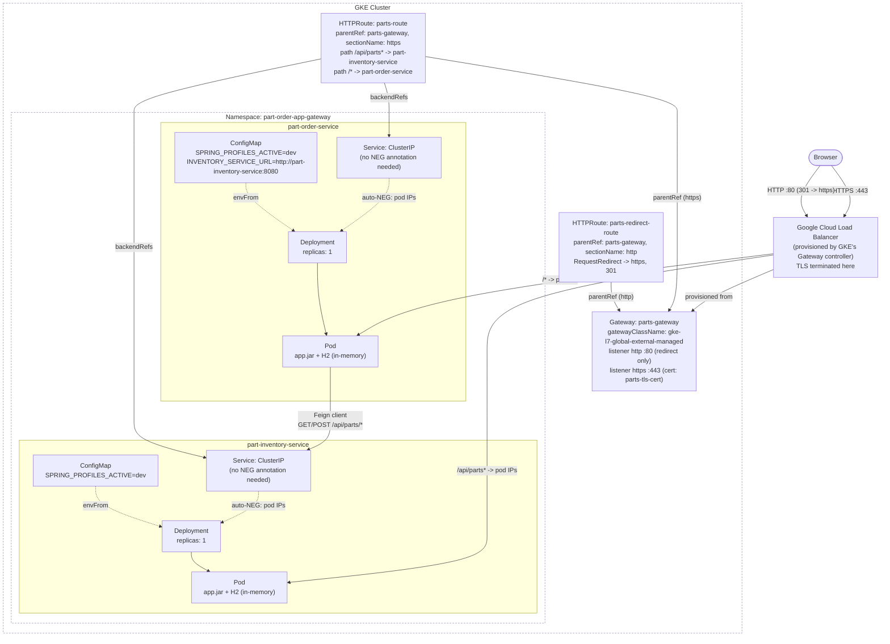
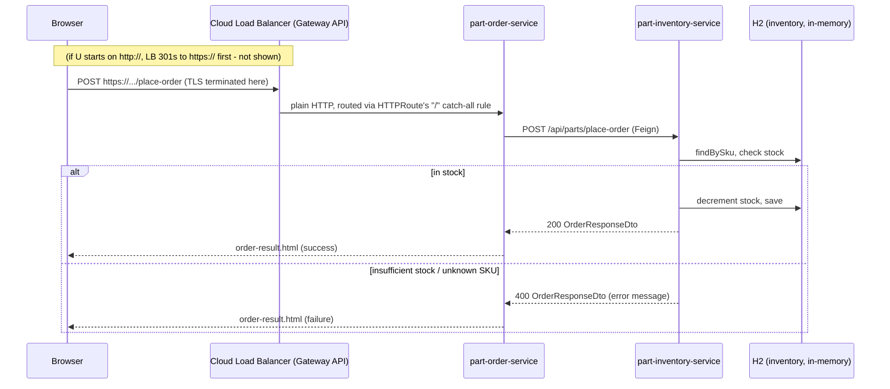

# part-order-app-java on Kubernetes (Gateway API, GKE)

Same app, same scope as [`../k8s-with-ingress`](../k8s-with-ingress) — `dev`
Spring profile, in-memory H2, no MySQL, same two path rules
(`/api/parts*` → inventory's REST API, `/*` catch-all → order-service's UI).
The variant changes *which API provisions the load balancer*: the
[Gateway API](https://gateway-api.sigs.k8s.io/) (`Gateway` + `HTTPRoute`
resources) instead of `networking.k8s.io/v1` `Ingress` — and additionally
terminates TLS at that load balancer, redirecting plain HTTP to HTTPS. See
"TLS termination" below for how the cert is sourced and why self-signed is
what's wired up by default.

Read this alongside [`../k8s-with-ingress/NOTES.md`](../k8s-with-ingress/NOTES.md)
— most of the app-level reasoning (why `/inventory` web UI isn't routable,
why probes needed widening, how the Feign call works) is identical and isn't
repeated here.

## What's different from the Ingress (`../k8s-with-ingress`) stack

| | `../k8s-with-ingress` | `k8s-with-gateway-api` (this one) |
| --- | --- | --- |
| Namespace | `part-order-app-ingress` | `part-order-app-gateway` |
| API | `networking.k8s.io/v1` `Ingress` (1 resource, routing rules inline) | `gateway.networking.k8s.io/v1` `Gateway` (infra: listener, LB class) + `HTTPRoute` (routing rules), 2 resources |
| Controller selector | `spec.ingressClassName: gce` | `spec.gatewayClassName: gke-l7-global-external-managed` |
| Service → LB wiring | `cloud.google.com/neg` annotation required on every backend Service | None needed — GKE's Gateway implementation always NEGs every backend a Route references |
| Who can attach routes | N/A (routing rules live inside the one Ingress object) | `Gateway.spec.listeners[].allowedRoutes` explicitly controls which namespaces' `HTTPRoute`s may attach |
| Traffic splitting / rewrites | Controller-specific annotations (e.g. nginx's `canary-weight`) or not supported at all by `gce` | Portable `backendRefs[].weight` and `URLRewrite`/`RequestRedirect` filters, part of the API itself (see commented-out examples in `httproute.yaml`) |
| TLS | Not configured (`../k8s-with-ingress` is plain HTTP) | Terminated at the `https` listener (port 443, self-signed cert via `Secret`); `http` listener (port 80) only 301-redirects to it |

## Architecture



Note the shape change from the Ingress diagram: `Gateway` and `HTTPRoute`
are two separate objects with a `parentRef` link between them, instead of
one `Ingress` object holding both "which controller" and "which paths" — and
now there are *two* `HTTPRoute`s, each pinned to a different listener via
`sectionName`, splitting "redirect" traffic from "serve" traffic.

## Request flow: placing an order

Identical to [`../k8s-with-ingress`](../k8s-with-ingress) — only the
infrastructure resource type fronting `part-order-service` changed, not the
app-level request path:



## Layout

```
k8s-with-gateway-api/
  namespace.yaml
  gateway.yaml
  httproute.yaml
  part-inventory-service/
    configmap.yaml
    deployment.yaml
    service.yaml
  part-order-service/
    configmap.yaml
    deployment.yaml
    service.yaml
```

## Quick reference

| | part-inventory-service | part-order-service |
| --- | --- | --- |
| Image | `ram1uj/part-inventory-service:latest` | `ram1uj/part-order-service:latest` |
| Replicas | 1 | 1 |
| Service type | ClusterIP | ClusterIP |
| Port | 8080 | 8080 |
| Profile | `dev` (H2 in-memory) | `dev` (H2 in-memory) |
| Health path | `/actuator/health/{liveness,readiness}` | `/actuator/health/{liveness,readiness}` |
| Talks to | — | `part-inventory-service:8080` (Feign) |
| Externally reachable via | `HTTPRoute` path `/api/parts` over HTTPS (REST API only) | `HTTPRoute` path `/` over HTTPS (catch-all, full web UI); plain HTTP 301s to HTTPS |

## Ingress vs. Gateway API: what's actually different

Both ultimately provision the same underlying resource on GKE — a Google
Cloud global external Application Load Balancer — so at the infrastructure
level there's no difference in *what* gets built, only in *the Kubernetes
API used to describe it*. The differences that matter:

- **Separation of concerns**: `Ingress` conflates "which controller handles
  this" (`ingressClassName`) with "what are the routing rules" (`rules[]`)
  in one object, owned by one team/file. `Gateway` (infrastructure: which
  controller, which listener/port/protocol, who's allowed to attach routes)
  and `HTTPRoute` (routing rules) are separate objects that can be owned by
  different people — e.g. a platform team manages `Gateway`s, app teams
  each own their own `HTTPRoute`. `Gateway.spec.listeners[].allowedRoutes`
  is what enforces that split (here, `from: Same` keeps it simple since one
  namespace owns everything in this stack).
- **Portable routing features**: traffic splitting (weighted `backendRefs`)
  and path/header rewriting (`URLRewrite`, `RequestRedirect` filters) are
  part of the Gateway API spec itself, so the same `HTTPRoute` YAML is
  meant to work the same way across implementations (GKE, nginx-gateway,
  Istio, Contour, ...). With `Ingress`, the equivalent features exist only
  as *controller-specific annotations* — `nginx.ingress.kubernetes.io/canary-weight`
  works on ingress-nginx and nowhere else; `gce` has no canary-weight
  annotation at all. `httproute.yaml` in this directory has two commented-out
  examples (weighted split, `URLRewrite`) that would need zero controller-
  specific syntax to enable.
- **No manual NEG annotation**: `../k8s-with-ingress` requires
  `cloud.google.com/neg: '{"ingress": true}'` on every Service an `Ingress`
  targets, or GKE falls back to the older instance-group backend model.
  GKE's Gateway API implementation always uses container-native load
  balancing for any Service an `HTTPRoute` references — one less thing to
  remember or get wrong.
- **Typed, structured status**: `Gateway`/`HTTPRoute` report conditions
  (`Accepted`, `Programmed`, per-backend-ref resolution) in
  `status.conditions`, richer and more structured than `Ingress`'s single
  `status.loadBalancer.ingress[].ip`. `kubectl get httproute parts-route -o yaml`
  shows exactly which parent accepted the route and why, instead of just an
  IP appearing (or not) with no explanation.
- **Multi-cluster routing** (not used here, mentioned for completeness):
  Gateway API has first-class multi-cluster primitives (e.g. GKE's
  `MultiClusterService`/`MCS` integration) that `Ingress` has no equivalent
  for — relevant once you're routing across more than one cluster, out of
  scope for this single-cluster learning stack.

## Why upgrade to Gateway API

- **`Ingress` is functionally frozen.** It reached GA years ago and the
  Kubernetes project's own direction (SIG Network) is that new
  L4/L7 routing capability lands in Gateway API, not `Ingress`. Annotations
  are how `Ingress` has papered over missing features (canary weights, auth,
  rewrites, timeouts) for years, and every one of those annotations is
  controller-specific, non-portable, and invisible to `kubectl explain`.
- **This app is a concrete example of the gap**: exposing
  `part-inventory-service`'s web UI (not just its REST API) is impossible
  under `../k8s-with-ingress` without changing app code, because there's no
  portable way to rewrite `/inventory-ui/*` down to `/*` before it hits the
  backend — `gce` Ingress has no rewrite annotation at all. The commented-out
  `URLRewrite` filter in `httproute.yaml` here is a real, standard fix for
  that same problem (support varies by implementation, but it's part of the
  spec, not a `gce`-only or `nginx`-only bolt-on).
- **One config format across implementations.** The GKE-specific pieces of
  this stack are down to two fields: `gatewayClassName` (this file) and
  which `GatewayClass` names exist on the cluster. Everything else
  (`HTTPRoute` matches, filters, weighted `backendRefs`) is the same YAML
  you'd write for ingress-nginx's Gateway API mode, Istio, Contour, Cilium,
  or any other conformant implementation — unlike `Ingress`, where the
  routing *rules* stay portable but anything beyond basic path matching
  does not.
- **Better failure visibility.** When something's misconfigured,
  `Gateway`/`HTTPRoute` status conditions say why (e.g. "no matching
  parent," "backend not found," "GatewayClass not accepted"). `Ingress`
  mostly just... doesn't get an address, with no structured signal pointing
  at the cause (this is exactly what happened when testing
  `../k8s-with-ingress` on a cluster where the `gce` IngressClass wasn't
  registered — no error, no event, just a permanently empty `status.loadBalancer`).
- **Where `Ingress` still wins**: simplicity for the common case (one
  Service, one host, no splitting/rewriting) and universal tooling support —
  every ecosystem tool assumes `Ingress` exists; Gateway API support is
  newer and spottier outside GKE/Istio/a handful of others. For a single
  externally-facing Service with no advanced routing needs, `Ingress`
  remains the shorter path.

## TLS termination

TLS is terminated at the load balancer (`https` listener, port 443) using a
Kubernetes `Secret` of type `kubernetes.io/tls` referenced by
`gateway.yaml`'s `certificateRefs` — the standard Gateway API mechanism
(`tls.mode: Terminate`), not anything GKE-specific. Traffic from the LB to
the Pods stays plain HTTP; the app itself has no TLS configuration at all,
same as terminating TLS at an Ingress or any reverse proxy.

**The cert is self-signed**, generated locally with `openssl` — deliberately
not committed to the repo (unlike `../k8s-with-mysql/mysql/secret.yaml`'s
plaintext DB credentials, a cert has an expiry date, so a checked-in one
would silently go stale, and every regeneration produces different key
material anyway, so there's nothing meaningful to diff/commit). Create the
`Secret` after the namespace exists but before applying `gateway.yaml`:

```bash
openssl req -x509 -nodes -days 365 -newkey rsa:2048 \
  -keyout /tmp/parts-tls.key -out /tmp/parts-tls.crt \
  -subj "/CN=parts.example.com" \
  -addext "subjectAltName=DNS:parts.example.com"

kubectl create secret tls parts-tls-cert \
  --cert=/tmp/parts-tls.crt --key=/tmp/parts-tls.key \
  -n part-order-app-gateway

rm /tmp/parts-tls.key /tmp/parts-tls.crt   # don't leave the key on disk
```

`parts.example.com` is a placeholder — there's no real domain or DNS record
behind it, and there doesn't need to be, since the Gateway doesn't check the
`hostname` field against anything (no `hostname:` is set on the `https`
listener, so it matches any SNI). This means: no browser will trust this
cert (self-signed, unknown CA, hostname you're actually visiting won't match
the cert's `CN`/SAN), so testing needs `curl -k` / `--insecure`, or a
browser click-through past the warning. That's expected and fine for a
learning stack — see "Why self-signed" below for the tradeoff, and
"Deliberately left out" for the Google-managed alternative.

**Why self-signed instead of a Google-managed certificate**: a
`ManagedCertificate` (Ingress) or Certificate Manager-issued cert (Gateway
API) requires a domain name you actually own, with a DNS `A` record pointed
at the load balancer's IP, so Google can complete domain validation before
issuing anything — and even then it can take 15–60+ minutes to provision.
Self-signed works immediately against a bare IP with zero external
dependencies, which is what makes this stack testable end-to-end the same
way `../k8s-with-ingress` was (see that directory's `NOTES.md` for a real
example of a GKE feature that silently never provisions when a prerequisite
is missing — the same risk applies to a managed cert waiting on DNS that
isn't actually configured correctly).

## Requirements

Gateway API needs to be enabled on the cluster *in addition to* the
`GatewayClass`es GKE ships once it is:

```bash
gcloud container clusters update <cluster-name> --zone <zone> \
  --gateway-api=standard
```

(`standard` tracks the stable Gateway API channel; `disabled` turns it back
off.) This is a separate toggle from the `HttpLoadBalancing` addon that
`../k8s-with-ingress` depends on — enabling one does not enable the other.
Check what's currently registered before applying anything here:

```bash
kubectl get gatewayclass
```

If `gke-l7-global-external-managed` isn't listed, `--gateway-api=standard`
hasn't been applied yet (or is still propagating - like the `HttpLoadBalancing`
addon toggle in `../k8s-with-ingress/NOTES.md`, this is a control-plane
update that can take a few minutes).

## Applying

```bash
kubectl apply -f k8s-with-gateway-api/namespace.yaml
kubectl apply -f k8s-with-gateway-api/part-inventory-service/
kubectl apply -f k8s-with-gateway-api/part-order-service/

# TLS Secret must exist before gateway.yaml is applied - see "TLS
# termination" above for the openssl + kubectl create secret commands.

kubectl apply -f k8s-with-gateway-api/gateway.yaml
kubectl apply -f k8s-with-gateway-api/httproute.yaml
```

Check status:

```bash
kubectl -n part-order-app-gateway get pods,svc,deploy
kubectl -n part-order-app-gateway get gateway parts-gateway
kubectl -n part-order-app-gateway get httproute
kubectl -n part-order-app-gateway describe gateway parts-gateway
kubectl -n part-order-app-gateway describe httproute parts-route
kubectl -n part-order-app-gateway describe httproute parts-redirect-route
```

`describe` on both resources shows `status.conditions` - look for
`Accepted: True` and `Programmed: True` on the `Gateway`, and `Accepted:
True`/`ResolvedRefs: True` on both `HTTPRoute`s. If `ResolvedRefs` is
`False` on the `Gateway` itself, check the reason - the most likely cause is
`parts-tls-cert` not existing yet in the same namespace. Provisioning the
underlying Cloud Load Balancer takes a few minutes, same as
`../k8s-with-ingress`.

**`Programmed: True` and `HEALTHY` backends still isn't "reachable yet."**
Confirmed live on a fresh Autopilot cluster: even after the `Gateway`
reports `Programmed: True` and
`gcloud compute backend-services get-health` shows every backend
`HEALTHY`, actual requests can keep failing for another 10-15 minutes with
`curl: (52) Empty reply from server` (HTTP) or
`SSL_connect: SSL_ERROR_SYSCALL` (HTTPS) - all the GCP objects
(forwarding rules, target-http/https-proxies, SSL cert, URL map) already
exist correctly at that point; what's still catching up is propagation of
the global external LB's anycast IP to Google's edge network. This is not a
misconfiguration - if you see resets/EOF right after the `Gateway` first
goes `Programmed: True`, it's very likely just this; retry every 20-30s
rather than re-checking your YAML.

## Reaching the app

```bash
kubectl -n part-order-app-gateway get gateway parts-gateway \
  -o jsonpath='{.status.addresses[0].value}'
```

```bash
curl -k https://<that-ip>/                # part-order-service UI
curl -k https://<that-ip>/api/parts       # part-inventory-service REST API
curl -i http://<that-ip>/                 # expect a 301 Location: https://...
```

`-k`/`--insecure` is required because the cert is self-signed - `curl`
otherwise refuses to complete the TLS handshake, same as a browser would
show a warning page. This is expected, not a bug in the manifests.

To hit either Service directly for debugging, bypassing the Gateway
entirely:

```bash
kubectl -n part-order-app-gateway port-forward svc/part-inventory-service 8081:8080
curl http://localhost:8081/api/parts
```

## Iterating on code

Same as the other variants — images are tagged `:latest`, so a rebuild
needs an explicit rollout restart:

```bash
./build-commands-mac.sh   # rebuilds and pushes both images
kubectl -n part-order-app-gateway rollout restart deploy/part-inventory-service
kubectl -n part-order-app-gateway rollout restart deploy/part-order-service
```

## Deliberately left out (learning scope)

| Left out | Why / what changes to add it |
| --- | --- |
| MySQL | Same as `../k8s` / `../k8s-with-ingress` — `prod` profile is untouched, this stack stays on `dev`/H2 |
| `part-inventory-service` web UI exposure | Commented out in `httproute.yaml` (`URLRewrite` at `/inventory-ui`) rather than enabled by default - it's the headline "why Gateway API" example for this app, left inactive so the base stack matches `../k8s-with-ingress`'s tested routing exactly |
| Weighted traffic splitting / canary | Commented out in `httproute.yaml` - there's no second (`-v2`) Deployment defined to split traffic to; add one to actually exercise it |
| Browser-trusted certificate | Currently self-signed (see "TLS termination" above) - swap for a `ManagedCertificate`/Certificate Manager cert once you have a real domain with DNS pointed at the Gateway's reserved static IP |
| Reserved static IP | Without one, the Gateway's IP can change if it's deleted/recreated - reserve one with `gcloud compute addresses create` and reference it via a `networking.gke.io/addresses` annotation on the `Gateway`, same caveat as `../k8s-with-ingress` |
| `GRPCRoute` / `TCPRoute` / `TLSRoute` | Not needed - this app is plain HTTP/REST end to end |
| HPA / PodDisruptionBudget | Not meaningful at 1 replica with in-memory, per-pod H2 state - same reasoning as `../k8s` |
