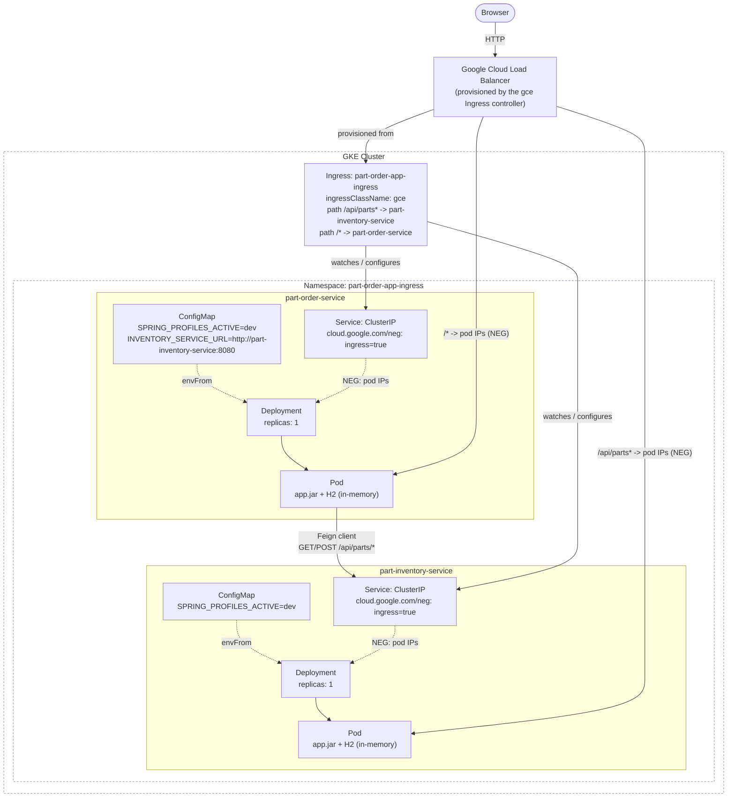
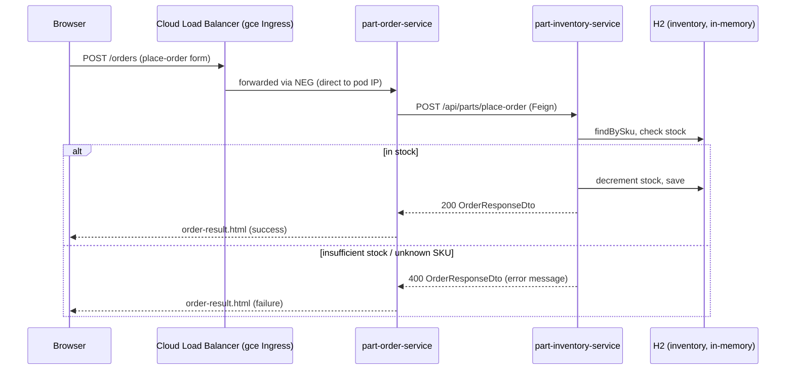

# part-order-app-java on Kubernetes (Ingress, GKE)

Same app, same scope as [`../k8s`](../k8s) — `dev` Spring profile, in-memory
H2, no MySQL. The only thing this variant changes is *how the app is exposed*:
instead of a `NodePort` Service, external traffic comes in through a Kubernetes
`Ingress` fronted by GKE's native Google Cloud Load Balancer
(`ingressClassName: gce`).

## What's different from the NodePort (`../k8s`) stack

| | `../k8s` | `k8s-with-ingress` (this one) |
| --- | --- | --- |
| Namespace | `part-order-app` | `part-order-app-ingress` |
| External entry point | `part-order-service` Service, `type: NodePort` (`30080`) | `Ingress` resource, `ingressClassName: gce` |
| `part-order-service` Service type | `NodePort` | `ClusterIP` (+ `cloud.google.com/neg` annotation) |
| `part-inventory-service` reachable from outside the cluster? | No | Yes — `/api/parts` path rule on the same `Ingress` |
| Requires | any cluster (minikube/kind/Docker Desktop/GKE) | a GKE cluster (uses the built-in `gce` IngressClass / Cloud Load Balancer) |

Everything else — Deployments, ConfigMaps, `part-inventory-service`, the
`dev`/H2 profile — is identical to `../k8s`.

## Architecture



`part-inventory-service` is now reachable two ways: internally, via Feign
calls from `part-order-service` over the cluster-internal `ClusterIP`
Service; and externally, via the `Ingress`'s `/api/parts` path rule — its
REST API only. Its web UI (`index.html`, `/inventory`, `/inventory-update`,
mounted at `/` in the app) is **not** routable through this Ingress: that
path is already claimed by `part-order-service`'s own root, and the app has
no separate context-path to disambiguate them. Reach the inventory web UI
via `port-forward` (see "Reaching the app" below) if you need it.

## Request flow: placing an order

Identical to [`../k8s`](../k8s) once the request reaches
`part-order-service` — only the hop from the browser to that pod changes
(through the Cloud Load Balancer + Ingress instead of a NodePort):



## Layout

```
k8s-with-ingress/
  namespace.yaml
  ingress.yaml
  part-inventory-service/
    configmap.yaml
    deployment.yaml
    service.yaml
  part-order-service/
    configmap.yaml
    deployment.yaml
    service.yaml
```

## Quick reference

| | part-inventory-service | part-order-service |
| --- | --- | --- |
| Image | `ram1uj/part-inventory-service:latest` | `ram1uj/part-order-service:latest` |
| Replicas | 1 | 1 |
| Service type | ClusterIP (`cloud.google.com/neg` annotation) | ClusterIP (`cloud.google.com/neg` annotation) |
| Port | 8080 | 8080 |
| Profile | `dev` (H2 in-memory) | `dev` (H2 in-memory) |
| Health path | `/actuator/health/{liveness,readiness}` | `/actuator/health/{liveness,readiness}` |
| Talks to | — | `part-inventory-service:8080` (Feign) |
| Externally reachable via | `Ingress` path `/api/parts` (REST API only) | `Ingress` path `/` (catch-all, full web UI) |

## How the pieces fit together

- **Ingress class `gce`**: GKE ships a built-in `IngressClass` named `gce`
  (and `gce-internal` for an internal-only LB) with no controller to install
  — setting `spec.ingressClassName: gce` on the `Ingress` is enough for GKE to
  provision a global external HTTP(S) Load Balancer (forwarding rule, target
  proxy, URL map, backend service, health checks) with one backend service
  per path rule's target Service.
- **Two path rules, one URL map**: `ingress.yaml` routes `/api/parts` to
  `part-inventory-service` and the catch-all `/` to `part-order-service`.
  Both backends live on the same forwarding rule/IP — the LB's URL map picks
  the backend by longest-prefix path match, so a request to
  `/api/parts/sku/ABC123` goes to inventory, everything else (`/`, `/home`,
  `/orders`, ...) goes to order. Only inventory's REST API is exposed this
  way — its Thymeleaf web UI is mounted at `/` in the app itself with no
  distinguishing prefix, so it can't be disambiguated from
  `part-order-service`'s own root without changing app code (e.g. a
  `server.servlet.context-path`), which is out of scope here.
- **NEG annotation (`cloud.google.com/neg: '{"ingress": true}'`)**: on both
  Services now, this switches the backend from the older instance-group
  model to container-native load balancing — the LB sends traffic straight
  to pod IPs via a Network Endpoint Group instead of bouncing through a
  NodePort + `kube-proxy` hop. This is why both Services are `ClusterIP`
  here instead of `NodePort` (unlike `../k8s`) — NEG doesn't need a NodePort
  at all. Requires a VPC-native (alias IP) GKE cluster, which is the GKE
  default since 2020.
- **Auto-derived health checks**: the `gce` Ingress controller reads each
  backing pod's `readinessProbe` (`/actuator/health/readiness` on port
  `http`, same path/port on both services) to configure each backend
  service's Cloud Load Balancer health check automatically — no extra
  `BackendConfig` needed for the basic case. Add one later if you want to
  tune check intervals/thresholds independently of the Kubernetes probe.
- **Everything else** (ConfigMaps, `dev` profile, H2, Feign wiring, replica
  count) is unchanged from [`../k8s`](../k8s) — see that directory's
  `NOTES.md` for the full rationale.

## Applying

Requires a GKE cluster with an active `gcloud`/`kubectl` context pointed at
it.

```bash
kubectl apply -f k8s-with-ingress/namespace.yaml
kubectl apply -f k8s-with-ingress/part-inventory-service/
kubectl apply -f k8s-with-ingress/part-order-service/
kubectl apply -f k8s-with-ingress/ingress.yaml
```

Check status:

```bash
kubectl -n part-order-app-ingress get pods,svc,deploy
kubectl -n part-order-app-ingress get ingress part-order-app-ingress
kubectl -n part-order-app-ingress describe ingress part-order-app-ingress
```

Provisioning the Cloud Load Balancer takes a few minutes. `describe ingress`
shows events as the forwarding rule/backend/health check come up; the
`ADDRESS` column on `get ingress` fills in once the external IP is assigned.

## Reaching the app

```bash
kubectl -n part-order-app-ingress get ingress part-order-app-ingress \
  -o jsonpath='{.status.loadBalancer.ingress[0].ip}'
```

Open `http://<that-ip>/` once both backend services show `HEALTHY` (check via
`gcloud compute backend-services list` / the GCP Console → Network Services →
Load Balancing, or just retry the URL — DNS-less IP access works immediately,
propagation of the LB itself is what takes time).

The inventory service's REST API is reachable directly through the same
Ingress, without going through `part-order-service`'s Feign call:

```bash
curl http://<that-ip>/api/parts
curl http://<that-ip>/api/parts/sku/<some-sku>
```

Its web UI (`/`, `/inventory`, `/inventory-update`) isn't reachable through
the Ingress (see "How the pieces fit together" above) — for that, or for any
other debugging that needs the raw Service without going through the LB:

```bash
kubectl -n part-order-app-ingress port-forward svc/part-inventory-service 8081:8080
curl http://localhost:8081/api/parts
```

## Iterating on code

Same as `../k8s` — images are tagged `:latest`, so a rebuild needs an
explicit rollout restart:

```bash
./build-commands-mac.sh   # rebuilds and pushes both images
kubectl -n part-order-app-ingress rollout restart deploy/part-inventory-service
kubectl -n part-order-app-ingress rollout restart deploy/part-order-service
```

## Switching to another Ingress controller (e.g. `nginx`)

`ingress.yaml` is the only file that names a controller. Everything else
(the `ClusterIP` Services, the `cloud.google.com/neg` annotation) works as-is
under any controller — annotations an Ingress controller doesn't recognize
are simply ignored, so there's no need to strip the GCE-specific annotation
to try this.

1. **Install ingress-nginx** (it isn't built into GKE the way `gce` is — you
   deploy its controller like any other workload):

   ```bash
   helm repo add ingress-nginx https://kubernetes.github.io/ingress-nginx
   helm repo update
   helm install ingress-nginx ingress-nginx/ingress-nginx \
     --namespace ingress-nginx --create-namespace
   ```

   This provisions its own `Service type: LoadBalancer` (a separate GCP
   Network Load Balancer, distinct from the `gce` Ingress controller's HTTP(S)
   LB) fronting the nginx controller pods, and registers an `IngressClass`
   named `nginx`.

2. **Point the Ingress at it** — change one field in `ingress.yaml`:

   ```diff
   -  ingressClassName: gce
   +  ingressClassName: nginx
   ```

   Re-apply: `kubectl apply -f k8s-with-ingress/ingress.yaml`.

3. **Get the new external IP** (nginx's, not the `gce` LB's):

   ```bash
   kubectl -n ingress-nginx get svc ingress-nginx-controller \
     -o jsonpath='{.status.loadBalancer.ingress[0].ip}'
   ```

4. **Health checks work differently**: nginx doesn't read `readinessProbe`
   to build cloud health checks (there's no cloud LB in the loop for
   nginx-to-pod traffic) — it relies on Kubernetes' own Service
   endpoints/readiness gating, which is already correctly wired via the
   `readinessProbe` on each Deployment, so no extra config is needed.

5. Both controllers can coexist (they watch different `ingressClassName`
   values), so you can leave the `gce`-backed Cloud Load Balancer running
   side by side while testing nginx, and just flip `ingressClassName` back
   when done.

## Deliberately left out (learning scope)

| Left out | Why / what changes to add it |
| --- | --- |
| MySQL | Same as `../k8s` — `prod` profile is untouched, this stack stays on `dev`/H2 |
| TLS / HTTPS | Add a `ManagedCertificate` (GKE-specific CRD) + a `kubernetes.io/ingress.global-static-ip-name` reserved static IP, then reference the cert in an `Ingress` annotation |
| Reserved static IP | Without one, the Cloud Load Balancer's IP can change if the `Ingress` is deleted/recreated; reserve one with `gcloud compute addresses create` and reference it via `kubernetes.io/ingress.global-static-ip-name` for a stable IP |
| `BackendConfig` (custom health checks, Cloud CDN, IAP, timeouts) | Not needed for the default auto-derived health check to work; add one if you need to tune LB-specific behavior beyond what the Kubernetes probe implies |
| `part-inventory-service` web UI exposure | Its Thymeleaf routes are mounted at `/`, colliding with `part-order-service`'s root — exposing them too would need a `server.servlet.context-path` (or similar app-level prefix) so the paths stop colliding; out of scope for a manifests-only change |
| Host-based routing | Both services are routed by path on one host/IP; add distinct `host:` entries per `rules[].host` if you want e.g. `orders.example.com` / `inventory.example.com` instead |
| HPA / PodDisruptionBudget | Not meaningful at 1 replica with in-memory, per-pod H2 state — same reasoning as `../k8s` |
