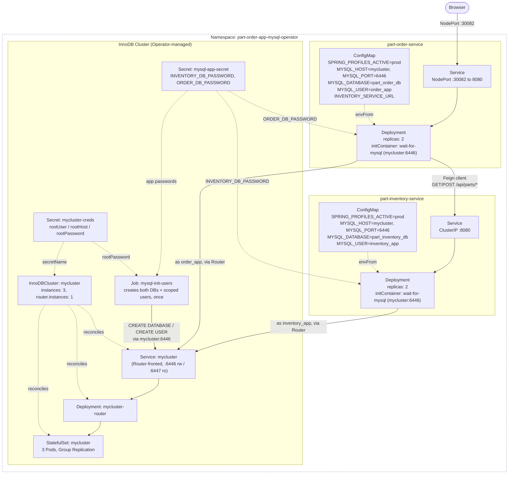
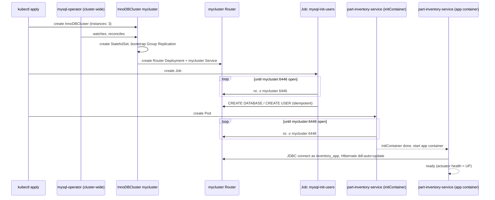

# part-order-app-java on Kubernetes (MySQL Operator / InnoDB Cluster)

Third variant of the same two services, alongside [`../k8s`](../k8s/NOTES.md)
(dev/H2) and [`../k8s-with-mysql`](../k8s-with-mysql/NOTES.md) (prod/MySQL
`StatefulSet`). Same `prod` Spring profile, same JDBC-based connection, but
MySQL itself is now a 3-instance **InnoDB Cluster** managed by Oracle's
official [MySQL Operator](https://github.com/mysql/mysql-operator), the same
one worked through end-to-end in
[05-mysql-operator-example.md](../../../kubernetes/kubernetes-advanced/05-mysql-operator-example.md)
— read that first if the `InnoDBCluster`/Router/Group Replication vocabulary
below is unfamiliar.

## What's different from the bare-StatefulSet (`../k8s-with-mysql`) stack

| | `k8s-with-mysql` (`StatefulSet`) | `k8s-with-mysql-operator` (`InnoDBCluster`) |
| --- | --- | --- |
| Namespace | `part-order-app-mysql` | `part-order-app-mysql-operator` |
| MySQL instances | 1 | 3, with Group Replication |
| Failover | none — downtime until the same Pod restarts | automatic primary election, seconds of impact |
| What creates the MySQL Pods | `mysql/statefulset.yaml` directly | the Operator's reconciliation loop, from `mysql/innodbcluster.yaml` |
| App → MySQL entrypoint | `mysql` Service (direct Pod, :3306) | `mycluster` Service (Router, :6446 read-write) |
| Root credentials shape | one `Secret`, arbitrary keys (`MYSQL_ROOT_PASSWORD`) | one `Secret`, Operator-mandated keys (`rootUser`/`rootHost`/`rootPassword`) |
| App DB/user provisioning | `ConfigMap` mounted at `/docker-entrypoint-initdb.d`, runs on first PVC init | one-shot `Job` (`mysql/init-job.yaml`) run against the Router after the cluster is reachable |
| part-order-service NodePort | `30081` | `30082` (kept distinct so all three stacks can run at once) |
| Cluster-wide prerequisite | none | MySQL Operator + its CRDs installed once, cluster-wide (see below) |

## Prerequisite: the Operator itself

Unlike the other two stacks, `kubectl apply -f k8s-with-mysql-operator/` is
not sufficient on its own — an `InnoDBCluster` object does nothing without
the Operator's controller watching for it. Install it once per cluster
(not per namespace, not part of this directory):

```bash
helm repo add mysql-operator https://mysql.github.io/mysql-operator/
helm repo update
helm install mysql-operator mysql-operator/mysql-operator \
  --namespace mysql-operator --create-namespace
kubectl get pods -n mysql-operator   # mysql-operator-xxxx   1/1   Running
```

Don't also run the separate `kubectl apply -f .../deploy-crds.yaml` step that
[05-mysql-operator-example.md](../../../kubernetes/kubernetes-advanced/05-mysql-operator-example.md)
shows — confirmed against the current chart (`mysql-operator` 9.7.0-2.2.8):
the Helm chart now installs and owns its own CRDs, and applying them
yourself first makes `helm install` fail with a field-manager conflict
(`Apply failed with 1 conflict: conflict with "kubectl-client-side-apply"
... .spec.versions`) because both `kubectl apply` and Helm claim ownership of
the same CRD object. If you hit that error, `kubectl delete -f
deploy-crds.yaml` and re-run `helm install` — Helm recreates them as part of
the release. `kubectl get pods -n mysql-operator` should show one `Running`
Pod roughly 1-2 minutes after install, most of that spent pulling the
operator image on first run.

Full walkthrough, including what each CRD does and how failover looks in
practice:
[05-mysql-operator-example.md](../../../kubernetes/kubernetes-advanced/05-mysql-operator-example.md).

## Architecture



Same two-databases-two-users isolation as `k8s-with-mysql` — neither service
can see the other's tables, and app Pods never see the cluster root
password. The difference is entirely in what backs `mycluster`: not one Pod
with one disk, but 3 replicated instances behind a Router that always knows
which one is currently primary.

## Startup ordering

More steps than the `StatefulSet` stack, because the Operator's reconcile
loop and the app-DB provisioning both have to happen before the app
Deployments can connect:



The app Deployments' `wait-for-mysql` initContainer only checks that the
Router's port is open — not that `mysql-init-users` has finished creating
their database/user yet. In practice the Job finishes well before any app
Pod is scheduled (Job start doesn't depend on app Pods at all), but if you
see a `Deployment` in `CrashLoopBackOff` with an "unknown database" or
"access denied" error, check `kubectl get job mysql-init-users` before
anything else — that's the accurate signal, not the initContainer passing.

## Layout

```text
k8s-with-mysql-operator/
  namespace.yaml
  mysql/
    secret.yaml            # mycluster-creds (Operator's root creds) + mysql-app-secret
    innodbcluster.yaml      # the InnoDBCluster CR — this is what the Operator reconciles
    init-job.yaml            # one-shot Job: creates both app databases + users
  part-inventory-service/
    configmap.yaml
    deployment.yaml
    service.yaml
  part-order-service/
    configmap.yaml
    deployment.yaml
    service.yaml
```

## Quick reference

| | part-inventory-service | part-order-service |
| --- | --- | --- |
| App image | `ram1uj/part-inventory-service:latest` | `ram1uj/part-order-service:latest` |
| App replicas | 2 | 2 |
| App Service type | ClusterIP | NodePort (`30082`) |
| MySQL database | `part_inventory_db` | `part_order_db` |
| MySQL app user | `inventory_app` | `order_app` |
| Health path | `/actuator/health/{liveness,readiness}` | `/actuator/health/{liveness,readiness}` |

MySQL itself: `InnoDBCluster` `mycluster`, 3 instances + 1 Router, apps
connect through the Router Service (`mycluster:6446`, read-write) rather
than any instance directly.

## Applying

```bash
# one-time, cluster-wide (see "Prerequisite" above) — skip if already installed
helm install mysql-operator mysql-operator/mysql-operator \
  --namespace mysql-operator --create-namespace

kubectl apply -f k8s-with-mysql-operator/namespace.yaml
kubectl apply -f k8s-with-mysql-operator/mysql/secret.yaml
kubectl apply -f k8s-with-mysql-operator/mysql/innodbcluster.yaml
kubectl get innodbcluster mycluster -n part-order-app-mysql-operator -w
# wait for STATUS: ONLINE, ONLINE: 3, ROUTERS: 1 before continuing

kubectl apply -f k8s-with-mysql-operator/mysql/init-job.yaml
kubectl wait --for=condition=complete job/mysql-init-users \
  -n part-order-app-mysql-operator --timeout=120s

kubectl apply -f k8s-with-mysql-operator/part-inventory-service/
kubectl apply -f k8s-with-mysql-operator/part-order-service/
```

The `InnoDBCluster` takes noticeably longer to reach `ONLINE` than the
`StatefulSet` stack takes to become ready — it's bootstrapping Group
Replication across 3 instances, not just starting one `mysqld`. Don't apply
the Job (or the app Deployments) until `kubectl get innodbcluster` shows
`ONLINE`; the Job's `wait-for-router` initContainer only checks that the
Router port is open, which can be true slightly before the cluster is fully
formed.

Verified end-to-end on a local `docker-desktop` cluster: on first run, most
of the ~10-12 minutes to `ONLINE` was the `mysql`/`community-server` image
pull (~270MB) on each of the 3 Pods, not the actual Group Replication
bootstrap — subsequent runs on a cluster with the image already cached are
much faster. `kubectl wait --for=jsonpath='{.status.cluster.status}'=ONLINE`
can time out even though the cluster *did* reach `ONLINE` — the status field
doesn't always land inside `kubectl wait`'s polling window during the
image-pull-dominated first boot. Prefer watching it interactively
(`kubectl get innodbcluster -w`) over scripting a hard wait on first apply.

Check status:

```bash
kubectl -n part-order-app-mysql-operator get innodbcluster,pods,svc,deploy,job
kubectl -n part-order-app-mysql-operator logs -f deploy/part-order-service
kubectl -n part-order-app-mysql-operator logs job/mysql-init-users
```

## Reaching the app

- **minikube**: `minikube service part-order-service -n part-order-app-mysql-operator`
- **kind / Docker Desktop**: `kubectl -n part-order-app-mysql-operator port-forward svc/part-order-service 8080:8080`
  then open `http://localhost:8080`
- Direct NodePort access (`http://<node-ip>:30082`).

To inspect a database directly, always through the Router — never target
`mycluster-0`/`-1`/`-2` by name, since whichever is primary can change after
a failover:

```bash
kubectl run mysql-client --image=mysql:8 -n part-order-app-mysql-operator -it --rm --restart=Never -- \
  mysql -h mycluster -P 6446 -uinventory_app \
  -p"$(kubectl -n part-order-app-mysql-operator get secret mysql-app-secret -o jsonpath='{.data.INVENTORY_DB_PASSWORD}' | base64 -d)" \
  part_inventory_db
```

## Iterating on code

```bash
./build-commands-mac.sh   # rebuilds and pushes both images
kubectl -n part-order-app-mysql-operator rollout restart deploy/part-inventory-service
kubectl -n part-order-app-mysql-operator rollout restart deploy/part-order-service
```

## Trying a failover

Same experiment as Step 7 of
[05-mysql-operator-example.md](../../../kubernetes/kubernetes-advanced/05-mysql-operator-example.md),
against this app's actual traffic instead of a throwaway `demo` cluster:

```bash
# find the current primary — MEMBER_ROLE is what actually names it,
# component=mysqld only narrows to the 3 mysqld Pods
kubectl -n part-order-app-mysql-operator exec mycluster-0 -c mysql -- \
  mysqlsh --uri root@localhost \
  -p"$(kubectl -n part-order-app-mysql-operator get secret mycluster-creds -o jsonpath='{.data.rootPassword}' | base64 -d)" \
  --sql -e "SELECT MEMBER_HOST, MEMBER_STATE, MEMBER_ROLE FROM performance_schema.replication_group_members;"

kubectl -n part-order-app-mysql-operator delete pod mycluster-0   # whichever came back PRIMARY above

# watch it drop to ONLINE_PARTIAL (2/3) then back to ONLINE (3/3)
# once the old primary rejoins as a secondary
kubectl -n part-order-app-mysql-operator get innodbcluster mycluster -w
```

Verified against this app's real traffic, not just a throwaway client:
placing an order (`POST /place-order`) roughly 15 seconds after deleting the
primary Pod still succeeded — no error, no manual intervention. Re-running
the `replication_group_members` query against a different surviving Pod
afterward showed a new `PRIMARY` elected automatically. HikariCP recovered
on its own within that window (see the study note's Step 8c for why it
sometimes doesn't, and how to tune it if a request lands squarely inside a
longer failover).

## Resetting the data

Deleting the `InnoDBCluster` does **not** delete its PVCs (same
`volumeClaimTemplates` behavior as a bare `StatefulSet`) — remove those
explicitly to actually wipe data:

```bash
kubectl -n part-order-app-mysql-operator delete innodbcluster mycluster
kubectl -n part-order-app-mysql-operator delete pvc -l app.kubernetes.io/instance=mycluster
```

Re-applying `mysql/innodbcluster.yaml` after that rebuilds the cluster from
scratch, but the app databases/users are gone with it — re-run
`mysql/init-job.yaml` (delete the old `Job` first, `kubectl delete job
mysql-init-users`, since a `Job` won't rerun a completed run) once the
cluster is `ONLINE` again.

## Cleanup

Order matters here in a way it doesn't for the other two stacks: the
`InnoDBCluster` and its Pods carry `kopf.zalando.org/*` finalizers that only
the Operator's controller ever clears. Delete the CR (and let it finish)
*before* removing the Operator, not after:

```bash
kubectl -n part-order-app-mysql-operator delete innodbcluster mycluster
kubectl -n part-order-app-mysql-operator wait --for=delete innodbcluster/mycluster --timeout=120s

kubectl delete namespace part-order-app-mysql-operator

# only once the namespace above is gone, and only if no other InnoDBCluster
# anywhere in the cluster still needs it:
helm uninstall mysql-operator -n mysql-operator
kubectl delete namespace mysql-operator
kubectl delete crd innodbclusters.mysql.oracle.com mysqlbackups.mysql.oracle.com \
  mysqlclustersetfailovers.mysql.oracle.com clusterkopfpeerings.zalando.org \
  kopfpeerings.zalando.org   # Helm installs these but does not remove them on uninstall
```

**If the Operator is already gone and a namespace is stuck `Terminating`**
(confirmed reproducible — this is what actually happened while validating
this stack: the operator was uninstalled first, then `mycluster` and its
Pods were left with unresolvable `kopf`/`mysql.oracle.com/membership`
finalizers, and the namespace hung for 30+ minutes with no controller left
to clear them), strip the finalizers by hand rather than waiting it out:

```bash
kubectl patch innodbcluster mycluster -n part-order-app-mysql-operator \
  --type=merge -p '{"metadata":{"finalizers":[]}}'

for p in mycluster-0 mycluster-1 mycluster-2 mycluster-router-<hash>; do
  kubectl patch pod "$p" -n part-order-app-mysql-operator \
    --type=merge -p '{"metadata":{"finalizers":[]}}' 2>/dev/null
done

kubectl delete innodbcluster mycluster -n part-order-app-mysql-operator --wait=false
```

Watch `kubectl get all -n part-order-app-mysql-operator` afterward — in
practice the namespace controller still needed the `Deployment`s, `Service`s,
and the `Job` deleted explicitly (`kubectl delete deploy/svc/job ...
--wait=false`) once it had been stalled this long; it didn't pick them back
up on its own even after the blocking finalizers were cleared.

## Deliberately left out (learning scope)

| Left out | Why / what changes to add it |
| --- | --- |
| Backups | `04-crds.md`/`05-mysql-operator-example.md` cover the real `BackupSchedule` CRD this Operator ships — add one pointed at object storage before treating this as durable |
| TLS on the app→MySQL connection | JDBC URL still uses `useSSL=false` (from `application-prod.yml`); `tlsUseSelfSigned: true` on the `InnoDBCluster` only covers intra-cluster replication traffic, not the app's connection |
| A real secret manager | `Secret` objects here are plaintext `stringData` committed to git, meant only for spinning this up locally — swap for Sealed Secrets / External Secrets / Vault before this goes anywhere real |
| NetworkPolicy | Nothing currently stops other namespaces from reaching the `mycluster` Service directly; add a `NetworkPolicy` restricting the Router ports to this namespace's app Pods if the cluster is shared |
| Read/write splitting | Everything goes through the Router's read-write port (`6446`); the read-only port (`6447`) from the study note's Step 8d is unused — fine at this traffic scale, revisit if `SELECT` load actually becomes a bottleneck |
| HikariCP failover tuning | `application-prod.yml` is unchanged from the `k8s-with-mysql` stack — the study note's Step 8c tuning isn't applied, so a failover briefly surfaces as failed requests until Hikari's defaults notice the stale connection |
