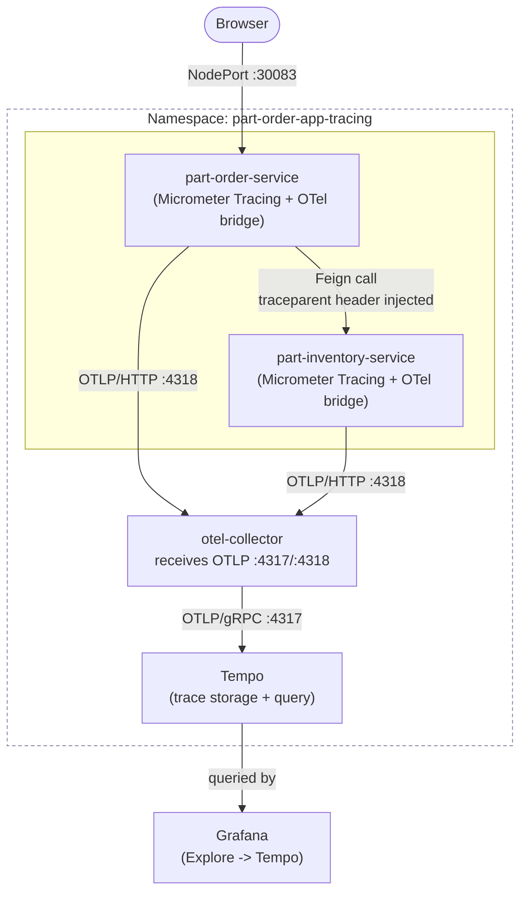
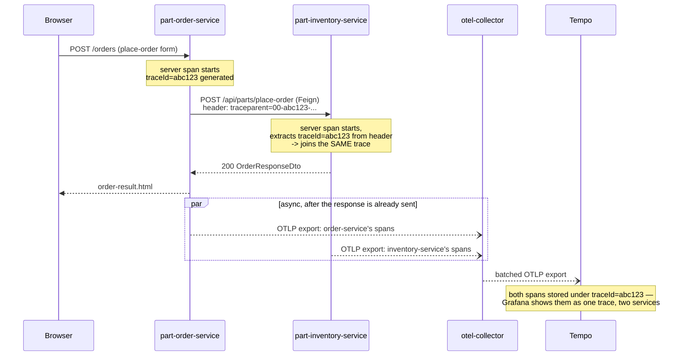

# Distributed Tracing for part-order-app-java (OpenTelemetry + Tempo)

A fifth variant alongside [`../k8s`](../k8s/NOTES.md), [`../k8s-with-mysql`](../k8s-with-mysql/NOTES.md),
[`../k8s-istio`](../k8s-istio/README.md), and
[`../k8s-cluster-monitoring-logging`](../k8s-cluster-monitoring-logging/README.md)
— this one adds **distributed tracing**: every request into `part-order-service`
is assigned a trace ID, and that same trace ID follows the request across its
Feign call into `part-inventory-service`, so one trace shows the whole
request's path through both services.

Unlike the metrics/logs stack, this **does** touch application code — tracing
has to be baked into the jar (a Java process can't be traced from the
outside the way Prometheus scrapes an HTTP endpoint or Promtail tails a log
file). See "What changed in the app code" below for exactly what that meant.

## Why tracing is a different problem from metrics or logs

| | Answers | k8s-cluster-monitoring-logging | This stack |
| --- | --- | --- | --- |
| Metrics (Prometheus) | "how is it performing, in aggregate" | ✅ | — |
| Logs (Loki) | "what did it actually log" | ✅ | — |
| **Traces (this stack)** | **"what path did *this one request* take, and where did it spend its time"** | — | ✅ |

A dashboard can tell you p95 latency spiked at 14:02. It can't tell you
*which* request was slow, or whether the time was spent in
`part-order-service`'s own logic or waiting on `part-inventory-service`. A
trace answers exactly that — one request, end to end, both services, with a
duration per hop.

## Architecture



## One request, one trace: placing an order



The two spans never block the response — export happens on a background
thread after the HTTP response is already on the wire, same as how
Prometheus scraping and Promtail log shipping don't slow down request
handling either.

## What changed in the app code

Both `part-inventory-service` and `part-order-service` got the same three
changes (see their `pom.xml`, `application.yml`, `logback-spring.xml`):

| File | Change | Why |
| --- | --- | --- |
| `pom.xml` | added `org.springframework.boot:spring-boot-starter-opentelemetry` | Spring Boot 4's single starter for Micrometer Tracing + the OTel bridge + OTLP exporters (metrics *and* traces) |
| `pom.xml` (order-service only) | added `io.github.openfeign:feign-micrometer` | **not** pulled in transitively by `spring-cloud-starter-openfeign` — without it, Feign calls never go through Micrometer's `ObservationRegistry`, so no client-side span is created and no `traceparent` header is injected. Confirmed by testing: without this dependency, order-service and inventory-service ended up in two *disconnected* traces despite everything else being wired up correctly. |
| `application.yml` | `management.tracing.sampling.probability`, `management.opentelemetry.tracing.export.otlp.endpoint`, `management.otlp.metrics.export.enabled: false` | trace every request in this dev/learning scope; point OTLP exports at the collector; the OTel starter also auto-configures an OTLP *metrics* exporter, turned off here since metrics are already covered by Prometheus scraping in `k8s-cluster-monitoring-logging/` — left on, it logs a connection-refused stack trace every export interval with no collector listening for metrics |
| `logback-spring.xml` | `traceId=%X{traceId:-},spanId=%X{spanId:-}` added to both log patterns | Micrometer Tracing's OTel bridge puts `traceId`/`spanId` into MDC automatically for any log line written inside a request; this makes them visible in the log output (and queryable in Loki — see the Grafana datasource wiring below) |

No code in `InventoryServiceClient.java`, `PartOrderController`, or
`PartController` changed — propagation is entirely auto-configuration:
Spring MVC creates a server span from the incoming request (extracting
`traceparent` if one arrived), and Feign's `MicrometerObservationCapability`
creates a client span around each `@FeignClient` call and injects
`traceparent` into the outgoing request. Both sides just need the right
dependencies on the classpath.

**Property name note**: Spring Boot 4 renamed the OTLP tracing property
from Boot 3's `management.otlp.tracing.endpoint` to
`management.opentelemetry.tracing.export.otlp.endpoint`, and moved the
autoconfiguration itself into `spring-boot-starter-opentelemetry` rather
than bundling it into `spring-boot-starter-actuator`. Worth knowing if
you're following older Spring Boot tracing tutorials against this repo's
4.0.2 baseline.

## Verified locally (without Kubernetes)

Before writing the manifests below, the app-level wiring was checked by
running both services locally (`mvnw spring-boot:run`) and placing a real
order through `part-order-service`'s REST API:

```bash
curl -X POST http://localhost:8090/api/part-orders/place-order \
  -H "Content-Type: application/json" -d '{"sku":"SEAT-SAFE45-001","quantity":1}'
```

Both services' log output showed the **same** `traceId` for that request —
proof the `traceparent` header actually crossed the Feign call, not just
that each service independently generated tracing-shaped log lines:

```text
# part-order-service:
[traceId=4bcb4cab520f5b65fcf4d595ba0e7327,spanId=0601111137491552] DEBUG org.hibernate.SQL ...

# part-inventory-service:
[traceId=4bcb4cab520f5b65fcf4d595ba0e7327,spanId=898593f75ebe96c4] DEBUG org.hibernate.SQL ...
```

The Kubernetes manifests in this directory (collector, Tempo, Grafana
datasource) route that same OTLP export somewhere queryable — they weren't
re-verified against a live cluster in this session, so treat them the way
you'd treat any manifest set before a first `kubectl apply`: read
[setup-and-run.md](setup-and-run.md), apply, and check `kubectl get pods`.

## Layout

```text
k8s-with-tracing/
  README.md                          # this file — what and why
  setup-and-run.md                   # ordered steps — how to stand it up and verify it
  namespace.yaml
  tempo-values.yaml                  # Tempo Helm values: single-binary, local filesystem storage
  grafana-values.yaml                # Grafana Helm values: Tempo + Loki datasources, trace<->log correlation
  otel-collector/
    configmap.yaml                   # Collector pipeline: OTLP in -> batch -> OTLP out to Tempo (+ debug exporter)
    deployment.yaml
    service.yaml
  part-inventory-service/
    configmap.yaml                   # SPRING_PROFILES_ACTIVE + OTEL_EXPORTER_OTLP_TRACES_ENDPOINT
    deployment.yaml
    service.yaml
  part-order-service/
    configmap.yaml                   # + INVENTORY_SERVICE_URL, same OTEL_EXPORTER_OTLP_TRACES_ENDPOINT
    deployment.yaml
    service.yaml
```

## Why an OTel Collector instead of exporting straight to Tempo

Tempo can accept OTLP directly — the collector isn't load-bearing for a
two-service demo this size. It's here because it's the piece actually named
in "OpenTelemetry": a vendor-neutral pipeline stage that decouples "how the
app exports telemetry" (OTLP, always) from "where it ends up" (Tempo here;
swapping in Jaeger, or fanning out to both, or adding a `filter`/`attributes`
processor, is a collector config change — zero app redeploys). The `debug`
exporter alongside `otlp/tempo` in
[otel-collector/configmap.yaml](otel-collector/configmap.yaml) also means you
can confirm spans are flowing (`kubectl logs deploy/otel-collector`) before
Tempo or Grafana are even installed.

## Deliberately left out (dev scope)

| Left out | Why / what changes to add it |
| --- | --- |
| Tail-based sampling / collector-side filtering | `management.tracing.sampling.probability: 1.0` head-samples every request client-side instead — fine at dev traffic volumes, not at production volume/cost |
| Tempo's distributed (`tempo-distributed`) chart, object storage backend | single-binary + local filesystem, same trade-off `loki-values.yaml` makes in `k8s-cluster-monitoring-logging/` — right-sized for a laptop cluster, not production trace retention |
| Collector `Deployment` -> `DaemonSet` (node-local agent + gateway tiers) | one collector Pod is enough for two low-traffic services; the agent/gateway split matters at real fleet scale |
| Combining this with `k8s-with-mysql`'s `prod` profile | this variant reuses `k8s`'s `dev`/H2 scope like `k8s-istio` and `k8s-cluster-monitoring-logging` do — tracing config itself is profile-independent, nothing stops wiring the same OTel env vars into `k8s-with-mysql`'s Deployments |
