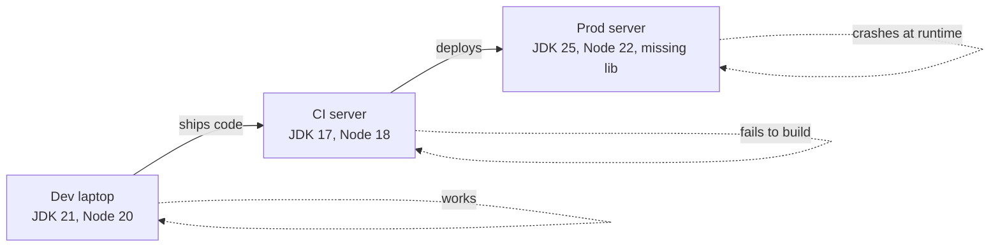
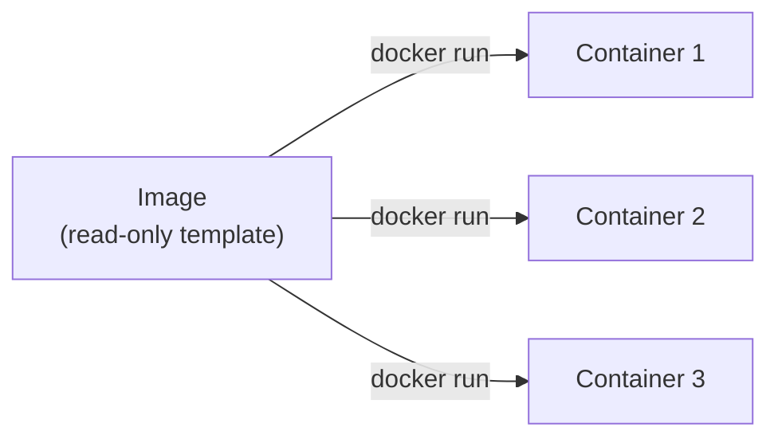
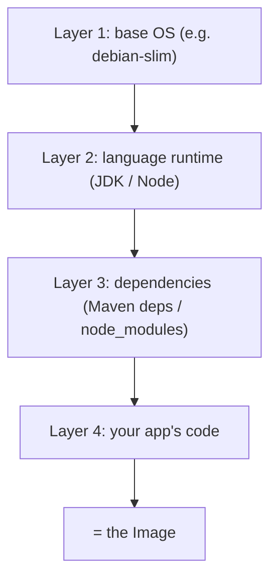
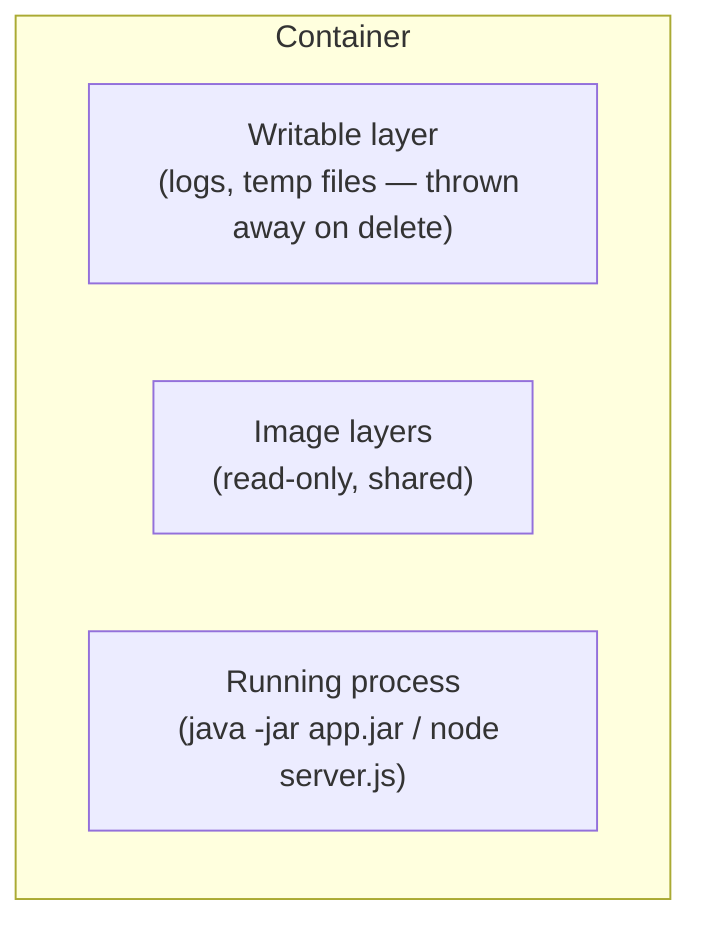
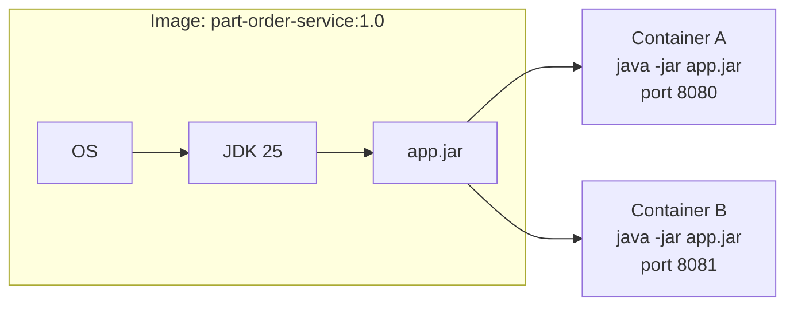
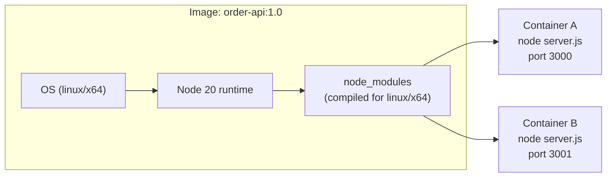

# Why Docker?

---

## The problem: "works on my machine"

Same source code, three different outcomes — because each machine has a
different runtime version, different OS libraries, different installed
dependencies. Nobody can say with confidence *what's actually running*.

---

## What actually varies between environments

- language runtime version (JDK 17 vs 21, Node 18 vs 22)
- OS-level libraries the runtime silently depends on
- installed package versions (Maven, npm, global CLIs)
- environment-specific config baked in by hand
- "it was set up years ago and nobody remembers how"

Every one of these is a way for identical code to behave differently.

---

## Docker's fix: two concepts, one mental model

- an **image** — a frozen, read-only snapshot: app + runtime + dependencies
- a **container** — a running instance of that image

Same relationship as a **class and an object** — the image is the
definition, the container is a live instance of it. One image, any number
of containers, all identical at birth.

---

## Image = layers, stacked

An image is built as a stack of layers, each one a diff on top of the last.
Layers are cached and reused — that's *why* Docker builds are fast after
the first one.

- Java image: OS → JDK → Maven dependencies → your compiled `.jar`
- Node image: OS → Node runtime → `node_modules` → your `.js` source

Change only your app code, and only the top layer needs rebuilding —
everything below it is reused from cache.

---

## Container = image + a writable layer + a running process

The image itself never changes. Everything the container writes at
runtime (log files, temp data) lives in a thin writable layer on top —
delete the container, that layer is gone; the image is untouched and
ready to spin up a fresh, identical container again.

---

## Java, illustrated

The `.jar` and the exact JDK it needs are frozen into the image once.
Every container started from it launches the identical JVM, the identical
bytecode — no "which Java is on this box" question, ever.

---

## Node.js, illustrated

The native addons inside `node_modules` (things like `bcrypt`, `sharp`)
were compiled **inside the image's own OS/CPU**, once — not copied in from
a developer's Mac. Every container from this image has binaries that
actually match the environment they run in.

---

## Same underlying fix, two different symptoms

| | Java pain | Node.js pain |
| --- | --- | --- |
| Root cause | wrong JDK/Maven version | wrong OS/CPU/ABI for native modules |
| Symptom | build fails, or JVM behaves differently | app crashes on startup, "wrong ELF class" |
| Docker's fix | freeze the JDK + Maven output into the image | build `node_modules` inside the image's own OS/arch |

Different languages, different failure modes — same root cause (untracked
environment drift), same fix (freeze the whole environment into an image,
then run containers from it).

---

## What you get beyond "it works everywhere"

- **isolation** — one container's dependencies never collide with another's
  (two services needing different Node versions? no conflict, ever)
- **fast onboarding** — one `docker run` replaces a page of setup instructions
- **identical staging/prod** — the exact image tested in staging is the
  exact image deployed to prod, not a rebuild
- **the foundation for Kubernetes** — everything in `../kubernetes-intro/`
  assumes you already have an image; Kubernetes decides *where* and *how
  many* containers run, Docker decides *what's actually inside* each one

---

## Takeaway

An **image** is a frozen definition — app, runtime, dependencies, all
pinned. A **container** is a disposable, running instance of that
definition. Docker doesn't make your code better — it makes the
environment your code runs in explicit and frozen, instead of implicit and
drifting.
