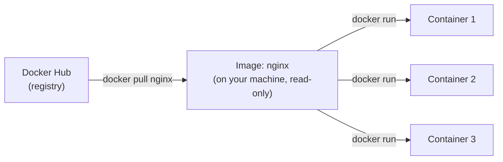
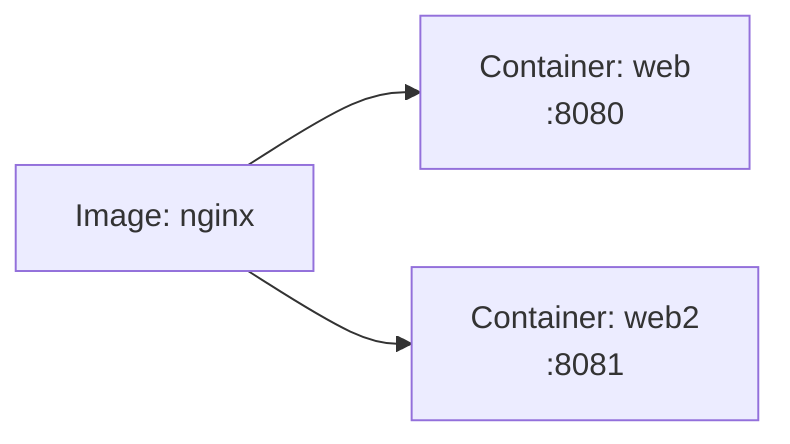
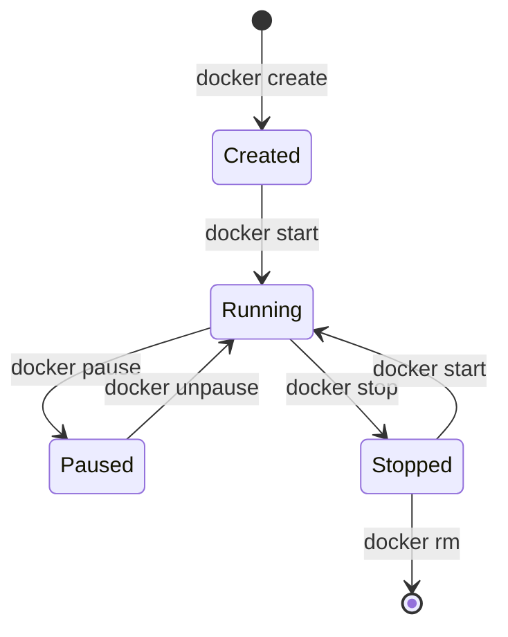
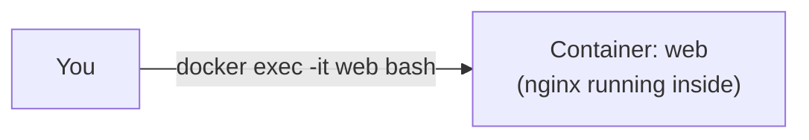
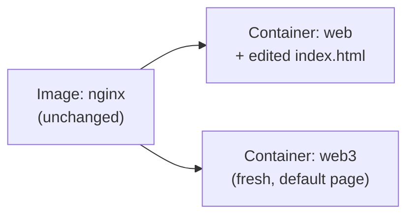
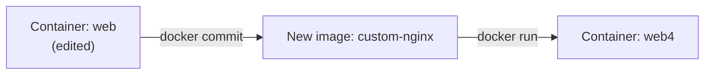

# Docker Images & Containers, with nginx

Companion to [docker-intro.md](docker-intro.md) — that explained *why*.
This is the hands-on *how*, all with one image: `nginx`.

---

## The relationship, in one picture



- **Image** — downloaded once, sits on disk, never changes
- **Container** — a running (or stopped) instance of that image; you can
  have as many as you want from the same image

---

## Step 1: get the image

```bash
docker pull nginx
docker images
```

```text
REPOSITORY   TAG       IMAGE ID       SIZE
nginx        latest    605c77e624dd   187MB
```

Nothing is running yet — this is just the frozen template sitting locally.

---

## Step 2: run a container from it

```bash
docker run -d --name web -p 8080:80 nginx
docker ps
```


```bash
curl localhost:8080     # nginx's welcome page
```

`docker run` = "create a new container from this image, and start it."
Run it again and you get a second, independent container:

```bash
docker run -d --name web2 -p 8081:80 nginx
docker ps
```



Same image, two containers, no interference between them.

---

## A container has a lifecycle — an image doesn't



The image sitting behind all of this never moves through any of these
states — it's not a process, just bytes on disk.

```bash
docker stop web
docker ps                # web no longer listed (not running)
docker ps -a              # web still listed (stopped, not deleted)
docker start web
docker ps                 # running again, same container
```

---

## Look inside a running container

```bash
docker exec -it web bash
# now you're a shell inside the container
cat /etc/nginx/nginx.conf
exit

docker logs web
docker top web
docker inspect web        # full JSON: IP, mounts, env, config...
```



`exec` starts a *new* process inside an *already-running* container — it
doesn't create anything new.

---

## Changes inside a container don't touch the image

```bash
docker exec -it web sh -c 'echo "hello" > /usr/share/nginx/html/index.html'
curl localhost:8080         # shows "hello" now

docker rm -f web
docker run -d --name web3 -p 8080:80 nginx
curl localhost:8080         # back to the default nginx page — image was untouched
```



That edit only ever lived in `web`'s writable layer. Delete the container,
the edit is gone — the image it came from is exactly as it was on day one.

---

## Turning a change into a new image

If you *want* that edit to persist, capture it as a new image layer:

```bash
docker commit web custom-nginx
docker images
docker run -d --name web4 -p 8082:80 custom-nginx
curl localhost:8082         # "hello" — baked in now
```



(In practice you'd build this properly from a Dockerfile instead of
`commit` — but `commit` makes the image/container relationship concrete:
a container's changes can be frozen back into a new image.)

---

## Image commands, cheat sheet

```bash
docker pull nginx:1.25          # download a specific tag
docker images                   # list local images
docker tag nginx:1.25 myrepo/nginx:1.25   # rename/re-tag
docker push myrepo/nginx:1.25   # upload to a registry
docker history nginx            # show each layer and its size
docker inspect nginx             # full metadata: env, entrypoint, layers
docker rmi nginx                 # delete the image (must have no containers using it)
```

---

## Container commands, cheat sheet

```bash
docker run -d --name web -p 8080:80 nginx   # create + start
docker create --name web -p 8080:80 nginx   # create only, don't start
docker start web                            # start an existing container
docker stop web                             # graceful stop (SIGTERM, then SIGKILL)
docker restart web
docker pause web / docker unpause web       # freeze/unfreeze processes

docker ps                                   # running containers
docker ps -a                                # all containers, incl. stopped

docker exec -it web bash                    # shell into a running container
docker logs web                             # stdout/stderr
docker logs -f web                          # follow logs live
docker inspect web                          # full JSON config/state
docker stats web                            # live CPU/memory usage
docker cp web:/etc/nginx/nginx.conf .        # copy a file out of the container

docker rm web                               # delete a stopped container
docker rm -f web                            # stop + delete in one go
```

---

## Cleanup

```bash
docker rm -f web web2 web3 web4
docker rmi custom-nginx
```

---

## Takeaway

`nginx` the image never changes no matter what you do to a container built
from it. Containers are the disposable, mutable, running layer on top —
that split is the entire reason Docker is predictable: throw away every
container, `docker run` again, and you're back to exactly the same
starting point.
