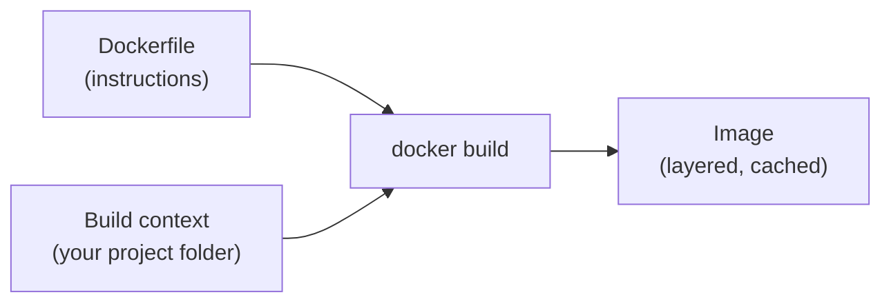
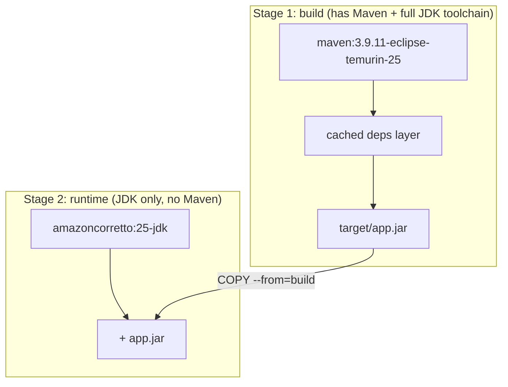
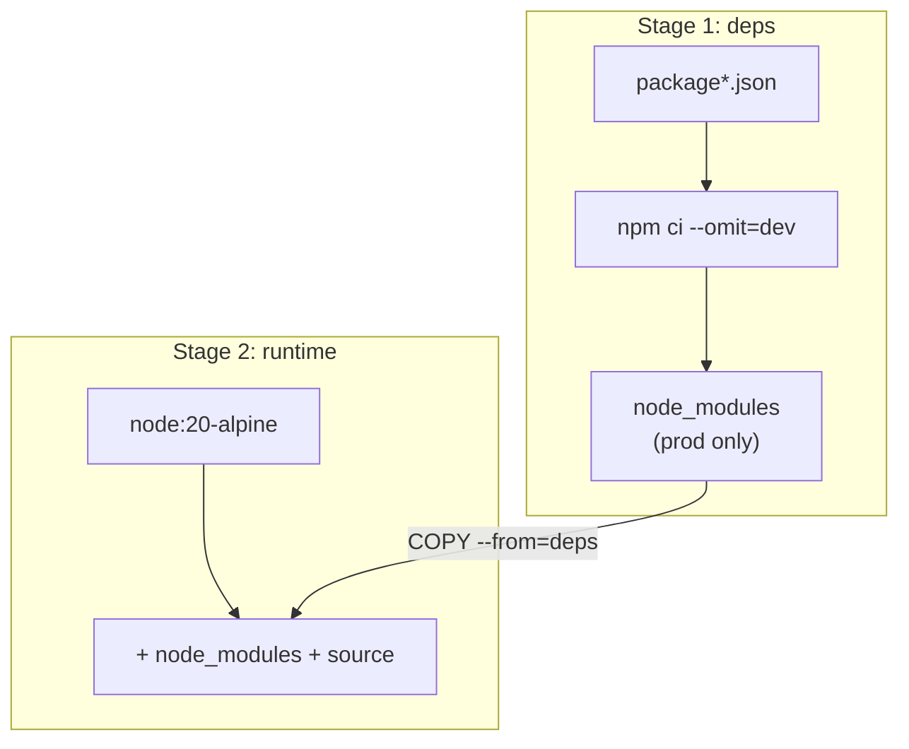
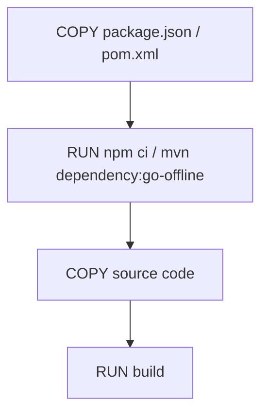
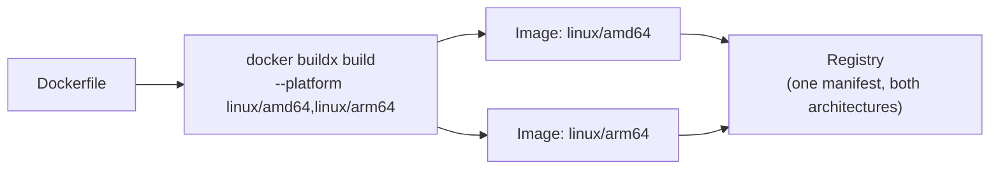

# Building Docker Images: Dockerfile, build, buildx

Companion to [docker-intro.md](docker-intro.md) (why images/containers
exist) and [docker-images-containers.md](docker-images-containers.md)
(using an existing image). This is about **producing** your own image.

---

## The build pipeline, in one picture



`docker build` reads the Dockerfile's instructions **in order**, executes
each one, and stacks the result as a new layer on top of the previous one.

---

## Dockerfile instructions, the ones you'll actually use

| Instruction | Does |
| --- | --- |
| `FROM` | the base image to start from |
| `WORKDIR` | sets the working directory for everything after it |
| `COPY` | copies files from your machine into the image |
| `RUN` | executes a command **at build time**, result baked into a layer |
| `ENV` | sets an environment variable, baked into the image |
| `EXPOSE` | documents which port the container listens on (doesn't publish it) |
| `ENTRYPOINT` / `CMD` | the command that runs when a **container** starts |

`RUN` happens once, during `docker build`. `ENTRYPOINT`/`CMD` happens
every time, during `docker run` — a common first mix-up.

---

## Java example: Spring Boot, multi-stage

```dockerfile
# -------- Build stage --------
FROM maven:3.9.11-eclipse-temurin-25 AS build
WORKDIR /app

COPY pom.xml .
RUN mvn dependency:go-offline          # cached separately from source changes

COPY src ./src
RUN mvn clean package -DskipTests

# -------- Runtime stage --------
FROM amazoncorretto:25-jdk
WORKDIR /app
COPY --from=build /app/target/*.jar app.jar

EXPOSE 8080
ENTRYPOINT ["java", "-jar", "app.jar"]
```



`COPY --from=build` pulls **only the finished jar** into the runtime
image — the entire Maven toolchain, and every intermediate build layer,
never make it into the image you actually ship. Smaller image, smaller
attack surface.

```bash
cd part-order-app-java/part-order-service
docker build -t part-order-service:1.0 .
docker run -p 8080:8080 part-order-service:1.0
```

---

## Node.js example: Express, multi-stage

```dockerfile
# -------- Dependencies stage --------
FROM node:20-alpine AS deps
WORKDIR /app
COPY package.json package-lock.json ./
RUN npm ci --omit=dev                  # only production deps, deterministic

# -------- Runtime stage --------
FROM node:20-alpine
WORKDIR /app
COPY --from=deps /app/node_modules ./node_modules
COPY . .

EXPOSE 3000
CMD ["node", "server.js"]
```



```bash
docker build -t order-api:1.0 .
docker run -p 3000:3000 order-api:1.0
```

`npm ci` (not `npm install`) reads `package-lock.json` exactly —
reproducible installs, and it fails loudly if the lockfile is out of sync
with `package.json`, instead of silently resolving something different.

---

## Why the COPY order matters: layer caching



Docker caches each layer and **reuses it** if nothing that produced it has
changed. Copying dependency manifests (`package.json`, `pom.xml`) *before*
source code means: change one line of app code → only layers 3-4 rebuild;
`npm ci`/`mvn dependency:go-offline` (the slow part) stays cached.

Get the order backwards — copy everything at once, then install — and
**every** code change reruns the full dependency install, every time.

---

## `docker build`, the flags you'll actually use

```bash
docker build -t myapp:1.0 .                      # tag it, build context = current dir
docker build -t myapp:1.0 -f Dockerfile.prod .   # use a non-default Dockerfile name
docker build --build-arg NODE_ENV=production .   # pass a build-time variable
docker build --no-cache .                        # ignore all cached layers
docker build --progress=plain .                  # full, unfolded build output
docker build --target deps .                     # build only up to a specific stage (debugging)
```

`.` at the end is the **build context** — the set of files Docker can see
during the build. Always pair a Dockerfile with a `.dockerignore` (same
syntax as `.gitignore`) so `node_modules`, `target/`, and `.git` don't get
sent into the build context and bloat/slow it down.

---

## `docker buildx` — the modern builder

`buildx` is the newer build engine (BuildKit-based) — since Docker 23 it's
the default for plain `docker build` too, but it's invoked directly for
things plain builds can't do: multi-platform images and pushing straight
from a build.



```bash
docker buildx create --use               # create + switch to a builder instance
docker buildx build --platform linux/amd64,linux/arm64 -t myrepo/myapp:1.0 --push .
```

Why this matters in practice: a Java or Node image built on an Apple
Silicon (arm64) laptop won't run on a typical x86-64 cloud VM without this
— `buildx` builds both in one command and publishes a single tag that
resolves to the right architecture automatically on pull.

```bash
docker buildx build --cache-to=type=registry,ref=myrepo/myapp:cache \
                     --cache-from=type=registry,ref=myrepo/myapp:cache \
                     -t myrepo/myapp:1.0 --push .
```

`buildx` can also push/pull its **layer cache** to a registry — useful in
CI, where each run is otherwise a fresh machine with an empty local cache.

---

## Cheat sheet

```bash
docker build -t app:1.0 .
docker build --no-cache -t app:1.0 .
docker build --build-arg KEY=value -t app:1.0 .
docker history app:1.0                      # see every layer and its size
docker image inspect app:1.0

docker buildx create --use
docker buildx build --platform linux/amd64,linux/arm64 -t app:1.0 --push .
docker buildx imagetools inspect app:1.0    # see which platforms a tag supports
```

---

## Takeaway

A Dockerfile is a recipe executed top-to-bottom into cached layers —
ordering it so rarely-changing steps (installing dependencies) come
before frequently-changing ones (your source code) is what makes rebuilds
fast. Multi-stage builds keep the final image lean by discarding the
build toolchain. `buildx` is the same `docker build` you know, extended
to target multiple CPU architectures and share cache across machines.
