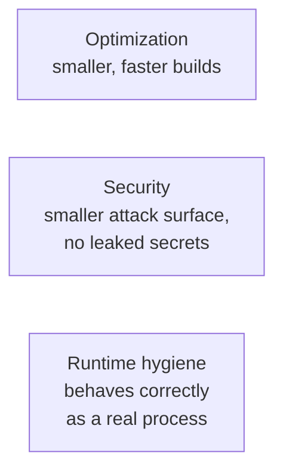
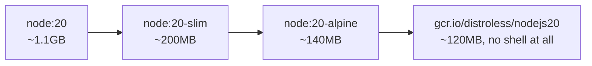
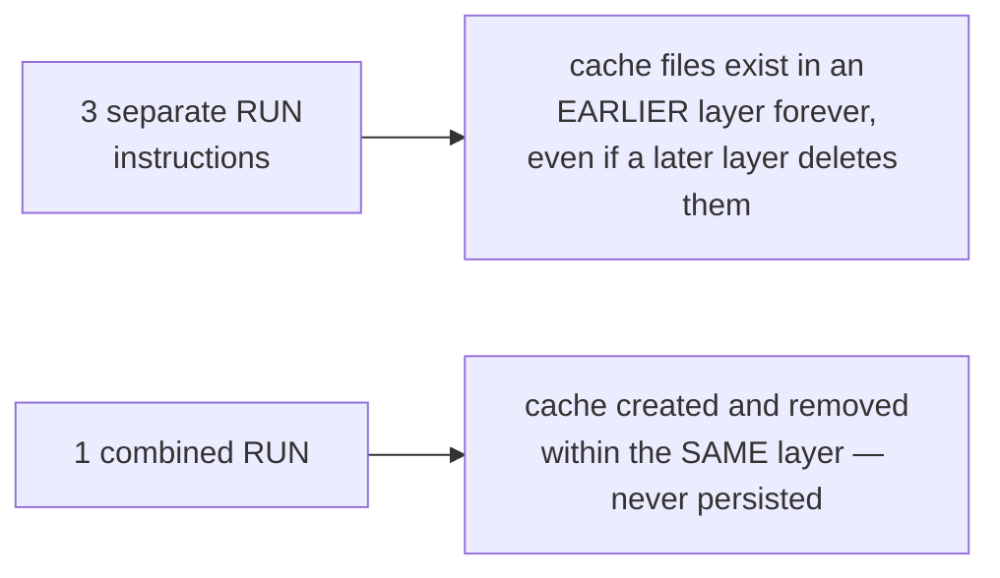
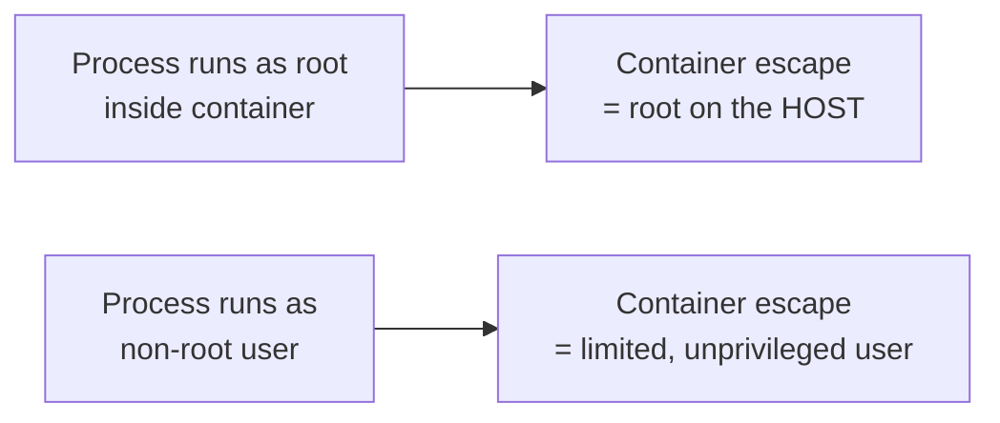
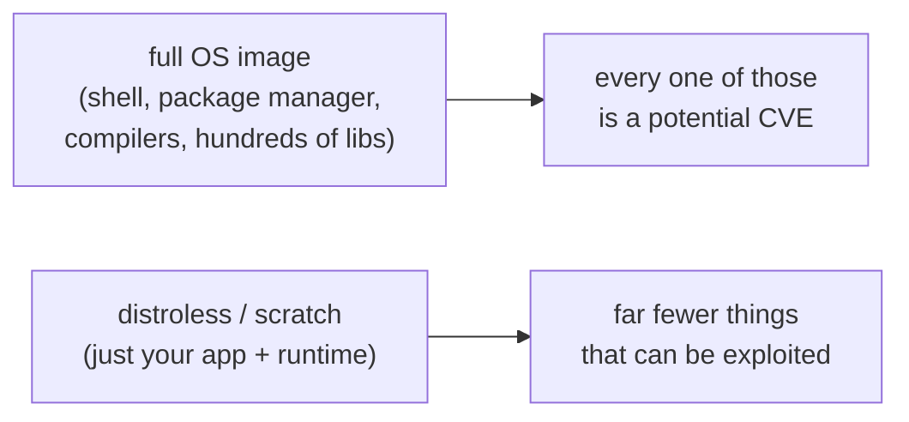
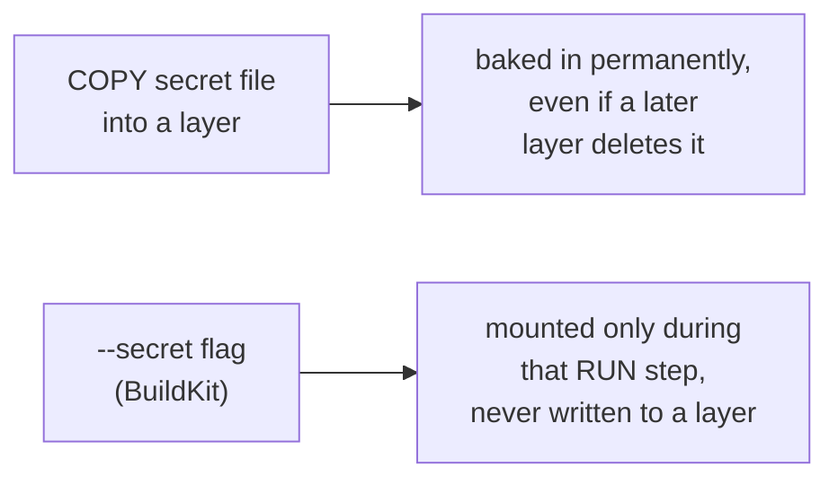
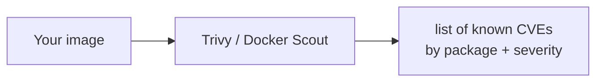
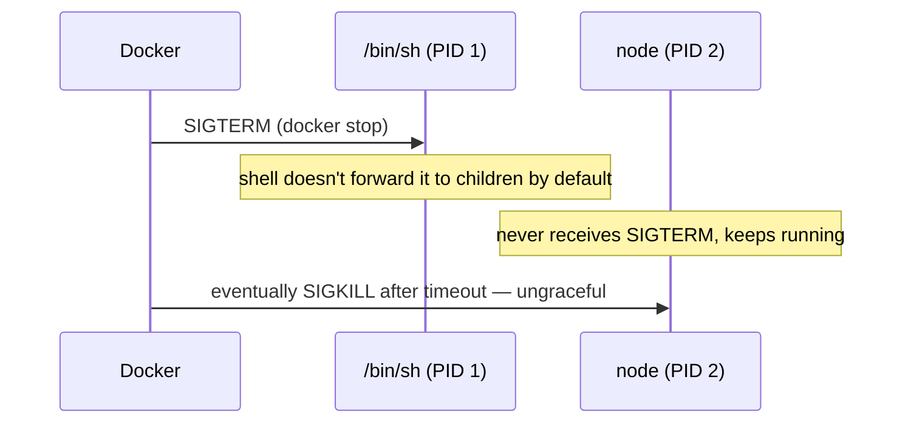

# Docker Best Practices: Size, Security, Runtime Hygiene

Builds on [docker-build.md](docker-build.md) (how a build actually works)
— this is how to build **well**: smaller images, fewer vulnerabilities, and
containers that behave correctly at runtime.

---

## Three separate concerns



Most "Docker best practices" lists mix all three together — worth keeping
them mentally separate, because the fix for one rarely helps the others.

---

## Optimization 1: smallest reasonable base image



```dockerfile
FROM node:20-alpine        # instead of node:20
FROM amazoncorretto:25-alpine   # instead of amazoncorretto:25-jdk (if available for your base)
```

Smaller image = faster pulls, faster Pod starts, less disk on every Node.
Alpine uses `musl` instead of `glibc` — usually fine, but worth testing if
your app depends on native `glibc`-linked libraries.

---

## Optimization 2: multi-stage builds (recap)

Covered in depth in [docker-build.md](docker-build.md) — the short
version: build with the full toolchain (Maven, `npm`), ship only the
compiled output + a minimal runtime image. This alone is usually the
single biggest size win available.

---

## Optimization 3: order layers by change frequency (recap)

Also covered in [docker-build.md](docker-build.md): copy dependency
manifests (`pom.xml`, `package.json`) and install dependencies *before*
copying source code, so editing app code doesn't invalidate the
expensive dependency-install layer.

---

## Optimization 4: fewer, combined `RUN` layers

```dockerfile
# Bad — 3 layers, and the apt cache still bloats the final image
RUN apt-get update
RUN apt-get install -y curl
RUN rm -rf /var/lib/apt/lists/*
```

```dockerfile
# Good — 1 layer, apt cache never persists in any layer
RUN apt-get update && \
    apt-get install -y --no-install-recommends curl && \
    rm -rf /var/lib/apt/lists/*
```



Because layers are additive, deleting a file in a *later* layer doesn't
shrink the image — the file still exists in the earlier layer underneath.
The cleanup has to happen in the same `RUN` that created the mess.

---

## Optimization 5: pin versions, don't float on `:latest`

```dockerfile
# Bad — silently different image every rebuild, whenever upstream repushes "latest"
FROM node:latest

# Good — reproducible, auditable, and you control exactly when it changes
FROM node:20.11.1-alpine
```

Same reasoning as [docker-intro.md](docker-intro.md)'s "works on my
machine" problem — `:latest` reintroduces the exact drift Docker exists to
eliminate, just one layer up (which *image version* you're even running).

---

## Optimization 6: always ship a `.dockerignore`

```text
# .dockerignore
node_modules
target
.git
.env
*.log
```

Without one, the entire project directory (including `.git` history,
local `node_modules`, secrets in `.env`) gets sent to the Docker daemon as
build context — slower builds, and a real way for secrets to end up
inside the image accidentally (see the security section next).

---

## Security 1: never run as root inside the container

```dockerfile
FROM node:20-alpine
WORKDIR /app
COPY --chown=node:node . .
USER node                  # nginx/node images ship a non-root user already
CMD ["node", "server.js"]
```



Kubernetes can enforce this cluster-wide too:

```yaml
securityContext:
  runAsNonRoot: true
  runAsUser: 1000
```

By default, a container process **is root** unless told otherwise — one
of Docker's most surprising defaults for people coming from normal Linux
user permissions.

---

## Security 2: minimal images = smaller attack surface



```dockerfile
# Runtime stage using distroless — no shell, no package manager at all
FROM gcr.io/distroless/java21-debian12
COPY --from=build /app/target/app.jar /app.jar
ENTRYPOINT ["java", "-jar", "/app.jar"]
```

Trade-off: `kubectl exec -it ... -- sh` won't work against a distroless
container (no shell) — use `kubectl debug` (see
[debugging-common-issues.md](../kubernetes-intermediate/debugging-common-issues.md))
instead when you need to poke inside one.

---

## Security 3: never bake secrets into a layer

```dockerfile
# Bad — the key is now permanently in the image's layer history,
# recoverable even after a later layer "removes" the file
COPY .env .
RUN some-build-step --api-key=$(cat .env)
```

```bash
docker history myimage --no-trunc    # secrets baked in like this are visible right here
```



Use BuildKit's secret mount instead — available during the build, never
persisted to any layer:

```dockerfile
# syntax=docker/dockerfile:1
RUN --mount=type=secret,id=api_key \
    some-build-step --api-key="$(cat /run/secrets/api_key)"
```

```bash
docker build --secret id=api_key,src=./api_key.txt -t myapp .
```

For anything running in the cluster (not build-time), use a Kubernetes
Secret instead — see
[configmap-and-secrets.md](../kubernetes-intro/configmap-and-secrets.md).

---

## Security 4: scan images for known vulnerabilities

```bash
docker scout cves myimage:1.0
# or
trivy image myimage:1.0
```



Worth running in CI on every build — catching a critical CVE in a base
image before it ships is far cheaper than after.

---

## Runtime hygiene 1: one process per container

Don't run nginx + your app + a cron job all in one container via a
homemade supervisor script — split them into separate containers (main +
[sidecar](../kubernetes-intermediate/sidecars.md) if they're tightly
coupled, separate Pods if they're not). One process means Docker/Kubernetes
can actually observe and restart the thing that's actually broken.

---

## Runtime hygiene 2: exec form, and the PID 1 signal problem

```dockerfile
# Shell form — bad: your process is NOT PID 1, a shell is
CMD node server.js

# Exec form — good: your process runs directly as PID 1
CMD ["node", "server.js"]
```



With shell form, `docker stop` sends `SIGTERM` to the shell, not your
app — the shell doesn't automatically relay it, so your app never gets a
chance to shut down cleanly and just gets killed after the grace period.
Exec form makes your process PID 1 directly, so it receives signals itself.

---

## Runtime hygiene 3: HEALTHCHECK (or let Kubernetes probes do it)

```dockerfile
HEALTHCHECK --interval=30s --timeout=3s \
  CMD curl -f http://localhost:80/ || exit 1
```

```bash
docker ps    # STATUS column shows (healthy) / (unhealthy)
```

In plain Docker this is how `docker ps` reports container health. In
Kubernetes, `livenessProbe`/`readinessProbe` supersede this entirely (see
[debugging-common-issues.md](../kubernetes-intermediate/debugging-common-issues.md))
— define `HEALTHCHECK` for standalone Docker use, but don't expect it to
do anything once the image is running as a Kubernetes Pod.

---

## Putting it together: before vs. after

```dockerfile
# Before
FROM node
COPY . .
RUN npm install
CMD node server.js
```

```dockerfile
# After
# syntax=docker/dockerfile:1
FROM node:20.11.1-alpine AS deps
WORKDIR /app
COPY package.json package-lock.json ./
RUN npm ci --omit=dev

FROM node:20.11.1-alpine
WORKDIR /app
COPY --from=deps /app/node_modules ./node_modules
COPY --chown=node:node . .
USER node
EXPOSE 3000
HEALTHCHECK --interval=30s CMD wget -qO- http://localhost:3000/ || exit 1
CMD ["node", "server.js"]
```

Every line change in "after" maps to one of the practices above: pinned
version, multi-stage, dependency-layer caching, non-root user, exec-form
CMD, health check.

---

## Cheat sheet

```bash
docker history myimage --no-trunc     # inspect layers, check for baked-in secrets
docker scout cves myimage             # vulnerability scan
trivy image myimage                   # alternative vulnerability scan
docker build --secret id=x,src=./x.txt -t myimage .   # build-time secret, never baked in
docker run --read-only --user 1000 myimage             # enforce read-only fs + non-root at runtime
```

---

## Takeaway

Optimization, security, and runtime hygiene are three different jobs:
shrink the image (multi-stage, minimal base, ordered layers, pinned
versions), reduce what's exploitable (non-root, minimal base again, no
baked-in secrets, scan in CI), and behave like a real process once
running (one job per container, exec-form `CMD` so signals work, a health
check). None of these change what your application code does — only how
safely and efficiently it ships.
