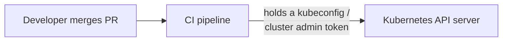
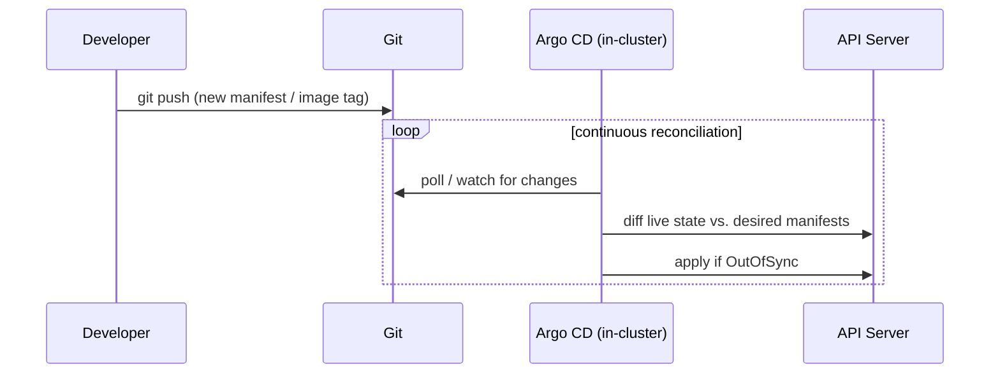
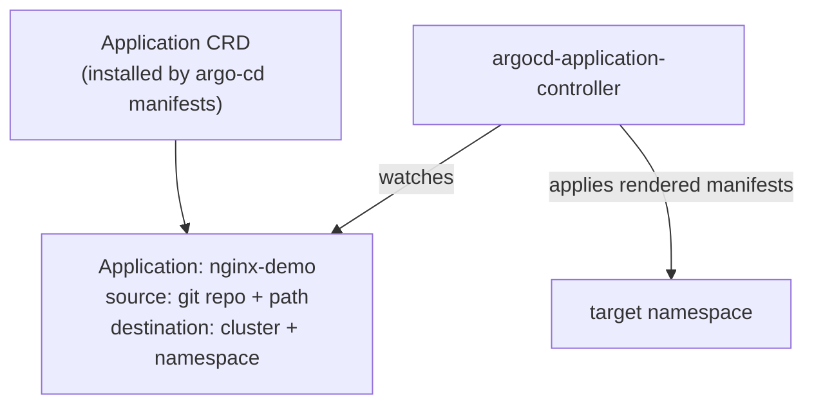
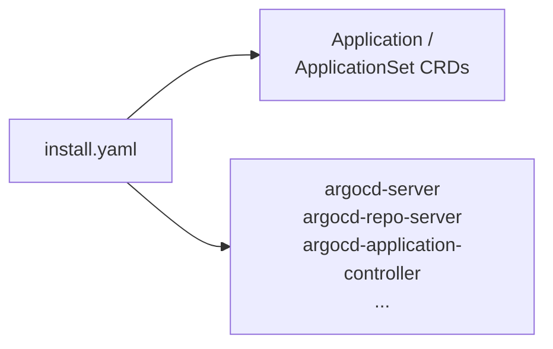
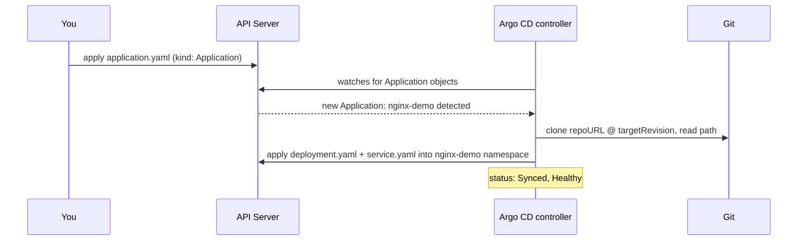
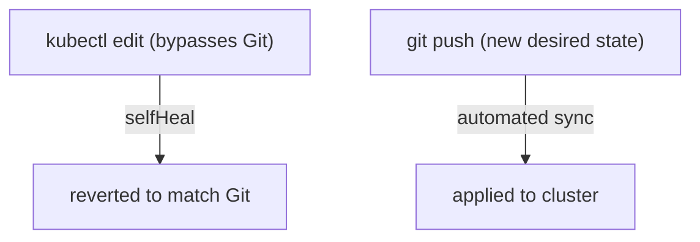
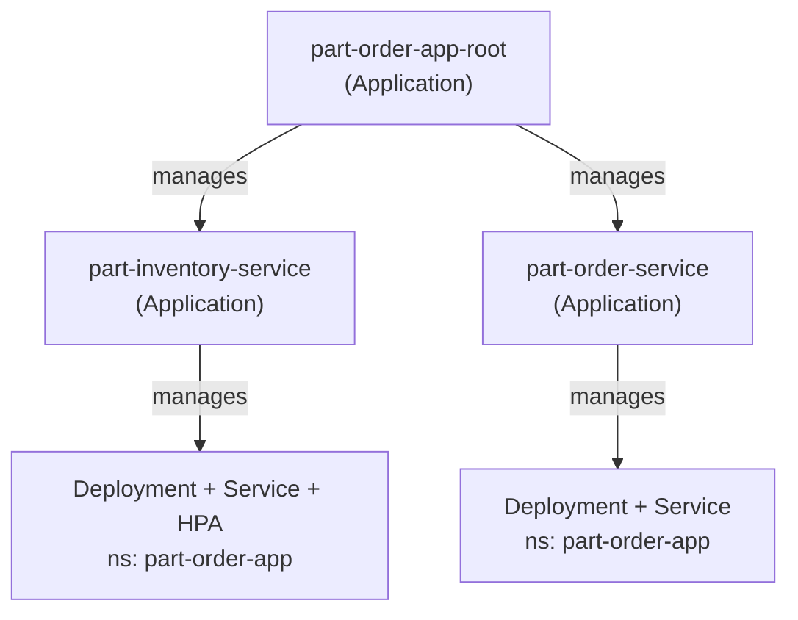

# Argo CD — GitOps for Kubernetes

Argo CD is the concrete example behind one line in
[04-crds.md](../kubernetes/kubernetes-advanced/04-crds.md)'s Operator
table: `Application` is a CRD, Argo CD itself is the controller watching
it. This doc is that pattern, walked through end to end with a real
install and a real `nginx` deployment.

---

## The problem: `kubectl apply` from CI is push-based and untrusted

The usual pipeline: a merge to `main` triggers CI, CI runs
`kubectl apply -f k8s/`, done. That means:



- CI needs cluster-admin-ish credentials sitting in pipeline secrets —
  every pipeline is a path to the cluster
- nothing stops someone running `kubectl edit` by hand afterwards; Git
  and the live cluster silently drift apart
- "what's actually running in prod right now" requires asking the
  cluster, not reading the repo — Git is not a reliable source of truth
- rolling back means re-running a pipeline against an old commit, not a
  single declarative action

---

## GitOps flips it: pull, not push



- the controller lives **inside** the cluster and pulls from Git — no
  external system is ever handed cluster credentials
- Git becomes the actual source of truth, because a controller
  continuously enforces it, not because of convention
- this is the exact same desired-state reconciliation loop from
  [01-intro.md](../kubernetes/kubernetes-intro/01-intro.md) — just watching
  a Git repo instead of only watching the API server's own objects

---

## Argo CD is a CRD + controller, nothing more exotic

Same shape as every Operator in
[04-crds.md](../kubernetes/kubernetes-advanced/04-crds.md): a
`CustomResourceDefinition` plus a controller Pod that reconciles it.



An `Application` object just says: *this path in this Git repo is the
desired state for this namespace in this cluster.* The controller does
the diffing and applying — you never run `kubectl apply -f` against the
app itself again after the first sync.

---

## Core concepts

| Concept | What it means |
| --- | --- |
| **Source** | where desired state lives: `repoURL` + `path` (plain YAML, a Helm chart, or Kustomize) + `targetRevision` (branch/tag/commit) |
| **Destination** | `server` (which cluster) + `namespace` (where to apply) |
| **Sync status** | `Synced` (live == desired) vs. `OutOfSync` (Git and cluster disagree) |
| **Health status** | `Healthy` / `Progressing` / `Degraded` — read from the underlying Deployment/Pod status |
| **Sync policy** | `manual` (default — you click/`argocd app sync`) vs. `automated` (auto-apply on drift), with optional `prune` (delete objects removed from Git) and `selfHeal` (revert manual `kubectl edit`s) |

A `source` isn't limited to plain manifests — it can point at the Helm
chart from [06-helm.md](../kubernetes/kubernetes-intermediate/06-helm.md)
plus a `values` override instead. This doc uses plain YAML to keep the
example minimal.

---

## Installing Argo CD

```bash
kubectl create namespace argocd
kubectl apply -n argocd -f https://raw.githubusercontent.com/argoproj/argo-cd/stable/manifests/install.yaml

kubectl get pods -n argocd
# argocd-server, argocd-repo-server, argocd-application-controller,
# argocd-dex-server, argocd-redis, argocd-applicationset-controller
```



Access the UI/API (no LoadBalancer needed for local learning):

```bash
kubectl port-forward svc/argocd-server -n argocd 8080:443
```

Initial admin password (auto-generated on install):

```bash
kubectl -n argocd get secret argocd-initial-admin-secret \
  -o jsonpath="{.data.password}" | base64 -d
```

```bash
# Argo CD CLI — brew install argocd, or download from the GitHub release
argocd login localhost:8080 --username admin --password <password-above> --insecure
```

---

## A simple example: nginx, deployed via Argo CD

Plain manifests, no templating — the point here is Argo CD's sync loop,
not Helm's:
[`example-nginx/app-manifests/deployment.yaml`](example-nginx/app-manifests/deployment.yaml),
[`example-nginx/app-manifests/service.yaml`](example-nginx/app-manifests/service.yaml).

The `Application` object that ties it together:
[`example-nginx/application.yaml`](example-nginx/application.yaml).

```bash
kubectl apply -f git-ops-argocd/example-nginx/application.yaml -n argocd

argocd app get nginx-demo
argocd app sync nginx-demo       # only needed if syncPolicy isn't automated

kubectl get all -n nginx-demo
```



---

## Seeing GitOps actually enforce itself

Two ways to prove the loop is real, both worth trying against the
`nginx-demo` example above:

**Drift via `kubectl`, reverted automatically** (requires
`selfHeal: true`, set in the example's `syncPolicy`):

```bash
kubectl scale deployment nginx -n nginx-demo --replicas=5
kubectl get deploy nginx -n nginx-demo -w
# watch it get reset back to replicas: 2 — Argo CD noticed live != Git
```

**Change via Git, rolled out automatically** (requires
`automated` sync, also set in the example):

```bash
# edit example-nginx/app-manifests/deployment.yaml — bump replicas or image tag
git add git-ops-argocd/example-nginx/app-manifests/deployment.yaml
git commit -m "nginx-demo: bump replicas"
git push
# Argo CD polls (default every 3m) or reacts to a webhook, then applies the diff
```



Without `automated`/`selfHeal`, Argo CD still detects both cases and
flags the Application `OutOfSync` in the UI/CLI — it just waits for you
to run `argocd app sync` instead of acting on its own. Manual sync is
the safer default for anything that isn't a throwaway demo.

---

## App of Apps: one root `Application` managing part-order-app's two services

`part-inventory-service` and `part-order-service`
([k8s/NOTES.md](../applications-and-source-code/part-order-app-java/k8s/NOTES.md))
are two independently deployable services that happen to make up one
app. Wiring each up as its own `Application` — applied by hand, twice —
has the same problem this doc opened with: a person, not Git, decides
what exists. **App of Apps** is the CRD-recursion answer — an
`Application` whose "manifests" are *other* `Application` objects, so
that one `kubectl apply` bootstraps every service the app needs.



- [`app-of-apps/root-application.yaml`](app-of-apps/root-application.yaml)
  — the one thing you apply by hand; its `source.path` is a directory of
  child `Application` YAML, not app manifests
- [`app-of-apps/apps/part-inventory-service.yaml`](app-of-apps/apps/part-inventory-service.yaml)
  and
  [`app-of-apps/apps/part-order-service.yaml`](app-of-apps/apps/part-order-service.yaml)
  — child `Application`s, each pointing at one service's plain manifests
  under `k8s/` (dev/H2 profile, same as `k8s/NOTES.md`'s apply order —
  Argo CD just does that apply for you, continuously)

```bash
kubectl apply -f git-ops-argocd/app-of-apps/root-application.yaml -n argocd

argocd app get part-order-app-root
kubectl get applications -n argocd
# part-order-app-root, part-inventory-service, part-order-service —
# the last two created BY part-order-app-root

kubectl get all -n part-order-app
```

Each child still syncs independently: `argocd app sync
part-inventory-service` rolls out just that service without touching
`part-order-service`, but both were *created* by the one root apply.
Add a third service the same way — drop another `Application` YAML file
into `app-of-apps/apps/`, commit, push — `part-order-app-root`'s own
`automated` sync picks it up, no further `kubectl apply` against the
cluster at all. Delete a file from `apps/` and `prune: true` removes
that child `Application` too (and, since its own `syncPolicy` also
prunes, the Deployment/Service it created).

The [`example-nginx/`](example-nginx/) and
[`part-order-app` Helm](../applications-and-source-code/part-order-app-java/helm/part-order-app/argocd/application.yaml)
examples earlier in this doc stay single, standalone `Application`s —
app-of-apps is worth it once you have more than one thing to bootstrap
together, not for a single throwaway demo.

---

## Cheat sheet

```bash
# cluster-side
kubectl get applications -n argocd
kubectl describe application nginx-demo -n argocd
kubectl get pods -n argocd

# argocd CLI
argocd app list
argocd app get nginx-demo
argocd app sync nginx-demo
argocd app history nginx-demo
argocd app rollback nginx-demo <history-id>
argocd app delete nginx-demo          # also removes app-created objects if configured to
```

---

## Takeaway

Argo CD doesn't add a new deployment mechanism any more than Helm does
([06-helm.md](../kubernetes/kubernetes-intermediate/06-helm.md)) — it's
still `kubectl apply` underneath. What it changes is *who* applies and
*when*: an in-cluster controller pulling from Git on a loop, instead of
an external pipeline pushing with cluster credentials. The `Application`
CRD is the only new vocabulary — everything else is the same
desired-state reconciliation model from
[01-intro.md](../kubernetes/kubernetes-intro/01-intro.md), pointed at a
Git repo instead of just the objects already in etcd.
