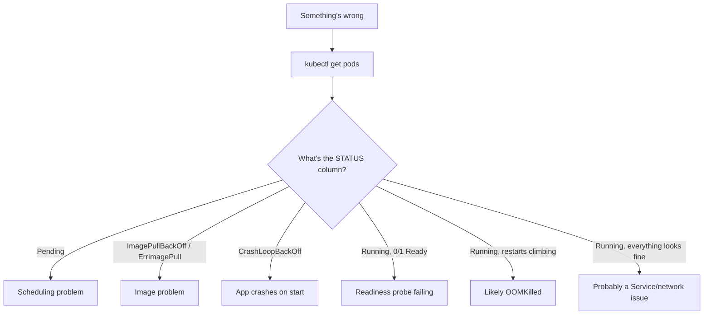
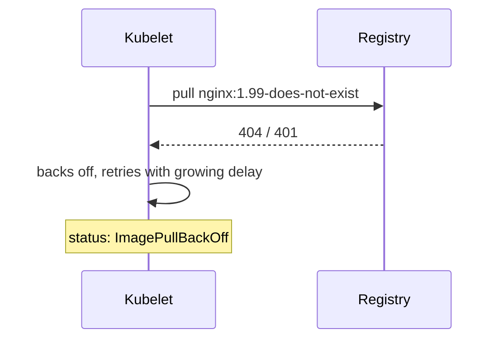
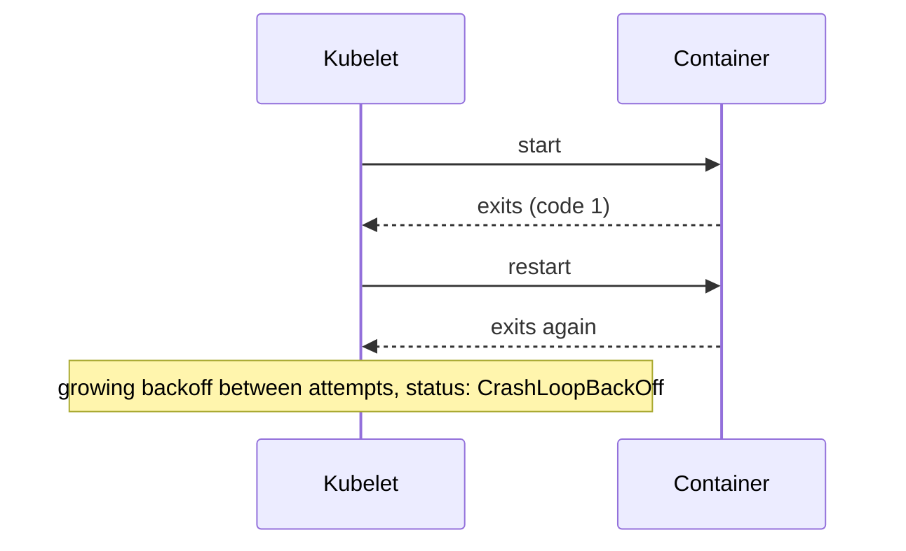
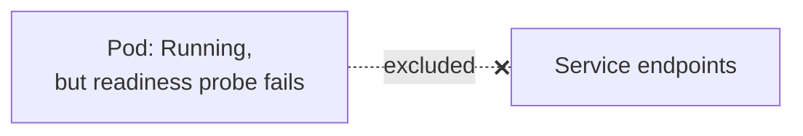
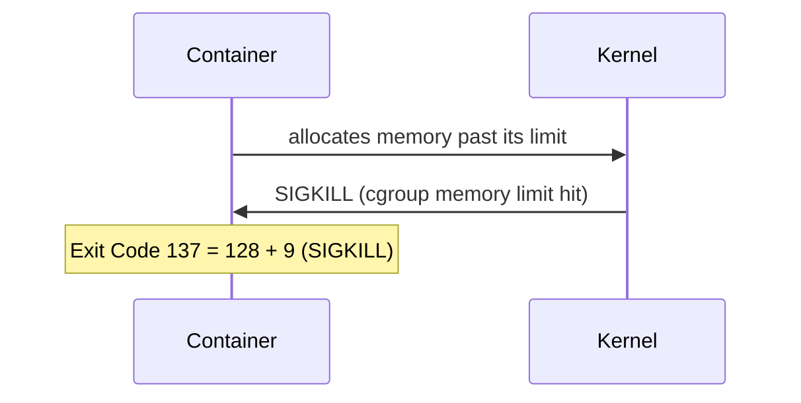
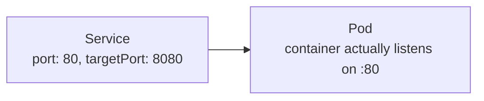
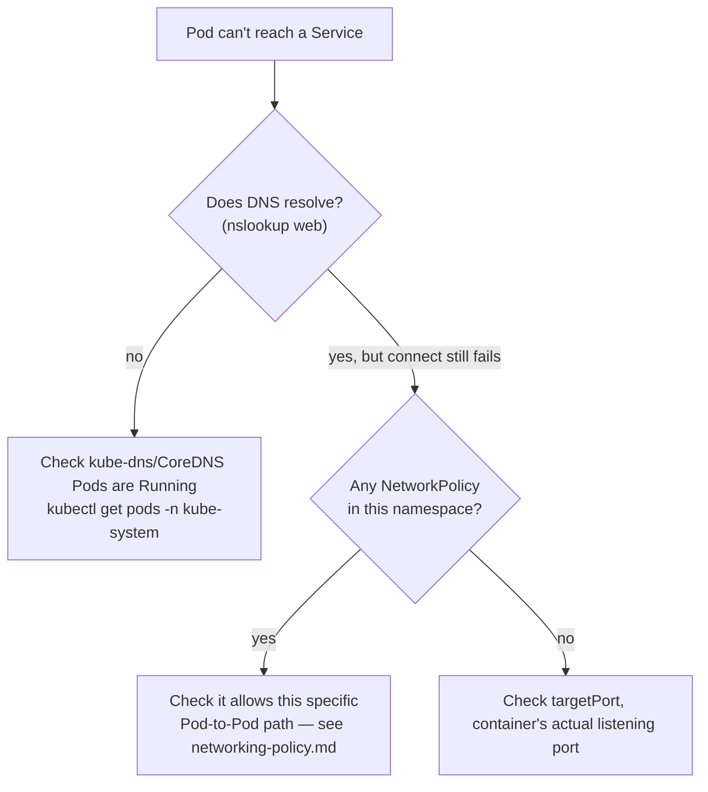

# Debugging Common Kubernetes Issues

---

## The starting point, every time



`kubectl describe pod <name>` and `kubectl logs <name>` answer almost
everything below — the **Events** section at the bottom of `describe` is
the single most useful thing in Kubernetes debugging and the first thing
people forget to scroll to.

---

## Issue 1: stuck in `Pending`

The Scheduler can't find a Node to place the Pod on.

```bash
kubectl run web --image=nginx --requests=cpu=100 --requests=memory=64Gi
kubectl get pods
# web   0/1   Pending
kubectl describe pod web
# Events: 0/3 nodes are available: 3 Insufficient memory.
```

```mermaid
flowchart LR
    Pod["Pod requests:\n64Gi memory"] -.x doesn't fit on any Node.-> N1["Node 1: 8Gi"]
    Pod -.x.-> N2["Node 2: 8Gi"]
    Pod -.x.-> N3["Node 3: 8Gi"]
```

Common causes:

| Cause | How to confirm |
| --- | --- |
| resource requests too high for any Node | `kubectl describe node` — check Allocatable vs. Allocated |
| PVC can't be bound (no matching storage) | `kubectl get pvc` — check STATUS |
| taints on all Nodes, Pod has no matching toleration | `kubectl describe node \| grep Taint` |
| nodeSelector/affinity matches nothing | check `spec.nodeSelector` against `kubectl get nodes --show-labels` |

---

## Issue 2: `ImagePullBackOff` / `ErrImagePull`

```bash
kubectl run web --image=nginx:1.99-does-not-exist
kubectl get pods
# web   0/1   ErrImagePull
kubectl describe pod web
# Failed to pull image: not found
```



Common causes:

- typo'd image name or tag (most common by far)
- private registry, missing `imagePullSecrets`
- rate-limited by the registry (Docker Hub anonymous pulls, e.g.)

```bash
kubectl describe pod web | grep -A5 Events
```

The "BackOff" part just means Kubernetes is retrying with exponential
delay — fixing the underlying image reference resolves it on the next
attempt, no restart needed.

---

## Issue 3: `CrashLoopBackOff`

The container starts, then exits — repeatedly.

```bash
kubectl run web --image=nginx --command -- /bin/sh -c "exit 1"
kubectl get pods
# web   0/1   CrashLoopBackOff
kubectl logs web              # what did it print before dying?
kubectl logs web --previous    # logs from the PREVIOUS crash, if it already restarted
```



Common causes:

- app throws on startup — missing required env var, bad config, can't
  reach a dependency it needs at boot (e.g. a DB not up yet)
- wrong `command`/`ENTRYPOINT` — container runs, does its one task, exits
  immediately (normal for a batch job, wrong for a long-running server)
- a **liveness probe** killing the container repeatedly — this looks
  identical from `kubectl get pods`, easy to misdiagnose as an app bug

```bash
kubectl describe pod web | grep -A3 Liveness
# Liveness probe failed: HTTP probe failed with statuscode: 500
```

If it's the liveness probe, the fix is either the probe's path/threshold,
or the fact that the app really is unhealthy — check which.

---

## Issue 4: `Running` but `0/1 Ready` — readiness probe failing

The container is up, but never receives traffic — because it's never
marked Ready.

```bash
kubectl get pods
# web   0/1   Running
kubectl describe pod web | grep -A3 Readiness
# Readiness probe failed: connection refused
```



```bash
kubectl get endpoints web-svc
# <none>   <- this Pod is never added, because it's never Ready
```

This is often confused with a Service problem (see Issue 6) — always
check `READY` in `kubectl get pods` first; a Service with zero endpoints
is frequently just this, not a selector mismatch.

---

## Issue 5: `OOMKilled`

```bash
kubectl get pods
kubectl describe pod web
# Last State: Terminated, Reason: OOMKilled, Exit Code: 137
```



Fix is one of:

- raise `resources.limits.memory` if the app genuinely needs more
- fix an actual memory leak in the app (rising `kubectl top pod` over time
  is the tell)
- if paired with [VPA](scaling-vpa-hpa.md), let it recommend the right
  limit instead of guessing

Exit code `137` specifically (not just any crash) is the fingerprint of
an OOM kill — worth memorizing.

---

## Issue 6: Service has no endpoints (label mismatch)

The single most common networking complaint, and it's almost always this.

```bash
kubectl create deployment web --image=nginx
kubectl expose deployment web --port=80
kubectl edit deployment web    # accidentally changes the Pod template's label
kubectl get endpoints web
# <none>
```


```bash
kubectl get svc web -o jsonpath='{.spec.selector}'
kubectl get pods --show-labels
# compare the two by eye — mismatch is usually obvious once side by side
```

Straight from [deployment-vs-statefulsets.md](../kubernetes-intro/deployments.md)
and [pods-and-services.md](../kubernetes-intro/pods-and-services.md): a
Service is only ever "whichever Pods match this selector" — if the labels
drift apart, the Service silently has nothing behind it. No error, no
event — just an empty `endpoints` list.

---

## Issue 7: can reach the Service, but get connection refused / wrong response

```bash
kubectl exec -it client -- wget -qO- web
# wget: can't connect to remote host: Connection refused
```

Usually a `port` vs `targetPort` mixup:



```bash
kubectl get svc web -o jsonpath='{.spec.ports}'
kubectl exec -it <pod> -- netstat -tlnp    # or: cat /proc/net/tcp
```

`targetPort` must match the port the container **actually** listens on —
Kubernetes has no way to verify this for you at apply-time; it's a silent
mismatch until someone tries to connect.

---

## Issue 8: Pod can't reach anything at all (DNS or NetworkPolicy)

```bash
kubectl exec -it client -- nslookup web
# ;; connection timed out — DNS itself isn't resolving
```



If DNS itself is broken, check CoreDNS is healthy — this affects the
*entire* cluster, not just one Pod, so it's usually visible everywhere at
once. If DNS works but the connection is still refused/timed out, and a
[NetworkPolicy](networking-policy.md) exists, it's the next suspect —
remember its default-deny leaves *no* trace of "blocked," it just looks
like a timeout.

---

## The generic toolbox

```bash
kubectl get pods -o wide                 # which Node, what IP, restart count
kubectl describe pod <name>              # Events section — read it first
kubectl logs <name>                      # current container's stdout/stderr
kubectl logs <name> --previous           # previous crash's logs
kubectl logs <name> -c <container>       # multi-container Pod: pick one
kubectl get events --sort-by=.lastTimestamp   # cluster-wide recent events
kubectl top pod <name>                   # live CPU/memory (needs metrics-server)
kubectl exec -it <name> -- sh            # shell in, if the container has one
kubectl debug -it <name> --image=busybox --target=<container>   # attach a debug container
                                          # (works even if the app image has no shell)
```

`kubectl debug` matters specifically for minimal/distroless images that
have no shell to `exec` into at all — it attaches an ephemeral debug
container sharing the target's network/process namespace instead.

---

## Takeaway

Almost every issue reduces to reading two things: the `STATUS` column
from `kubectl get pods` (tells you *which* stage failed) and the Events
section of `kubectl describe pod` (tells you *why*). Networking
complaints are usually a labels mismatch or a `port`/`targetPort` typo,
not a mysterious cluster problem — check the boring explanation first.
