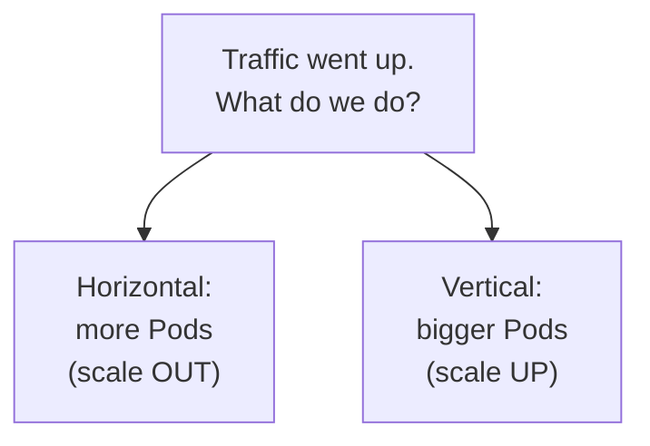
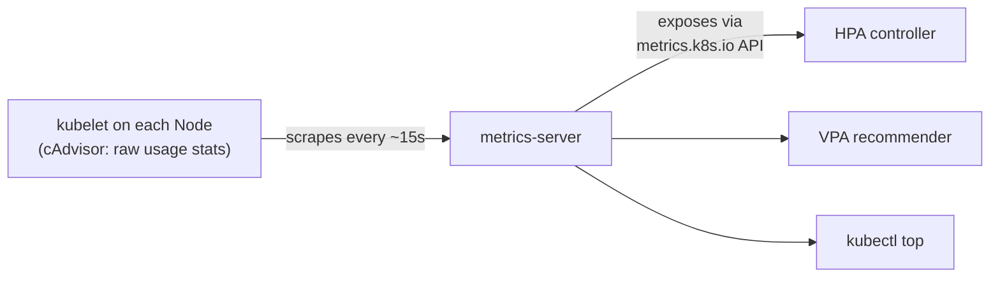
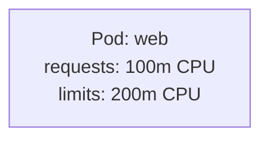
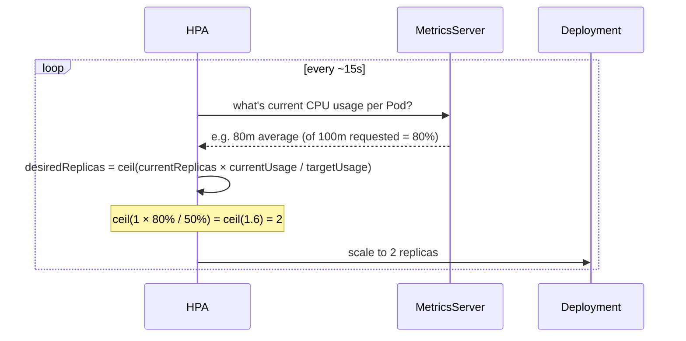
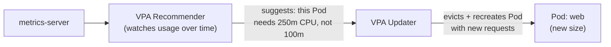
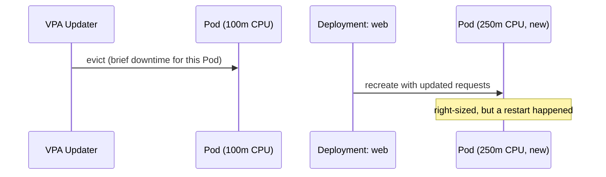
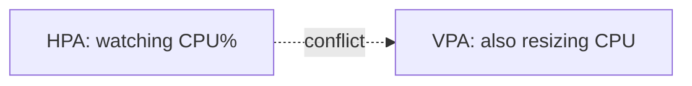

# Scaling: Horizontal (HPA) vs. Vertical (VPA)

Builds on `kubectl scale` from
[deployments.md](../kubernetes-intro/deployments.md) — that was *manual*.
This is Kubernetes doing it **automatically**, based on real usage.

---

## Two different questions



- **Horizontal (HPA)** — add more copies of the same Pod. Good default:
  stateless apps, no upper limit besides cluster capacity.
- **Vertical (VPA)** — give an existing Pod more CPU/memory. Useful when a
  single instance can't be split (or you don't yet know the right size).

---

## The missing piece both depend on: metrics-server

Kubernetes doesn't track CPU/memory usage by default — `kubectl top` and
autoscaling both need **metrics-server** installed first.



```bash
# most local clusters: one command
minikube addons enable metrics-server
# kind / others: apply the components manifest
kubectl apply -f https://github.com/kubernetes-sigs/metrics-server/releases/latest/download/components.yaml

kubectl top nodes
kubectl top pods
```

metrics-server only holds **current** usage in memory — no history, no
dashboards. It's a thin, fast pipe for autoscaling decisions, nothing more
(long-term metrics = Prometheus, a separate concern).

---

## Setup: nginx with resource requests

Both HPA and VPA make decisions **relative to requests** — without them,
neither has a baseline to compare "current usage" against.

```bash
kubectl create deployment web --image=nginx --replicas=1
kubectl set resources deployment/web --requests=cpu=100m,memory=64Mi --limits=cpu=200m,memory=128Mi
kubectl get pods
kubectl top pods
```



- **request** — what the Scheduler reserves for this Pod, guaranteed
- **limit** — the hard ceiling; the container gets throttled (CPU) or
  killed (memory, OOMKilled) past this

---

## Horizontal: HPA, set up

```bash
kubectl autoscale deployment web --cpu-percent=50 --min=1 --max=5
kubectl get hpa
```

```text
NAME   REFERENCE      TARGETS   MINPODS   MAXPODS   REPLICAS
web    Deployment/web 2%/50%    1         5         1
```

"Keep average CPU usage across all Pods at 50% of their **request**
(100m) — scale out up to 5 Pods if it climbs above that, scale back down
to as few as 1 if it drops."

---

## Same HPA, as YAML (`autoscaling/v2`)

`kubectl autoscale` is really just a shortcut for creating this object.
The declarative form uses the `autoscaling/v2` API — `v1` only supported a
single CPU-percentage target; `v2` supports multiple metrics at once
(CPU, memory, or custom/external metrics).

```yaml
# web-hpa.yaml
apiVersion: autoscaling/v2
kind: HorizontalPodAutoscaler
metadata:
  name: web
spec:
  scaleTargetRef:
    apiVersion: apps/v1
    kind: Deployment
    name: web
  minReplicas: 1
  maxReplicas: 5
  metrics:
    - type: Resource
      resource:
        name: cpu
        target:
          type: Utilization
          averageUtilization: 50
    - type: Resource
      resource:
        name: memory
        target:
          type: Utilization
          averageUtilization: 70
  behavior:
    scaleDown:
      stabilizationWindowSeconds: 300   # wait 5 min before scaling down
    scaleUp:
      stabilizationWindowSeconds: 0     # scale up immediately
```

```bash
kubectl apply -f web-hpa.yaml
kubectl get hpa web
kubectl describe hpa web        # shows per-metric current vs. target
```

- **`metrics: []`** — a list, not one value; with two entries here, the
  HPA computes a desired replica count for *each* and scales to the
  **larger** of the two, so neither CPU nor memory ever breaches target
- **`behavior`** — `v2`-only; explicit control over how cautious scale-up
  vs. scale-down should be, instead of one hardcoded cooldown for both

---

## How the HPA control loop actually works



Same reconciliation-loop idea as everything else in Kubernetes — desired
vs. actual, checked repeatedly, corrected automatically. The only new
input is a live number from metrics-server instead of a value you typed.

---

## Watch it scale, live

Generate load against the Service, then watch:

```bash
kubectl expose deployment web --port=80
kubectl run load-gen --image=busybox --restart=Never -- \
  sh -c "while true; do wget -q -O- web; done"

kubectl get hpa web -w
kubectl get pods -w
```

```mermaid
flowchart LR
    subgraph "Before: low load"
        P1["Pod\n5% CPU"]
    end
    subgraph "After: high load"
        P2["Pod\n70% CPU"]
        P3["Pod\n70% CPU"]
        P4["Pod\n70% CPU"]
    end
    "Before: low load" -->|HPA scales out| "After: high load"
```

Stop `load-gen` and, after a cooldown window (default ~5 min, to avoid
flapping), the HPA scales back down toward `--min`.

---

## Vertical: VPA — not built in, and it works differently

Unlike HPA, VPA is **not a core Kubernetes feature** — it's a separate
project (`kubernetes/autoscaler`) you install as CRDs + controllers.

```bash
# one-time cluster setup (clone the autoscaler repo)
./hack/vpa-up.sh
kubectl get pods -n kube-system | grep vpa
```



Define one per Deployment:

```yaml
apiVersion: autoscaling.k8s.io/v1
kind: VerticalPodAutoscaler
metadata:
  name: web-vpa
spec:
  targetRef:
    apiVersion: apps/v1
    kind: Deployment
    name: web
  updatePolicy:
    updateMode: "Auto"
```

```bash
kubectl apply -f web-vpa.yaml
kubectl describe vpa web-vpa
# shows: Target CPU: 100m -> Recommended: 250m (based on observed usage)
```

---

## Why VPA needs to restart the Pod (usually)

CPU/memory requests are set at **container creation**, not changeable on
a running container in most Kubernetes versions — so VPA's "Auto" mode
works by **evicting** the Pod and letting the Deployment recreate it with
new values.



`updateMode` controls how aggressive this is:

| Mode | Behavior |
| --- | --- |
| `Off` | only recommends, never changes anything |
| `Initial` | applies the recommendation only at Pod creation |
| `Auto` | evicts and resizes running Pods automatically |

(Newer Kubernetes versions have an alpha **in-place resize** feature that
avoids the restart — worth checking if your cluster supports it, but
`Auto` mode restarting Pods is still the common case today.)

---

## HPA and VPA together — usually don't, on CPU



If both scale on the *same metric* (CPU), they can fight each other — VPA
resizes the Pod, which changes the % HPA is measuring against, which
triggers HPA to react, etc. Common safe pattern: **HPA on CPU/custom
metrics, VPA on memory only** (or run VPA in `Off`/recommendation-only
mode and apply its suggestions manually).

---

## Side by side

| | HPA | VPA |
| --- | --- | --- |
| Scales | number of Pods | CPU/memory per Pod |
| Built into core Kubernetes? | yes | no, separate project |
| Needs metrics-server? | yes | yes |
| Causes a restart? | no — new Pods added alongside | usually yes (Pod evicted) |
| Good fit | stateless, horizontally-shardable apps | apps that can't be split, or unknown right-sizing |

---

## Cleanup

```bash
kubectl delete hpa web
kubectl delete pod load-gen
kubectl delete vpa web-vpa    # if installed
kubectl delete deployment web
kubectl delete svc web
```

---

## Takeaway

Both are the same reconciliation loop as everything else in Kubernetes —
desired vs. actual, corrected continuously — just fed by **live metrics**
instead of a number you typed once. HPA adds Pods when load rises; VPA
resizes a Pod when it's under- or over-provisioned. Neither works without
metrics-server actually running in the cluster.
