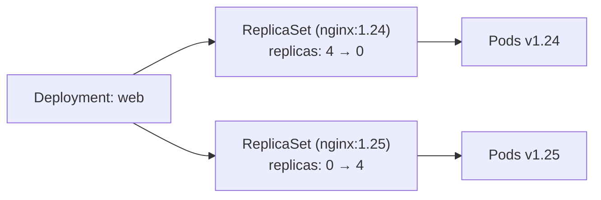
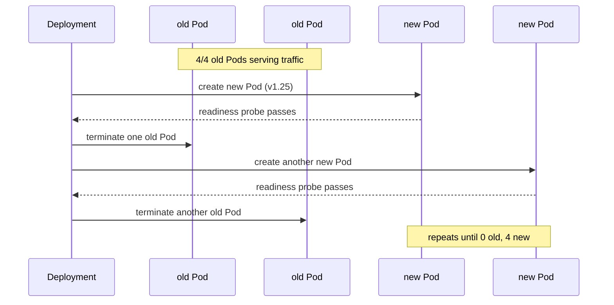
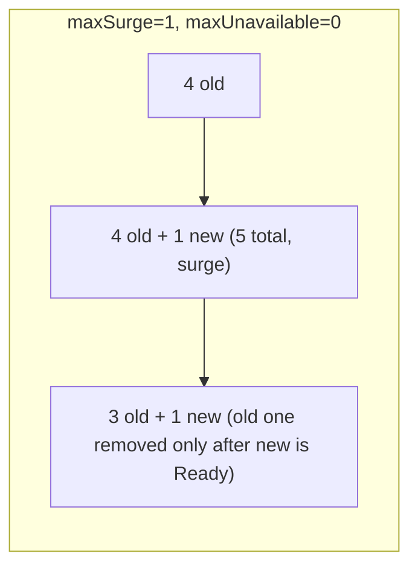
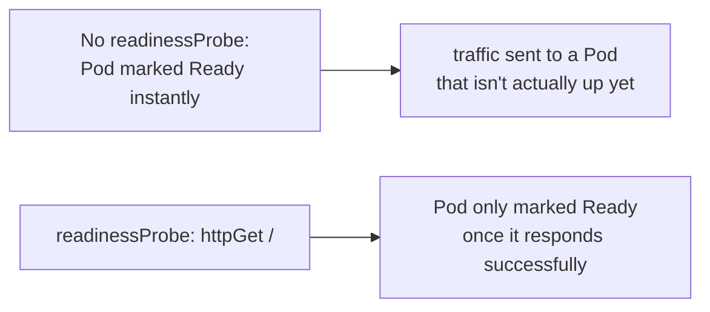
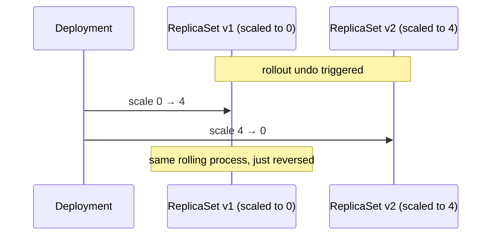
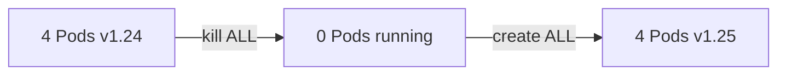
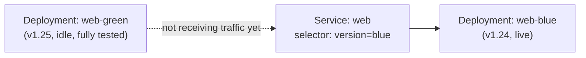
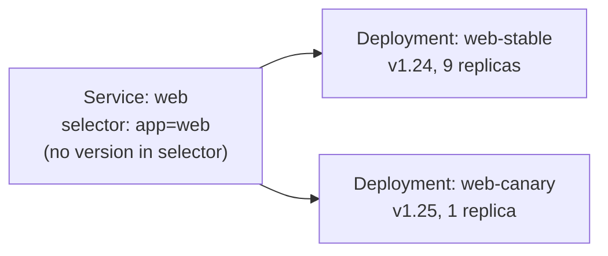

# Rolling Updates — how they work, and other strategies

Builds on the one-liner in
[deployments.md](../kubernetes-intro/deployments.md) — this is the
mechanism underneath, how to tune it, and what to reach for when a rolling
update isn't the right fit.

---

## The command you already know

```bash
kubectl create deployment web --image=nginx:1.24 --replicas=4
kubectl set image deployment/web nginx=nginx:1.25
kubectl rollout status deployment/web
```

Traffic never drops. Underneath, this is doing a lot more than "restart
the containers with a new image."

---

## What actually happens: a new ReplicaSet, not new Pods

A Deployment never edits Pods in place. Changing the image creates a
**second ReplicaSet** and shifts replica counts between old and new.



```bash
kubectl get rs -l app=web
# web-6f9d8c7b4  (nginx:1.25)  4  4  4
# web-5b7c9a6c3  (nginx:1.24)  0  0  0   <- kept around, scaled to 0
```

The old ReplicaSet isn't deleted — it's kept at 0 replicas, which is
exactly what makes `rollout undo` instant: no rebuild, just scale the old
one back up and the new one down.

---

## The actual pod-by-pod sequence



At every point in this sequence, the total count of Ready Pods stays close
to 4 — old Pods are only removed **after** a new Pod is confirmed Ready,
never before.

---

## The knobs: maxSurge and maxUnavailable

```yaml
apiVersion: apps/v1
kind: Deployment
metadata:
  name: web
spec:
  replicas: 4
  strategy:
    type: RollingUpdate
    rollingUpdate:
      maxSurge: 1          # how many EXTRA Pods allowed above 4, temporarily
      maxUnavailable: 0    # how many of the 4 are allowed to be down at once
  selector:
    matchLabels: { app: web }
  template:
    metadata:
      labels: { app: web }
    spec:
      containers:
        - name: nginx
          image: nginx:1.25
          readinessProbe:
            httpGet: { path: /, port: 80 }
            initialDelaySeconds: 2
```

```bash
kubectl apply -f deployment.yaml
```



- **maxSurge** — how far *above* the desired count Kubernetes may go
  temporarily (extra capacity during rollout)
- **maxUnavailable** — how far *below* the desired count it may drop
  temporarily (0 = never less than fully staffed, slower rollout)
- Defaults are both `25%` — for 4 replicas: surge up to 5, drop as low as 3

`maxUnavailable: 0` + `maxSurge: 1` is the strictest, slowest, safest
combination: never fewer than 4 Ready, one extra at a time.

---

## Why readinessProbe is not optional here

Without one, Kubernetes considers a Pod "Ready" the instant its container
process starts — even if the app inside is still booting.



A rolling update's entire safety guarantee — "only remove an old Pod once
its replacement is really serving traffic" — depends on this probe being
accurate. Skip it, and a rolling update can silently route traffic to a
half-started Pod.

---

## Rollback: why it's instant

```bash
kubectl rollout history deployment/web
kubectl rollout history deployment/web --revision=2
kubectl rollout undo deployment/web                  # back to previous
kubectl rollout undo deployment/web --to-revision=1   # back to a specific one
```



Rollback is just another rolling update, in the opposite direction,
between two ReplicaSets that already exist — no rebuild, no repull of an
old image tag (assuming it's still cached/available).

---

## Strategy 2: Recreate — the blunt alternative

```yaml
spec:
  strategy:
    type: Recreate
```



All old Pods are terminated **before** any new ones are created —
guaranteed downtime, but guaranteed that old and new versions never run
simultaneously. Use when your app can't tolerate two versions running at
once (e.g. a schema migration that isn't backward-compatible).

---

## Strategy 3: Blue-Green — not built in, but easy to build

Run both versions fully, switch a Service's selector all at once.



```bash
kubectl create deployment web-blue --image=nginx:1.24 --replicas=4
kubectl expose deployment web-blue --port=80 --name=web --selector=app=web,version=blue

kubectl create deployment web-green --image=nginx:1.25 --replicas=4
# test web-green directly (port-forward to it) before it gets any real traffic

kubectl patch service web -p '{"spec":{"selector":{"version":"green"}}}'
# instant full cutover — all traffic now hits green
```

All-or-nothing switch, instant rollback (patch the selector back), but
costs double the resources while both versions are up.

---

## Strategy 4: Canary — not built in, but easy to build

Run a small number of new-version Pods alongside the old ones, same
Service, same label selector — traffic splits proportionally to replica
count.



```bash
kubectl create deployment web-stable --image=nginx:1.24 --replicas=9
kubectl expose deployment web-stable --port=80 --name=web --selector=app=web

kubectl create deployment web-canary --image=nginx:1.25 --replicas=1
# ~10% of traffic now hits the canary — watch error rates/logs

kubectl scale deployment web-canary --replicas=9
kubectl scale deployment web-stable --replicas=1
# ...continue shifting weight, then delete web-stable once confident
```

Coarser control than a service mesh (traffic % is just replica-count
ratio) but needs nothing extra installed — a real canary setup (precise
%, header-based routing) usually uses Ingress annotations or a mesh like
Istio/Linkerd on top of this same idea.

---

## Side by side

| Strategy | Downtime | Both versions live at once? | Built into Deployment? |
| --- | --- | --- | --- |
| RollingUpdate | none | briefly, a few Pods | yes (default) |
| Recreate | yes | never | yes |
| Blue-Green | none (instant switch) | yes, fully, until cutover | no — build with 2 Deployments + Service selector |
| Canary | none | yes, partially, on purpose | no — build with 2 Deployments + shared selector |

---

## Cleanup

```bash
kubectl delete deployment web web-blue web-green web-stable web-canary
kubectl delete svc web
```

---

## Takeaway

A rolling update is two ReplicaSets, one scaling up while the other scales
down, gated on `readinessProbe` and bounded by `maxSurge`/`maxUnavailable`
— that's the entire mechanism, and it's also why rollback is instant.
Recreate trades that safety for simplicity when versions can't coexist;
blue-green and canary aren't native primitives, but fall out naturally
from Deployments + Service label selectors once you understand how those
two connect.
