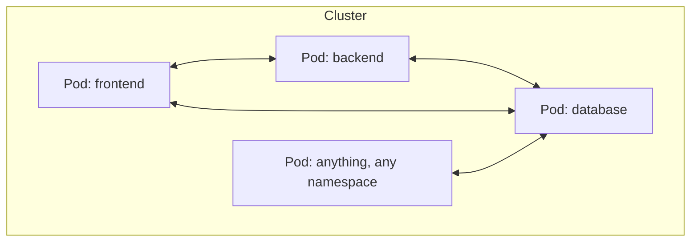
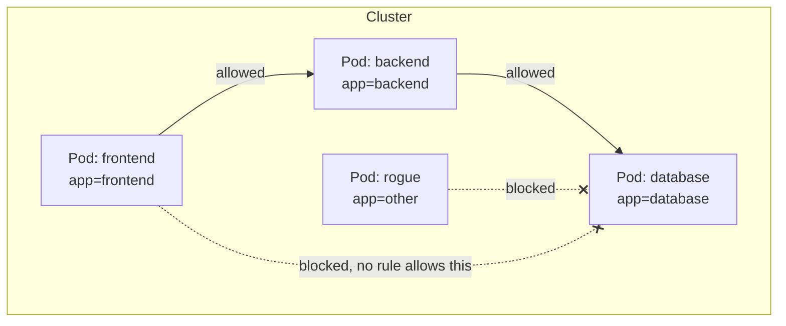
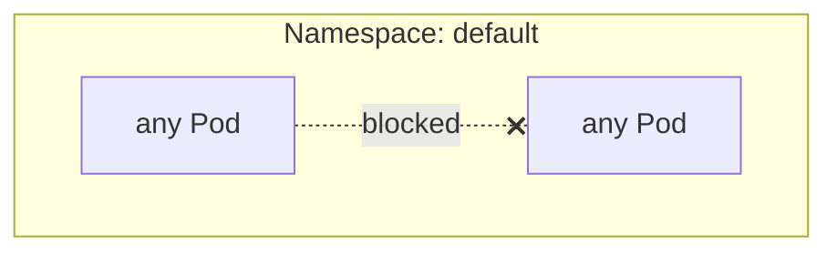
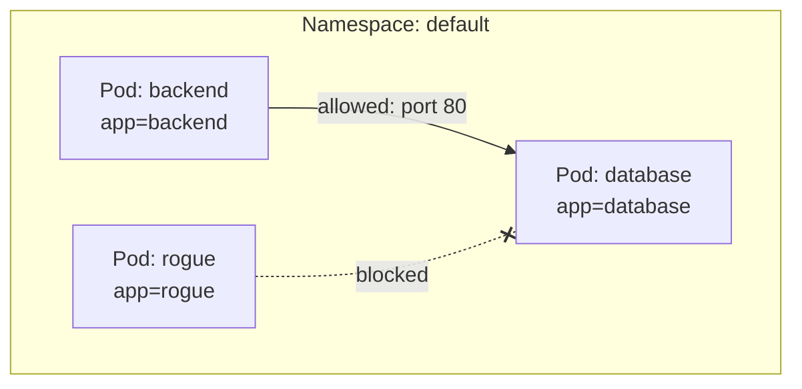
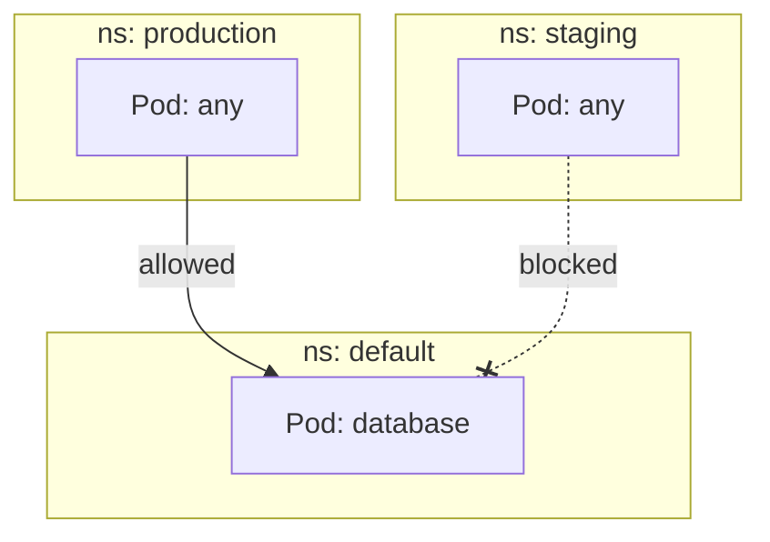
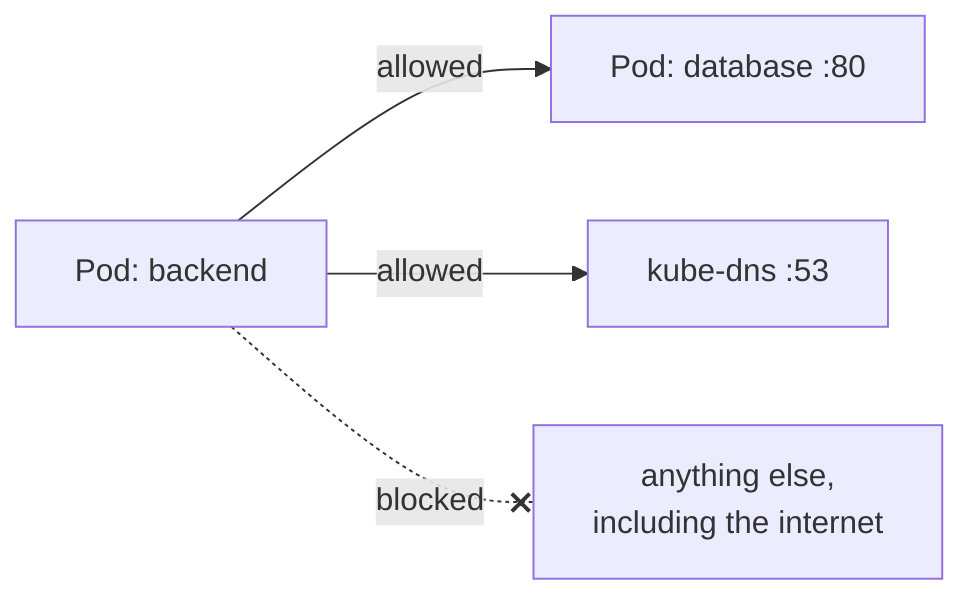

# NetworkPolicy — why, and how

Builds on the flat-network model from
[services.md](../kubernetes-intro/services.md) — this is what puts limits
on it.

---

## The problem: by default, everything can reach everything



Any Pod can reach any other Pod's IP, on any port, cluster-wide — that's
the flat network doing exactly what it's designed to do. It's also a
security problem: a compromised `frontend` Pod (or literally any Pod
anyone spins up) can talk **directly to your database**, with nothing in
between.

---

## The fix: NetworkPolicy — a firewall scoped by labels

A NetworkPolicy says "Pods matching **this label** may only receive
traffic from Pods matching **that label**" (and/or only send traffic to
certain destinations). It's enforced by the cluster's networking layer,
not by anything inside the Pod.



---

## Important caveat before you try this

NetworkPolicy is a Kubernetes **API object** — enforcing it is the job of
the CNI plugin, not the API server. Some CNIs (like the default one in
plain `kind`, or basic `flannel`) **don't enforce NetworkPolicy at all** —
you can apply one and see zero effect.

```bash
kubectl get pods -n kube-system   # look for calico / cilium / weave
```

If none of those are present, either install one (e.g. Calico) or use
`minikube start --cni=calico` — otherwise every example below will apply
cleanly but do nothing.

---

## Setup: three Pods to test with

```bash
kubectl run database --image=nginx --port=80 --labels=app=database
kubectl run backend --image=busybox --labels=app=backend --command -- sleep 3600
kubectl run rogue --image=busybox --labels=app=rogue --command -- sleep 3600

kubectl expose pod database --port=80 --name=database
```

```bash
# before any policy — both succeed
kubectl exec -it backend -- wget -qO- --timeout=2 database
kubectl exec -it rogue -- wget -qO- --timeout=2 database
```

---

## Example 1: default-deny-all (the recommended starting point)

```yaml
# default-deny.yaml
apiVersion: networking.k8s.io/v1
kind: NetworkPolicy
metadata:
  name: default-deny
spec:
  podSelector: {}       # empty = applies to every Pod in the namespace
  policyTypes:
    - Ingress
```

```bash
kubectl apply -f default-deny.yaml

kubectl exec -it backend -- wget -qO- --timeout=2 database
# times out — nothing is allowed in anymore, including backend
```



Whitelist-only from here — nothing gets in unless a policy explicitly
allows it. This is the standard "secure by default" starting posture.

---

## Example 2: allow only from a specific label

```yaml
# allow-backend-to-database.yaml
apiVersion: networking.k8s.io/v1
kind: NetworkPolicy
metadata:
  name: allow-backend-to-database
spec:
  podSelector:
    matchLabels:
      app: database        # this policy applies to Pods labeled app=database
  policyTypes:
    - Ingress
  ingress:
    - from:
        - podSelector:
            matchLabels:
              app: backend  # only allow traffic FROM Pods labeled app=backend
      ports:
        - protocol: TCP
          port: 80
```

```bash
kubectl apply -f allow-backend-to-database.yaml

kubectl exec -it backend -- wget -qO- --timeout=2 database
# works — backend is explicitly allowed

kubectl exec -it rogue -- wget -qO- --timeout=2 database
# still times out — rogue matches no allow rule
```



Two policies **combine additively** — `default-deny` blocks everything,
this one carves out one specific exception. Order doesn't matter; every
matching `NetworkPolicy` for a Pod is unioned together.

---

## Example 3: restrict by namespace, not just label

```yaml
apiVersion: networking.k8s.io/v1
kind: NetworkPolicy
metadata:
  name: allow-from-prod-namespace
spec:
  podSelector:
    matchLabels:
      app: database
  policyTypes:
    - Ingress
  ingress:
    - from:
        - namespaceSelector:
            matchLabels:
              kubernetes.io/metadata.name: production
```



Every namespace is auto-labeled with `kubernetes.io/metadata.name` by
Kubernetes itself — handy for exactly this kind of namespace-scoped rule
without having to label it yourself.

---

## Example 4: egress — restrict outbound traffic too

Ingress rules control what can reach a Pod; **egress** rules control what
that Pod is allowed to call out to — useful for locking down a Pod that's
been compromised from doing anything but talk to what it needs.

```yaml
apiVersion: networking.k8s.io/v1
kind: NetworkPolicy
metadata:
  name: backend-egress
spec:
  podSelector:
    matchLabels:
      app: backend
  policyTypes:
    - Egress
  egress:
    - to:
        - podSelector:
            matchLabels:
              app: database
      ports:
        - protocol: TCP
          port: 80
    - to:      # also allow DNS lookups — easy to forget, breaks everything else
        - namespaceSelector: {}
      ports:
        - protocol: UDP
          port: 53
```



Forgetting the DNS egress rule is the single most common NetworkPolicy
mistake — without it, `backend` can't even resolve `database`'s name to
try connecting.

---

## Cleanup

```bash
kubectl delete networkpolicy default-deny allow-backend-to-database allow-from-prod-namespace backend-egress
kubectl delete pod database backend rogue
kubectl delete svc database
```

---

## Takeaway

Kubernetes's flat network means "any Pod can reach any Pod" by default —
convenient, but not something you want in production untouched.
NetworkPolicy layers a label-based, additive firewall on top: start with
`default-deny`, then explicitly allow only the specific Pod-to-Pod paths
your app actually needs — but only if your CNI plugin actually enforces
it.
