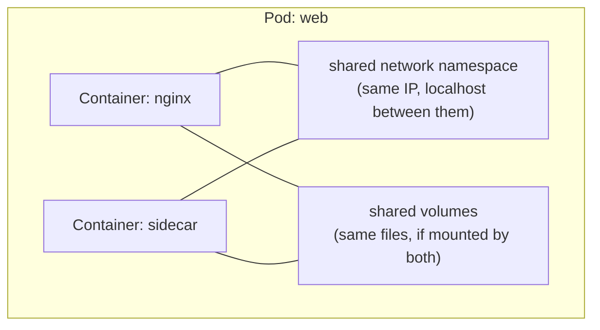
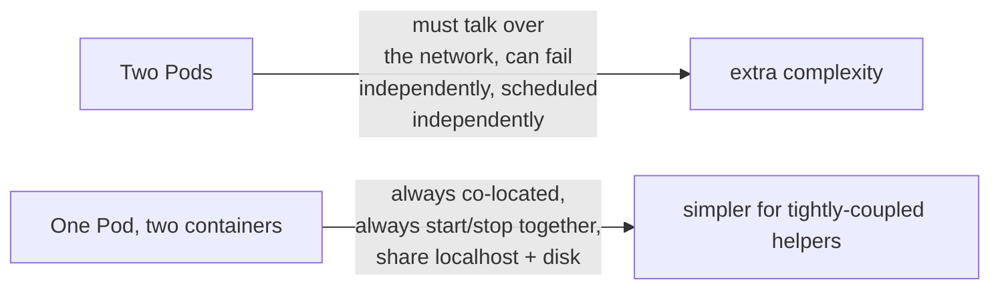
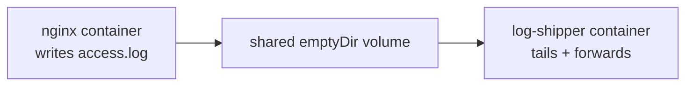
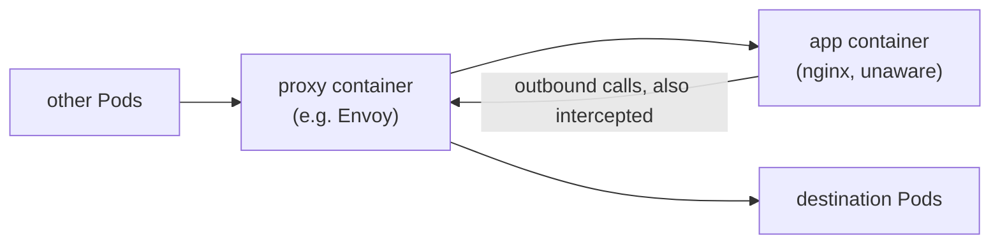
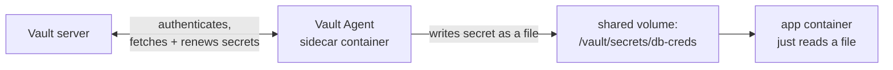
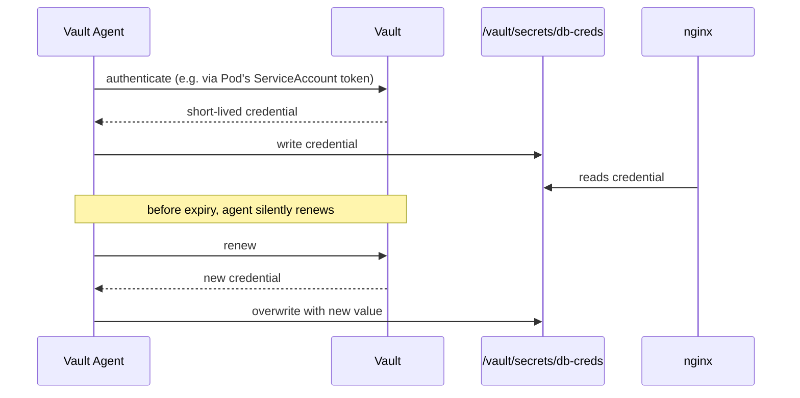
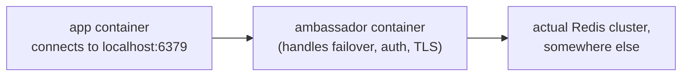
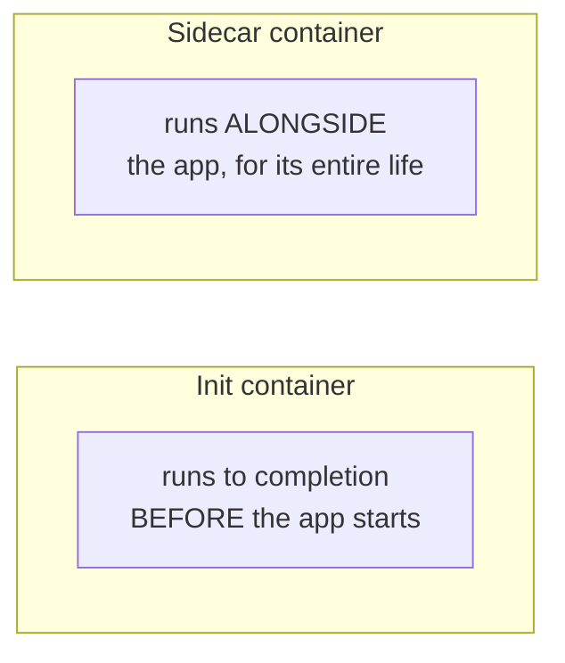
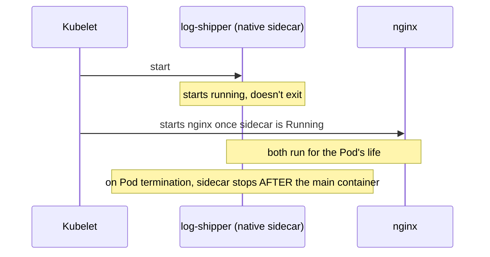

# Sidecars & Multi-Container Pods

---

## Recap: a Pod can hold more than one container

Every other doc in this repo uses one container per Pod — that's the
common case, but not a hard rule. Containers **in the same Pod** share
two things no Pod-to-Pod pair ever shares:



- **network** — both containers see `localhost` as each other; port 80 in
  one container is `localhost:80` from the other's point of view
- **volumes** — any volume mounted by both is the exact same files, live

This is the entire mechanism every pattern below is built on.

---

## Why not just use two separate Pods?



A sidecar is for something that's **not a separate service** — it has no
purpose without its main container, doesn't get scaled independently, and
needs zero-latency access to the main container's disk or localhost port.
If it could reasonably be its own Deployment + Service, it probably
should be — that's not a sidecar, that's a microservice.

---

## Use case 1: logging sidecar

`nginx` doesn't ship logs anywhere useful on its own — a sidecar tails its
log file from a shared volume and forwards it.

```yaml
apiVersion: v1
kind: Pod
metadata:
  name: web
spec:
  containers:
    - name: nginx
      image: nginx
      volumeMounts:
        - name: logs
          mountPath: /var/log/nginx
    - name: log-shipper
      image: busybox
      command: ["sh", "-c", "tail -F /var/log/nginx/access.log"]
      volumeMounts:
        - name: logs
          mountPath: /var/log/nginx
  volumes:
    - name: logs
      emptyDir: {}
```



```bash
kubectl apply -f web-logging.yaml
kubectl logs web -c log-shipper -f
```

`nginx` itself needed zero changes — it just writes to disk like always;
the sidecar does the "ship this somewhere" job it doesn't know how to do.

---

## Use case 2: proxy/service-mesh sidecar

Every network call in and out of the Pod is silently routed through a
proxy container first — this is exactly how Istio/Linkerd inject mTLS,
retries, and metrics without touching your app.



```bash
kubectl get pod web -o jsonpath='{.spec.containers[*].name}'
# istio-proxy nginx      <- injected automatically by the mesh's admission webhook
```

The app container never knows the proxy exists — traffic is redirected at
the network layer (iptables rules the proxy sets up on Pod startup), which
is exactly what shared network namespace makes possible.

---

## Use case 3: Vault Agent — secrets injection

Rather than your app calling HashiCorp Vault's API directly (auth
handshake, token renewal, retry logic, all in your code), a Vault Agent
sidecar does that work and hands the app plain files instead.



```yaml
apiVersion: v1
kind: Pod
metadata:
  name: web
spec:
  containers:
    - name: nginx
      image: nginx
      volumeMounts:
        - name: vault-secrets
          mountPath: /vault/secrets
          readOnly: true
    - name: vault-agent
      image: hashicorp/vault
      args:
        - agent
        - -config=/vault/config/agent.hcl
      volumeMounts:
        - name: vault-secrets
          mountPath: /vault/secrets
        - name: vault-config
          mountPath: /vault/config
  volumes:
    - name: vault-secrets
      emptyDir: {}       # never touches disk outside the Pod, gone when Pod dies
    - name: vault-config
      configMap:
        name: vault-agent-config
```

```bash
kubectl exec web -c nginx -- cat /vault/secrets/db-creds
# username: app
# password: <freshly issued, short-lived>
```

The app container never sees a Vault token, never calls Vault's API, and
never handles renewal — it just re-reads the file. The agent handles
re-authenticating and rewriting that file before the secret expires,
transparently, in the background.



This is the same idea as the `envFrom`/mounted-Secret approach in
[configmap-and-secrets.md](../kubernetes-intro/configmap-and-secrets.md),
but solves the problem that doc calls out — a plain Kubernetes Secret is
static and never rotates on its own; a Vault Agent sidecar keeps the file
fresh for the Pod's entire lifetime instead.

---

## Use case 4: ambassador — simplifying access to something external

The sidecar presents a simple `localhost` interface; it hides the real
complexity (retries, discovery, auth) of reaching something outside the
Pod.



```yaml
containers:
  - name: app
    image: myapp
    env:
      - name: REDIS_HOST
        value: "localhost"      # app thinks Redis is right here
  - name: redis-ambassador
    image: redis-proxy
    ports:
      - containerPort: 6379
```

The app's code stays trivial ("connect to localhost") while the
ambassador absorbs whatever real-world complexity sits behind it.

---

## Use case 5: adapter — normalizing output

Reshapes the main container's output into a format something else
expects — e.g. converting `nginx`'s log format into the JSON a monitoring
system requires, without patching nginx itself.


Same shape as the logging sidecar — the distinguishing feature is that an
adapter **transforms** the data, not just relays it.

---

## Sidecar vs. Init Container — easy to conflate, different jobs



| | Init container | Sidecar |
| --- | --- | --- |
| When it runs | before the main container starts, then exits | for the whole Pod lifetime |
| Purpose | one-time setup (wait for a dependency, run a migration, fetch a config file) | ongoing support role (logging, proxying, syncing) |
| Restarts with the Pod? | runs once per Pod start | yes, restarted if it crashes |

```yaml
initContainers:
  - name: wait-for-db
    image: busybox
    command: ["sh", "-c", "until nc -z database 5432; do sleep 1; done"]
containers:
  - name: app
    image: myapp
```

`wait-for-db` blocks the Pod from starting `app` until the database port
is reachable, then exits and is never involved again.

---

## Native sidecars (Kubernetes 1.28+)

Before 1.28, "sidecar" was purely a convention — just a second entry
under `containers:`, with no special ordering guarantees, and no clean way
to say "keep this one alive for the Pod's whole life but start it before
the main app." Kubernetes 1.28 added real sidecar support by extending
`initContainers`:

```yaml
initContainers:
  - name: log-shipper
    image: busybox
    command: ["sh", "-c", "tail -F /var/log/nginx/access.log"]
    restartPolicy: Always        # <-- this is what makes it a "native" sidecar
    volumeMounts:
      - name: logs
        mountPath: /var/log/nginx
containers:
  - name: nginx
    image: nginx
    volumeMounts:
      - name: logs
        mountPath: /var/log/nginx
volumes:
  - name: logs
    emptyDir: {}
```



`restartPolicy: Always` on an init container is the signal: start it
first (like a normal init container), but don't wait for it to *exit* —
just wait for it to be *running*, then start the real containers. It also
shuts down **last** on Pod termination, so it can capture logs from the
main container's shutdown too.

---

## Cleanup

```bash
kubectl delete pod web
```

---

## Takeaway

Containers in the same Pod share network and (opt-in) volumes — that's
the whole trick behind logging sidecars, mesh proxies, ambassadors, and
adapters. Use a sidecar when a helper process has no life of its own
outside the main container; use an init container for one-time setup
before the app starts; on Kubernetes 1.28+, `restartPolicy: Always` on an
init container gets you a real, properly-ordered sidecar instead of the
old "just add another container and hope" convention.
