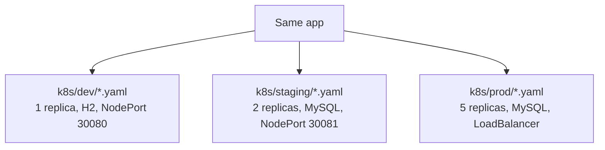
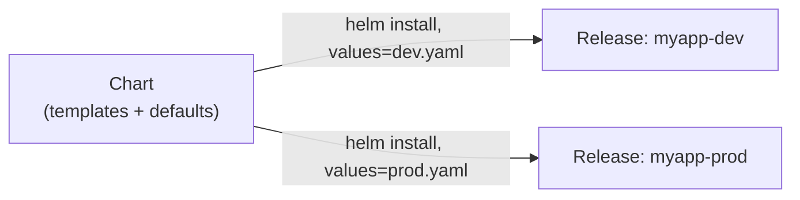
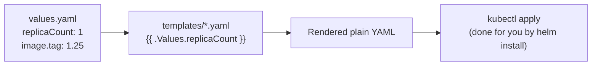
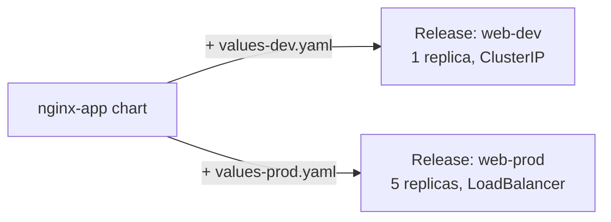
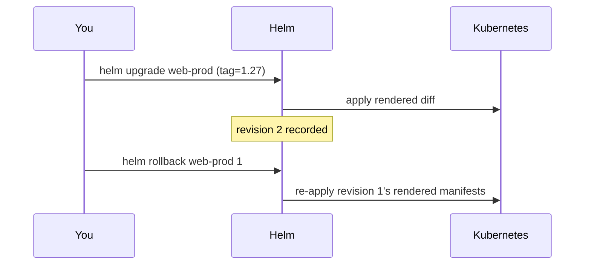
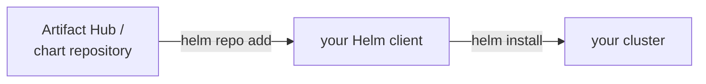

# Helm — a package manager for Kubernetes

---

## The problem: plain YAML doesn't scale across environments

Look at [`part-order-app-java/k8s/`](../part-order-app-java/k8s/) vs.
[`k8s-with-mysql/`](../part-order-app-java/k8s-with-mysql/) in this repo —
two variants of the *same app*, and most of each manifest is identical.
Multiply that by dev/staging/prod and you get:



- three (or more) near-duplicate copies of every Deployment/Service/ConfigMap
- change one label everywhere → find-and-replace across every copy, by hand
- "which YAML did we actually apply to prod last time?" has no good answer
- no single command to install, upgrade, or fully remove "the app" as one unit

---

## What Helm actually is



- **Chart** — a packaged, parameterized set of manifest templates (think:
  an npm package, but for Kubernetes YAML)
- **Values** — the parameters filled into those templates, one file per
  environment
- **Release** — one installed instance of a chart + a specific set of
  values, tracked with its own version history

Same chart, different values file, as many independent releases as you
need — no copy-pasted YAML.

---

## Anatomy of a chart

```bash
helm create nginx-app
```

```text
nginx-app/
  Chart.yaml          # name, version, metadata
  values.yaml          # DEFAULT values — the "factory settings"
  templates/
    deployment.yaml    # YAML + {{ .Values.xxx }} placeholders
    service.yaml
    configmap.yaml
  charts/              # dependencies (other charts), if any
```



Helm doesn't invent a new deployment mechanism — it renders templates into
ordinary Kubernetes YAML, then applies that. Nothing about the cluster
itself is Helm-aware.

---

## A minimal example: nginx, templated

```yaml
# values.yaml (defaults)
replicaCount: 1
image:
  repository: nginx
  tag: "1.25"
service:
  type: ClusterIP
  port: 80
```

```yaml
# templates/deployment.yaml
apiVersion: apps/v1
kind: Deployment
metadata:
  name: {{ .Release.Name }}-nginx
spec:
  replicas: {{ .Values.replicaCount }}
  selector:
    matchLabels:
      app: {{ .Release.Name }}
  template:
    metadata:
      labels:
        app: {{ .Release.Name }}
    spec:
      containers:
        - name: nginx
          image: "{{ .Values.image.repository }}:{{ .Values.image.tag }}"
          ports:
            - containerPort: 80
```

```yaml
# templates/service.yaml
apiVersion: v1
kind: Service
metadata:
  name: {{ .Release.Name }}-nginx
spec:
  type: {{ .Values.service.type }}
  selector:
    app: {{ .Release.Name }}
  ports:
    - port: {{ .Values.service.port }}
      targetPort: 80
```

`{{ .Release.Name }}` is filled in from whatever name you give the
release at install time — the same chart produces differently-named,
non-colliding objects for every release.

---

## See what it actually generates, before touching the cluster

```bash
helm template myweb ./nginx-app
```

This renders the templates and prints the plain YAML — no cluster
contact at all. Always worth running before `install`/`upgrade` on
anything you don't fully trust yet.

---

## Install, per environment — this is the payoff

```yaml
# values-dev.yaml
replicaCount: 1
service:
  type: ClusterIP
```

```yaml
# values-prod.yaml
replicaCount: 5
image:
  tag: "1.26"
service:
  type: LoadBalancer
```

```bash
helm install web-dev ./nginx-app -f values-dev.yaml -n dev
helm install web-prod ./nginx-app -f values-prod.yaml -n prod
```



One chart, one source of truth for the template structure; only the
*values* differ per environment — exactly the duplication problem from
the top of this doc, solved.

---

## Upgrade and rollback — versioned, like a Deployment's rollout

```bash
helm upgrade web-prod ./nginx-app -f values-prod.yaml --set image.tag=1.27
helm history web-prod
helm rollback web-prod 2      # back to revision 2, whole release at once
```



This is the same rolling-update mechanism from
[rolling-update.md](rolling-update.md) happening underneath — Helm's
"revision" is one level up: not just one Deployment's rollout history, but
every object the chart manages, versioned and rolled back together.

---

## Removing an app, cleanly

```bash
helm uninstall web-dev -n dev
```

Deletes every object the release created — no risk of orphaned
ConfigMaps or Services left behind from a manual `kubectl delete -f`
across several files, some of which you forgot.

---

## Public charts: you rarely start from scratch

```bash
helm repo add bitnami https://charts.bitnami.com/bitnami
helm repo update
helm search repo bitnami/nginx
helm install web bitnami/nginx --set service.type=LoadBalancer
```



Most common software (nginx, MySQL, Redis, Prometheus...) already has a
well-maintained public chart — writing your own is mainly for your own
application, not for infrastructure you'd otherwise hand-roll from
scratch.

---

## Cheat sheet

```bash
helm create <name>                        # scaffold a new chart
helm template <release> <chart>            # render without installing
helm lint <chart>                          # catch template mistakes
helm install <release> <chart> -f values.yaml
helm upgrade <release> <chart> -f values.yaml
helm upgrade --install <release> <chart>   # install if missing, upgrade otherwise
helm rollback <release> <revision>
helm history <release>
helm uninstall <release>
helm list -A                               # all releases, all namespaces
```

---

## Takeaway

Helm is `kubectl apply -f` with templating and a release history layered
on top — a Chart is the reusable template, values files are what change
per environment, and a Release is one tracked, upgradeable,
rollback-able, uninstallable instance of the two combined. It doesn't
replace anything about how Kubernetes itself works — it just stops you
from hand-copying YAML across environments.
