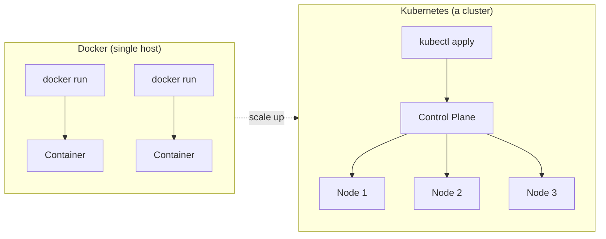
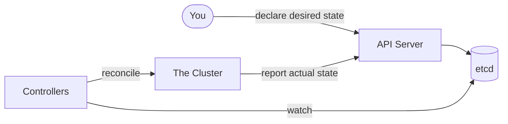
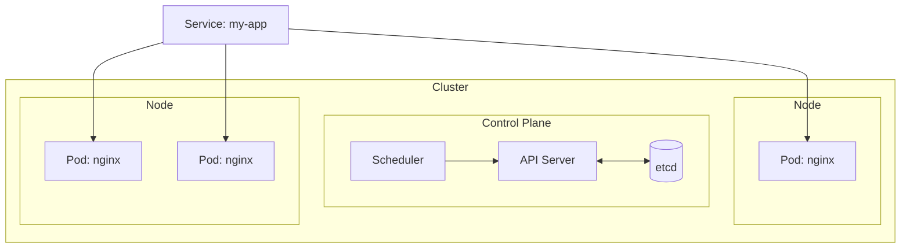
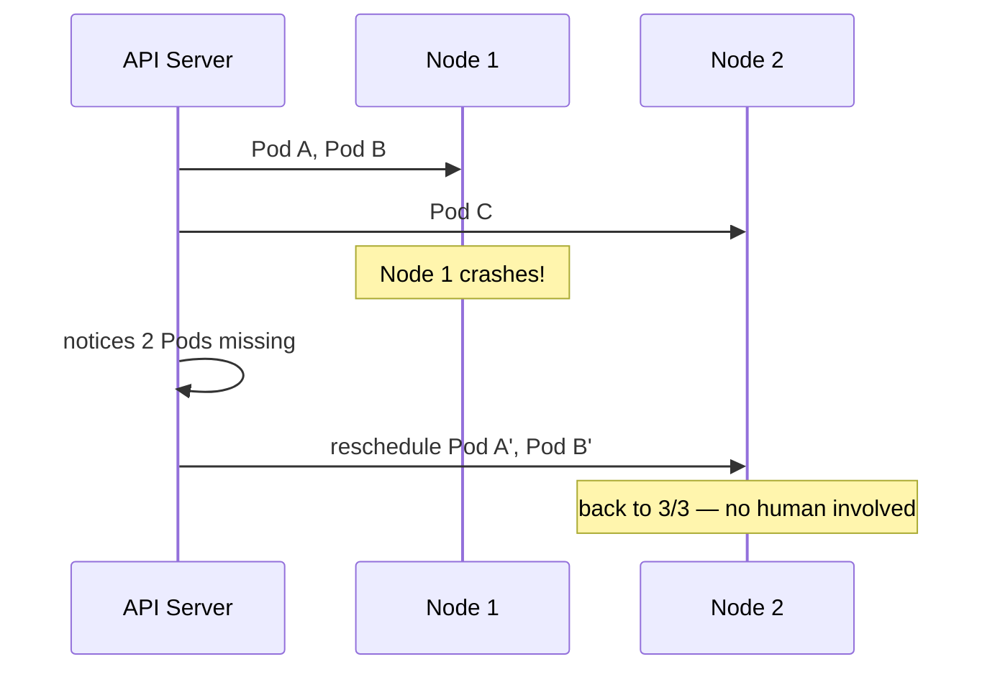
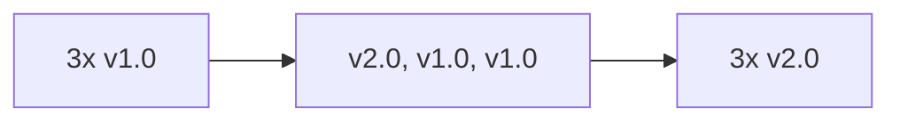

# Kubernetes - the container orchestrator

---

## The problem

- Docker knows how to run containers on **one machine**
- Real apps need:
  - many copies, spread across **many machines**
  - auto-restart when something dies
  - scale up/down with load
  - zero-downtime rollouts + instant rollback
- `docker run` / `docker-compose` can't do any of this

---

## Docker vs. Kubernetes



**Docker:** imperative, one host
**Kubernetes:** declarative, many hosts

---

## The core idea: desired state

> You never say "start this container."
> You say "**this** is what the world should look like."



Controllers loop forever, closing the gap between **desired** and **actual**.

---

## Docker → Kubernetes vocabulary

| Docker | Kubernetes |
| --- | --- |
| container | **Pod** |
| `docker run --restart` | **Deployment** |
| `docker-compose.yml` | Deployment + Service |
| compose network | **Service** |
| `-v` volume | **Volume / PVC** |
| `docker exec -it` | `kubectl exec -it` |
| a host | **Node** |
| Docker daemon | **kubelet** |
| `--env-file` | **ConfigMap / Secret** |

---

## The building blocks



- **Pod** — one running app instance, disposable
- **Deployment** — "keep N of these running"
- **Service** — stable address for a moving set of Pods
- **Node** — a machine that runs Pods
- **Control Plane** — the brain

---

## Compose vs. Kubernetes

```yaml
# docker-compose.yml
services:
  web:
    image: myapp:1.0
    ports: ["8080:80"]
```

```yaml
# deployment.yaml
spec:
  replicas: 3          # <- the whole point
  template:
    spec:
      containers:
        - image: myapp:1.0
---
# service.yaml
spec:
  selector: { app: web }
  ports: [{ port: 80 }]
```

`replicas: 3` = keep 3 alive, forever, wherever there's room.

---

## Try it: nginx, Docker → kubectl

### Docker

```bash
docker run -d --name web -p 8080:80 nginx
docker ps
curl localhost:8080
docker rm -f web
```

### Kubernetes (same steps, no YAML)

```bash
kubectl run web --image=nginx --port=80
kubectl get pods
kubectl expose pod web --port=8080 --target-port=80
kubectl port-forward pod/web 8080:80
curl localhost:8080
kubectl delete pod web
```

Want 3 copies instead of 1? That's the part Docker can't do:

```bash
kubectl create deployment web --image=nginx --replicas=3
kubectl get pods -o wide          # 3 Pods, likely on different nodes
kubectl scale deployment web --replicas=5
kubectl delete deployment web
```

---

## Self-healing, in action



---

## Rolling updates



- `kubectl set image deploy/web web=myapp:2.0`
- swaps Pods gradually, health-checked, **zero downtime**
- `kubectl rollout undo` reverses it instantly

---

## One sentence

**Docker:** package + run one container, one machine.
**Kubernetes:** keep the right containers running, healthy, balanced, and
updated — across a fleet — with no human babysitting.

---

## Next up

1. `kubectl` basics (`get`, `describe`, `logs`, `exec`)
2. Labels & selectors
3. ConfigMaps & Secrets
4. Namespaces
5. Ingress
6. StatefulSets & PersistentVolumes
