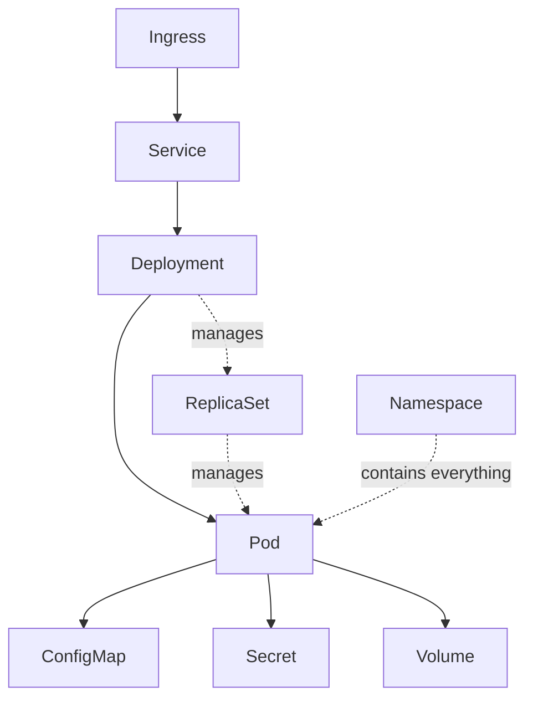
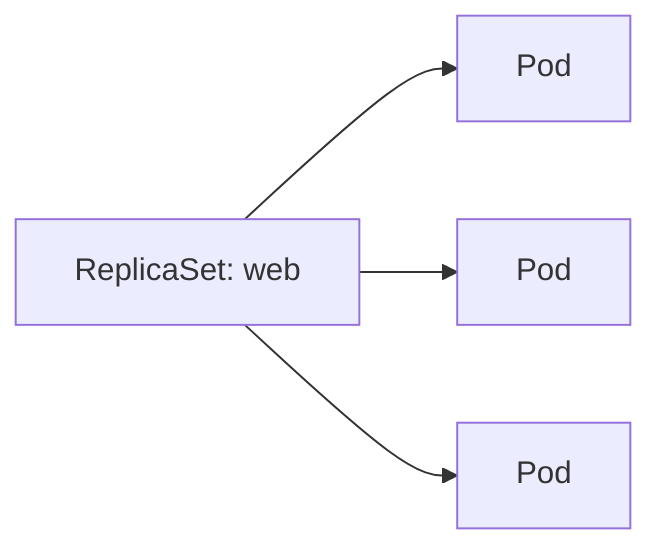
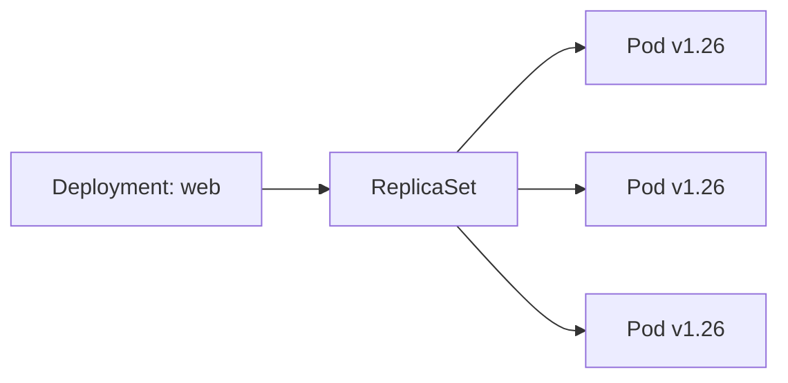
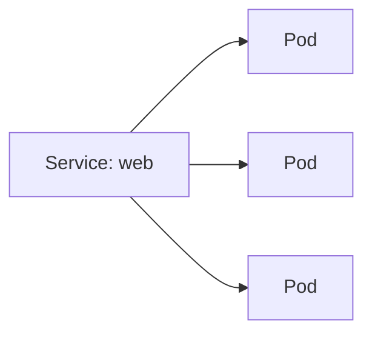
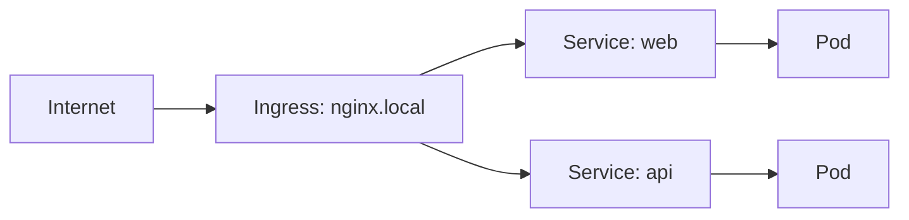

# Kubernetes Components

---

## The stack we're building



We'll go bottom-up: Pod → ReplicaSet → Deployment → Service → Ingress,
then the supporting pieces (ConfigMap, Secret, Volume, Namespace).

---

## Pod — the smallest unit

One (usually) container, with its own IP, inside the cluster.

```bash
kubectl run web --image=nginx --port=80
kubectl get pods
kubectl describe pod web
kubectl logs web
kubectl exec -it web -- bash
kubectl delete pod web
```

- Pods are **disposable** — delete one, it's just gone (nothing replaces it)
- That's the problem the next component fixes

---

## ReplicaSet — "keep N of these running"

You basically never create these directly — a Deployment manages them for
you. Shown once so you know the layer exists:

```bash
kubectl create deployment web --image=nginx
kubectl get replicasets
kubectl get pods --show-labels
```



If you delete a Pod it manages, the ReplicaSet notices and starts a new one
immediately — try it:

```bash
kubectl delete pod <one-of-the-pods>
kubectl get pods -w      # watch a replacement appear
```

---

## Deployment — the thing you actually use

Wraps a ReplicaSet, adds rollouts/rollbacks/scaling on top.

```bash
kubectl create deployment web --image=nginx:1.25 --replicas=3
kubectl get deployments
kubectl get pods -o wide

kubectl scale deployment web --replicas=5
kubectl set image deployment/web nginx=nginx:1.26   # rolling update
kubectl rollout status deployment/web
kubectl rollout undo deployment/web                 # instant rollback
```



---

## Service — a stable address for moving Pods

Pods get new IPs every time they're replaced. A Service gives you one
address that never changes.

```bash
kubectl expose deployment web --port=80 --target-port=80 --type=ClusterIP
kubectl get svc web
kubectl port-forward svc/web 8080:80
curl localhost:8080
```



Three flavors, same command different `--type`:

| Type | Reachable from |
| --- | --- |
| `ClusterIP` (default) | inside the cluster only |
| `NodePort` | any node's IP, on a high port |
| `LoadBalancer` | the internet (needs cloud provider support) |

```bash
kubectl expose deployment web --port=80 --type=NodePort
kubectl get svc web    # note the NodePort, e.g. 80:31234/TCP
```

---

## Ingress — HTTP routing into the cluster

One entry point that routes by hostname/path to different Services —
avoids opening a NodePort/LoadBalancer per app.

```bash
kubectl create ingress web-ingress \
  --rule="nginx.local/*=web:80"
kubectl get ingress
```



Requires an Ingress Controller running in the cluster (e.g. `ingress-nginx`)
to actually do anything — the resource alone is just config.

---

## Namespace — separating environments

A folder for your cluster objects. Same nginx Deployment, isolated per env.

```bash
kubectl create namespace staging
kubectl create deployment web --image=nginx -n staging
kubectl get pods -n staging
kubectl get pods -A                 # across all namespaces
```

```mermaid
flowchart TB
    subgraph default
        P1[Pod: web]
    end
    subgraph staging
        P2[Pod: web]
    end
    subgraph production
        P3[Pod: web]
    end
```

---

## ConfigMap — external config, no rebuild

Change nginx's behavior without baking it into the image.

```bash
kubectl create configmap web-config --from-literal=GREETING=hello
kubectl get configmap web-config -o yaml

kubectl set env deployment/web --from=configmap/web-config
kubectl exec deploy/web -- printenv GREETING
```

Same idea as `docker run --env-file`, just decoupled from the Pod spec so
it can be shared and updated independently.

---

## Secret — like ConfigMap, for sensitive values

```bash
kubectl create secret generic web-secret --from-literal=API_KEY=super-secret
kubectl get secret web-secret

kubectl set env deployment/web --from=secret/web-secret
kubectl exec deploy/web -- printenv API_KEY
```

Base64-encoded at rest, not encrypted by default — treat it as "not plain
text," not "actually secure," unless you've configured encryption at rest.

---

## Volume — storage that outlives the container

Mount a host path into nginx to serve custom content, similar to
`docker run -v`.

```bash
kubectl create deployment web --image=nginx
kubectl exec deploy/web -- sh -c 'echo "hello from k8s" > /usr/share/nginx/html/index.html'
```

That change dies with the Pod. To persist it, mount a volume:

```bash
kubectl run web --image=nginx --port=80 \
  --overrides='
{
  "spec": {
    "containers": [{
      "name": "web",
      "image": "nginx",
      "volumeMounts": [{"mountPath": "/usr/share/nginx/html", "name": "html"}]
    }],
    "volumes": [{"name": "html", "hostPath": {"path": "/tmp/html"}}]
  }
}'
```

(This is the one place a bit of inline JSON creeps in — real persistent
storage normally uses a **PersistentVolumeClaim**, which is YAML-shaped by
nature. Good next topic once you're comfortable here.)

---

## Putting it together

```bash
kubectl create namespace demo
kubectl create deployment web --image=nginx:1.25 --replicas=3 -n demo
kubectl expose deployment web --port=80 -n demo
kubectl create configmap web-config --from-literal=GREETING=hello -n demo
kubectl set env deployment/web --from=configmap/web-config -n demo

kubectl get all -n demo
kubectl port-forward svc/web 8080:80 -n demo
curl localhost:8080

kubectl delete namespace demo    # cleans up everything at once
```

---

## Component cheat sheet

| Component | One-line job |
| --- | --- |
| Pod | run a container |
| ReplicaSet | keep N Pods alive |
| Deployment | manage ReplicaSets + rollouts |
| Service | stable address for Pods |
| Ingress | HTTP routing into Services |
| Namespace | isolate groups of objects |
| ConfigMap | external, non-secret config |
| Secret | external, sensitive config |
| Volume / PVC | storage that outlives a Pod |
