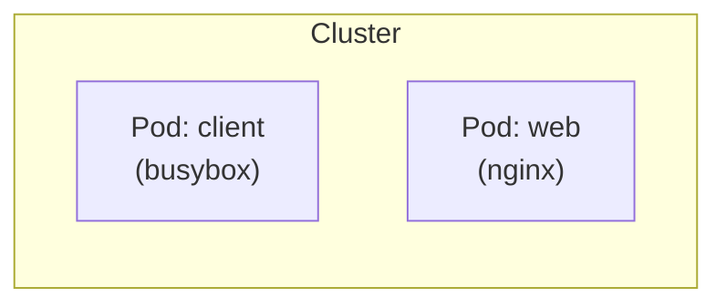
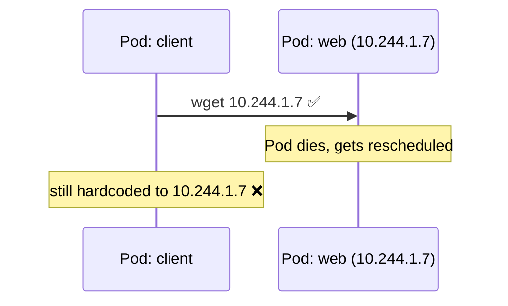
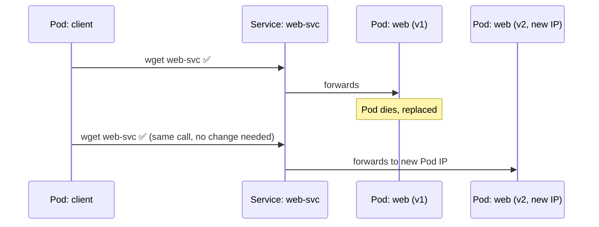
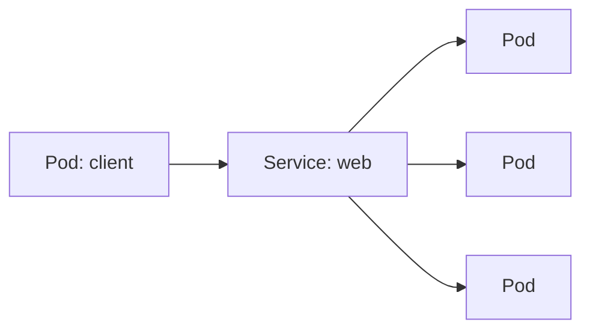

# Pod-to-Pod Communication, and Why Services Exist

Two Pods, one talking to the other. First the hard way (raw Pod IP), then
the way you'd actually do it (a Service).

---

## Setup: two Pods

```bash
kubectl run web --image=nginx --port=80
kubectl run client --image=busybox --command -- sleep 3600

kubectl get pods -o wide
```



Every Pod gets its own IP on a flat cluster network — any Pod can reach any
other Pod's IP directly, no NAT, no config.

---

## The hard way: talk via Pod IP

```bash
kubectl get pod web -o jsonpath='{.status.podIP}'
# e.g. 10.244.1.7

kubectl exec -it client -- wget -qO- 10.244.1.7
```

It works — nginx's welcome page comes back. But:

```bash
kubectl delete pod web
kubectl run web --image=nginx --port=80
kubectl get pod web -o jsonpath='{.status.podIP}'
# a different IP!
```



Any hardcoded IP breaks the moment the Pod is replaced — and Pods get
replaced constantly (crashes, rollouts, rescheduling).

---

## The fix: a Service

A Service gives a **stable name and IP** in front of a Pod, no matter how
many times the Pod behind it changes.

```bash
kubectl expose pod web --port=80 --target-port=80 --name=web-svc
kubectl get svc web-svc
```


Now talk to the **Service name**, not the Pod IP:

```bash
kubectl exec -it client -- wget -qO- web-svc
```

Kubernetes runs a built-in DNS server — `web-svc` resolves automatically
from any Pod in the same namespace (full name:
`web-svc.default.svc.cluster.local`).

---

## Proving it's stable

```bash
kubectl delete pod web
kubectl run web --image=nginx --port=80 --labels=run=web
# wait for the new Pod to be Ready, then:
kubectl exec -it client -- wget -qO- web-svc
```



Same request, same name, works before and after — because the Service
tracks Pods by **label**, not by identity, and updates its routing
automatically.

---

## How it actually finds the Pod: labels + selector

```bash
kubectl get pod web --show-labels
kubectl describe svc web-svc | grep -i selector
kubectl get endpoints web-svc
```


The Service doesn't know about a specific Pod at all — it just watches
"whichever Pods currently have label `run=web`" and load-balances across
all of them.

---

## Scale it up: one name, many Pods

```bash
kubectl delete pod web
kubectl create deployment web --image=nginx --replicas=3
kubectl expose deployment web --port=80

kubectl exec -it client -- sh -c 'for i in 1 2 3; do wget -qO- web | grep -i title; done'
```



Every call to `web` gets routed to one of the 3 Pods — client code never
changes whether there's 1 replica or 100.

---

## Cleanup

```bash
kubectl delete pod client
kubectl delete deployment web
kubectl delete svc web web-svc
```

---

## Takeaway

| Approach | Address | Survives Pod restarts? |
| --- | --- | --- |
| Direct Pod IP | `10.244.1.7` | changes every time |
| Service (by name) | `web-svc` / `web` | always |

Never hardcode a Pod IP for Pod-to-Pod traffic — always talk through a
Service.
