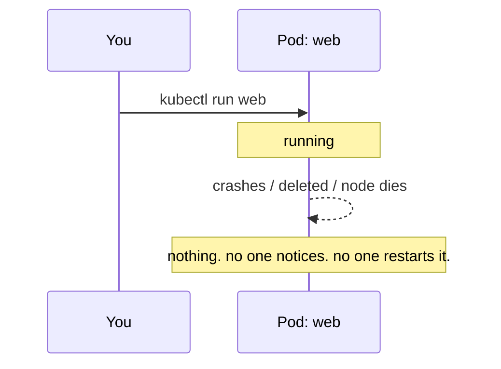
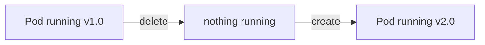
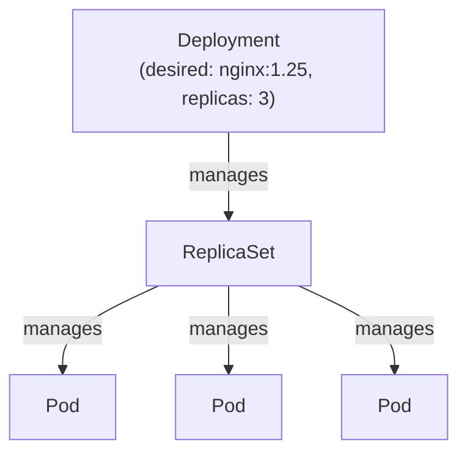
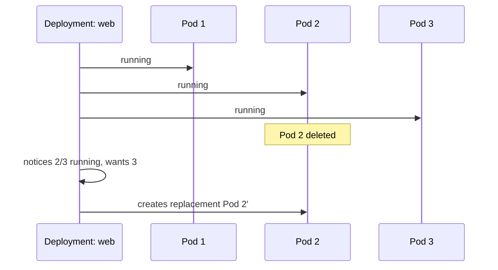
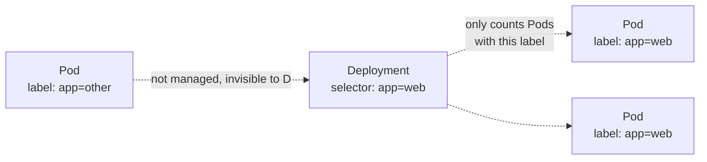

# Why Deployments? (and the limits of a bare Pod)

---

## Start with a bare Pod

```bash
kubectl run web --image=nginx --port=80
kubectl get pods
```

That's it — one Pod, running nginx. Looks fine, until something happens to
it.

---

## Limitation 1: nothing restarts it

```bash
kubectl delete pod web
kubectl get pods
# No resources found. It's just... gone. Forever.
```



A bare Pod has no supervisor. If it dies, it stays dead until a human
notices and re-runs the command.

---

## Limitation 2: no scaling

```bash
kubectl run web --image=nginx --port=80
kubectl scale pod web --replicas=3
# error: cannot scale pod web
```

A Pod is a single instance. There's no built-in concept of "3 of these" —
you'd have to manually run `kubectl run web2`, `web3`, ... and wire up
networking yourself.

---

## Limitation 3: no safe way to update it

```bash
kubectl set image pod/web nginx=nginx:1.26
# error: pods "web" is invalid: spec.containers... field is immutable
```

Most of a Pod's spec is **immutable** after creation. To change the image
you must delete and recreate it — which means downtime, and no rollback if
the new version is broken.



---

## The fix: Deployment

A Deployment is a supervisor that sits above your Pods and constantly
asks: *"does reality match what I was told to maintain?"*



It gives you, for free, everything a bare Pod lacks:

| Bare Pod | Deployment |
| --- | --- |
| dies, stays dead | dies → replaced automatically |
| fixed at 1 instance | `--replicas=N`, scale anytime |
| update = delete + recreate (downtime) | rolling update, zero downtime |
| no history | `rollout undo` — instant rollback |

---

## Same example, as a Deployment — commands

```bash
kubectl create deployment web --image=nginx:1.25 --replicas=3
kubectl get deployments
kubectl get pods -o wide

# scaling: no longer an error
kubectl scale deployment web --replicas=5

# updating: rolling, zero-downtime
kubectl set image deployment/web nginx=nginx:1.26
kubectl rollout status deployment/web

# broke something? instant rollback
kubectl rollout undo deployment/web
```

---

## Prove the self-healing

```bash
kubectl get pods -l app=web
kubectl delete pod <one-of-the-pod-names>
kubectl get pods -l app=web -w
# a replacement Pod appears within seconds, unprompted
```



---

## Same example, as YAML

```yaml
# deployment.yaml
apiVersion: apps/v1
kind: Deployment
metadata:
  name: web
spec:
  replicas: 3
  selector:
    matchLabels:
      app: web          # <-- must match template's labels below
  template:
    metadata:
      labels:
        app: web        # <-- Pods are stamped with this label
    spec:
      containers:
        - name: nginx
          image: nginx:1.25
          ports:
            - containerPort: 80
```

```bash
kubectl apply -f deployment.yaml
kubectl get deployments
kubectl get pods --show-labels
```

Change the file (bump the image tag) and re-apply to trigger a rolling
update — same effect as `kubectl set image`, just declared instead of
imperative:

```bash
# edit image: nginx:1.25 -> nginx:1.26 in the file, then:
kubectl apply -f deployment.yaml
kubectl rollout status deployment/web
```

---

## Why labels matter (this is the part that's easy to miss)

The Deployment doesn't track Pods by name or by ID. It tracks them purely
by **label**, via `spec.selector.matchLabels`.



That indirection is *the whole mechanism* behind rolling updates: a new
ReplicaSet is created for the new Pod template, old and new Pods briefly
coexist under the same label, and the Deployment just counts how many
match — scaling the new set up and the old set down.

See it directly:

```bash
kubectl get pods --show-labels
kubectl get rs -l app=web
kubectl describe deployment web | grep -A2 Selector
```

If the label on `template.metadata.labels` doesn't match
`spec.selector.matchLabels`, `kubectl apply` refuses outright — this
mismatch is one of the most common first-timer Deployment errors.

---

## Cleanup

```bash
kubectl delete deployment web
```

---

## Takeaway

A bare Pod is a single, disposable, immutable instance — fine for a quick
test, unusable for anything real. A Deployment adds the supervisor loop:
keep N alive, roll out changes safely, roll back instantly — all built on
one idea, matching Pods by **label**, not by identity.
