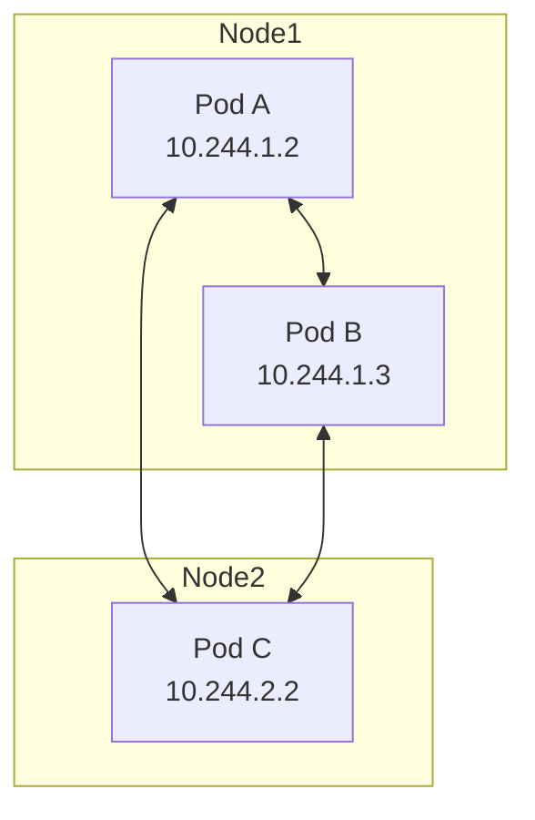
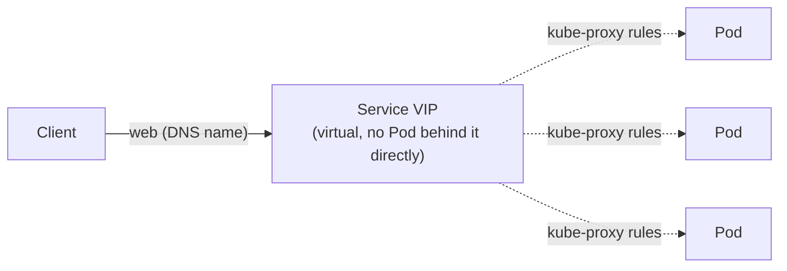
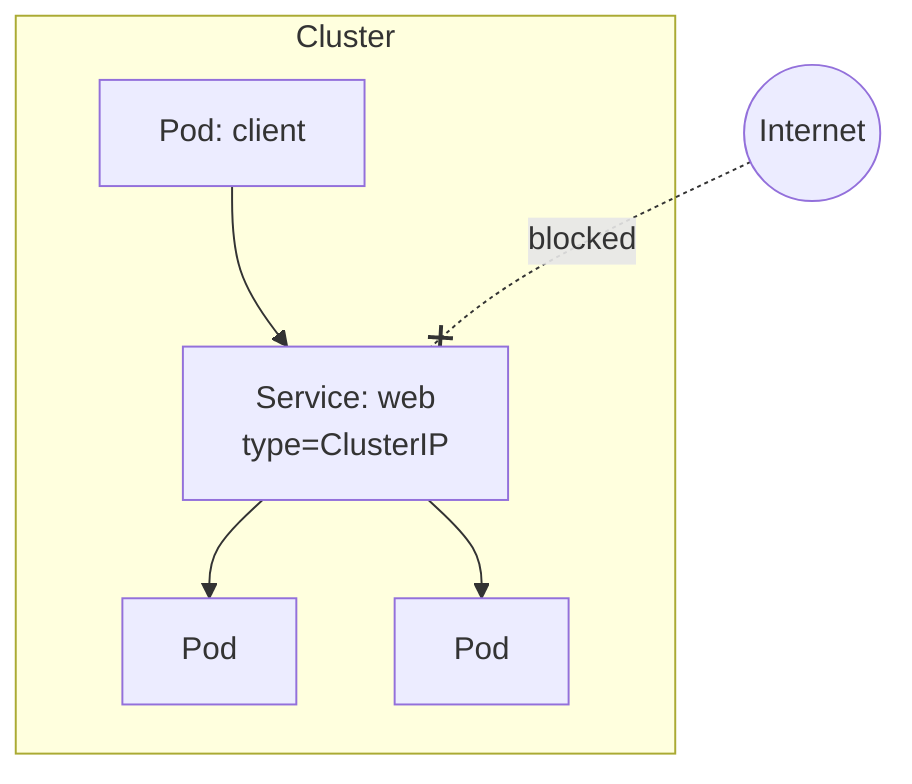
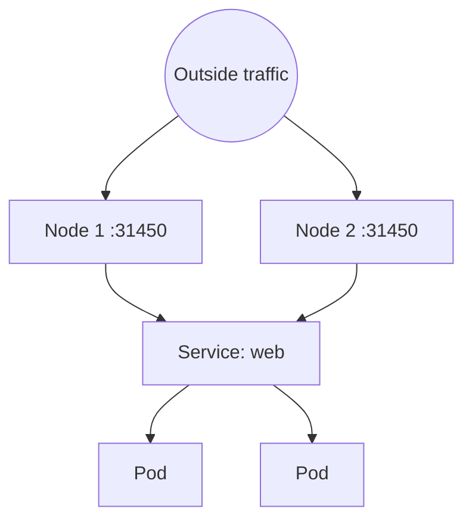
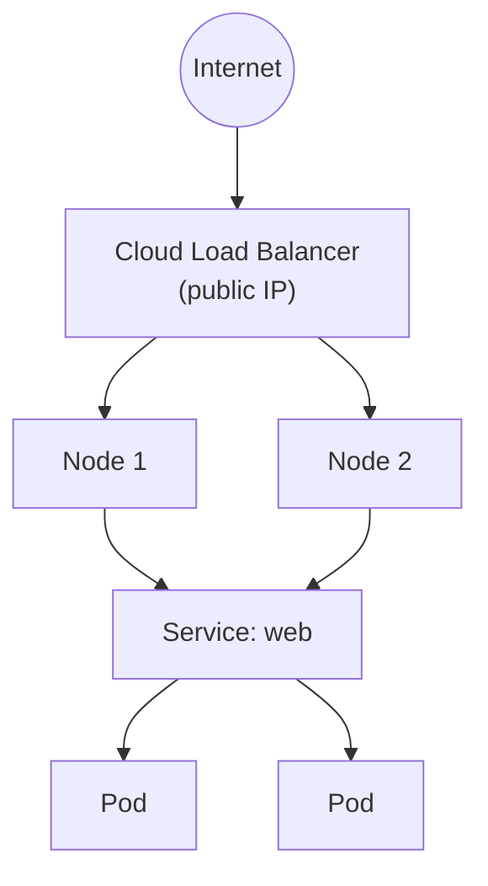
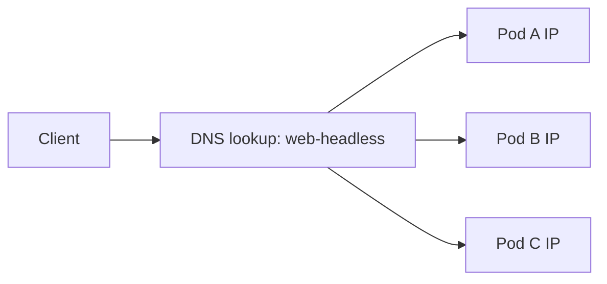

# Kubernetes Networking & Service Types

Builds on [pods-and-services.md](pods-and-services.md) — that covered *why*
Services exist. This is about the networking model underneath, and the
different flavors of Service and when to use each.

---

## The networking rules (what makes Services possible)

Kubernetes networking guarantees a few things, always:

- every Pod gets its **own IP** — no port-mapping juggling like Docker
- every Pod can reach every other Pod's IP directly, **flat network**, no NAT
- Pods on any Node can reach any other Pod, regardless of which Node



The catch: Pod IPs are **not stable** — a replaced Pod gets a new one.
Services exist to paper over that.

---

## What a Service actually is

Not a process, not a Pod — a **virtual IP + DNS name**, backed by rules
that `kube-proxy` programs on every Node to forward traffic to whichever
Pods currently match the Service's label selector.



```bash
kubectl create deployment web --image=nginx --replicas=3
kubectl expose deployment web --port=80
kubectl get endpoints web    # the real Pod IPs currently behind the VIP
```

---

## Type 1 — ClusterIP (the default)

Reachable **only from inside the cluster**. Used for internal service-to-
service traffic — the normal case (a backend calling a database, etc).

```bash
kubectl expose deployment web --port=80 --type=ClusterIP
kubectl get svc web
```



```bash
kubectl run client --image=busybox --command -- sleep 3600
kubectl exec -it client -- wget -qO- web     # works, inside the cluster
```

---

## Type 2 — NodePort

Opens the **same port on every Node** (default range 30000–32767), so
traffic can enter from outside via any Node's IP. Mostly used for quick
testing, or as a building block under a LoadBalancer.

```bash
kubectl expose deployment web --port=80 --type=NodePort
kubectl get svc web
# web   NodePort   10.96.45.10   <none>   80:31450/TCP
```



```bash
curl <any-node-ip>:31450
```

---

## Type 3 — LoadBalancer

Same as NodePort, plus asks the cloud provider (AWS/GCP/Azure/etc.) to
provision a real external load balancer with its own public IP in front of
it. This is the standard way to expose something to the internet.

```bash
kubectl expose deployment web --port=80 --type=LoadBalancer
kubectl get svc web
# EXTERNAL-IP shows <pending> until the cloud LB is provisioned
```



On a local cluster (`kind`/`minikube`) there's no cloud provider, so
`EXTERNAL-IP` just stays `<pending>` forever — this type only fully works
on a real cloud cluster.

---

## Type 4 — Headless (no load balancing)

`ClusterIP: None`. Instead of one virtual IP, DNS returns **all** the Pod
IPs directly. Used when clients need to talk to a *specific* Pod — e.g.
each replica of a database/StatefulSet.

```bash
kubectl expose deployment web --port=80 --cluster-ip=None --name=web-headless
kubectl run client --image=busybox --command -- sleep 3600
kubectl exec -it client -- nslookup web-headless
# returns every individual Pod IP, not one VIP
```



---

## Type 5 — ExternalName

No Pods, no selector — just a DNS **alias** to something outside the
cluster (e.g. a managed database). Lets Pods use a stable internal name
that's actually pointing off-cluster.

```bash
kubectl create service externalname db-svc --external-name=mydb.rds.amazonaws.com
kubectl exec -it client -- nslookup db-svc
# resolves to mydb.rds.amazonaws.com
```


---

## All five, side by side

| Type | Reachable from | Backed by Pods? | Typical use |
| --- | --- | --- | --- |
| ClusterIP | inside cluster only | yes, load-balanced | internal service-to-service |
| NodePort | any Node's IP:port | yes, load-balanced | quick/manual external access |
| LoadBalancer | internet | yes, load-balanced | production external access (cloud) |
| Headless | inside cluster, per-Pod | yes, **not** load-balanced | StatefulSets, direct Pod addressing |
| ExternalName | inside cluster (DNS alias) | no | pointing at an external system |

---

## Same thing, as YAML (ClusterIP example)

```yaml
apiVersion: v1
kind: Service
metadata:
  name: web
spec:
  type: ClusterIP
  selector:
    app: web          # must match the Deployment Pod template's labels
  ports:
    - port: 80        # the Service's own port
      targetPort: 80  # the container port it forwards to
```

```bash
kubectl apply -f service.yaml
```

Only `spec.type` changes between the five flavors — everything else about
a Service stays the same.

---

## Cleanup

```bash
kubectl delete deployment web
kubectl delete pod client
kubectl delete svc web web-headless db-svc
```

---

## Takeaway

A Service is a stable virtual address in front of a changing set of Pods,
matched by label — not a process you can `kubectl exec` into. Pick the
**type** based on *who* needs to reach it: cluster-internal (ClusterIP),
manually external (NodePort), production external (LoadBalancer), per-Pod
(Headless), or off-cluster (ExternalName).
