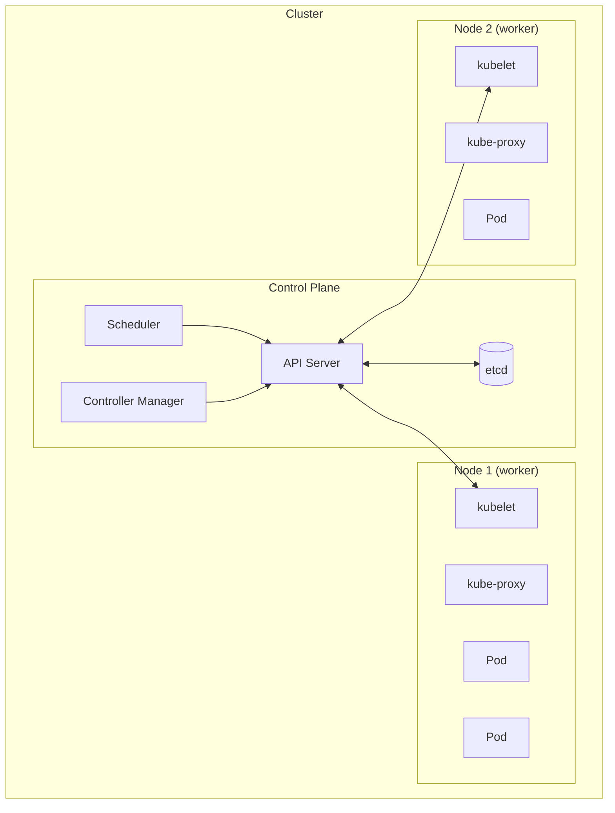
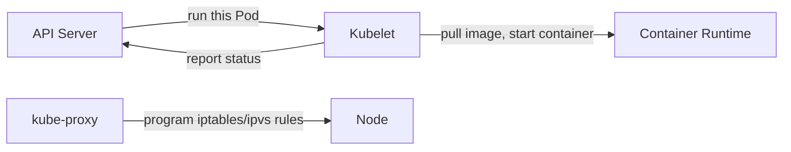
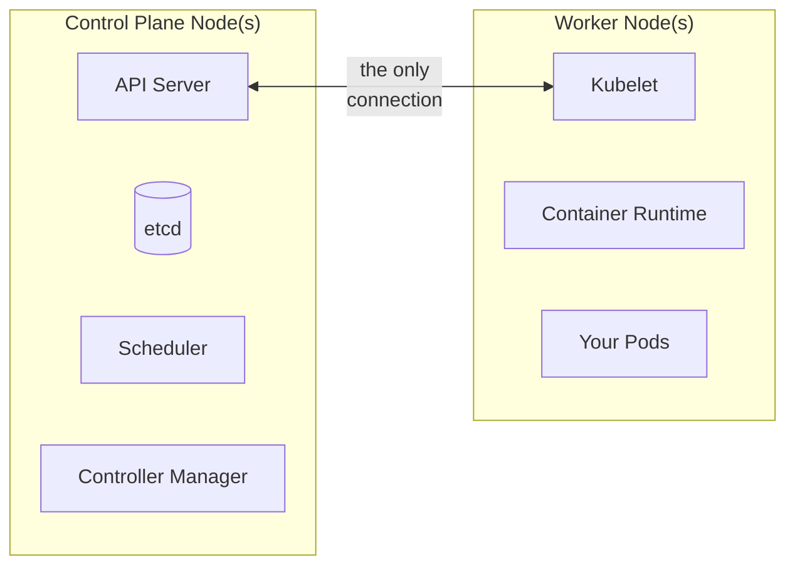
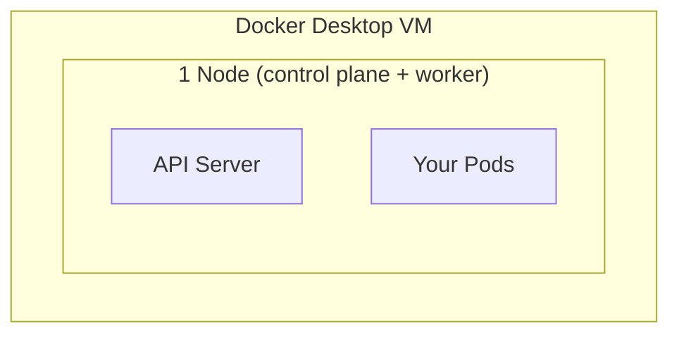
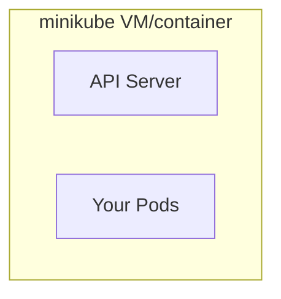
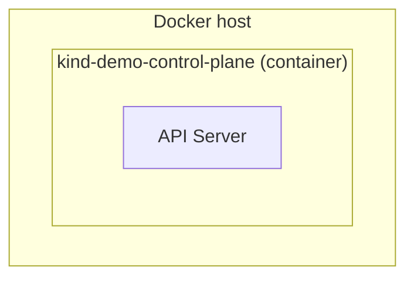
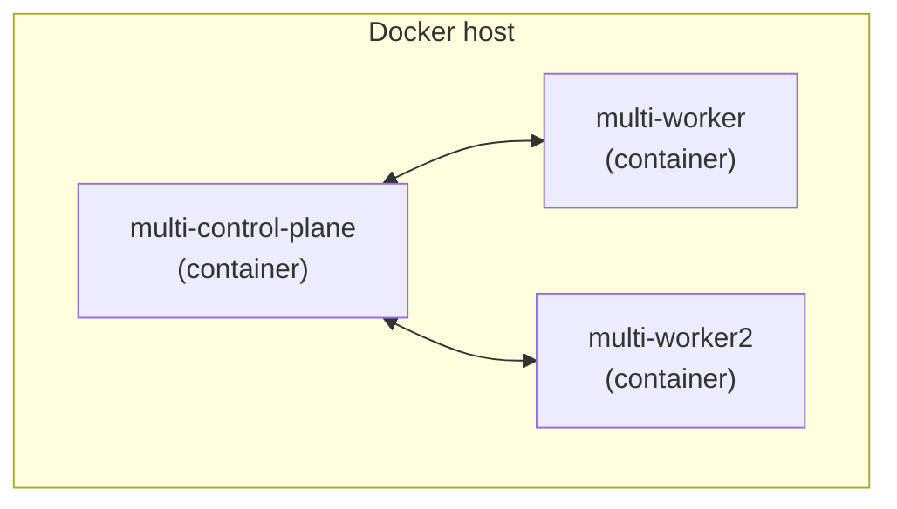
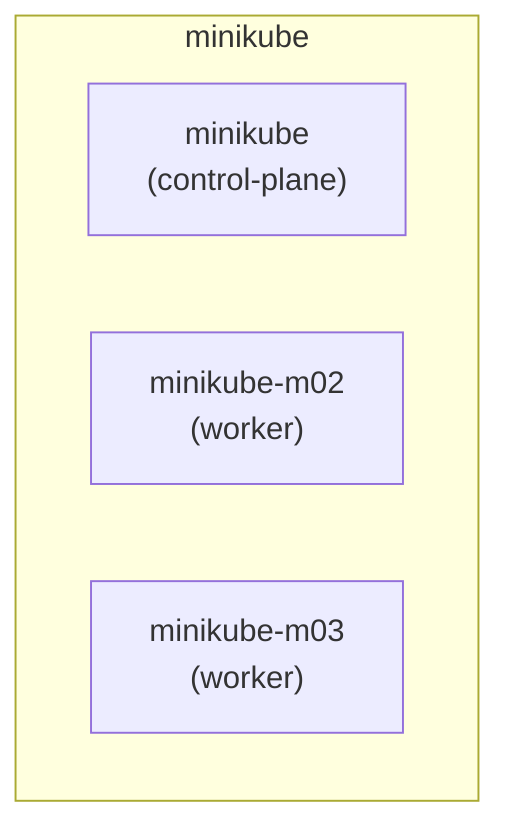
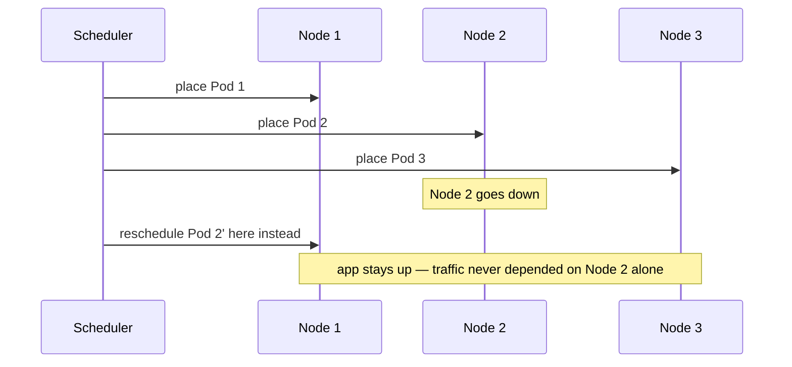

# Clusters & Nodes — and Running One Locally

---

## What a cluster actually is

A **cluster** = a Control Plane (the brain) + one or more **Nodes** (the
muscle, where your Pods actually run).



You (`kubectl`) only ever talk to the API Server. Everything else — where
Pods land, how they're kept alive, how traffic reaches them — happens
because of that one conversation, replicated across every Node.

---

## What's actually on a Node

Every Node runs three things:

| Component | Job |
| --- | --- |
| **kubelet** | talks to the API Server, starts/stops containers on this Node |
| **kube-proxy** | programs the networking rules that make Services work |
| **container runtime** | actually runs containers (containerd, CRI-O, ...) |



A "Node" is just a Linux machine (VM or bare metal) with these three
things installed and registered with a Control Plane. Nothing magic — you
could build one by hand.

---

## Control plane vs. worker node



- **Control plane**: decides *what should run where* — usually doesn't run
  your app's Pods (in production; local dev tools often blur this)
- **Worker node**: actually *runs* your app's Pods

Small clusters can even run control plane and workload on the same
machine — which is exactly what the local tools below do.

---

## Running a local cluster: your three options

| Tool | What it gives you | Multi-node? |
| --- | --- | --- |
| **Docker Desktop** | 1-node cluster, built into an app you likely already have | no |
| **minikube** | 1 VM/container acting as a full cluster, most batteries-included | yes, with a flag |
| **kind** ("Kubernetes IN Docker") | each Node is a Docker container, fast, great for CI | yes, trivially |

All three give you a real Kubernetes API — everything from the other notes
in this folder (`kubectl run`, Deployments, Services...) works identically
on any of them.

---

## Option 1 — Docker Desktop

If you already have Docker Desktop, this is the zero-install option.

```bash
# Settings → Kubernetes → check "Enable Kubernetes" → Apply & Restart
kubectl config use-context docker-desktop
kubectl get nodes
```



- single Node, always
- good for: quick smoke tests, no extra tooling
- not great for: anything requiring multiple Nodes

---

## Option 2 — minikube

```bash
brew install minikube    # or your package manager of choice
minikube start
kubectl get nodes
minikube dashboard        # bonus: a web UI for the cluster
```



- one command to get a fully working cluster
- built-in addons: `minikube addons enable ingress`, metrics-server, etc.
- good default choice if you're not sure which to pick

---

## Option 3 — kind

```bash
brew install kind
kind create cluster --name demo
kubectl get nodes
kubectl cluster-info --context kind-demo
```



- each "Node" is literally a Docker container — starts in seconds
- the tool of choice for CI pipelines and quick throwaway clusters
- needs Docker (or Podman) already running

---

## Multi-node cluster: kind (easiest way to try this)

```bash
cat <<EOF > kind-config.yaml
kind: Cluster
apiVersion: kind.x-k8s.io/v1alpha4
nodes:
  - role: control-plane
  - role: worker
  - role: worker
EOF

kind create cluster --name multi --config kind-config.yaml
kubectl get nodes
```



Now scale a Deployment and watch Pods spread across the workers:

```bash
kubectl create deployment web --image=nginx --replicas=4
kubectl get pods -o wide     # note the different NODE column values
```

---

## Multi-node cluster: minikube

```bash
minikube start --nodes 3
kubectl get nodes
kubectl create deployment web --image=nginx --replicas=4
kubectl get pods -o wide
```



Same idea as kind, one flag instead of a config file — trade-off is it's
generally heavier (full VMs, not lightweight containers).

---

## Why bother with multi-node locally?

Things that are invisible on a single Node but very real in production:

- the Scheduler actually **choosing** between Nodes (resource requests,
  taints/tolerations, affinity rules)
- Pods for the same Deployment landing on **different machines** — so one
  Node dying doesn't take the whole app down
- real network hops between Pods, instead of everything being on one
  loopback-adjacent VM



---

## Cleanup

```bash
kind delete cluster --name demo
kind delete cluster --name multi
minikube delete
# Docker Desktop: Settings → Kubernetes → uncheck "Enable Kubernetes"
```

---

## Takeaway

A cluster is a Control Plane plus Nodes; a Node is just kubelet +
kube-proxy + a container runtime on a machine. For local learning, **kind**
is fastest and best for multi-node experiments, **minikube** is the most
fully-featured, **Docker Desktop** is the zero-setup single-node option.
