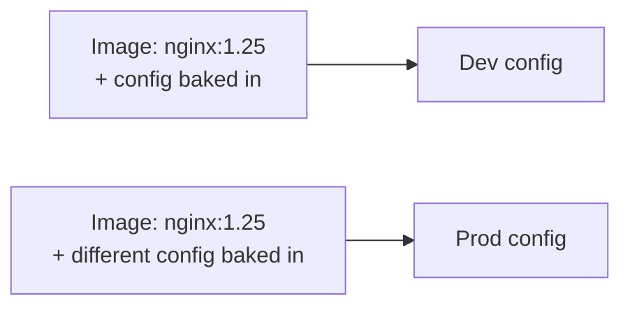
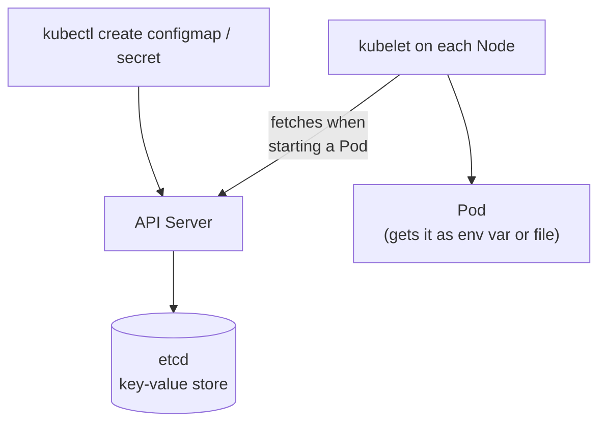
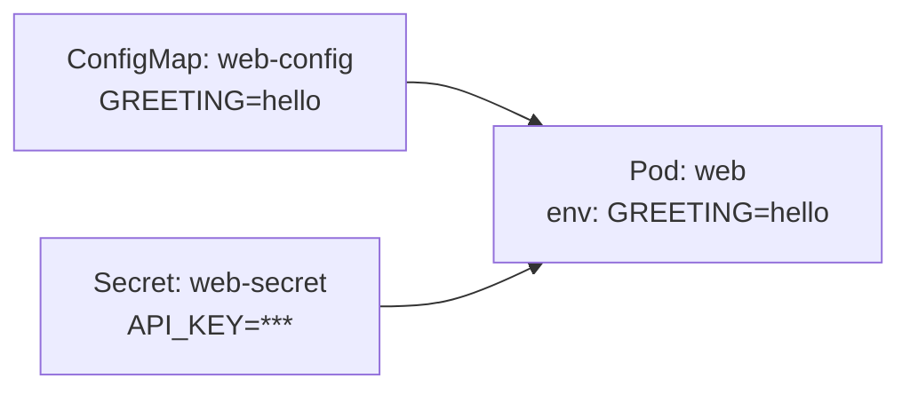
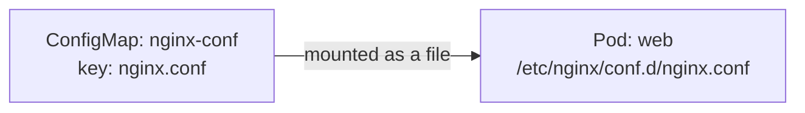
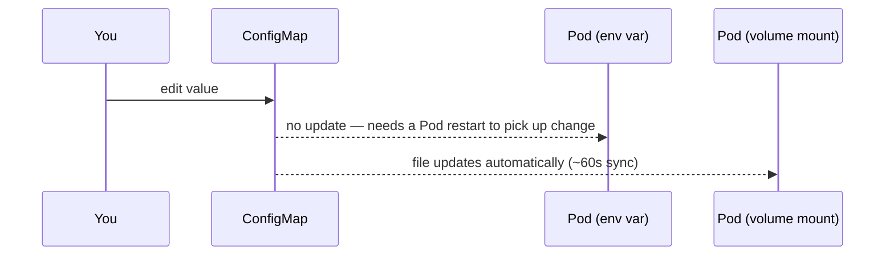

# ConfigMaps & Secrets: where they live, how to use them

Both answer the same question — "how do I get config into a Pod without
baking it into the image?" — for two different sensitivity levels.

---

## Why not just bake config into the image?



Same image, two different builds, just to change config — every
environment needs its own image, and a config typo means a full rebuild.
ConfigMaps/Secrets decouple **what image runs** from **what config it gets**,
so one image moves unchanged from dev → staging → prod.

---

## ConfigMap vs. Secret — same mechanism, different intent

| | ConfigMap | Secret |
| --- | --- | --- |
| For | non-sensitive config (feature flags, URLs, `nginx.conf`) | sensitive values (passwords, API keys, TLS certs) |
| Stored as | plain text | base64-encoded |
| Encrypted at rest by default? | n/a | **no** — base64 is encoding, not encryption |
| API object | `ConfigMap` | `Secret` |

The important nuance: a Secret is not automatically "secure" — it's just
conventionally treated with more care (RBAC restrictions, not printed in
`kubectl describe` output, etc). Real protection needs encryption at rest
configured on the cluster.

---

## Where they actually live: etcd



Both are just objects stored in **etcd**, same as Deployments and
Services — no separate vault or secret-storage system out of the box.
That's exactly why "Secret ≠ actually secure": anyone with API access (or
etcd access) can read it, unless the cluster is configured with
[encryption at rest](https://kubernetes.io/docs/tasks/administer-cluster/encrypt-data/)
and tight RBAC.

```bash
kubectl create secret generic web-secret --from-literal=API_KEY=super-secret
kubectl get secret web-secret -o jsonpath='{.data.API_KEY}'
# c3VwZXItc2VjcmV0
echo c3VwZXItc2VjcmV0 | base64 -d
# super-secret   <- trivially reversible, this is NOT encryption
```

---

## Creating them, a few ways

```bash
# ConfigMap
kubectl create configmap web-config --from-literal=GREETING=hello
kubectl create configmap web-config --from-file=nginx.conf
kubectl create configmap web-config --from-env-file=app.env

# Secret
kubectl create secret generic web-secret --from-literal=API_KEY=super-secret
kubectl create secret generic web-tls --cert=tls.crt --key=tls.key
kubectl create secret docker-registry regcred \
  --docker-server=<registry> --docker-username=<u> --docker-password=<p>
```

Same two objects, as YAML:

```yaml
# configmap.yaml
apiVersion: v1
kind: ConfigMap
metadata:
  name: web-config
data:
  GREETING: hello
  nginx.conf: |
    server {
      listen 80;
      location / { return 200 "hello from configmap\n"; }
    }
```

```yaml
# secret.yaml
apiVersion: v1
kind: Secret
metadata:
  name: web-secret
type: Opaque
stringData:            # <-- plain text here; Kubernetes base64-encodes it for you
  API_KEY: super-secret
```

```bash
kubectl apply -f configmap.yaml
kubectl apply -f secret.yaml
kubectl get configmap web-config -o yaml
kubectl get secret web-secret -o yaml    # note: .data.API_KEY is now base64
```

Use `stringData` when hand-writing a Secret — Kubernetes encodes it on
save, so you never have to base64-encode values yourself. `data` (base64
already) is what you'll see when Kubernetes hands the object back to you.

---

## Way 1: as environment variables

```bash
kubectl create deployment web --image=nginx
kubectl set env deployment/web --from=configmap/web-config
kubectl set env deployment/web --from=secret/web-secret

kubectl exec deploy/web -- printenv GREETING API_KEY
```

Same result, as YAML — either name individual keys with `valueFrom`, or
pull every key in an object at once with `envFrom`:

```yaml
# deployment.yaml (relevant excerpt)
spec:
  template:
    spec:
      containers:
        - name: nginx
          image: nginx
          env:
            - name: GREETING              # single key, explicitly named
              valueFrom:
                configMapKeyRef:
                  name: web-config
                  key: GREETING
            - name: API_KEY
              valueFrom:
                secretKeyRef:
                  name: web-secret
                  key: API_KEY
          envFrom:                        # every key in these objects, as-is
            - configMapRef:
                name: web-config
            - secretRef:
                name: web-secret
```

```bash
kubectl apply -f deployment.yaml
kubectl exec deploy/web -- printenv GREETING API_KEY
```



Simple, familiar (same shape as `docker run --env-file`) — but env vars
are only read **once**, at container start.

---

## Way 2: as a mounted volume (files)

Each key becomes a **file**, named after the key, containing the value.

```bash
kubectl create configmap nginx-conf --from-file=nginx.conf
```

```yaml
# deployment.yaml (relevant excerpt)
spec:
  template:
    spec:
      containers:
        - name: nginx
          image: nginx
          volumeMounts:
            - name: config-vol
              mountPath: /etc/nginx/conf.d
      volumes:
        - name: config-vol
          configMap:
            name: nginx-conf
```

```bash
kubectl apply -f deployment.yaml
kubectl exec deploy/web -- cat /etc/nginx/conf.d/nginx.conf
```



Secrets mount the same way — `secret:` instead of `configMap:` in the
volume definition — landing as files under the mount path, base64-decoded
automatically.

---

## The key difference: env vars vs. volumes, on update

```bash
kubectl create configmap web-config --from-literal=GREETING=hello
kubectl set env deployment/web --from=configmap/web-config
kubectl edit configmap web-config      # change GREETING to "hi"
kubectl exec deploy/web -- printenv GREETING
# still "hello" — env vars do NOT auto-update
```

```bash
# volume-mounted version:
kubectl edit configmap nginx-conf
kubectl exec deploy/web -- cat /etc/nginx/conf.d/nginx.conf
# updates within ~1 minute — the kubelet syncs mounted files periodically
```



Env vars need a Pod restart (`kubectl rollout restart deployment/web`) to
pick up a change; mounted files update live but the app itself may need
its own reload logic to notice (nginx doesn't auto-reload its config file
just because it changed on disk).

---

## Immutable ConfigMaps/Secrets

```yaml
apiVersion: v1
kind: ConfigMap
metadata:
  name: web-config
data:
  GREETING: hello
immutable: true
```

`immutable: true` locks the object — any edit attempt is rejected outright
(you delete and recreate instead). Two benefits: protects against
accidental changes rippling out to every Pod using it, and the API server
can skip watching it for changes, reducing load on large clusters.

---

## Cleanup

```bash
kubectl delete deployment web
kubectl delete configmap web-config nginx-conf
kubectl delete secret web-secret web-tls regcred
```

---

## Takeaway

ConfigMaps and Secrets both live as plain objects in etcd — a Secret is
just base64-encoded, **not** encrypted, by default. Use env vars for
config that's fine to fix with a restart; use volume mounts for config a
running app needs to pick up live, or for larger blobs like a full
`nginx.conf` or a TLS cert.
