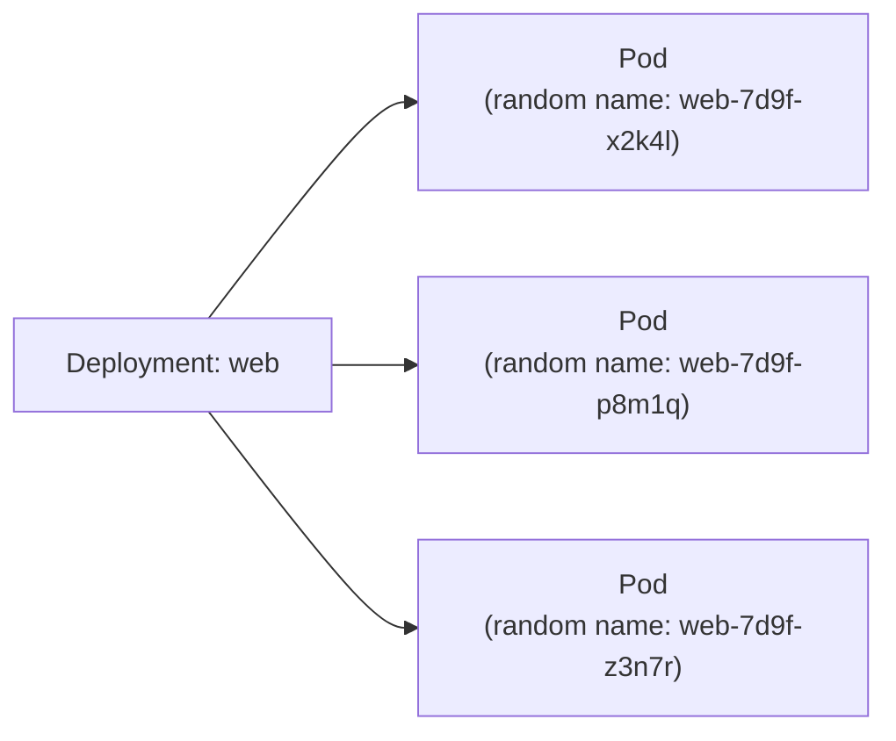
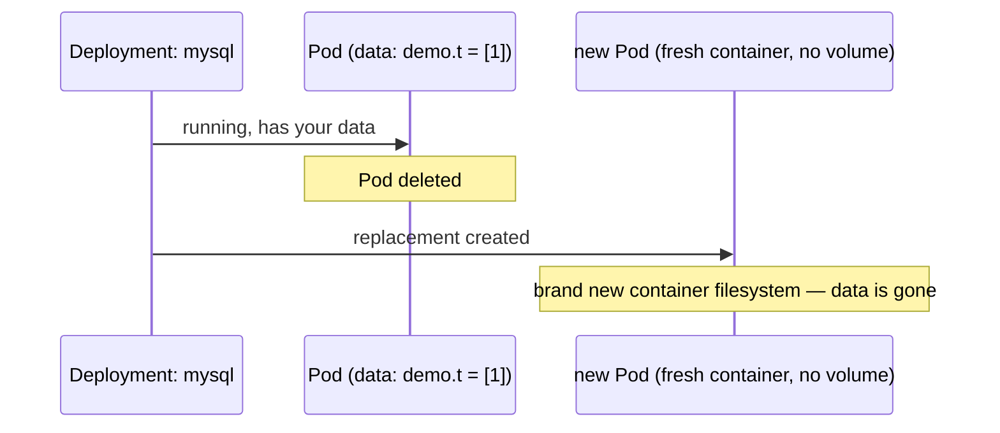
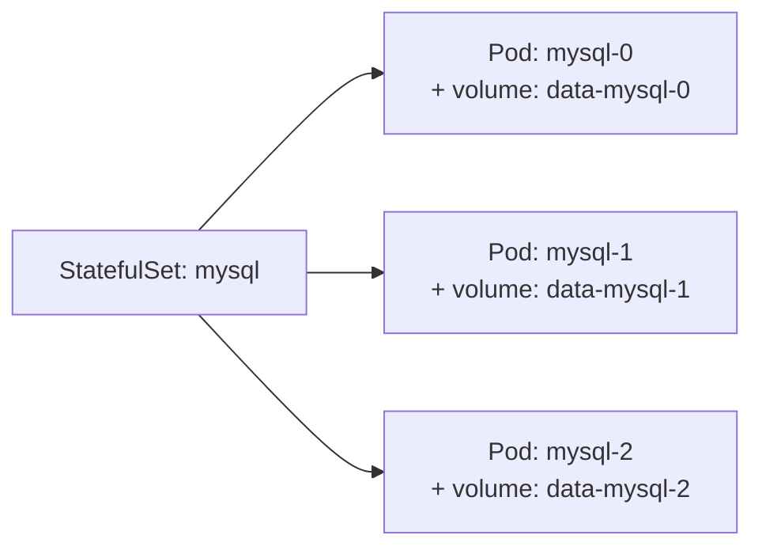
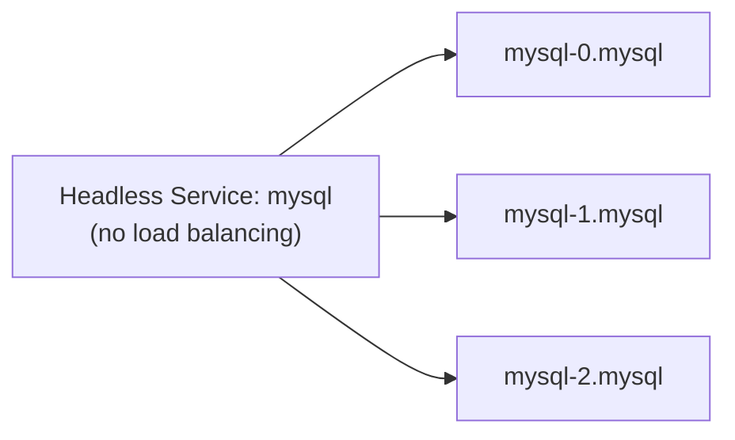
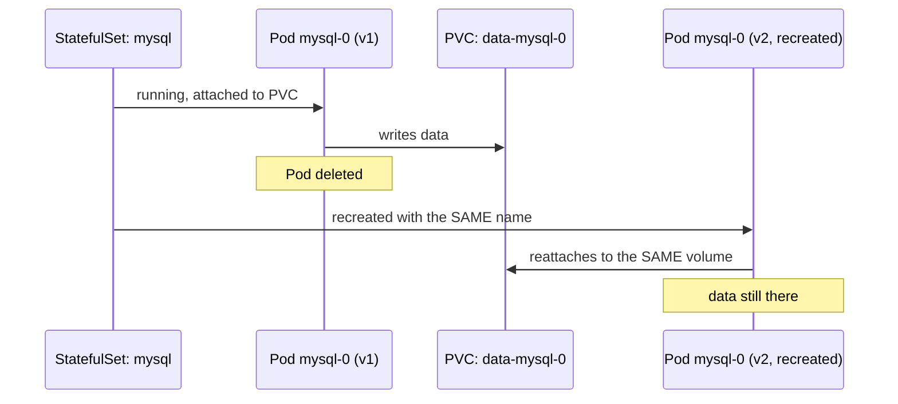

# Deployment vs. StatefulSet — with MySQL

---

## Recap: what a Deployment gives you

From [deployments.md](deployments.md): N interchangeable Pods, any one can
be killed and replaced, none of them are "special." Perfect for stateless
apps like nginx — every replica serves the exact same thing.



Any Pod can be deleted and replaced by an identical one — the replacement
has a **new random name** and, if it had local storage, a **new empty
disk**. Nothing about identity is preserved.

---

## Try MySQL as a Deployment — and watch it break

```bash
kubectl create deployment mysql --image=mysql:8 --replicas=1
kubectl set env deployment/mysql MYSQL_ROOT_PASSWORD=secret
kubectl exec -it deploy/mysql -- mysql -uroot -psecret \
  -e "CREATE DATABASE demo; USE demo; CREATE TABLE t(id INT); INSERT INTO t VALUES (1);"
```

Now let the Pod get replaced — a crash, a node drain, anything:

```bash
kubectl delete pod -l app=mysql
kubectl get pods -l app=mysql -w
```



```bash
kubectl exec -it deploy/mysql -- mysql -uroot -psecret -e "SELECT * FROM demo.t;"
# ERROR 1049: Unknown database 'demo'
```

The data is just gone. A Deployment's Pods are meant to be
**interchangeable** — it has no concept of "this Pod's disk must survive
and follow it around."

---

## Why this matters specifically for a database

- MySQL needs **one disk per instance**, and that exact disk must reattach
  to the exact same instance on restart — not a random new one
- if you run a MySQL **cluster** (replication), each replica needs a
  **stable, predictable name** (`mysql-0` is always the primary, say) —
  not a name that changes every restart
- replicas often need to start in **order** (primary before replicas)

None of that is what a Deployment is built for.

---

## StatefulSet: same idea, three guarantees added



1. **Stable, predictable names** — `mysql-0`, `mysql-1`, `mysql-2`, always
   in that order, never random suffixes
2. **Stable storage per Pod** — `mysql-0` always reattaches to the same
   volume, even after being deleted and recreated
3. **Ordered start/stop** — `mysql-0` starts first and fully ready before
   `mysql-1` starts; scaling down removes the highest-numbered Pod first

---

## StatefulSet needs a Service too — just headless

Pods need to address each other **individually** (e.g. replica → primary),
not load-balanced randomly — that's the headless Service from
[services.md](services.md).



```bash
kubectl create service clusterip mysql --clusterip="None" --tcp=3306:3306
```

Each Pod gets its own stable DNS name:
`mysql-0.mysql.default.svc.cluster.local`, `mysql-1.mysql...`, etc.

---

## Defining it — this is the one place YAML is required

`kubectl create` has no imperative command for StatefulSets, because their
whole point — a **volumeClaimTemplate** stamping out one persistent volume
per Pod — has no sensible one-liner equivalent:

```yaml
apiVersion: apps/v1
kind: StatefulSet
metadata:
  name: mysql
spec:
  serviceName: mysql          # must match the headless Service
  replicas: 3
  selector:
    matchLabels:
      app: mysql
  template:
    metadata:
      labels:
        app: mysql
    spec:
      containers:
        - name: mysql
          image: mysql:8
          env:
            - name: MYSQL_ROOT_PASSWORD
              value: secret
          volumeMounts:
            - name: data
              mountPath: /var/lib/mysql
  volumeClaimTemplates:       # <-- the key difference from a Deployment
    - metadata:
        name: data
      spec:
        accessModes: ["ReadWriteOnce"]
        resources:
          requests:
            storage: 1Gi
```

```bash
kubectl apply -f mysql-statefulset.yaml
kubectl get statefulset mysql
kubectl get pods -l app=mysql
# mysql-0   Running
# mysql-1   Running   (only starts once mysql-0 is Ready)
# mysql-2   Running   (only starts once mysql-1 is Ready)

kubectl get pvc
# data-mysql-0   Bound   1Gi
# data-mysql-1   Bound   1Gi
# data-mysql-2   Bound   1Gi
```

One `PersistentVolumeClaim` **per Pod**, named after that Pod specifically
— that's what `volumeClaimTemplates` buys you over a Deployment.

---

## Prove the data now survives

```bash
kubectl exec -it mysql-0 -- mysql -uroot -psecret \
  -e "CREATE DATABASE demo; USE demo; CREATE TABLE t(id INT); INSERT INTO t VALUES (1);"

kubectl delete pod mysql-0
kubectl get pods -w
# mysql-0 reappears — same name, same volume reattached

kubectl exec -it mysql-0 -- mysql -uroot -psecret -e "SELECT * FROM demo.t;"
# 1   <- still there
```



---

## Side by side

| | Deployment | StatefulSet |
| --- | --- | --- |
| Pod names | random suffix, e.g. `web-7d9f-x2k4l` | stable ordinal, e.g. `mysql-0`, `mysql-1` |
| Storage | shared or none — any Pod is fine with any disk | one PVC per Pod, always reattaches to the same one |
| Start/stop order | all at once, any order | strictly sequential, one at a time |
| Networking | load-balanced Service, don't care which Pod answers | headless Service, address Pods individually |
| Good fit | nginx, stateless APIs | MySQL, PostgreSQL, Kafka, anything with per-instance identity/data |

---

## Cleanup

```bash
kubectl delete statefulset mysql
kubectl delete pvc -l app=mysql   # StatefulSet deletion does NOT delete PVCs automatically
kubectl delete svc mysql
kubectl delete deployment mysql
```

Note that last point: PVCs are **kept on purpose** even after deleting a
StatefulSet, so you don't accidentally lose a database — you delete them
explicitly when you actually mean it.

---

## Takeaway

A Deployment assumes every Pod is disposable and interchangeable — right
for nginx, wrong for MySQL. A StatefulSet gives each Pod a permanent name
and its own permanent disk, and starts/stops them in order — because a
database isn't "N identical copies," it's "these specific instances, with
this specific data, in this specific order."
