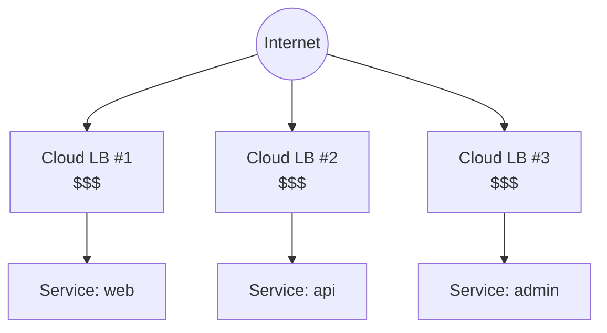
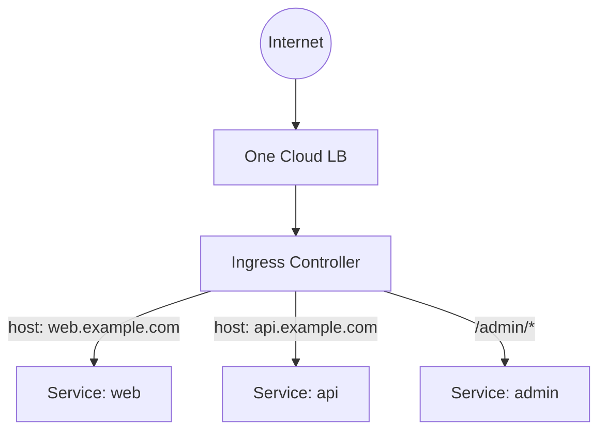
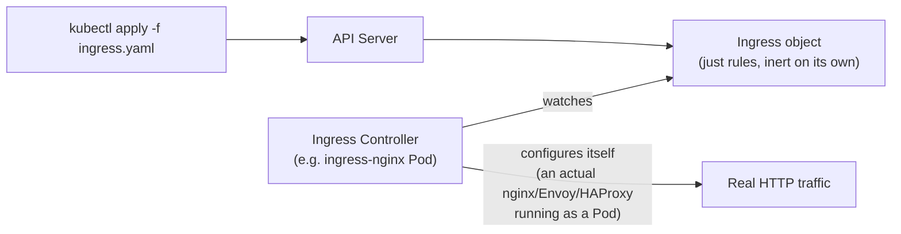
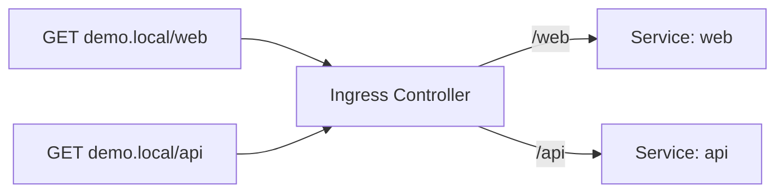
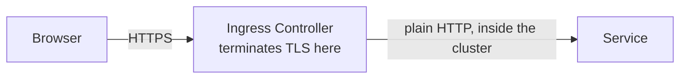
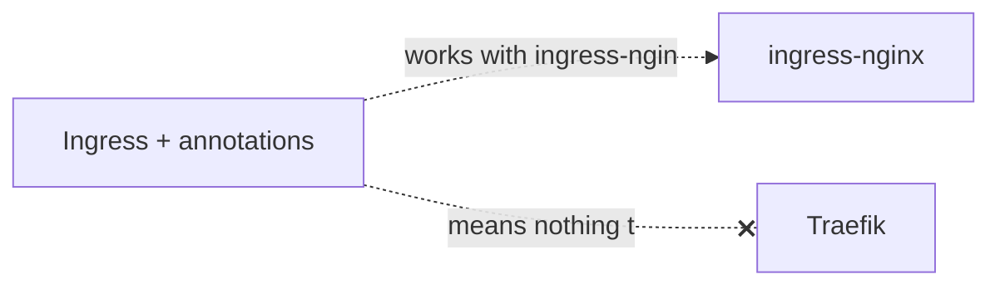
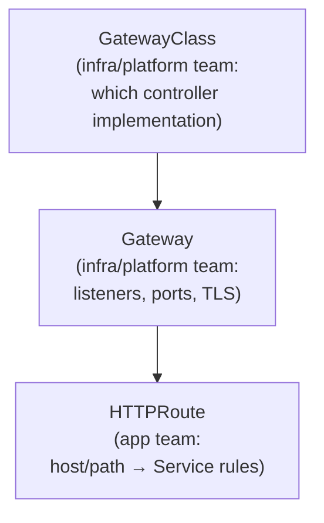

# Ingress — HTTP routing into the cluster

Builds on the Service types in [services.md](services.md) — this is what
sits in front of them so you don't need one LoadBalancer per app.

---

## The problem: one LoadBalancer per Service gets expensive



Every `type: LoadBalancer` Service provisions its **own** cloud load
balancer — its own cost, its own public IP, its own place to configure
TLS. Ten services on your domain means ten load balancers, mostly doing
the same job: routing HTTP by hostname/path.

---

## The fix: one entry point, routed by hostname/path



One public IP, one LoadBalancer, one place to terminate TLS — Ingress
rules decide which Service each request actually goes to, based on the
hostname or path in the HTTP request itself.

---

## Ingress is a resource; the Controller does the work

This is the single most important thing to understand about Ingress: the
`Ingress` object is just **rules** — nothing routes traffic until an
**Ingress Controller** (a separate thing you install) reads those rules
and configures itself accordingly.



Apply an `Ingress` with no controller running, and `kubectl get ingress`
shows the object — but nothing happens. This trips up almost everyone the
first time.

---

## Setup: install a controller locally

```bash
# minikube
minikube addons enable ingress

# kind
kubectl apply -f https://raw.githubusercontent.com/kubernetes/ingress-nginx/main/deploy/static/provider/kind/deploy.yaml

kubectl get pods -n ingress-nginx
```

---

## Example: path-based routing, two nginx-backed services

```bash
kubectl create deployment web --image=nginx
kubectl expose deployment web --port=80

kubectl create deployment api --image=nginx
kubectl expose deployment api --port=80
```

```yaml
# ingress.yaml
apiVersion: networking.k8s.io/v1
kind: Ingress
metadata:
  name: demo-ingress
  annotations:
    nginx.ingress.kubernetes.io/rewrite-target: /
spec:
  ingressClassName: nginx
  rules:
    - host: demo.local
      http:
        paths:
          - path: /web
            pathType: Prefix
            backend:
              service:
                name: web
                port:
                  number: 80
          - path: /api
            pathType: Prefix
            backend:
              service:
                name: api
                port:
                  number: 80
```

```bash
kubectl apply -f ingress.yaml
kubectl get ingress demo-ingress

echo "127.0.0.1 demo.local" | sudo tee -a /etc/hosts
curl http://demo.local/web
curl http://demo.local/api
```



Same idea works host-based instead of path-based — just add a second
`host:` entry (`web.demo.local`, `api.demo.local`) instead of splitting on
path.

---

## TLS termination — Ingress's other big job

```yaml
spec:
  tls:
    - hosts: ["demo.local"]
      secretName: demo-tls        # a Secret of type kubernetes.io/tls
  rules:
    - host: demo.local
      ...
```



The certificate/key live in a `kubernetes.io/tls` Secret (see
[configmap-and-secrets.md](configmap-and-secrets.md)); the Ingress
Controller decrypts at the edge, so individual apps don't need to handle
TLS at all. In practice this Secret is usually managed automatically by
**cert-manager** rather than created by hand.

---

## Popular Ingress Controllers

| Controller | Notes |
| --- | --- |
| **ingress-nginx** | the default choice for most clusters; not the same project as NGINX Inc.'s own controller, easy to confuse |
| **Traefik** | config-light, popular in Docker/homelab and light k8s setups |
| **HAProxy Ingress** | built on HAProxy, strong at high-throughput L7 routing |
| **AWS Load Balancer Controller** | provisions a real AWS ALB per Ingress, native AWS integration |
| **GKE Ingress** | provisions a Google Cloud L7 load balancer natively |
| **Kong Ingress Controller** | adds API-gateway features (auth, rate limiting) on top of routing |
| **Istio / Envoy Gateway** | service-mesh projects that can also serve as your cluster's ingress |

Only one difference actually matters day-to-day: which
`ingressClassName` + which annotations it understands — the `Ingress`
resource's `rules:`/`tls:` shape is identical across all of them.

---

## The annotation problem — why Gateway API exists

Ingress's `spec` only covers the basics (host, path, TLS secret).
Anything controller-specific — rewrite rules, rate limiting, canary
weighting, redirect rules — has to go in `metadata.annotations`, which is
just **untyped strings**, not real API fields:

```yaml
metadata:
  annotations:
    nginx.ingress.kubernetes.io/rewrite-target: /
    nginx.ingress.kubernetes.io/canary: "true"
    nginx.ingress.kubernetes.io/canary-weight: "20"
```



Switch controllers, and every annotation silently stops working — there's
no validation, no portability, and no clean way for a platform team to
separate "infrastructure config" from "what routes to what."

---

## Gateway API — Ingress's successor

Gateway API splits one blurry resource into three, each owned by a
different role:



```yaml
# Gateway (platform team owns this)
apiVersion: gateway.networking.k8s.io/v1
kind: Gateway
metadata:
  name: demo-gateway
spec:
  gatewayClassName: nginx
  listeners:
    - name: http
      protocol: HTTP
      port: 80
---
# HTTPRoute (app team owns this)
apiVersion: gateway.networking.k8s.io/v1
kind: HTTPRoute
metadata:
  name: web-route
spec:
  parentRefs:
    - name: demo-gateway
  rules:
    - matches:
        - path: { type: PathPrefix, value: /web }
      backendRefs:
        - name: web
          port: 80
```

What this actually buys you over Ingress:

| | Ingress | Gateway API |
| --- | --- | --- |
| Config for controller-specific behavior | annotations (untyped strings) | typed fields, part of the real spec |
| Role separation | one resource, everyone edits it | `Gateway` (platform) vs `HTTPRoute` (app team), separately owned |
| Protocol support | HTTP/HTTPS only | HTTP, HTTPS, TCP, UDP, gRPC, TLS passthrough |
| Portable across controllers | no — annotations are vendor-specific | yes — same `HTTPRoute` works against any compliant Gateway |
| Status | stable, everywhere | stable API, growing controller support |

---

## Cleanup

```bash
kubectl delete ingress demo-ingress
kubectl delete deployment web api
kubectl delete svc web api
```

---

## Takeaway

Ingress is rules, not a router — nothing happens until a Controller Pod
reads those rules and configures itself. It solves "one entry point
instead of one LoadBalancer per Service," but leans on untyped
annotations for anything beyond basic host/path routing and TLS, which is
exactly the gap Gateway API closes with typed, role-separated resources.
For learning and most small clusters, Ingress + ingress-nginx is still
the simplest place to start.
