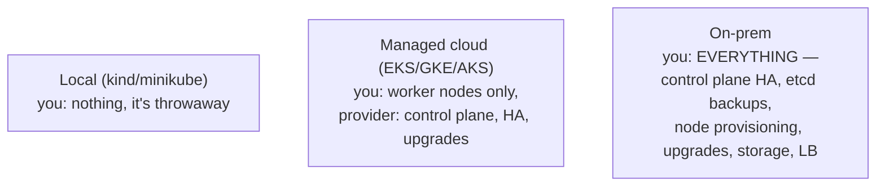
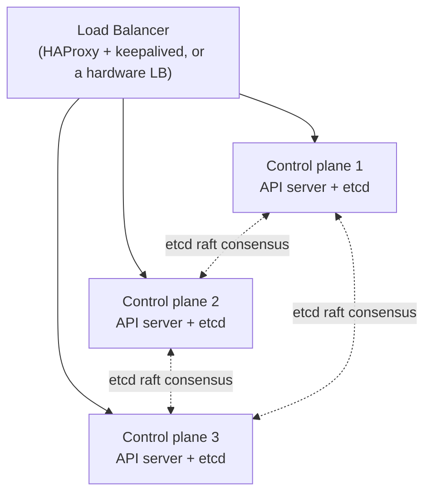
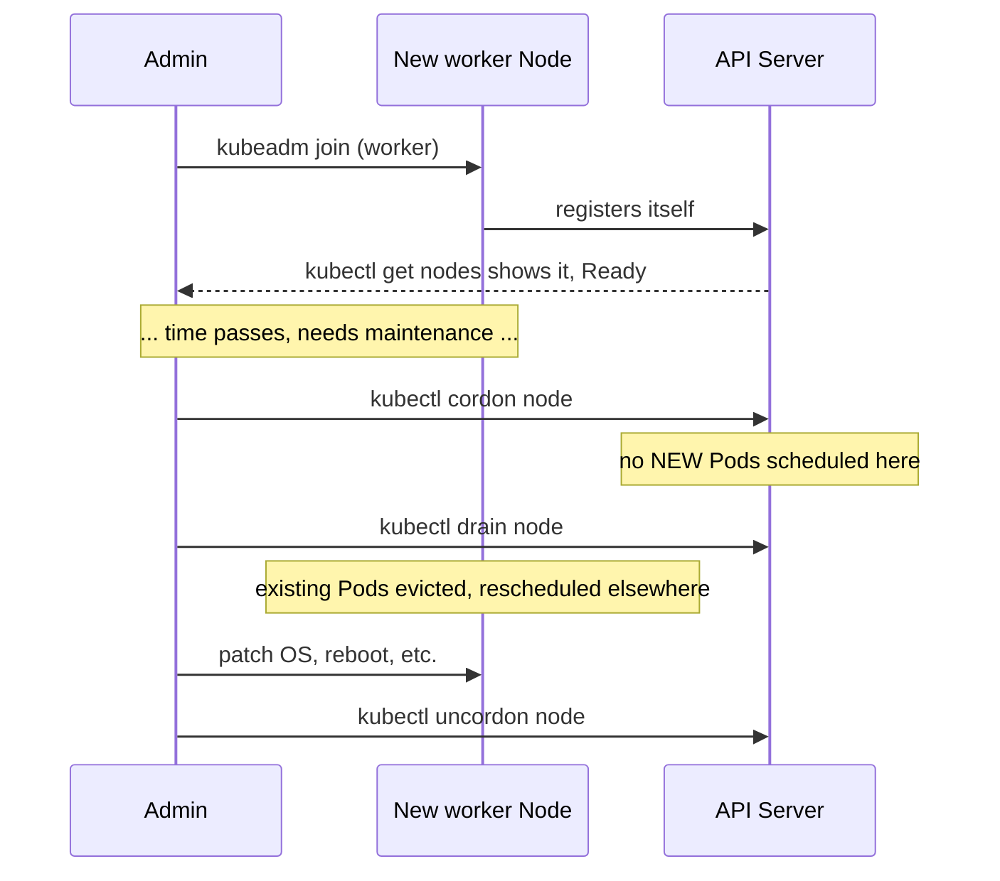
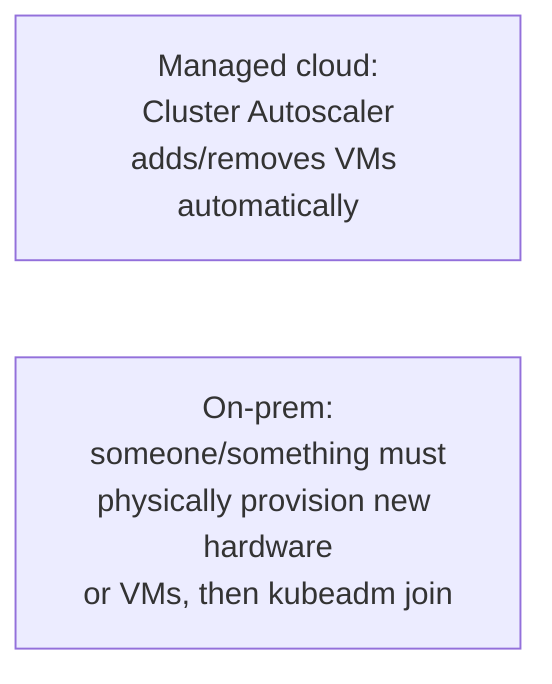
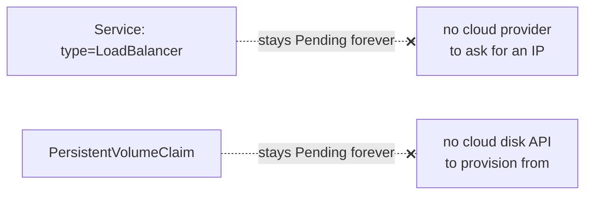
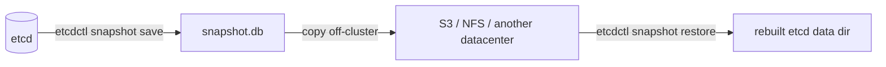
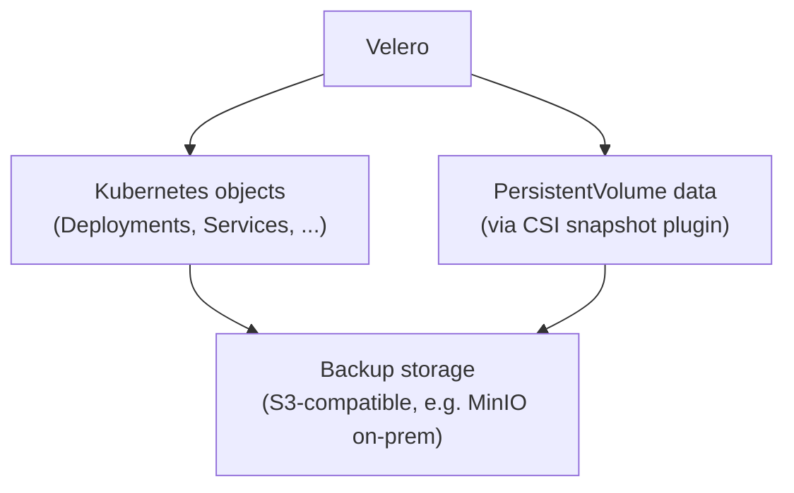
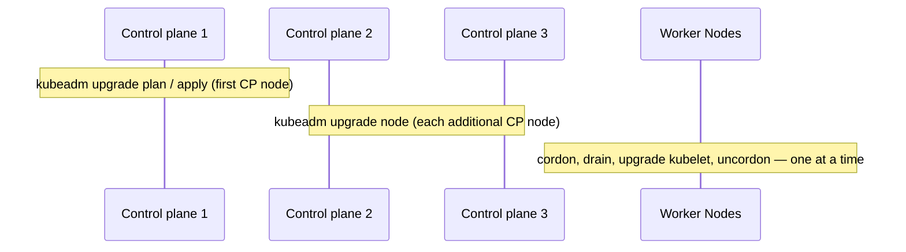
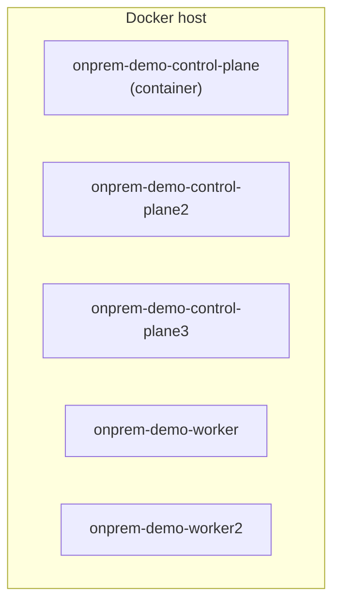

# Running a Production Cluster On-Premises

Builds on
[cluster-and-nodes.md](../kubernetes-intro/06-cluster-and-nodes.md)
(throwaway local clusters) and
[kubernetes-on-cloud.md](../kubernetes-intermediate/07-kubernetes-on-cloud.md)
(managed cloud clusters). On-prem is the third path — and the one where
**you** are the managed service.

---

## What "on-prem" actually takes away



Nothing about `kubectl`, Deployments, or Services changes — every other
note in this repo still applies untouched. What changes is everything
*beneath* the API server: nobody else is on call for etcd, nobody else
patches the control plane, and nobody else replaces a dead disk.

---

## Bootstrapping the cluster

`kubeadm` is the standard, "does exactly what it says" tool — it doesn't
hide any steps, which is exactly why it's the reference implementation
most other tools (including managed cloud offerings, under the hood) build
on.

```bash
# on the first control-plane node
kubeadm init --control-plane-endpoint "LOAD_BALANCER_IP:6443" \
  --upload-certs \
  --pod-network-cidr=10.244.0.0/16

# install a CNI plugin — nothing works until one is present
kubectl apply -f https://raw.githubusercontent.com/flannel-io/flannel/master/Documentation/kube-flannel.yml
```

| Tool | When to reach for it |
| --- | --- |
| **kubeadm** | full control, understand every step — the reference way to bootstrap |
| **k3s / RKE2** | lightweight, single-binary, popular for edge/small clusters |
| **Kubespray** | Ansible-driven, for provisioning many clusters/nodes at once |

---

## Control plane HA — the part with no cloud safety net

A single control-plane Node is a single point of failure for the entire
cluster. Production on-prem clusters run at least **3** control-plane
Nodes, fronted by a load balancer.



- **odd number of etcd members** (3 or 5) — etcd uses Raft consensus,
  which needs a strict majority to keep writing; 3 members tolerate 1
  failure, 5 tolerate 2. An even number buys nothing extra and can still
  only tolerate the same number of losses as one fewer.
- **the load balancer** is what `--control-plane-endpoint` in `kubeadm
  init` points at — every `kubectl`/kubelet connection goes through it,
  never hardcoded to one specific control-plane Node's IP.
- joining additional control-plane Nodes:

```bash
kubeadm join LOAD_BALANCER_IP:6443 --token <token> \
  --discovery-token-ca-cert-hash sha256:<hash> \
  --control-plane --certificate-key <key>
```

---

## Node management: the lifecycle of a worker



```bash
# adding a worker
kubeadm join LOAD_BALANCER_IP:6443 --token <token> \
  --discovery-token-ca-cert-hash sha256:<hash>

# taking one out for maintenance, safely
kubectl cordon node-3        # stop new scheduling
kubectl drain node-3 --ignore-daemonsets --delete-emptydir-data
# ... do the maintenance ...
kubectl uncordon node-3      # resume scheduling

# removing a node permanently
kubectl drain node-3 --ignore-daemonsets --delete-emptydir-data
kubectl delete node node-3
# then run `kubeadm reset` on the node itself
```

`drain` is what makes this safe — it evicts Pods gracefully (respecting
PodDisruptionBudgets, see below) instead of just yanking the Node out from
under running workloads. Once nodes exist, everything from
[08-node-selection.md](../kubernetes-intermediate/08-node-selection.md)
(affinity, taints, spread constraints) governs how Pods land across them.

---

## Scaling: no cloud autoscaler to lean on



- **Pod-level scaling** — [HPA/VPA](../kubernetes-intermediate/02-scaling-vpa-hpa.md)
  work identically on-prem; they scale *within* existing Node capacity.
- **Node-level scaling** — no built-in equivalent of EKS/GKE/AKS's managed
  node groups. Either provision hardware/VMs manually and `kubeadm join`
  them, or run **Cluster API** (`clusterctl`) against your virtualization
  layer (vSphere, OpenStack, bare-metal provisioners) to get declarative,
  automated node scaling on-prem too.
- **Protect against over-eager draining**: a `PodDisruptionBudget` caps
  how many replicas can be down at once during voluntary
  disruptions (drains, not crashes):

```yaml
apiVersion: policy/v1
kind: PodDisruptionBudget
metadata:
  name: web-pdb
spec:
  minAvailable: 2
  selector:
    matchLabels: { app: web }
```

```bash
kubectl apply -f web-pdb.yaml
kubectl drain node-3 --ignore-daemonsets
# refuses to evict a Pod if doing so would violate minAvailable
```

---

## The two things cloud gave you for free — and now don't



- **LoadBalancer Services** ([services.md](../kubernetes-intro/05-services.md))
  need **MetalLB** (or similar) on-prem — it hands out real IPs from a
  pool you own instead of asking a cloud API for one.
- **PersistentVolumeClaims** ([deployment-vs-statefulsets.md](../kubernetes-intro/08-deployment-vs-statefulsets.md))
  need a storage layer that can actually provision on-prem — **Rook/Ceph**
  or **Longhorn** for real distributed block storage, or an NFS-backed
  `StorageClass` for something simpler.

```bash
kubectl get svc web
# EXTERNAL-IP: <pending>   <- until MetalLB (or similar) is installed
kubectl get pvc
# STATUS: Pending          <- until a StorageClass with a real provisioner exists
```

---

## Backup: etcd is the entire cluster's brain

Every Deployment, Secret, ConfigMap — everything — is one etcd write.
Lose etcd with no backup, and you've lost the cluster's entire state, even
if every workload Node is still physically fine.



```bash
ETCDCTL_API=3 etcdctl snapshot save /backup/snapshot-$(date +%Y%m%d).db \
  --endpoints=https://127.0.0.1:2379 \
  --cacert=/etc/kubernetes/pki/etcd/ca.crt \
  --cert=/etc/kubernetes/pki/etcd/server.crt \
  --key=/etc/kubernetes/pki/etcd/server.key

# restore (on a fresh data dir, cluster stopped)
ETCDCTL_API=3 etcdctl snapshot restore /backup/snapshot-20260101.db \
  --data-dir /var/lib/etcd-restored
```

- **schedule this** (a `CronJob` running `etcdctl` against the local
  static Pod, or a systemd timer on each control-plane Node) — a backup
  that isn't automatic is a backup that isn't there the day it matters
- **copy snapshots off the cluster** — a snapshot sitting on the same
  disks that just failed protects against nothing
- **etcd backup ≠ full disaster recovery** — it restores cluster
  *objects*, not PersistentVolume *data* sitting in Rook/Ceph/Longhorn;
  back those up separately (their own snapshot mechanism, or **Velero**
  with a volume snapshot plugin)



```bash
velero backup create full-backup --include-namespaces=production
velero restore create --from-backup full-backup
```

Velero covers what an etcd snapshot doesn't: point-in-time,
namespace-scoped, restorable-to-a-different-cluster backups of both
objects and the volumes behind them — the practical tool for "restore just
this namespace" or "migrate this workload to a new cluster," which a raw
etcd snapshot can't do.

---

## Upgrades: one Node at a time, control plane first



```bash
# on the first control-plane node
kubeadm upgrade plan
kubeadm upgrade apply v1.31.0

# on each additional control-plane node
kubeadm upgrade node

# on every worker, one at a time
kubectl cordon <node>
kubectl drain <node> --ignore-daemonsets --delete-emptydir-data
kubeadm upgrade node
apt-get update && apt-get install -y kubelet=1.31.0-* kubectl=1.31.0-*
systemctl restart kubelet
kubectl uncordon <node>
```

Kubernetes only supports upgrading **one minor version at a time**
(1.29 → 1.30 → 1.31, never 1.29 → 1.31 directly) — skipping a version is
unsupported and can leave the cluster in a broken state.

---

## Try it yourself locally, with `kind`

You don't need real servers to practice most of this. `kind` bootstraps
its nodes with `kubeadm` internally — each "Node" is a Docker container
running a real kubelet, real static control-plane Pods, and real etcd —
so an HA control plane, node draining, and etcd backup/restore all behave
exactly like they would on real hardware. What you *can't* fully practice
this way is noted at the end.

### Spin up a 3-control-plane, 2-worker cluster

```yaml
# kind-ha-config.yaml
kind: Cluster
apiVersion: kind.x-k8s.io/v1alpha4
nodes:
  - role: control-plane
  - role: control-plane
  - role: control-plane
  - role: worker
  - role: worker
```

```bash
kind create cluster --name onprem-demo --config kind-ha-config.yaml
kubectl get nodes
# 3x control-plane, 2x worker — same shape as the HA diagram above
```



### Demonstrate control-plane HA

```bash
docker ps --filter "name=onprem-demo-control-plane" --format "{{.Names}}"

# kill one control-plane node's container outright
docker stop onprem-demo-control-plane2

kubectl get nodes           # still works — served by the other 2
kubectl create deployment web --image=nginx   # still works — etcd quorum survives

docker start onprem-demo-control-plane2   # bring it back
```

With 3 members, losing 1 still leaves a Raft majority (2 of 3) — this is
the concrete version of the "why an odd number" rule from earlier.

### Demonstrate safe node draining

```bash
kubectl create deployment web --image=nginx --replicas=4
kubectl get pods -o wide     # note which node(s) they're on

kubectl cordon onprem-demo-worker2
kubectl drain onprem-demo-worker2 --ignore-daemonsets --delete-emptydir-data

kubectl get pods -o wide     # everything that was on worker2 is now on worker
kubectl uncordon onprem-demo-worker2
```

### Demonstrate an etcd snapshot, for real

```bash
docker exec -it onprem-demo-control-plane sh -c '
  ETCDCTL_API=3 etcdctl snapshot save /tmp/snapshot.db \
    --endpoints=https://127.0.0.1:2379 \
    --cacert=/etc/kubernetes/pki/etcd/ca.crt \
    --cert=/etc/kubernetes/pki/etcd/server.crt \
    --key=/etc/kubernetes/pki/etcd/server.key
'
docker cp onprem-demo-control-plane:/tmp/snapshot.db ./snapshot.db
ls -lh snapshot.db
```

That's a real etcd snapshot of a real (if small) cluster — the exact
command you'd run on real hardware, unchanged.

### Cleanup

```bash
kind delete cluster --name onprem-demo
```

### What this doesn't cover

`kind`'s node topology is fixed at `create` time — there's no `kubeadm
join` moment to practice, because kind provisions all Nodes for you up
front. To feel that part specifically (a brand new machine joining an
existing cluster), you'd need real VMs (e.g. Multipass) instead — kind is
the fast way to practice everything *after* a Node already exists:
draining, HA failover, and backup/restore.

---

## Cheat sheet

```bash
# bootstrap
kubeadm init --control-plane-endpoint <LB_IP>:6443 --upload-certs
kubeadm join <LB_IP>:6443 --token <t> --discovery-token-ca-cert-hash sha256:<h>

# node lifecycle
kubectl cordon <node>
kubectl drain <node> --ignore-daemonsets --delete-emptydir-data
kubectl uncordon <node>
kubectl delete node <node>

# etcd backup / restore
etcdctl snapshot save /backup/snap.db
etcdctl snapshot restore /backup/snap.db --data-dir /var/lib/etcd-restored

# upgrades
kubeadm upgrade plan
kubeadm upgrade apply v1.31.0
kubeadm upgrade node
```

---

## Takeaway

On-prem doesn't change how you *use* Kubernetes — it changes who's
responsible for keeping it alive. HA control plane (odd-numbered etcd +
a load balancer), safe node lifecycle (`cordon`/`drain`/`uncordon` plus
PodDisruptionBudgets), manual or Cluster-API-driven scaling, MetalLB and
Rook/Longhorn to replace what cloud LoadBalancers/disks gave you for
free, and — the one that actually matters most — automated, off-cluster
etcd snapshots plus Velero for anything volume-backed. Skip the backup
piece and everything else here is cosmetic.
