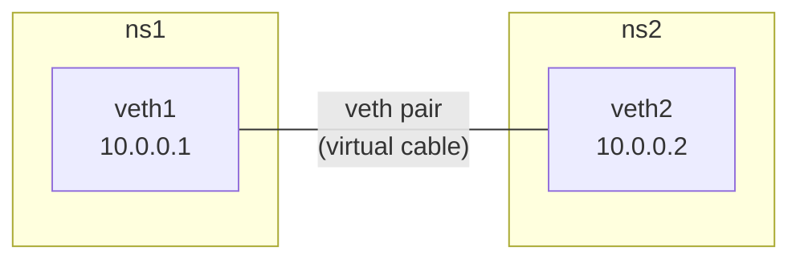
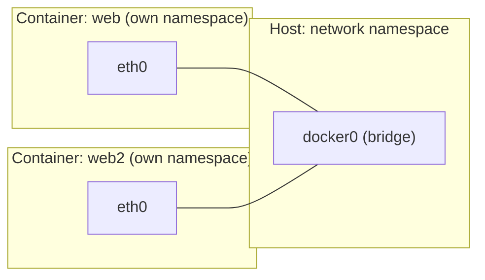
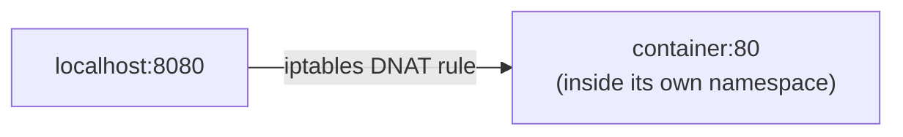
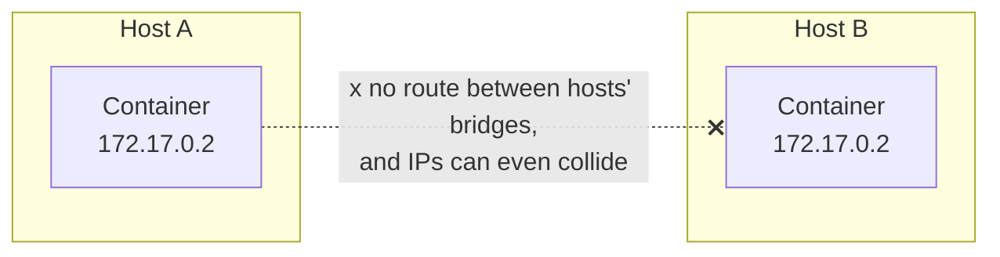
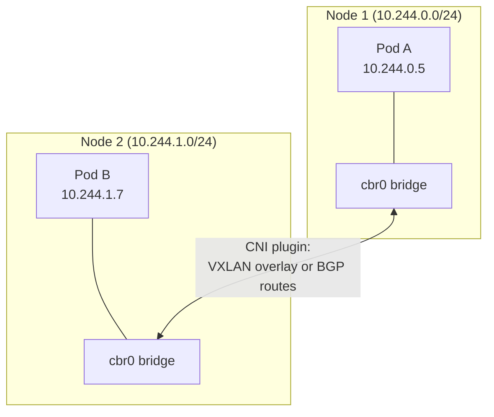

# Networking: Linux → Docker → Kubernetes

Same underlying problem at three increasing scales: give isolated
processes their own network identity, then let them talk to exactly who
they should. Docker solves it for one host; Kubernetes reuses Docker's
building blocks and solves it across many.


---

## Layer 1: Linux network namespaces — the raw primitive

A network namespace is an isolated copy of the network stack — its own
interfaces, routes, iptables rules. Two namespaces, by default, **can't
see each other at all**.

```bash
sudo ip netns add ns1
sudo ip netns add ns2

sudo ip netns exec ns1 ip addr    # only "lo", nothing else — fully isolated
```

To let them talk, you wire a **veth pair** — a virtual Ethernet cable with
one end in each namespace — and give each end an IP:

```bash
sudo ip link add veth1 type veth peer name veth2
sudo ip link set veth1 netns ns1
sudo ip link set veth2 netns ns2

sudo ip netns exec ns1 ip addr add 10.0.0.1/24 dev veth1
sudo ip netns exec ns2 ip addr add 10.0.0.2/24 dev veth2
sudo ip netns exec ns1 ip link set veth1 up
sudo ip netns exec ns2 ip link set veth2 up

sudo ip netns exec ns1 ping -c 2 10.0.0.2   # works — one cable, two ends
```



This pair-per-connection model doesn't scale past 2 namespaces on its own
— for 3+ you need a **bridge** (a virtual switch) so every veth's other
end plugs into one shared point instead of a tangle of direct cables. That
bridge is exactly what Docker sets up for you next.

---

## Layer 2: Docker — namespace + veth + bridge, automated

Every `docker run` does, automatically, what you just did by hand — plus
a bridge so any number of containers can reach each other, not just two.

```bash
docker run -d --name web nginx
docker run -d --name web2 nginx

ip link show docker0             # the bridge Docker created
docker exec web ip addr          # eth0 — one end of a veth pair
docker network inspect bridge | grep -A3 Containers
```



```bash
docker exec web2 ping -c 2 $(docker inspect -f '{{.NetworkSettings.IPAddress}}' web)
# works — same bridge, same host
```

### `-p` port mapping is just an iptables rule

```bash
docker run -d --name web3 -p 8080:80 nginx
sudo iptables -t nat -L DOCKER -n
# DNAT tcp -- 0.0.0.0/0  0.0.0.0/0  tcp dpt:8080 to:172.17.0.4:80
```



Nothing magic — `-p` is Docker writing one DNAT rule so traffic hitting
the host's port gets rewritten to the container's private IP:port.

### The gap Docker's model doesn't cover



`docker0`'s IP range is local to that one host — two different hosts both
default to the same `172.17.0.0/16` range, and there's no built-in routing
between them at all. Plain Docker was never designed to answer "how does
a container on Host A reach a container on Host B" — that's precisely the
problem Kubernetes's networking model exists to solve.

---

## Layer 3: Kubernetes — same primitives, plus a CNI plugin for cross-host routing

### Inside one Pod: still just a shared network namespace

A Pod's "shared network namespace" (see
[sidecars.md](../kubernetes-intermediate/05-sidecars.md)) is the exact
same primitive from Layer 1 — kubelet creates one network namespace per
Pod (via a small `pause` container that holds it open), and every
container in that Pod joins it instead of getting its own.

```bash
kubectl run web --image=nginx --port=80
kubectl get pod web -o jsonpath='{.status.podIP}'
kubectl exec web -- ip addr    # eth0, same shape as a Docker container's
```

### Across Nodes: the part Docker couldn't do, now solved by CNI

The Kubernetes network model is four rules, imposed on whichever CNI
plugin you install — not a new protocol, just a requirement:

1. every Pod gets its own IP
2. Pods on the same Node reach each other without NAT
3. Pods on **different** Nodes reach each other without NAT
4. a Pod sees itself as the same IP others use to reach it

```bash
kubectl get nodes -o jsonpath='{.items[*].spec.podCIDR}'
# 10.244.0.0/24   node1 — each Node gets its own slice of the overall Pod CIDR
# 10.244.1.0/24   node2
```



Same-Node traffic (Pod A → another Pod on Node 1) never leaves the
bridge — identical to two Docker containers on one host. Cross-Node
traffic is where CNI plugins differ: Flannel/Kindnet **encapsulate** the
packet (VXLAN) to tunnel it over the physical network; Calico can instead
**route** it directly via BGP, no encapsulation at all. Either way, the
CNI plugin is the piece that programs this — remove it, and Pods sit in
`ContainerCreating` forever with no IP.

```bash
kubectl get pods -n kube-system | grep -E "calico|flannel|cilium|kindnet|weave"
```

| Plugin | Model | NetworkPolicy support |
| --- | --- | --- |
| Flannel / Kindnet | overlay (VXLAN) | no (needs Calico alongside) |
| Calico | routed (BGP) or overlay | yes |
| Cilium | eBPF, no iptables | yes, extended |

### Verify it, layer by layer, on a real cluster

```bash
kind create cluster --name net-demo --config - <<'EOF'
kind: Cluster
apiVersion: kind.x-k8s.io/v1alpha4
nodes:
  - role: control-plane
  - role: worker
  - role: worker
EOF

kubectl create deployment web --image=nginx --replicas=2
kubectl get pods -o wide     # note: likely on two different nodes

kubectl run netshoot --image=nicolaka/netshoot --command -- sleep 3600
POD_IP=$(kubectl get pods -l app=web -o jsonpath='{.items[0].status.podIP}')

kubectl exec netshoot -- ping -c 3 $POD_IP
kubectl exec netshoot -- traceroute $POD_IP
# same node: 1 hop (the bridge). different node: 2 hops (bridge -> tunnel -> bridge)
```

---

## Layer 4: Services + CoreDNS — the part with no Docker equivalent at all

Even with CNI solving cross-Node routing, Pod IPs are still not
**stable** — see [pods-and-services.md](../kubernetes-intro/03-pods-and-services.md).
Docker has nothing like this; it's purely a Kubernetes-layer addition.


```bash
kubectl expose deployment web --port=80
kubectl exec netshoot -- nslookup web
kubectl exec netshoot -- curl -s http://web

# see the actual DNAT rule kube-proxy programmed
docker exec net-demo-control-plane iptables -t nat -L KUBE-SERVICES -n | grep $(kubectl get svc web -o jsonpath='{.spec.clusterIP}')
```

`kube-proxy` is doing on a Kubernetes ClusterIP exactly what the Docker
`-p` DNAT rule did in Layer 2 — one more DNAT hop, just now pointed at
*whichever Pod IP is currently healthy* instead of one fixed container.
CoreDNS is what turns a human-readable name into that ClusterIP in the
first place; full detail on both is in
[services.md](../kubernetes-intro/05-services.md).

---

## Same primitive, three layers — side by side

| | Linux | Docker | Kubernetes |
| --- | --- | --- | --- |
| Isolation unit | network namespace | container (= 1 namespace) | Pod (= 1 shared namespace) |
| Local connectivity | veth pair, by hand | `docker0` bridge, automatic | `cbr0`-style bridge per Node, automatic |
| Cross-host connectivity | not applicable | **doesn't exist** | CNI plugin (VXLAN overlay or BGP routing) |
| Stable address for a moving target | not applicable | not applicable | Service + ClusterIP + CoreDNS |
| "Port mapping" mechanism | manual iptables | `-p`, one DNAT rule | Service, DNAT rule per healthy Pod |

---

## Troubleshooting, mapped to the layer that broke

```bash
# Pod stuck ContainerCreating, no IP → Layer 3 (CNI) problem
kubectl get pods -n kube-system   # is the CNI plugin's Pod even Running?

# ping works same-node, fails cross-node → Layer 3 routing problem
kubectl exec <pod> -- traceroute <other-pod-ip>

# nslookup fails / times out → Layer 4 (CoreDNS) problem
kubectl logs -n kube-system -l k8s-app=kube-dns --tail=30

# Service unreachable but Pods are fine → Layer 4 (kube-proxy / endpoints) problem
kubectl get endpoints <service>    # empty = label selector mismatch, see deployments.md
```

---

## Cleanup

```bash
kind delete cluster --name net-demo
docker rm -f web web2 web3
sudo ip netns del ns1
sudo ip netns del ns2
```

---

## Takeaway

Every layer reuses the one below it instead of replacing it: Docker
automates raw Linux network namespaces + veth pairs behind a bridge for
one host; Kubernetes keeps that exact bridge-per-host model for same-Node
traffic and bolts on a CNI plugin specifically to solve the one thing
Docker never could — routing between hosts — then layers Services and
CoreDNS on top to give that routing a stable name. Debugging is just
asking which layer stopped working: no Pod IP is CNI, ping failing
cross-node is CNI routing, DNS failing is CoreDNS, and a Service with no
traffic is kube-proxy/endpoints.
