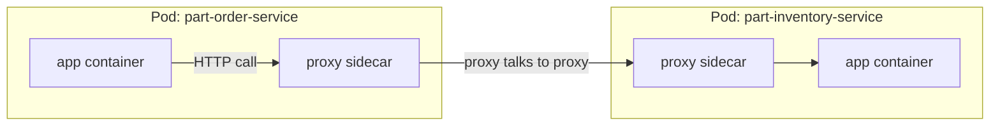
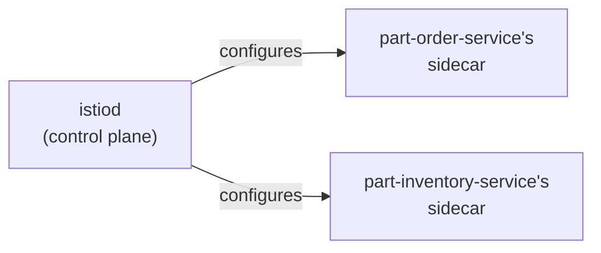
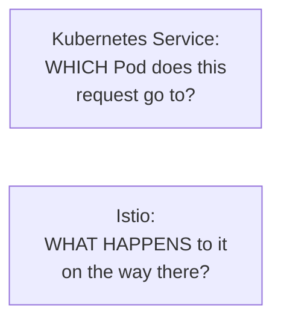
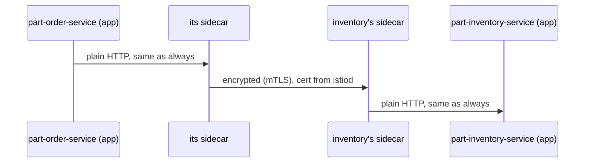
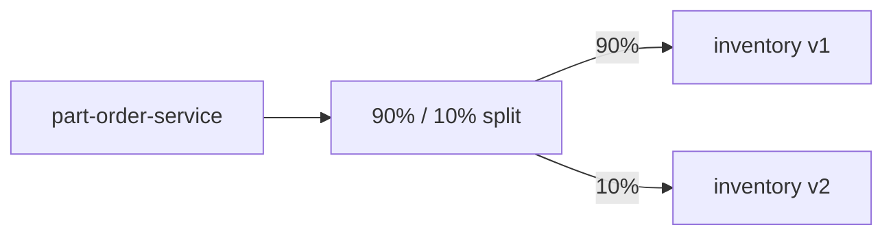
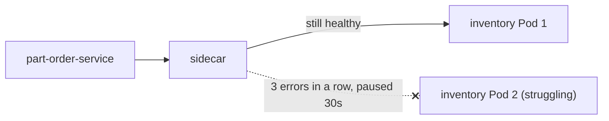
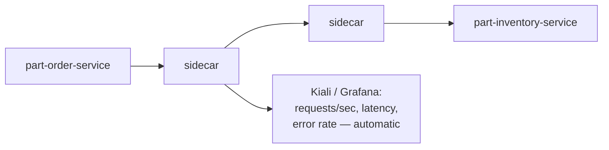

# Service Mesh & Istio, Simply

Using the real app in this repo: `part-order-service` calls
`part-inventory-service` over HTTP (a Feign client) to check stock and
place orders. Everything below is that one call, made smarter.

---

## Start here: it's just a sidecar proxy

[sidecars.md](../kubernetes-intermediate/05-sidecars.md) already showed
this pattern — a helper container sitting next to your app in the same
Pod, sharing its network. A service mesh is that idea, applied to *every*
Pod, automatically.



Neither Spring Boot app changes a single line of code. The call still
looks like a normal HTTP request to `part-inventory-service` — it just
quietly passes through a proxy on each end first.

---

## What Istio adds: one control plane for every sidecar

Wiring up one proxy by hand (like the sidecars.md examples) doesn't
scale past a couple of Pods. Istio installs the proxy (Envoy) into every
Pod automatically, and configures all of them from one place: `istiod`.



Turning it on:

```bash
istioctl install --set profile=demo
kubectl label namespace part-order-app istio-injection=enabled

kubectl rollout restart deployment/part-order-service -n part-order-app
kubectl rollout restart deployment/part-inventory-service -n part-order-app

kubectl get pods -n part-order-app
# both now show 2/2 — the app container, plus istio-proxy, injected automatically
```

That's it — the sidecar is there. Everything from here is just *telling*
Istio what you want that sidecar to do.

---

## But doesn't Kubernetes already do this?

Fair objection: a Kubernetes **Service** already gives
`part-order-service` a stable DNS name and spreads its calls across
every healthy `part-inventory-service` Pod. And Spring Boot already has
resilience4j for retries and circuit breakers. So what's actually
missing?



Three concrete gaps a plain Service + app-level libraries leave open:

1. **`kube-proxy` doesn't speak HTTP.** It only knows binary readiness —
   Pod is Ready, or it isn't. If a `part-inventory-service` Pod is Ready
   but returning 500s under load, a plain Service keeps sending it a
   third of the traffic anyway. It has no concept of "this Pod is
   unhealthy *right now*" — only "did the readiness probe pass." That's
   the gap `outlierDetection` (Use case 3) actually fills.
2. **resilience4j only helps if every service is Java.** The real cost
   isn't whether Spring Boot *can* retry — it's that the moment
   `part-inventory-service` gets rewritten in Go, or a Node.js service
   joins, that logic gets reimplemented, in a different library, with
   different defaults, by a different team. A sidecar doesn't care what
   language the app is; the same config applies unchanged.
3. **mTLS is a different order of problem than retries.** Doing it at
   the app level means every service issuing, rotating, and trusting
   certificates itself — real PKI infrastructure, duplicated per
   service, not a Spring Boot annotation. Use case 1 below is one YAML
   object precisely because a mesh already has this solved centrally.

None of this replaces the Kubernetes Service — Istio's sidecars actually
read the *same* Endpoints data Kubernetes already tracks to know where
`part-inventory-service`'s Pods are. It adds a layer on top that's aware
of HTTP, identity, and policy, instead of just IP:port.

---

## Use case 1: encrypt traffic between the two services

Today, `part-order-service` → `part-inventory-service` is plain HTTP.
One object turns on mutual TLS for every mesh service, with zero Java
code involved:

```yaml
apiVersion: security.istio.io/v1
kind: PeerAuthentication
metadata:
  name: default
  namespace: part-order-app
spec:
  mtls:
    mode: STRICT
```

```bash
kubectl apply -f peer-auth-strict.yaml
```



Both apps still write and receive plain HTTP — the encryption happens in
the sidecars, invisibly.

---

## Use case 2: try a new version safely (canary)

Say you're rolling out `part-inventory-service:v2`. In
[rolling-update.md](../kubernetes-intermediate/03-rolling-update.md), a
canary means running 1 Pod out of 10 and hoping the traffic split is
*roughly* 10% — since it depends on replica counts. Istio lets you say the
percentage directly:

```yaml
apiVersion: networking.istio.io/v1
kind: DestinationRule
metadata:
  name: part-inventory-service
spec:
  host: part-inventory-service
  subsets:
    - name: v1
      labels: { version: v1 }
    - name: v2
      labels: { version: v2 }
---
apiVersion: networking.istio.io/v1
kind: VirtualService
metadata:
  name: part-inventory-service
spec:
  hosts: ["part-inventory-service"]
  http:
    - route:
        - destination: { host: part-inventory-service, subset: v1 }
          weight: 90
        - destination: { host: part-inventory-service, subset: v2 }
          weight: 10
```



```bash
kubectl apply -f inventory-canary.yaml
```

`part-order-service` doesn't know the split exists — it just calls
`part-inventory-service` like always. Raise `v2`'s weight over time
(10 → 50 → 100) once you trust it.

---

## Use case 3: keep working when inventory is having a bad day

If a `part-inventory-service` Pod starts erroring or hangs, Istio can
notice and stop sending it traffic — before `part-order-service`'s Feign
calls start piling up failures:

```yaml
apiVersion: networking.istio.io/v1
kind: DestinationRule
metadata:
  name: part-inventory-service-resilience
spec:
  host: part-inventory-service
  trafficPolicy:
    outlierDetection:
      consecutive5xxErrors: 3
      interval: 10s
      baseEjectionTime: 30s
```



This is a circuit breaker — normally something you'd add to the Java
code with a library like resilience4j. Here it's one YAML file, and it
would work the same way even if `part-inventory-service` were rewritten
in Go tomorrow.

---

## Use case 4: see the traffic between the two services

Since every call already passes through a sidecar, Istio can show you
request rates, latencies, and error rates between the two services —
without adding any tracing code to either Spring Boot app:

```bash
istioctl dashboard kiali
```



Open Kiali and you'll see an arrow from `part-order-service` to
`part-inventory-service` with real numbers on it — the first time either
service reports anything about the other, without either one logging it.

---

## Is this worth it for a 2-service app?

Probably not yet — that's an honest answer. With just
`part-order-service` and `part-inventory-service`, both Spring Boot, one
team — resilience4j plus the Kubernetes Service you already have is
genuinely sufficient. Plain
[NetworkPolicy](../kubernetes-intermediate/04-networking-policy.md) and a
readiness probe cover most of what you actually need day-to-day.

The math flips once any of these become true instead:

- a third service joins in a **different language**, and the retry/TLS
  logic would otherwise get reimplemented a third way
- you have a **compliance requirement** like "prove every internal call
  is encrypted" — provable once, centrally, is very different from
  trusting every team implemented it correctly
- a Pod that's technically Ready is still **serving errors**, and you
  want that noticed without every caller's library catching it
  independently

Until one of those is real, running Istio is net overhead, not net
simplification — reach for it when the duplication itself becomes the
problem, not before.

---

## Cheat sheet

```bash
istioctl install --set profile=demo
kubectl label namespace part-order-app istio-injection=enabled
kubectl get pods -n part-order-app        # look for 2/2 (app + istio-proxy)
istioctl proxy-status                     # are all sidecars in sync with istiod?
kubectl apply -f peer-auth-strict.yaml
kubectl apply -f inventory-canary.yaml
istioctl dashboard kiali
```

---

## Takeaway

A service mesh is the sidecar pattern from `sidecars.md`, given to every
Pod automatically and configured from one place. For
`part-order-service` calling `part-inventory-service`, that buys you
encryption, safe canary releases, automatic circuit breaking, and a live
traffic map — all without touching either Spring Boot app's code.
