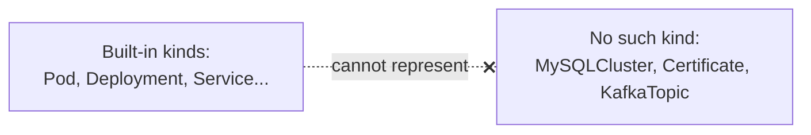
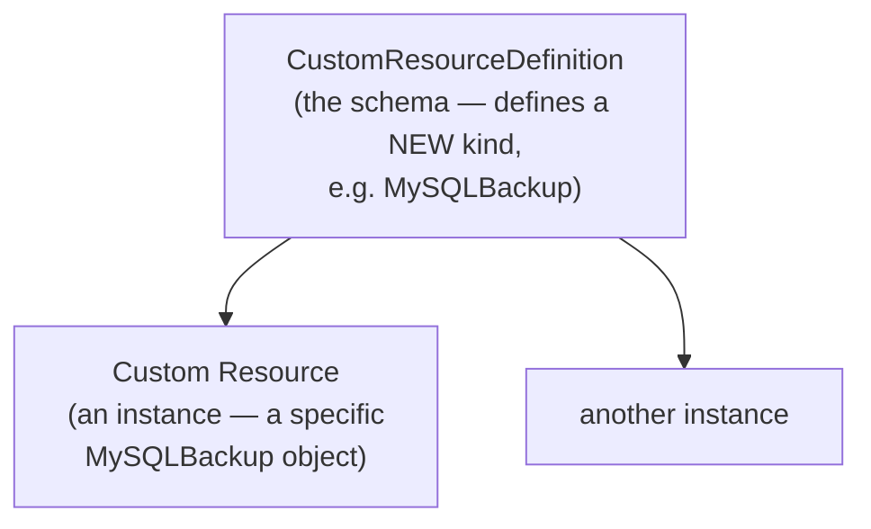
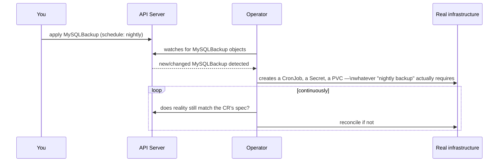
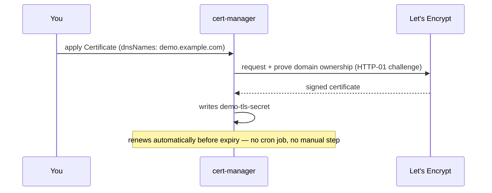
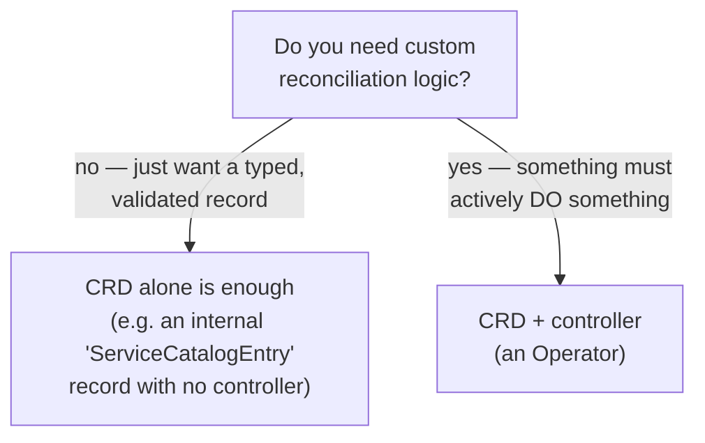

# Custom Resources & Operators

You've already used these without being told. `VerticalPodAutoscaler`
([scaling-vpa-hpa.md](../kubernetes-intermediate/02-scaling-vpa-hpa.md))
and `VirtualService`/`PeerAuthentication`
([service-mesh.md](03-service-mesh.md)) aren't built into Kubernetes —
every one of them is a **Custom Resource**, and something else was running
in the background making them actually do something. This is that
mechanism, named.

---

## The problem: Kubernetes's vocabulary is fixed

Kubernetes ships with a set vocabulary — `Pod`, `Deployment`, `Service`,
`ConfigMap`... What if what you want to manage is a MySQL cluster, a TLS
certificate, a Kafka topic — something with no built-in `kind` at all?



Option A: build a separate tool outside Kubernetes to manage these things
— its own CLI, its own storage, its own auth, none of it composable with
`kubectl`/RBAC/GitOps. Option B: teach the Kubernetes API server a new
`kind` and get all of that for free. A **CustomResourceDefinition** is
option B.

---

## CRD vs. CR — the same relationship as `Deployment` vs. a Deployment



Same as how `kind: Deployment` is a schema Kubernetes ships with, and
`my-app-deployment` is one instance of it — a CRD is you registering a
brand-new schema, and a CR is one object shaped like it.

```yaml
# crd.yaml — defines the new kind
apiVersion: apiextensions.k8s.io/v1
kind: CustomResourceDefinition
metadata:
  name: mysqlbackups.demo.example.com
spec:
  group: demo.example.com
  names:
    kind: MySQLBackup
    plural: mysqlbackups
  scope: Namespaced
  versions:
    - name: v1
      served: true
      storage: true
      schema:
        openAPIV3Schema:
          type: object
          properties:
            spec:
              type: object
              properties:
                schedule:
                  type: string
                retentionDays:
                  type: integer
```

```bash
kubectl apply -f crd.yaml
kubectl get crd mysqlbackups.demo.example.com
kubectl api-resources | grep mysqlbackup
```

```yaml
# a Custom Resource — an instance of the new kind
apiVersion: demo.example.com/v1
kind: MySQLBackup
metadata:
  name: nightly-backup
spec:
  schedule: "0 2 * * *"
  retentionDays: 14
```

```bash
kubectl apply -f nightly-backup.yaml
kubectl get mysqlbackups
kubectl describe mysqlbackup nightly-backup
```

That's a real object now — stored in etcd, subject to RBAC, visible to
`kubectl get`, diffable in Git, exactly like a Deployment. Notice what it
does *not* do yet: nothing actually schedules a backup. A CRD by itself is
just a typed, validated place to store data — the openAPIV3Schema even
rejects a CR with the wrong field types, same as `kubectl apply` rejecting
a malformed Deployment.

---

## What makes it do something: an Operator

A CRD with nobody watching it is a filing cabinet. An **Operator** is a
custom controller that watches CRs of a given kind and drives real
infrastructure to match — the exact same reconciliation loop from
[01-intro.md](../kubernetes-intro/01-intro.md), just pointed at your own
custom `kind` instead of a built-in one.



This is genuinely the same pattern as `kube-controller-manager` watching
Deployments and driving ReplicaSets/Pods to match — Operators just extend
that same idea to domains Kubernetes doesn't ship built-in logic for.

---

## The two examples you've already used

### VerticalPodAutoscaler

```yaml
apiVersion: autoscaling.k8s.io/v1
kind: VerticalPodAutoscaler
```

- the **CRD** is what makes `kind: VerticalPodAutoscaler` a valid object
  at all (installed by `vpa-up.sh`, not part of core Kubernetes)
- the **Operator** is the VPA Recommender + Updater + Admission Controller
  — three controllers that watch `VerticalPodAutoscaler` CRs and actually
  evict/resize Pods to match

### Istio's `VirtualService`, `DestinationRule`, `PeerAuthentication`

```yaml
apiVersion: networking.istio.io/v1
kind: VirtualService
```

- the **CRDs** are installed by `istioctl install`
- the **Operator** is `istiod` — it watches every one of these CRs and
  pushes the corresponding config down to every Envoy sidecar

Neither of these is a special Kubernetes feature — they're ordinary CRDs
plus an ordinary controller Pod, following the pattern above.

---

## Real-world Operators, and what they manage

| Operator | CRD(s) | What it actually does |
| --- | --- | --- |
| **cert-manager** | `Certificate`, `Issuer`, `ClusterIssuer` | requests/renews TLS certs from Let's Encrypt (or another CA), writes the result as a `kubernetes.io/tls` Secret — the piece [ingress.md](../kubernetes-intro/09-ingress.md) mentioned handling TLS automatically |
| **Prometheus Operator** | `Prometheus`, `ServiceMonitor`, `Alertmanager` | turns "monitor this Service" into actual scrape config, no hand-edited Prometheus YAML |
| **Argo CD** | `Application` | continuously syncs a cluster's state to match a Git repo — GitOps, implemented entirely as a CRD + controller |
| **Strimzi** | `Kafka`, `KafkaTopic`, `KafkaUser` | provisions and manages an entire Kafka cluster from a single CR |
| **Zalando Postgres Operator** | `postgresql` | provisions HA Postgres — the exact "MySQL needs a StatefulSet, not a Deployment" problem from [deployment-vs-statefulsets.md](../kubernetes-intro/08-deployment-vs-statefulsets.md), packaged so you just declare a database instead of hand-writing the StatefulSet yourself |

The pattern is identical across all of them: define the desired state of
something *domain-specific* as a CR, let a controller reconcile reality to
match — precisely the mental model from `01-intro.md`, just no longer
limited to what Kubernetes ships with out of the box.

---

## `cert-manager`, walked through

```bash
kubectl apply -f https://github.com/cert-manager/cert-manager/releases/latest/download/cert-manager.yaml
kubectl get pods -n cert-manager
```

```yaml
apiVersion: cert-manager.io/v1
kind: ClusterIssuer
metadata:
  name: letsencrypt
spec:
  acme:
    server: https://acme-v02.api.letsencrypt.org/directory
    email: you@example.com
    privateKeySecretRef:
      name: letsencrypt-key
    solvers:
      - http01:
          ingress:
            class: nginx
---
apiVersion: cert-manager.io/v1
kind: Certificate
metadata:
  name: demo-tls
spec:
  secretName: demo-tls-secret
  dnsNames: ["demo.example.com"]
  issuerRef:
    name: letsencrypt
    kind: ClusterIssuer
```

```bash
kubectl apply -f cluster-issuer.yaml
kubectl apply -f certificate.yaml
kubectl get certificate demo-tls
kubectl get secret demo-tls-secret    # created automatically once issued
```



Plug `demo-tls-secret` straight into the Ingress TLS example from
[09-ingress.md](../kubernetes-intro/09-ingress.md) — the manual "manage a
cert Secret by hand" step that doc left open is exactly what this Operator
automates.

---

## Should you write your own?



Writing the controller by hand against the raw Kubernetes client is a lot
of boilerplate (watch loops, retries, leader election for HA) — most
Operators are built with a framework that generates that scaffolding:
**Kubebuilder** or the **Operator SDK** are the two standard choices,
leaving you to fill in just the reconciliation logic itself.

---

## Cheat sheet

```bash
kubectl get crd                              # every custom kind installed in this cluster
kubectl explain mysqlbackup.spec             # schema docs, same as built-in kinds
kubectl api-resources | grep <group>         # which CRDs a given API group provides
kubectl describe crd <name>                  # full schema + versions
kubectl get <custom-kind> -A                 # CRs behave exactly like built-in objects
```

---

## Takeaway

A CRD teaches the API server a new `kind`; on its own it's just a
validated, RBAC'd, `kubectl`-visible filing cabinet. An Operator is a
controller that watches that `kind` and reconciles real infrastructure to
match — the same desired-state loop from `01-intro.md`, extended past
Kubernetes's built-in vocabulary. `VerticalPodAutoscaler`, Istio's traffic
CRDs, and `cert-manager`'s `Certificate` are all the same pattern wearing
different domains.
