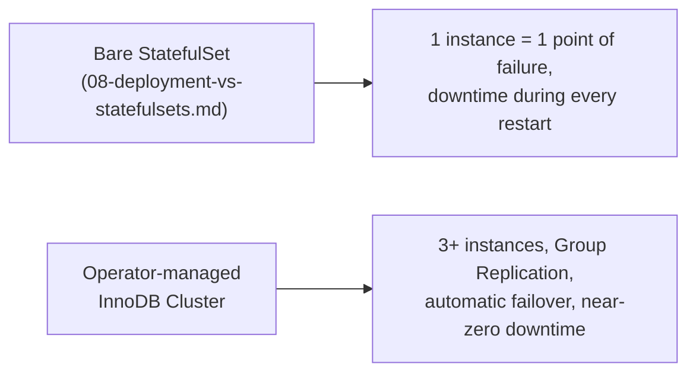
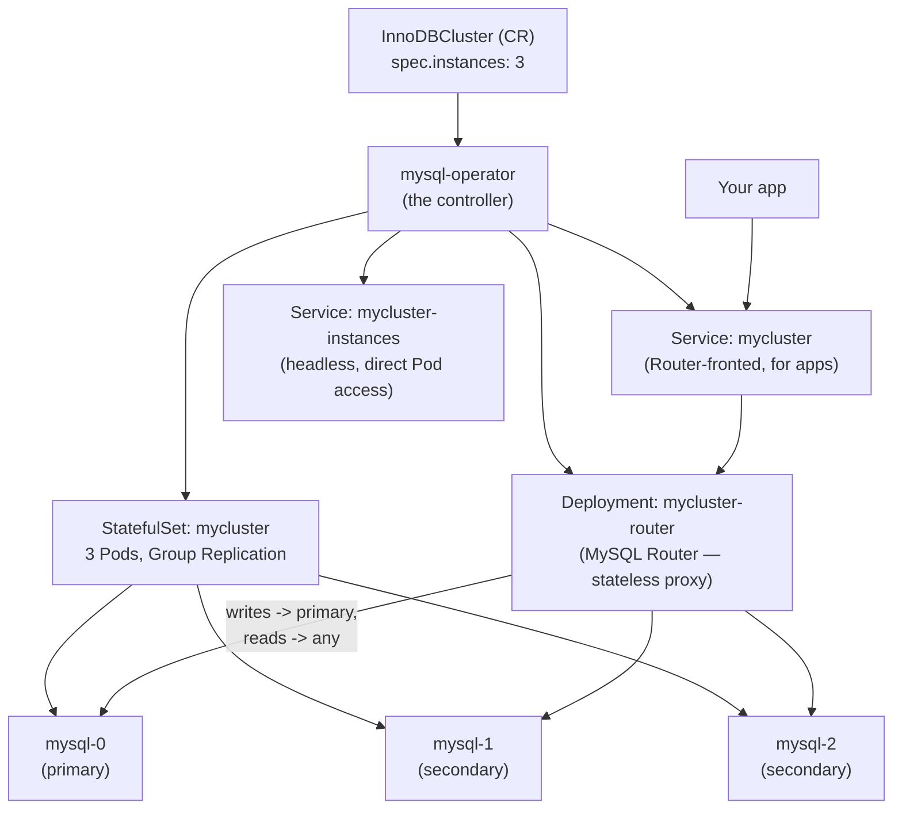
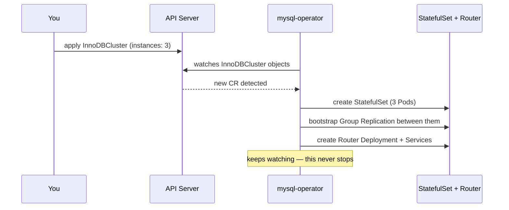
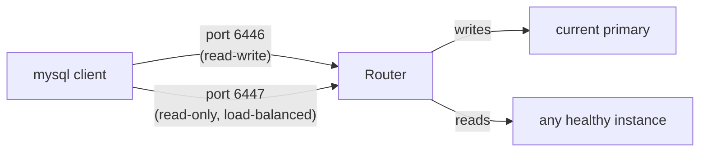
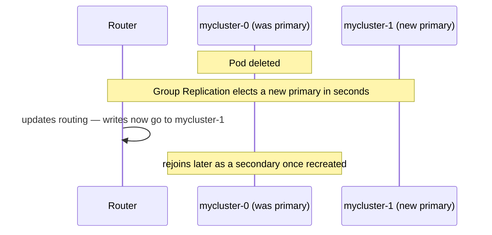
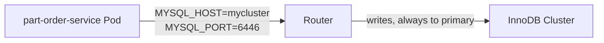
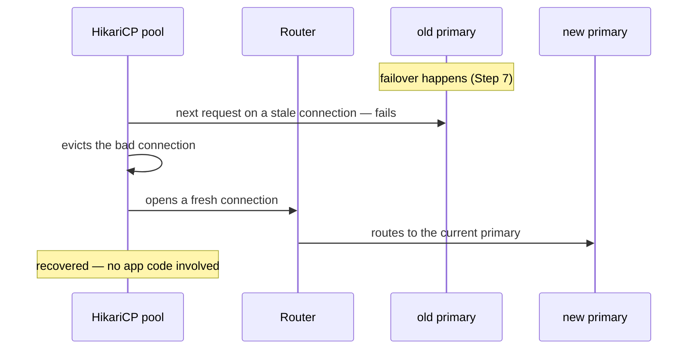

# Worked Example: a MySQL Cluster via the Official MySQL Operator

[04-crds.md](04-crds.md) ended by asking "should you write your own
Operator?" — the answer is almost always no, an existing one already
solves your domain. This is that in practice: standing up a real,
self-healing MySQL cluster using Oracle's official **MySQL Operator**
(`github.com/mysql/mysql-operator`), installed via its official Helm
chart.

---

## Why not just the StatefulSet from `08-deployment-vs-statefulsets.md`?

That doc gave MySQL a stable name and a stable disk — real progress over
a Deployment, but it was still **one instance**. Kill that Pod and the
StatefulSet recreates it — from the *same* disk, so data survives, but
there's a real gap between "Pod died" and "new Pod ready," during which
MySQL is fully down. No failover, because there's nothing to fail over
*to*.



A real MySQL Operator gives you MySQL's own built-in HA technology
(**Group Replication** / **InnoDB Cluster**) driven declaratively — multiple
instances that replicate to each other, automatic primary election, and a
router that always sends writes to whichever instance is currently
primary.

---

## Architecture



Exactly the pattern from `04-crds.md`: you declare `instances: 3` on a
CR, the Operator's reconciliation loop is what turns that into an actual
StatefulSet, a Router Deployment, and the Services in front of both.

---

## Step 1: Install the Operator via its official Helm chart

```bash
helm repo add mysql-operator https://mysql.github.io/mysql-operator/
helm repo update

# the CRDs (InnoDBCluster, MySQLBackup, BackupSchedule, ...) ship separately
kubectl apply -f https://raw.githubusercontent.com/mysql/mysql-operator/trunk/deploy/deploy-crds.yaml

helm install mysql-operator mysql-operator/mysql-operator \
  --namespace mysql-operator --create-namespace

kubectl get pods -n mysql-operator
# mysql-operator-xxxx   1/1   Running
```

```bash
kubectl get crd | grep mysql.oracle.com
# innodbclusters.mysql.oracle.com
# mysqlbackups.mysql.oracle.com
# backupschedules.mysql.oracle.com
```

That last one is worth pausing on: `MySQLBackup` is a **real** CRD in this
Operator — the same kind name used as an illustrative, made-up example in
`04-crds.md`. Here it's the genuine article.

---

## Step 2: Root credentials, as a Secret

The Operator never wants a plaintext password in the CR itself — it reads
one from a Secret you create first, same principle as
[configmap-and-secrets.md](../kubernetes-intro/07-configmap-and-secrets.md).

```bash
kubectl create namespace demo
kubectl apply -f - <<'EOF'
apiVersion: v1
kind: Secret
metadata:
  name: mycluster-creds
  namespace: demo
stringData:
  rootUser: root
  rootHost: "%"
  rootPassword: "ChangeMe123!"
EOF
```

---

## Step 3: Declare the cluster

```yaml
# innodbcluster.yaml
apiVersion: mysql.oracle.com/v2
kind: InnoDBCluster
metadata:
  name: mycluster
  namespace: demo
spec:
  secretName: mycluster-creds
  tlsUseSelfSigned: true
  instances: 3
  router:
    instances: 1
```

```bash
kubectl apply -f innodbcluster.yaml
kubectl get innodbcluster mycluster -n demo -w
```

```text
NAME        STATUS    ONLINE   INSTANCES   ROUTERS
mycluster   PENDING   0        3           1
mycluster   INITIALIZING   1   3           1
mycluster   ONLINE    3        3           1
```



---

## Step 4: See what the Operator actually built

```bash
kubectl get statefulset,pods,svc,deploy -n demo
```

```text
NAME                        READY
statefulset/mycluster       3/3

NAME               READY
pod/mycluster-0    2/2      # mysql + a sidecar the Operator injects for management
pod/mycluster-1    2/2
pod/mycluster-2    2/2

NAME                          TYPE
service/mycluster             ClusterIP    # Router-fronted, this is what apps use
service/mycluster-instances   ClusterIP    # headless, direct per-Pod access

NAME                                READY
deployment.apps/mycluster-router    1/1
```

None of this was written by hand — it's the direct output of the
reconciliation loop from Step 3, the same "CRD + controller = real
infrastructure" idea from `04-crds.md`.

---

## Step 5: Connect through the Router

```bash
kubectl run mysql-client --image=mysql:8 -n demo -it --rm --restart=Never -- \
  mysql -h mycluster -uroot -p"ChangeMe123!" \
  -e "SELECT @@hostname; CREATE DATABASE demo; SHOW DATABASES;"
```



You never target `mycluster-0` directly — the Router is the one thing
that knows *which* instance is currently primary, and that answer changes
after a failover. Point your app at the Router, always.

---

## Step 6: Scale — the reconciliation loop, live

```bash
kubectl patch innodbcluster mycluster -n demo --type=merge \
  -p '{"spec":{"instances":5}}'

kubectl get pods -n demo -w
# mycluster-3, mycluster-4 appear, join Group Replication automatically
```

One field changed; the Operator handled provisioning the new Pods *and*
enrolling them into the replication group — the StatefulSet-only approach
from `08-deployment-vs-statefulsets.md` gets you more Pods with `kubectl
scale`, but never wires up replication between them, because plain
Kubernetes has no idea what "MySQL replication" even means.

---

## Step 7: Kill the primary, watch failover happen

```bash
kubectl delete pod mycluster-0 -n demo

kubectl get innodbcluster mycluster -n demo -w
kubectl run mysql-client --image=mysql:8 -n demo -it --rm --restart=Never -- \
  mysql -h mycluster -uroot -p"ChangeMe123!" -e "SELECT @@hostname;"
# a DIFFERENT hostname than before — a new primary was elected automatically
```



This is the actual payoff over a bare StatefulSet: no human ran a failover
command, and the Router never sent a write into a void — it's simply the
Operator (and MySQL's own Group Replication underneath it) doing the job
`08-deployment-vs-statefulsets.md` explicitly called out as missing.

---

## Step 8: Wiring up a Spring Boot app (e.g. `part-order-app-java`)

This is the same `prod` Spring profile from `part-order-app-java`'s
[application-prod.yml](../../applications-and-source-code/part-order-app-java/part-order-service/src/main/resources/application-prod.yml)
— it already expects `MYSQL_HOST`/`MYSQL_PORT`/`MYSQL_DATABASE`/
`MYSQL_USER`/`MYSQL_PASSWORD` env vars and the `mysql-connector-j` driver.
Nothing about the app changes — only what those env vars now point at.

### 8a. Create a scoped database + user for the app

The Operator only manages the `root` account; it doesn't know your app
needs its own database. Same principle as
[k8s-with-mysql/NOTES.md](../../applications-and-source-code/part-order-app-java/k8s-with-mysql/NOTES.md)'s
two-databases-two-users setup — never point an app at `root`.

```bash
kubectl run mysql-client --image=mysql:8 -n demo -it --rm --restart=Never -- \
  mysql -h mycluster -uroot -p"ChangeMe123!" -e "
    CREATE DATABASE part_order_db;
    CREATE USER 'order_app'@'%' IDENTIFIED BY 'app-password-here';
    GRANT ALL PRIVILEGES ON part_order_db.* TO 'order_app'@'%';
    FLUSH PRIVILEGES;"
```

### 8b. Point the app's env vars at the Router — not at a Pod

```yaml
# configmap.yaml
apiVersion: v1
kind: ConfigMap
metadata:
  name: part-order-config
  namespace: demo
data:
  SPRING_PROFILES_ACTIVE: "prod"
  MYSQL_HOST: "mycluster"     # the Router Service, from Step 3 — NOT mycluster-0
  MYSQL_PORT: "6446"          # Router's read-write port
  MYSQL_DATABASE: "part_order_db"
  MYSQL_USER: "order_app"
---
apiVersion: v1
kind: Secret
metadata:
  name: part-order-db-secret
  namespace: demo
stringData:
  MYSQL_PASSWORD: "app-password-here"
```

```yaml
# deployment.yaml (relevant excerpt)
spec:
  template:
    spec:
      containers:
        - name: part-order-service
          image: ram1uj/part-order-service:latest
          envFrom:
            - configMapRef: { name: part-order-config }
            - secretRef: { name: part-order-db-secret }
```



`application-prod.yml`'s JDBC URL —
`jdbc:mysql://${MYSQL_HOST}:${MYSQL_PORT}/${MYSQL_DATABASE}?useSSL=false&allowPublicKeyRetrieval=true`
— resolves to `jdbc:mysql://mycluster:6446/part_order_db`. Same URL shape
as the single-instance `k8s-with-mysql` setup; only the host now happens
to be a Router instead of a MySQL Pod directly.

### 8c. The one thing that needs tuning: HikariCP surviving a failover

Spring Boot's default connection pool (HikariCP) holds connections open
for reuse — but a connection opened *before* a failover was routed to the
old primary, and stays broken until Hikari notices and replaces it. Left
at defaults, requests can fail for longer than the failover itself takes.

```yaml
# application-prod.yml — additions
spring:
  datasource:
    hikari:
      connection-test-query: SELECT 1
      max-lifetime: 60000        # recycle connections every 60s, well under any
                                  # reasonable failover window
      validation-timeout: 3000
```



This is the exact same "retry until the new reality settles" idea as
Kubernetes's own reconciliation loops elsewhere in this repo — just
happening inside the JDBC pool instead of a controller.

### 8d. Optional: split reads to port 6447

For read-heavy endpoints, a second `DataSource` pointed at the Router's
read-only port (`6447`) spreads `SELECT`-only traffic across every
healthy instance instead of funneling everything through the primary —
worth adding once read load is actually a bottleneck, not before.

```yaml
MYSQL_RO_HOST: "mycluster"
MYSQL_RO_PORT: "6447"
```

Wire it as a second `@Bean DataSource` and route `@Transactional(readOnly
= true)` calls to it — skip this until you actually need it; the
single-DataSource setup in 8b is correct and sufficient for most services.

### 8e. Verify

```bash
kubectl apply -f configmap.yaml
kubectl apply -f deployment.yaml
kubectl rollout status deployment/part-order-service -n demo

kubectl exec -n demo deploy/part-order-service -- \
  curl -s localhost:8080/actuator/health | jq .components.db
# { "status": "UP" }
```

---

## Step 9: Backups, using the CRD `04-crds.md` only described

```yaml
apiVersion: mysql.oracle.com/v2
kind: BackupSchedule
metadata:
  name: nightly-backup
  namespace: demo
spec:
  clusterName: mycluster
  schedule: "0 2 * * *"
  backupProfile:
    dumpInstance:
      storage:
        s3:
          bucketName: my-backups-bucket
          prefix: mycluster/
```

```bash
kubectl apply -f backup-schedule.yaml
kubectl get backupschedule -n demo
kubectl get mysqlbackup -n demo    # one appears each time the schedule fires
```

Same shape as the fictional `MySQLBackup` example in `04-crds.md`, except
this one is real: applying it causes the Operator to actually run
`mysqlsh`'s dump tooling against the cluster and ship the result to
object storage, on the cron schedule you declared.

---

## Cleanup

```bash
kubectl delete innodbcluster mycluster -n demo
kubectl delete backupschedule nightly-backup -n demo
kubectl delete secret mycluster-creds -n demo
kubectl delete namespace demo
helm uninstall mysql-operator -n mysql-operator
kubectl delete -f https://raw.githubusercontent.com/mysql/mysql-operator/trunk/deploy/deploy-crds.yaml
```

---

## Bare StatefulSet vs. Operator-managed cluster

| | Bare StatefulSet (`08-deployment-vs-statefulsets.md`) | Operator-managed InnoDB Cluster |
| --- | --- | --- |
| Replication between instances | none — each Pod is an independent MySQL | Group Replication, wired up automatically |
| Failover | none — downtime until the same Pod restarts | automatic primary election, seconds of impact |
| Scaling | more Pods, **not** replicated members | more Pods, **enrolled** into the replication group |
| Routing writes to the primary | your app has to know which Pod that is | `Router` Service — always correct, even after failover |
| Backups | you write your own CronJob | `BackupSchedule` CRD, built in |
| What you declare | replica count, storage size | replica count, storage size — the *rest* is the Operator's job |

---

## Takeaway

The Operator didn't replace anything from `08-deployment-vs-statefulsets.md`
— a StatefulSet is still what's running underneath. What it added is
everything Kubernetes has no native concept of: replication topology,
primary election, failover-aware routing, and scheduled backups — encoded
once as a controller instead of re-learned by every team that needs a
MySQL cluster. This is the concrete version of the abstract Operator
pattern from `04-crds.md`, and the same shape you'd find installing any
other production database Operator.
