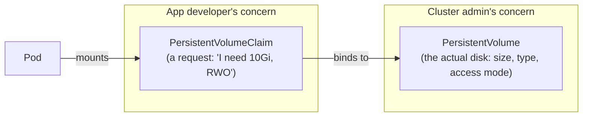
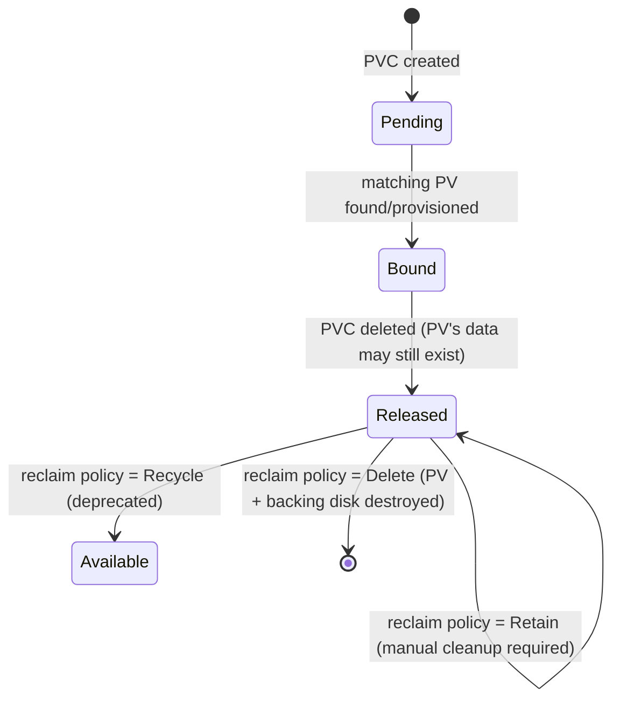
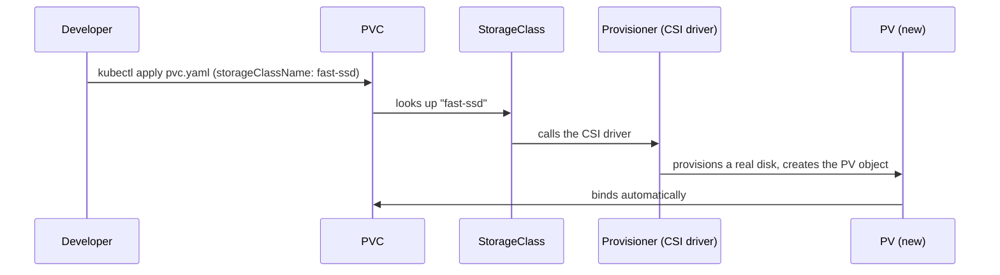
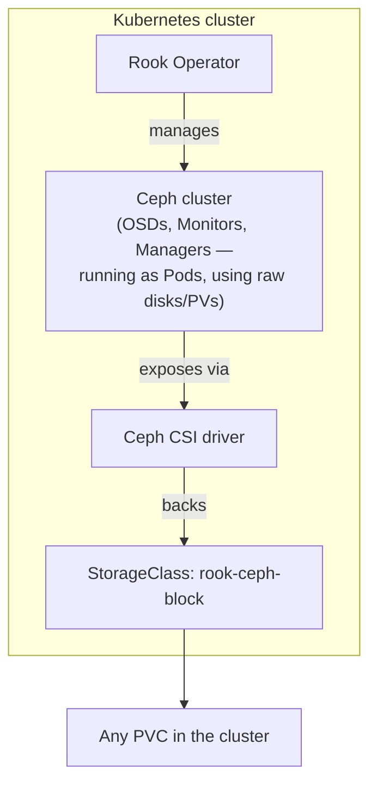

# Persistent Storage in Kubernetes

Builds on the `volumeClaimTemplates` example in
[08-deployment-vs-statefulsets.md](../kubernetes-intro/08-deployment-vs-statefulsets.md)
— that note shows PVCs *working*; this one covers what a PV/PVC actually
is, how one gets created without an admin hand-provisioning it, and what
actually backs the disk once you leave a laptop.

---

## PV and PVC: two sides of the same contract



- a **PersistentVolume (PV)** is a cluster-scoped object representing a
  real piece of storage — an AWS EBS volume, a Ceph RBD image, an NFS
  export. It exists independently of any Pod and has its own lifecycle.
- a **PersistentVolumeClaim (PVC)** is namespace-scoped and is what a Pod
  actually references in `volumes:` — it's a *request* ("10Gi, RWO"), not
  the disk itself. This split is deliberate: developers write PVCs
  without needing to know or care what storage backend is underneath.
- a Pod never mounts a PV directly — always PVC → PV → Pod.

### PVC lifecycle



- **access modes** — what a PV can be mounted as, not a performance
  setting:

  | Mode | Meaning |
  | --- | --- |
  | `ReadWriteOnce` (RWO) | one Node can mount read-write (most block storage: EBS, GCP PD, Ceph RBD) |
  | `ReadOnlyMany` (ROX) | many Nodes, read-only |
  | `ReadWriteMany` (RWX) | many Nodes, read-write (needs a filesystem-based backend: NFS, CephFS, EFS, Azure Files) |
  | `ReadWriteOncePod` (RWOP) | like RWO but enforced to a single *Pod*, not just single Node |

- **reclaim policy** — what happens to the underlying disk when its PVC
  is deleted:
  - `Delete` — backing disk is destroyed too (the default for
    dynamically-provisioned volumes) — convenient, but a rogue
    `kubectl delete pvc` on a database volume with `Delete` set is
    unrecoverable
  - `Retain` — PV and backing disk survive, but sit in `Released` state
    until an admin manually reclaims or deletes them — the safer default
    for anything you can't regenerate

```bash
kubectl get pv
kubectl get pvc
kubectl describe pvc data-mysql-0   # shows Bound/Pending status, which PV it's bound to, capacity
```

---

## Static vs. dynamic provisioning

### Static: an admin pre-creates the PV

```yaml
apiVersion: v1
kind: PersistentVolume
metadata:
  name: pv-manual-10gi
spec:
  capacity:
    storage: 10Gi
  accessModes: ["ReadWriteOnce"]
  persistentVolumeReclaimPolicy: Retain
  nfs:
    server: 10.0.0.5
    path: /exports/data
```

A PVC with matching size/access mode binds to it automatically — but
someone had to create that exact PV by hand first. This is fine for a
handful of NFS exports; it doesn't scale to "every StatefulSet replica
gets its own disk."

### Dynamic: a StorageClass creates the PV on demand



```yaml
apiVersion: v1
kind: PersistentVolumeClaim
metadata:
  name: data
spec:
  storageClassName: fast-ssd
  accessModes: ["ReadWriteOnce"]
  resources:
    requests:
      storage: 10Gi
```

No PV was written by hand anywhere — the `StorageClass` (below) knows how
to make one. This is what `volumeClaimTemplates` in a StatefulSet relies
on: every replica's PVC triggers this same flow independently.

---

## StorageClass: the "how to provision" template

```yaml
apiVersion: storage.k8s.io/v1
kind: StorageClass
metadata:
  name: fast-ssd
provisioner: ebs.csi.aws.com     # which CSI driver handles this class
parameters:
  type: gp3
  fsType: ext4
reclaimPolicy: Delete            # default if omitted
allowVolumeExpansion: true       # lets you grow the PVC later without recreating it
volumeBindingMode: WaitForFirstConsumer
```

- **`provisioner`** — the CSI driver that actually talks to the storage
  backend; this is the one field that changes per cloud/on-prem system
  (see tables below)
- **`volumeBindingMode`**:
  - `Immediate` — PV provisioned as soon as the PVC is created, before any
    Pod exists — risky with zone-bound storage (EBS/PD are AZ-local): the
    disk might land in a zone the Pod can never be scheduled into
  - `WaitForFirstConsumer` — provisioning waits until a Pod actually
    references the PVC, so the disk is created in whatever zone the
    scheduler picked for that Pod — the safer default for cloud block
    storage
- **`allowVolumeExpansion`** — lets you `kubectl edit pvc` to a bigger
  `storage:` request later; without it, resizing means migrate-and-delete
- one `StorageClass` is marked default cluster-wide
  (`storageclass.kubernetes.io/is-default-class: "true"` annotation) — a
  PVC with no `storageClassName` uses that one automatically

```bash
kubectl get storageclass
kubectl describe storageclass fast-ssd
```

---

## What actually happens for a StatefulSet

Recap from [08-deployment-vs-statefulsets.md](../kubernetes-intro/08-deployment-vs-statefulsets.md):
`volumeClaimTemplates` stamps out one PVC per replica (`data-mysql-0`,
`data-mysql-1`, ...). Layered on top of everything above:

- each of those PVCs independently triggers the **dynamic provisioning**
  flow against whatever `storageClassName` the template specifies — three
  replicas means three separate calls to the CSI driver, three separate
  disks
- **scaling up** (`replicas: 3` → `5`) — new PVCs (`data-mysql-3`,
  `data-mysql-4`) are created and provisioned the same way, automatically
- **scaling down** (`replicas: 5` → `3`) — the StatefulSet deletes Pods
  `mysql-4` and `mysql-3`, but **leaves their PVCs behind** by default —
  scaling back up reattaches the *same* disks with their old data, rather
  than starting empty
- `persistentVolumeClaimRetentionPolicy` (stable since 1.27) makes that
  scale-down behavior explicit instead of implicit:

```yaml
spec:
  persistentVolumeClaimRetentionPolicy:
    whenDeleted: Retain    # PVCs on StatefulSet delete: Retain (default) | Delete
    whenScaled: Retain     # PVCs on scale-down: Retain (default) | Delete
```

Setting `whenScaled: Delete` means shrinking replica count actually frees
the storage instead of leaving orphaned PVCs around — worth it for
disposable cache-style StatefulSets, wrong for anything holding data you
can't regenerate.

---

## Distributed storage on-prem: Rook/Ceph

Referenced in
[01-cluster-management.md](01-cluster-management.md#the-two-things-cloud-gave-you-for-free--and-now-dont)
as the answer to "no cloud disk API on-prem." Ceph is the actual storage
system; **Rook** is the Kubernetes Operator that runs and manages a Ceph
cluster *inside* Kubernetes, exposing it back to Kubernetes as a
StorageClass.



One Ceph cluster gives you three storage types from the same underlying
system — pick the `StorageClass`/provisioner per workload's access-mode
need:

| Ceph interface | Kubernetes StorageClass | Access mode | Good fit |
| --- | --- | --- | --- |
| RBD (block) | `rook-ceph-block` | RWO | databases, anything StatefulSet-shaped |
| CephFS (filesystem) | `rook-cephfs` | RWX | shared config/logs across many Pods |
| RGW (object, S3-compatible) | not a PV/PVC at all — apps talk to it directly over S3 API | n/a | backups (Velero target), object storage workloads |

```yaml
apiVersion: storage.k8s.io/v1
kind: StorageClass
metadata:
  name: rook-ceph-block
provisioner: rook-ceph.rbd.csi.ceph.com
parameters:
  clusterID: rook-ceph
  pool: replicapool
  imageFormat: "2"
  imageFeatures: layering
reclaimPolicy: Delete
allowVolumeExpansion: true
```

```bash
kubectl get cephcluster -n rook-ceph          # Rook's own CRD, health of the Ceph cluster itself
kubectl get storageclass rook-ceph-block
kubectl -n rook-ceph get pods                 # OSD/Monitor/Manager Pods, one Ceph "node" each
```

This is the on-prem equivalent of what EBS/PD/Azure Disk give you for
free on cloud — real distributed, replicated block storage, just run
by you instead of a cloud provider.

---

## Cloud-native storage: same PVC, different `provisioner`

The entire point of the PV/PVC abstraction: **the YAML a developer
writes never changes** across clouds — only the `StorageClass`'s
`provisioner` field does. All three follow the CSI (Container Storage
Interface) standard, which replaced the older in-tree cloud volume
plugins (removed as of Kubernetes 1.27).

| Cloud | CSI driver (`provisioner`) | Typical `parameters.type` | RWX option |
| --- | --- | --- | --- |
| AWS | `ebs.csi.aws.com` | `gp3`, `io2` | EFS (`efs.csi.aws.com`) |
| Azure | `disk.csi.azure.com` | `Premium_LRS`, `StandardSSD_LRS` | Azure Files (`file.csi.azure.com`) |
| GCP | `pd.csi.storage.gke.io` | `pd-ssd`, `pd-balanced` | Filestore (`filestore.csi.storage.gke.io`) |

```yaml
# AWS
apiVersion: storage.k8s.io/v1
kind: StorageClass
metadata: { name: ebs-gp3 }
provisioner: ebs.csi.aws.com
parameters: { type: gp3 }
volumeBindingMode: WaitForFirstConsumer
---
# Azure
apiVersion: storage.k8s.io/v1
kind: StorageClass
metadata: { name: azure-premium }
provisioner: disk.csi.azure.com
parameters: { skuName: Premium_LRS }
volumeBindingMode: WaitForFirstConsumer
---
# GCP
apiVersion: storage.k8s.io/v1
kind: StorageClass
metadata: { name: gcp-ssd }
provisioner: pd.csi.storage.gke.io
parameters: { type: pd-ssd }
volumeBindingMode: WaitForFirstConsumer
```

- managed cloud Kubernetes (EKS/AKS/GKE) ships the matching CSI driver
  and a default `StorageClass` out of the box — this is the "storage"
  box in the
  [kubernetes-on-cloud.md](../kubernetes-intermediate/07-kubernetes-on-cloud.md)
  "what the provider gives you for free" comparison
- all three block-storage drivers are **zone-local and RWO only** — a
  Pod can't mount an `ebs.csi.aws.com` volume from a different AZ than
  the disk lives in, which is exactly what `volumeBindingMode:
  WaitForFirstConsumer` protects against
- reach for the RWX column (EFS/Azure Files/Filestore) only when
  multiple Pods genuinely need to write the *same* files concurrently —
  it's slower and pricier than block storage, not a default choice

---

## Cheat sheet

```bash
# inspect
kubectl get pv
kubectl get pvc -A
kubectl get storageclass
kubectl describe pvc <name>

# static PV + StorageClass + PVC live in normal YAML manifests, apply as usual
kubectl apply -f pv.yaml
kubectl apply -f storageclass.yaml
kubectl apply -f pvc.yaml

# resize (only if allowVolumeExpansion: true on the StorageClass)
kubectl patch pvc data-mysql-0 -p '{"spec":{"resources":{"requests":{"storage":"20Gi"}}}}'

# Rook/Ceph cluster health
kubectl -n rook-ceph get cephcluster
kubectl -n rook-ceph get pods
```

---

## Takeaway

A PVC is a request, a PV is the disk, and a StorageClass is the recipe
that turns one into the other on demand — that indirection is what lets
the exact same StatefulSet YAML run unmodified on a laptop (no dynamic
provisioner, PVC stays `Pending`), on-prem (Rook/Ceph provisioner), or
any of the three big clouds (their respective CSI driver) with only the
`provisioner` field changing. Access modes and reclaim policy are the
two settings that actually matter operationally: RWO vs. RWX decides
whether your backend can even be block storage, and `Retain` vs.
`Delete` decides whether a deleted PVC is a shrug or an incident.
