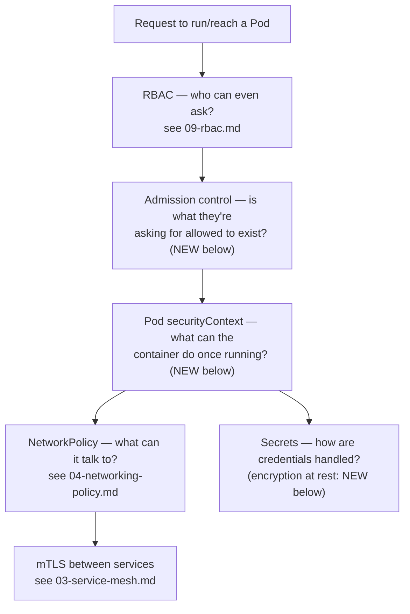
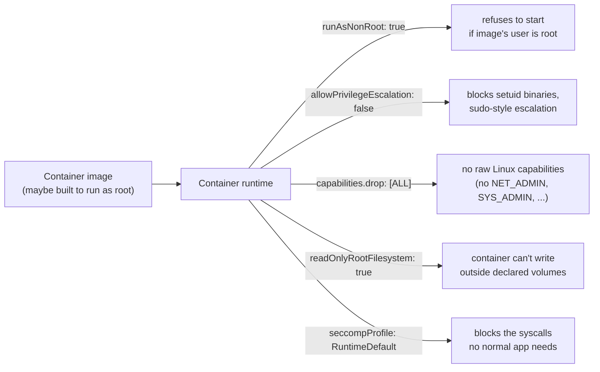
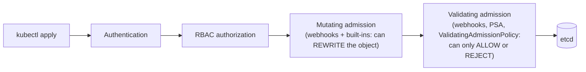
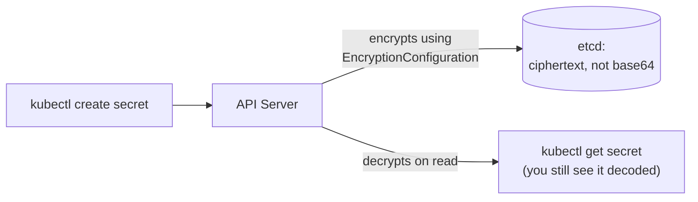
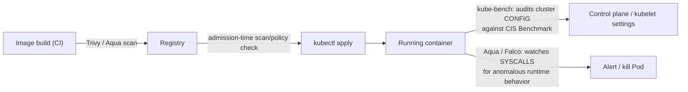

# Security Best Practices

Several pieces of this are already their own deep-dive notes — this one
doesn't re-explain them, it shows where they fit in a full defense-in-depth
picture and covers what they *don't*: Pod-level hardening, admission
control, ServiceAccount hygiene, encryption at rest, and scanning/runtime
tooling.



---

## RBAC — one line, then go read the dedicated note

Least-privilege access to the API server itself is covered in full in
[09-rbac.md](../kubernetes-intermediate/09-rbac.md) — `Role`/`ClusterRole`
paired with `RoleBinding`/`ClusterRoleBinding`, the built-in
`view`/`edit`/`admin`/`cluster-admin` roles, `kubectl auth can-i`, and how
GKE/EKS map cloud identities onto it. Nothing in this note repeats that;
everything below assumes RBAC is already scoped down and asks "now that
someone's allowed to create a Pod, what else needs constraining?"

---

## Pod-level hardening: `securityContext`

RBAC controls the API server request that *creates* a Pod. It says
nothing about what that Pod can do once its container is actually
running — that's `securityContext`, settable at the Pod level (applies to
all containers) or per-container (overrides the Pod-level setting).



```yaml
apiVersion: v1
kind: Pod
metadata:
  name: hardened-pod
spec:
  securityContext:               # Pod-level: applies to every container
    runAsNonRoot: true
    runAsUser: 1000
    fsGroup: 1000
    seccompProfile:
      type: RuntimeDefault
  containers:
    - name: app
      image: myapp:latest
      securityContext:           # container-level: can tighten further
        allowPrivilegeEscalation: false
        readOnlyRootFilesystem: true
        capabilities:
          drop: ["ALL"]
      volumeMounts:
        - name: tmp
          mountPath: /tmp        # writable scratch space, since root fs is read-only
  volumes:
    - name: tmp
      emptyDir: {}
```

- **`runAsNonRoot: true`** is a *check*, not an enforcement of a specific
  user — it fails the Pod at startup if the image's own `USER` is root,
  it doesn't rewrite the image to run as someone else. Pair it with
  `runAsUser` to pin the actual UID.
- **`readOnlyRootFilesystem: true`** breaks any app that writes to its own
  filesystem (logs, temp files, caches) unless you mount an `emptyDir`
  for exactly those paths, as above — this is usually the setting that
  surfaces a poorly-behaved image.
- **`capabilities.drop: ["ALL"]`**, then add back only what's actually
  needed (`add: ["NET_BIND_SERVICE"]` for a process binding to port 80/443
  as non-root) — start from nothing, not from "drop the scary-sounding
  ones."

```bash
kubectl apply -f hardened-pod.yaml
kubectl exec hardened-pod -- id                # confirm non-root uid
kubectl exec hardened-pod -- touch /etc/test    # confirm read-only rootfs blocks this
```

---

## Pod Security Admission — cluster-wide enforcement of the above

Hand-writing `securityContext` correctly on every Pod doesn't scale, and
`PodSecurityPolicy` (the old cluster-wide enforcement mechanism) was
**removed in Kubernetes 1.25**. Its replacement, **Pod Security
Admission**, is built into the API server — no separate component to
install — and enforces one of three fixed standards via a **Namespace
label**:

| Standard | What it allows |
| --- | --- |
| `privileged` | unrestricted — system/infra namespaces only |
| `baseline` | blocks known privilege escalations (host namespaces, privileged containers) but doesn't require non-root |
| `restricted` | the hardened profile — requires everything in the `securityContext` section above (non-root, no privilege escalation, all capabilities dropped, seccomp) |

```yaml
apiVersion: v1
kind: Namespace
metadata:
  name: production
  labels:
    pod-security.kubernetes.io/enforce: restricted
    pod-security.kubernetes.io/audit: restricted     # logs violations without blocking
    pod-security.kubernetes.io/warn: restricted       # kubectl apply prints a warning
```

```bash
kubectl label namespace production pod-security.kubernetes.io/enforce=restricted
kubectl apply -f a-privileged-pod.yaml -n production
# Error: pods "x" is forbidden: violates PodSecurity "restricted:latest"
```

- **`enforce` blocks, `audit`/`warn` don't** — a common rollout pattern is
  `warn`+`audit` first to see what would break, then flip to `enforce`
  once existing workloads are clean
- the three standards are **fixed** — if you need a custom rule PSA can't
  express ("images must come from our internal registry," "no `:latest`
  tags"), that's a policy engine, not PSA

---

## Admission control, more generally

Pod Security Admission is one built-in admission plugin among several —
this is the "Admission control" box from the RBAC request-lifecycle
diagram in [09-rbac.md](../kubernetes-intermediate/09-rbac.md#where-rbac-sits-in-a-requests-lifecycle),
expanded:



| Mechanism | How custom rules are written | Notes |
| --- | --- | --- |
| Pod Security Admission | not customizable — 3 fixed levels | zero extra components, covers the common Pod-hardening case |
| **OPA Gatekeeper** | Rego policies, packaged as `ConstraintTemplate`/`Constraint` CRDs | mature, most widely deployed general-purpose policy engine |
| **Kyverno** | plain YAML, no new language to learn | lower barrier to entry than Rego for k8s-native rules |
| `ValidatingAdmissionPolicy` (built-in, stable 1.30+) | CEL expressions, no webhook to run/scale/keep available | in-process — avoids a webhook being a new availability dependency for every `kubectl apply` |

```yaml
# Kyverno example: block anything without an explicit resource limit
apiVersion: kyverno.io/v1
kind: ClusterPolicy
metadata:
  name: require-resource-limits
spec:
  validationFailureAction: Enforce
  rules:
    - name: check-limits
      match:
        resources:
          kinds: ["Pod"]
      validate:
        message: "every container must set resources.limits"
        pattern:
          spec:
            containers:
              - resources:
                  limits:
                    memory: "?*"
                    cpu: "?*"
```

Reach for a full policy engine (Gatekeeper/Kyverno) once "restricted" PSA
isn't expressive enough for a real rule your org needs — registry
allow-lists, mandatory labels, banning `:latest` — rather than as a
day-one default; PSA alone covers most of what "Pod security best
practice" means in practice.

---

## ServiceAccounts: the identity a Pod itself uses

RBAC subjects include `ServiceAccount` — [09-rbac.md](../kubernetes-intermediate/09-rbac.md#worked-example-scoping-a-dev-user-to-one-namespace)
walks through binding one to a `Role`. The hardening concerns specific to
ServiceAccounts, on top of that:

- **every Pod gets the namespace's `default` ServiceAccount automatically**
  if you don't specify one, and its token is auto-mounted into the
  container even if that Pod never calls the Kubernetes API — an
  unnecessary credential sitting in every Pod's filesystem
- turn that off unless a Pod genuinely talks to the API server:

```yaml
apiVersion: v1
kind: ServiceAccount
metadata:
  name: default
  namespace: production
automountServiceAccountToken: false   # per-ServiceAccount default
```

```yaml
# or per-Pod, overriding the ServiceAccount's default
spec:
  serviceAccountName: web-app
  automountServiceAccountToken: false
```

- **one dedicated ServiceAccount per workload**, not everything sharing
  `default` — makes the [09-rbac.md](../kubernetes-intermediate/09-rbac.md)
  `Role`/`RoleBinding` actually mean something (`web-app` can read
  Secrets, `batch-job` can list Pods, neither can do the other's job)
  instead of one broad grant everything happens to use
- on managed cloud, a Kubernetes ServiceAccount can also assume a **cloud**
  identity to call *other* cloud APIs (S3, Pub/Sub) — GKE Workload
  Identity and EKS IAM Roles for Service Accounts (IRSA) are the
  mechanism, covered in
  [09-rbac.md](../kubernetes-intermediate/09-rbac.md#how-this-maps-onto-gke)'s
  GKE/EKS sections — a separate concern from in-cluster RBAC, but the
  same "narrow, dedicated identity per workload" principle applies

```bash
kubectl get sa -n production
kubectl get pod web-app-xyz -o jsonpath='{.spec.serviceAccountName}'
```

---

## Secrets: encryption at rest

[07-configmap-and-secrets.md](../kubernetes-intro/07-configmap-and-secrets.md#where-they-actually-live-etcd)
already covers the core fact: a `Secret` is base64 (not encrypted) in
etcd by default, and flags "encryption at rest" as the fix without
covering it. Here's that part.



```yaml
# /etc/kubernetes/enc/encryption-config.yaml — passed to kube-apiserver via
# --encryption-provider-config
apiVersion: apiserver.config.k8s.io/v1
kind: EncryptionConfiguration
resources:
  - resources: ["secrets"]
    providers:
      - kms:
          name: myKmsPlugin
          endpoint: unix:///var/run/kms-plugin.sock
      - identity: {}          # fallback: unencrypted — keep last, never first
```

- a **KMS provider** is the production choice — the encryption key itself
  lives in a cloud KMS, never on cluster disk:

| Cloud | KMS integration |
| --- | --- |
| AWS | AWS KMS via the `aws-encryption-provider` |
| Azure | Azure Key Vault via the AKS-managed KMS plugin |
| GCP | Cloud KMS, enabled with one flag on a GKE cluster (`--database-encryption-key`) |

- managed clusters (EKS/AKS/GKE) all expose this as a **cluster-creation
  flag**, not a manual `EncryptionConfiguration` file — reach for the
  managed toggle before hand-rolling this on a self-managed control
  plane covered in [01-cluster-management.md](01-cluster-management.md)
- encryption at rest protects a **stolen etcd disk/snapshot** — it does
  nothing against "an identity with RBAC access to `get secret`," which
  is what RBAC and the ServiceAccount hygiene above are for; the two are
  complementary, not substitutes

### Pulling from an external secret store instead of storing Secrets natively

Two established patterns for not putting the real credential in
Kubernetes `Secret` objects at all:

- **External Secrets Operator** — syncs a cloud secret manager (AWS
  Secrets Manager, GCP Secret Manager, Azure Key Vault, Vault) *into* a
  regular Kubernetes `Secret` on a schedule, so apps still just read a
  normal `Secret` but the source of truth lives outside etcd
- **Vault Agent sidecar** — already covered in
  [05-sidecars.md](../kubernetes-intermediate/05-sidecars.md#use-case-3-vault-agent-secrets-injection):
  injects secrets as files into the Pod directly, bypassing the
  Kubernetes `Secret` object entirely

```yaml
apiVersion: external-secrets.io/v1beta1
kind: ExternalSecret
metadata:
  name: db-credentials
spec:
  secretStoreRef:
    name: aws-secrets-manager
    kind: ClusterSecretStore
  target:
    name: db-credentials         # the k8s Secret this creates/updates
  data:
    - secretKey: password
      remoteRef:
        key: prod/db/password
```

---

## Network policy and mTLS — recap and link

Pod-to-pod traffic restriction is covered in full in
[04-networking-policy.md](../kubernetes-intermediate/04-networking-policy.md)
(default-deny, label-based rules, namespace scoping, egress) — that's the
firewall layer. Encrypting what those allowed connections actually carry
is covered in [03-service-mesh.md](03-service-mesh.md#use-case-1-encrypt-traffic-between-the-two-services)
(mTLS via a service mesh sidecar). Together they answer "who can connect"
and "is the connection itself readable if intercepted" — both already
have dedicated notes, so nothing more on either here.

---

## Integrating security tools: scanning and runtime enforcement

Everything above governs the cluster's own config. None of it catches
"this image has a known-vulnerable package" or "this running container is
doing something it's never done before" — that's a separate category of
tooling, usually wired in at three different points:



| Tool | Runs at | Checks | Category |
| --- | --- | --- | --- |
| **Trivy** (Aqua's open-source scanner) | CI build step, or admission | known CVEs in image layers/dependencies | image scanning |
| **Aqua Security** (commercial platform) | CI, admission, and runtime | image scanning + admission policy + live syscall/runtime anomaly detection, in one platform | full lifecycle |
| **kube-bench** | ad hoc / scheduled Job against the cluster | control plane and kubelet flags against the CIS Kubernetes Benchmark | config compliance |
| **Falco** | runtime, as a DaemonSet | syscall-level anomalous behavior (shell spawned in a container, unexpected outbound connection) | runtime security |

```bash
# scan an image before it's ever pushed
trivy image myapp:latest

# audit a running cluster's control-plane/kubelet config against CIS
kubectl apply -f https://raw.githubusercontent.com/aquasecurity/kube-bench/main/job.yaml
kubectl logs job/kube-bench
```

- **scan in CI, not just at admission** — catching a critical CVE at
  `kubectl apply` time is better than never, but it's a slower feedback
  loop than failing the build before the image is even pushed
- **Aqua specifically** packages scanning + admission-time enforcement
  (block unscanned or critical-CVE images from being admitted at all,
  layering on top of the Kyverno/Gatekeeper admission story above) +
  runtime anomaly detection as one product — the open-source pieces
  (Trivy for scanning, Falco-style runtime rules) cover the same
  categories individually if a single commercial platform isn't the
  right fit
- none of this replaces the earlier sections — a scanner catches a known
  CVE in a dependency; `securityContext`/PSA catch a container trying to
  do something a hardened Pod spec shouldn't allow *regardless* of
  whether the image itself is "clean"

---

## Cheat sheet

```bash
# securityContext
kubectl exec <pod> -- id
kubectl get pod <pod> -o jsonpath='{.spec.securityContext}'

# Pod Security Admission
kubectl label namespace <ns> pod-security.kubernetes.io/enforce=restricted
kubectl label namespace <ns> pod-security.kubernetes.io/enforce-

# ServiceAccounts
kubectl get sa -A
kubectl get pod <pod> -o jsonpath='{.spec.serviceAccountName}'

# RBAC (see 09-rbac.md for the full picture)
kubectl auth can-i --list --as=system:serviceaccount:<ns>:<sa>

# scanning
trivy image <image>:<tag>
kubectl logs job/kube-bench
```

---

## Takeaway

RBAC decides who can ask the API server for what; admission control and
`securityContext` decide what a Pod is even allowed to become and do once
it's running; NetworkPolicy and mTLS decide what it can reach and whether
that traffic is readable; encryption at rest and dedicated
ServiceAccounts (with automount off by default) shrink what's exposed if
any single layer is bypassed; and scanning/runtime tools (Trivy/Aqua/
kube-bench/Falco) catch the vulnerabilities and anomalous behavior none
of the config-level controls above were ever meant to catch. No single
layer here is "the" security control — each closes a gap the others
structurally can't.
