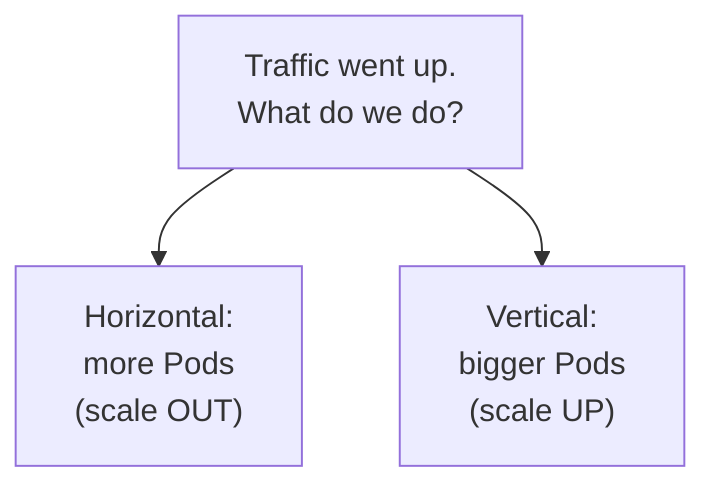
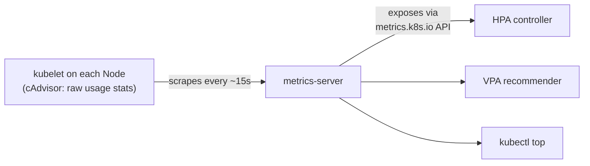
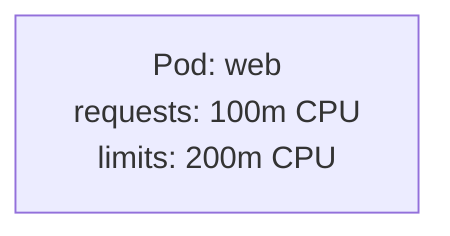
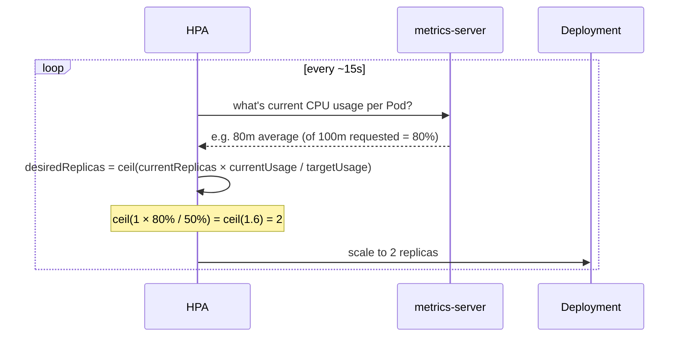
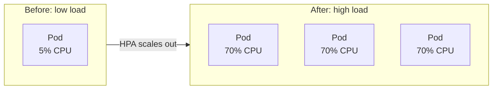
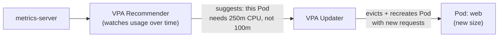
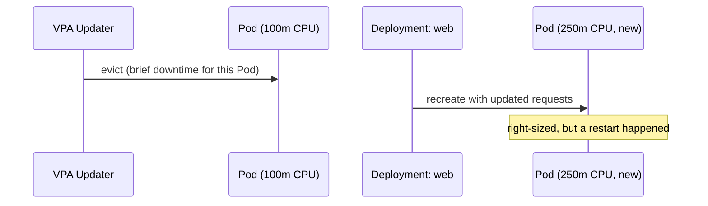
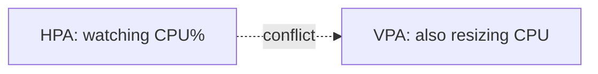

# Scaling: Horizontal (HPA) vs. Vertical (VPA)

Builds on `kubectl scale` from
[deployments.md](../kubernetes-intro/04-deployments.md) — that was
*manual*. This is Kubernetes doing it **automatically**, based on real
usage.

---

## Two different questions



- **Horizontal (HPA)** — add more copies of the same Pod. Good default:
  stateless apps, no upper limit besides cluster capacity.
- **Vertical (VPA)** — give an existing Pod more CPU/memory. Useful when a
  single instance can't be split (or you don't yet know the right size).

A fixed replica count is always a compromise: too few and peak traffic
overloads it, too many and off-peak traffic wastes CPU/RAM sitting idle.
Both mechanisms exist to close that gap automatically instead of you
guessing a number once and hoping it ages well.

---

## The missing piece both depend on: metrics-server

Kubernetes doesn't track CPU/memory usage by default — `kubectl top` and
autoscaling both need **metrics-server** installed first.



```bash
# most local clusters: one command
minikube addons enable metrics-server
# kind / others: apply the components manifest
kubectl apply -f https://github.com/kubernetes-sigs/metrics-server/releases/latest/download/components.yaml

kubectl top nodes
kubectl top pods
```

metrics-server only holds **current** usage in memory — no history, no
dashboards. It's a thin, fast pipe for autoscaling decisions, nothing more
(long-term metrics = Prometheus, a separate concern).

### Docker Desktop gotcha: kubelet's self-signed cert

On Docker Desktop (and some other local setups) metrics-server refuses to
scrape kubelet over TLS by default, and sits in `CrashLoopBackOff` while
`kubectl top` and every HPA's `TARGETS` column show `<unknown>`:

```bash
kubectl patch deployment metrics-server -n kube-system --type=json \
  -p='[{"op":"add","path":"/spec/template/spec/containers/0/args/-","value":"--kubelet-insecure-tls"}]'
```

That patch works, but it's a separate step layered on top of the
manifest — re-apply the upstream YAML later (an upgrade, a cluster
recreate) and the patch is silently gone, `<unknown>` comes back. Installing
via Helm bakes the flag into the release itself, so it survives upgrades:

```bash
helm repo add metrics-server https://kubernetes-sigs.github.io/metrics-server/
helm repo update

helm upgrade --install metrics-server metrics-server/metrics-server \
  --namespace kube-system \
  --set args="{--kubelet-insecure-tls}"

kubectl get pods -n kube-system | grep metrics-server
kubectl top nodes    # wait ~60s after install before this returns real numbers
```

```bash
# later, upgrading the chart without losing the flag:
helm upgrade metrics-server metrics-server/metrics-server \
  --namespace kube-system --reuse-values
```

---

## Setup: nginx with resource requests

Both HPA and VPA make decisions **relative to requests** — without them,
neither has a baseline to compare "current usage" against. This is the
single most common reason an HPA sits at `<unknown>%` or never scales:
the target Deployment simply has no `resources.requests` set.

```bash
kubectl create deployment web --image=nginx --replicas=1
kubectl set resources deployment/web --requests=cpu=100m,memory=64Mi --limits=cpu=200m,memory=128Mi
kubectl get pods
kubectl top pods
```



- **request** — what the Scheduler reserves for this Pod, guaranteed
- **limit** — the hard ceiling; the container gets throttled (CPU, since
  CPU is *compressible* — it just slows down) or killed (memory, since
  memory is *incompressible* — `OOMKilled`, exit code 137) past this

Setting `requests == limits` for every container gives the Pod
**Guaranteed** QoS — the last class evicted under Node memory pressure.
Setting only `requests` (with a higher `limit`, or none) gives
**Burstable** — normal for most workloads. Skipping both entirely gives
**BestEffort** — first to be evicted, and exactly the case where HPA has
nothing to compute a percentage against.

---

## Horizontal: HPA, set up

```bash
kubectl autoscale deployment web --cpu-percent=50 --min=1 --max=5
kubectl get hpa
```

```text
NAME   REFERENCE      TARGETS   MINPODS   MAXPODS   REPLICAS
web    Deployment/web 2%/50%    1         5         1
```

"Keep average CPU usage across all Pods at 50% of their **request**
(100m) — scale out up to 5 Pods if it climbs above that, scale back down
to as few as 1 if it drops."

---

## Same HPA, as YAML (`autoscaling/v2`)

`kubectl autoscale` is really just a shortcut for creating this object.
The declarative form uses the `autoscaling/v2` API — `v1` only supported a
single CPU-percentage target; `v2` supports multiple metrics at once
(CPU, memory, or custom/external metrics).

```yaml
# web-hpa.yaml
apiVersion: autoscaling/v2
kind: HorizontalPodAutoscaler
metadata:
  name: web
spec:
  scaleTargetRef:
    apiVersion: apps/v1
    kind: Deployment
    name: web
  minReplicas: 1
  maxReplicas: 5
  metrics:
    - type: Resource
      resource:
        name: cpu
        target:
          type: Utilization
          averageUtilization: 50
    - type: Resource
      resource:
        name: memory
        target:
          type: Utilization
          averageUtilization: 70
  behavior:
    scaleDown:
      stabilizationWindowSeconds: 300   # wait 5 min before scaling down
    scaleUp:
      stabilizationWindowSeconds: 0     # scale up immediately
```

```bash
kubectl apply -f web-hpa.yaml
kubectl get hpa web
kubectl describe hpa web        # shows per-metric current vs. target
```

- **`metrics: []`** — a list, not one value; with two entries here, the
  HPA computes a desired replica count for *each* and scales to the
  **larger** of the two, so neither CPU nor memory ever breaches target
- **`behavior`** — `v2`-only; explicit control over how cautious scale-up
  vs. scale-down should be, instead of one hardcoded cooldown for both

---

## Beyond CPU%: memory and custom metrics

CPU utilization (a percentage of `requests`) is the common case, but
`type: Resource` also accepts an absolute value, and HPA can scale on
metrics that have nothing to do with CPU/memory at all.

```yaml
# memory, as an absolute average — not a percentage
metrics:
  - type: Resource
    resource:
      name: memory
      target:
        type: AverageValue
        averageValue: 200Mi
```

Memory-based scaling is less common in practice: memory pressure often
means a **leak**, and adding Pods doesn't fix a leak, it just delays the
inevitable `OOMKilled`. It's a reasonable signal for workloads where
memory usage genuinely tracks request volume (in-memory caches, for
example) — not a general substitute for CPU%.

```yaml
# custom metric: requests-per-second, via Prometheus Adapter
metrics:
  - type: Pods
    pods:
      metric:
        name: http_requests_per_second
      target:
        type: AverageValue
        averageValue: "100"
```

This requires the **Prometheus Adapter** bridging Prometheus metrics into
Kubernetes' Custom Metrics API — at 500 RPS spread across 2 Pods (250 RPS
each), HPA scales to 5 Pods (500 ÷ 100 target). Worth reaching for when
CPU% doesn't actually correlate with what's overloading the app (e.g. an
I/O-bound service that's slow long before it's CPU-hot).

---

## How the HPA control loop actually works



Same reconciliation-loop idea as everything else in Kubernetes — desired
vs. actual, checked repeatedly, corrected automatically. The only new
input is a live number from metrics-server instead of a value you typed.

### Scale-up is fast, scale-down is deliberately slow

| Direction | Default stabilization window | Default policy |
| --- | --- | --- |
| Scale up | 0 seconds | up to +100% or +4 Pods per minute |
| Scale down | 300 seconds (5 min) | up to -100% per 15 min (gradual) |

That asymmetry is intentional: reacting instantly to rising load avoids
overload, but reacting instantly to a brief dip risks scaling down right
before the next spike (flapping). The `behavior` block above is exactly
where you'd tune either side if the defaults don't fit — faster scale-up
for a spiky workload, slower scale-down for one that's bursty but
expensive to under-provision.

---

## Watch it scale, live

A single `busybox` loop can nudge an HPA, but a proper load-generation
pod gives you real concurrency and a summary of what actually happened —
`hey` for a quick ad-hoc burst:

```bash
kubectl expose deployment web --port=80

kubectl run hey --image=williamyeh/hey --rm -it --restart=Never -- \
  -z 60s -c 50 http://web
# -z 60s   run for 60 seconds
# -c 50    50 concurrent workers
```

```bash
kubectl get hpa web -w
kubectl get pods -w
```



Stop the load and, after the scale-down stabilization window (default
5 min), the HPA scales back toward `--min`.

For anything past a quick smoke test — ramping load gradually, scripted
request bodies, pass/fail thresholds — reach for **k6**: it runs as a
`Job` in the cluster, so its traffic hits the Service exactly like any
other in-cluster client, and its `stages` can model a slow ramp instead
of an instant burst (which is a much more realistic test of whether HPA's
reaction time keeps up).

```javascript
// load-test.js, mounted into the k6 Job via a ConfigMap
import http from 'k6/http';

export const options = {
  stages: [
    { duration: '1m', target: 20 },
    { duration: '3m', target: 20 },
    { duration: '1m', target: 100 },
    { duration: '3m', target: 100 },
    { duration: '1m', target: 0 },
  ],
};

export default function () {
  http.get('http://web');
}
```

```bash
kubectl apply -f k6-scripts-configmap.yaml
kubectl apply -f k6-load-test-job.yaml
kubectl logs -f job/k6-load-test
kubectl get hpa web -w    # watch it react to the ramp, in a separate terminal
```

---

## Vertical: VPA — not built in, and it works differently

Unlike HPA, VPA is **not a core Kubernetes feature** — it's a separate
project (`kubernetes/autoscaler`) you install as CRDs + controllers.

```bash
# one-time cluster setup (clone the autoscaler repo)
git clone https://github.com/kubernetes/autoscaler.git
cd autoscaler/vertical-pod-autoscaler
./hack/vpa-up.sh

kubectl get pods -n kube-system | grep vpa
# vpa-admission-controller-xxxx   1/1   Running
# vpa-recommender-xxxx            1/1   Running
# vpa-updater-xxxx                1/1   Running
```

| Component | Role |
| --- | --- |
| **Recommender** | watches usage history, computes recommended `requests` |
| **Updater** | evicts Pods so they restart with new `requests` (in `Auto` mode) |
| **Admission Controller** | mutates a Pod's spec at *creation* time to match the current recommendation |



Define one per Deployment:

```yaml
apiVersion: autoscaling.k8s.io/v1
kind: VerticalPodAutoscaler
metadata:
  name: web-vpa
spec:
  targetRef:
    apiVersion: apps/v1
    kind: Deployment
    name: web
  updatePolicy:
    updateMode: "Off"        # start here — see modes below
  resourcePolicy:
    containerPolicies:
      - containerName: nginx
        minAllowed:
          cpu: 100m
          memory: 64Mi
        maxAllowed:
          cpu: 1
          memory: 512Mi
```

```bash
kubectl apply -f web-vpa.yaml
kubectl describe vpa web-vpa
```

---

## Reading VPA's recommendation

```text
Recommendation:
  Container Recommendations:
    Container Name:  nginx
    Lower Bound:
      Cpu:     100m
      Memory:  128Mi
    Target:
      Cpu:     250m        <- what VPA will actually set as requests
      Memory:  192Mi
    Upper Bound:
      Cpu:     600m
      Memory:  384Mi
```

- **Target** — what gets applied as `requests` (in `Auto`/`Initial` mode)
- **Lower Bound** — going below this risks `OOMKilled` / throttling
- **Upper Bound** — a safety ceiling; provisioning above this is wasteful

Start every VPA in `Off` mode, let it observe real traffic for a day or
two, then read `Target` and apply it — or switch modes once you trust it:

| Mode | Behavior | Use when |
| --- | --- | --- |
| `Off` | only recommends, changes nothing | learning the right size, zero disruption |
| `Initial` | applies the recommendation only at Pod creation | fix new Pods, leave running ones alone |
| `Auto` | evicts and resizes running Pods automatically | fully automated, restarts accepted |
| `Recreate` | same as `Auto` on Kubernetes versions without in-place resize | functionally identical to `Auto` today |

---

## Why VPA needs to restart the Pod (usually)

CPU/memory requests are set at **container creation**, not changeable on
a running container in most Kubernetes versions — so VPA's "Auto" mode
works by **evicting** the Pod and letting the Deployment recreate it with
new values.



(Newer Kubernetes versions have an alpha **in-place resize** feature that
avoids the restart — worth checking if your cluster supports it, but
`Auto` mode restarting Pods is still the common case today.)

---

## HPA and VPA together — only safe in specific combinations



If both scale on the *same metric* (CPU%), they fight each other: VPA
changes `requests` (the denominator HPA's percentage is computed against),
which shifts the percentage HPA sees, which triggers HPA to react to a
change that has nothing to do with actual load.

| Combination | Safe? |
| --- | --- |
| HPA (CPU%) + VPA (`Auto`) | **No** — VPA changing requests breaks HPA's math |
| HPA (CPU%) + VPA (`Off`/`Initial`) | **Yes** — VPA only recommends; you apply manually |
| HPA (custom metric, e.g. RPS) + VPA (`Auto`) | **Yes** — HPA isn't using requests at all |
| HPA (memory `AverageValue`) + VPA (`Auto`) | **No** — same conflict as CPU% |

The reliable pattern for most workloads: run VPA in `Off` to find the
right `requests` once, apply that to the Deployment by hand, *then* run
HPA on CPU% against that now-correct baseline.

---

## Side by side

| | HPA | VPA |
| --- | --- | --- |
| Scales | number of Pods | CPU/memory per Pod |
| Built into core Kubernetes? | yes | no, separate project |
| Needs metrics-server? | yes | yes |
| Causes a restart? | no — new Pods added alongside | usually yes (Pod evicted) |
| Good fit | stateless, horizontally-shardable apps | apps that can't be split, or unknown right-sizing |

---

## Cleanup

```bash
kubectl delete hpa web
kubectl delete pod hey 2>/dev/null || true
kubectl delete job k6-load-test 2>/dev/null || true
kubectl delete configmap k6-scripts 2>/dev/null || true
kubectl delete vpa web-vpa    # if installed
kubectl delete deployment web
kubectl delete svc web
```

---

## Takeaway

Both are the same reconciliation loop as everything else in Kubernetes —
desired vs. actual, corrected continuously — just fed by **live metrics**
instead of a number you typed once. HPA adds Pods when load rises; VPA
resizes a Pod when it's under- or over-provisioned. Neither works without
metrics-server actually running in the cluster, and neither works well
without correct `requests` set in the first place — which is really the
same prerequisite wearing two hats.
