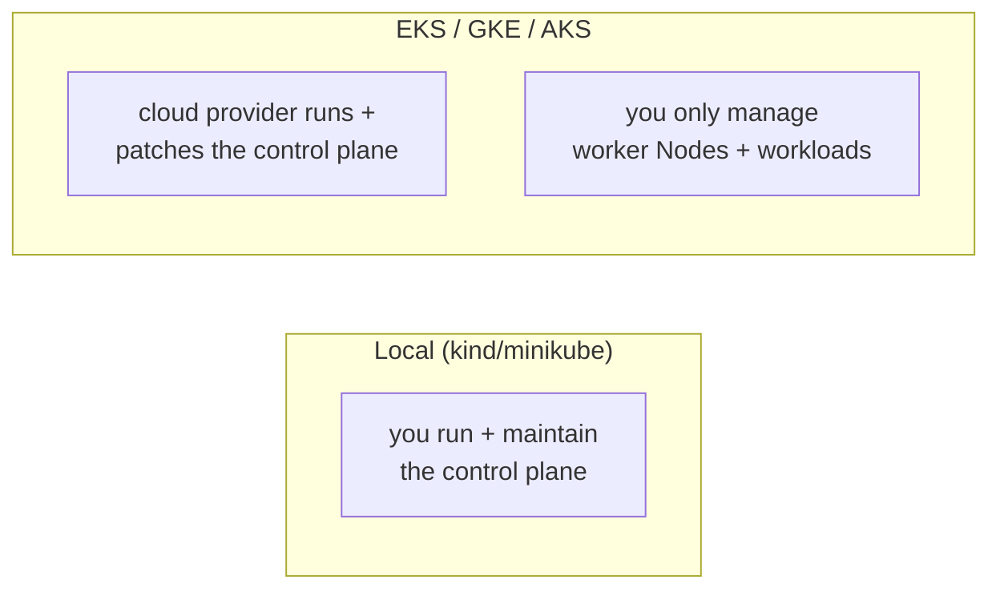
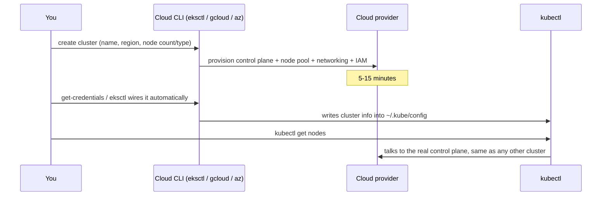
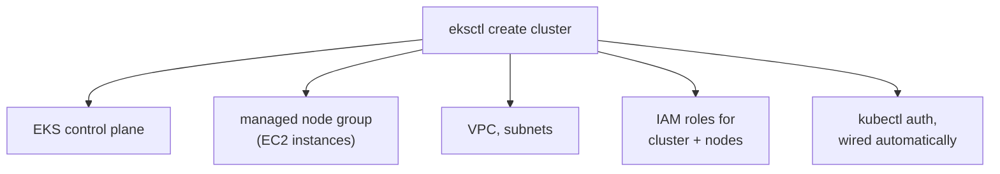
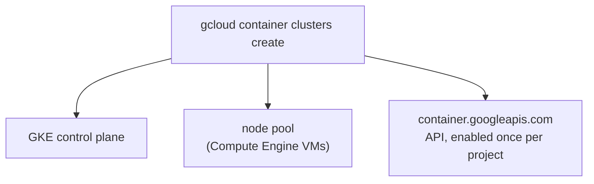
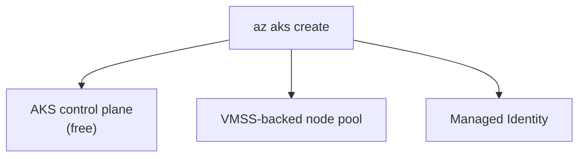

# Kubernetes on the Cloud: EKS, GKE, AKS

Builds on [cluster-and-nodes.md](../kubernetes-intro/cluster-and-nodes.md)
— that covered running a throwaway cluster locally (kind/minikube/Docker
Desktop). This is the same cluster concept, provisioned by a cloud
provider instead of your laptop.

---

## What "managed Kubernetes" actually means



Every one of the three follows the same shape: the provider hosts the
control plane (API server, etcd, scheduler) as a managed service; you
provision worker Nodes (a "node group"/"node pool") that join it. `kubectl`
doesn't know or care which of the three it's talking to — everything in
the rest of this repo works unchanged once you're connected.

---

## The three, at a glance

| | AWS: **EKS** | Google: **GKE** | Azure: **AKS** |
| --- | --- | --- | --- |
| CLI tool | `eksctl` (+ `aws`) | `gcloud` | `az` |
| Control plane cost | charged per cluster/hour | free tier available (esp. Autopilot) | free |
| What gets created | control plane, EC2 node group, VPC/subnets, IAM roles | control plane, GCE node pool | control plane, VMSS-backed node pool, resource group |
| `kubectl` wiring | `eksctl` does it automatically | `gcloud container clusters get-credentials` | `az aks get-credentials` |

---

## The common pattern, before the provider-specific detail



Same three questions across all of them: *how many nodes, what size, what
region* — everything below is really just each CLI's dialect for those
three answers.

---

## AWS: EKS, via `eksctl`

Prerequisites: `aws configure` already run, `eksctl` and `kubectl`
installed.

```bash
eksctl create cluster \
  --name my-cluster \
  --region us-east-2 \
  --nodegroup-name linux-nodes \
  --node-type t3.medium \
  --nodes 2 \
  --nodes-min 1 \
  --nodes-max 3 \
  --managed
```

With autoscaling of the node group itself enabled:

```bash
eksctl create cluster \
  --name my-cluster --version 1.33 \
  --region us-east-2 --nodegroup-name my-workers \
  --node-type t3.medium --nodes 2 --nodes-min 1 --nodes-max 3 \
  --managed --asg-access
```



`eksctl` is doing in one command what the AWS Console would need several
screens for — control plane, a VPC if you don't already have one, subnets
across AZs, IAM roles for both the cluster and the node group, and the
`aws-auth` ConfigMap mapping that IAM identity to Kubernetes RBAC.

```bash
kubectl get nodes
kubectl get svc
```

```bash
eksctl delete cluster --name my-cluster --region us-east-2
```

### EKS via the AWS Console (if you'd rather use a GUI)

1. AWS Console → EKS → **Create cluster**
2. Set cluster name, Kubernetes version, and an IAM role (create one if none exists)
3. Configure VPC/subnet settings
4. Add a managed **Node Group**
5. Wire up `kubectl`:

```bash
aws eks update-kubeconfig --name my-cluster --region us-east-2
kubectl get nodes
```

Same end result as `eksctl` — more clicks, more visibility into each
individual piece being created.

---

## Google Cloud: GKE, from Cloud Shell

Cloud Shell already has `gcloud` and `kubectl` pre-installed — open it
from [console.cloud.google.com](https://console.cloud.google.com).

```bash
gcloud config list
gcloud config set compute/zone us-central1-a
gcloud compute zones list          # if you need to pick a different one

gcloud services enable container.googleapis.com
```

```bash
gcloud container clusters create demo-cluster \
  --num-nodes=2 \
  --machine-type=e2-medium \
  --enable-autoscaling --min-nodes=1 --max-nodes=3
```



```bash
gcloud container clusters get-credentials demo-cluster
kubectl get nodes
```

Same deploy-and-expose pattern as everything else in this repo's notes —
it's a completely ordinary cluster from here:

```bash
kubectl create deployment myapp --image=nginx
kubectl expose deployment myapp --type=LoadBalancer --port=80
kubectl get svc     # wait for EXTERNAL-IP, then open it in a browser
```

```bash
gcloud container clusters delete demo-cluster
```

---

## Azure: AKS, via the CLI

```bash
az login
az account set --subscription "<your-subscription-id>"

az group create --name my-aks-rg --location southindia
```

```bash
az aks create \
  --name my-cluster \
  --resource-group my-aks-rg \
  --location southindia \
  --node-count 2 \
  --node-vm-size Standard_D2s_v4 \
  --nodepool-name systempool \
  --network-plugin kubenet \
  --load-balancer-sku standard \
  --enable-managed-identity \
  --generate-ssh-keys \
  --dns-name-prefix my-cluster
```

| Flag | Why it's there |
| --- | --- |
| `--node-count` | how many worker Nodes, spread for resilience |
| `--node-vm-size` | the VM SKU backing each Node (CPU/RAM) |
| `--network-plugin kubenet` | simpler networking, no pre-provisioned VNet needed |
| `--load-balancer-sku standard` | required for `type: LoadBalancer` Services to actually work |
| `--enable-managed-identity` | AKS authenticates to other Azure services (e.g. a registry) without you managing credentials |
| `--dns-name-prefix` | becomes part of the API server's public hostname |

Unlike EKS/GKE, the AKS control plane itself is **free** — you only pay
for the worker Node VMs.



```bash
az aks get-credentials --resource-group my-aks-rg --name my-cluster
kubectl get nodes
```

### AKS via the Azure Portal

1. Search **"Kubernetes services"** → **+ Create**
2. **Basics**: resource group, cluster name, region, pricing tier (Free)
3. **Node pools**: edit the default pool — VM size, node count
4. **Networking**: Kubenet, Standard load balancer
5. **Review + create**
6. Once provisioned: **Connect** button shows the exact
   `az aks get-credentials` command to run locally

```bash
az group delete --name my-aks-rg --yes --no-wait
```

Deleting the resource group tears down the cluster and everything created
alongside it (VNet, disks, IPs) in one step — the AKS equivalent of
`eksctl delete cluster` / `gcloud container clusters delete`.

---

## Side by side: the exact same task, three CLIs

| Task | EKS | GKE | AKS |
| --- | --- | --- | --- |
| Create cluster | `eksctl create cluster ...` | `gcloud container clusters create ...` | `az aks create ...` |
| Wire up kubectl | done automatically by `eksctl` | `gcloud container clusters get-credentials` | `az aks get-credentials` |
| List nodes | `kubectl get nodes` | `kubectl get nodes` | `kubectl get nodes` |
| Delete everything | `eksctl delete cluster` | `gcloud container clusters delete` | `az group delete` |

The last row is the one real gotcha: EKS/GKE deletion commands target the
cluster object directly, while AKS is usually torn down by deleting the
**resource group** it lives in — forgetting this on Azure is a common way
to leave a Node pool (and its bill) running.

---

## What's identical no matter which one you picked

Everything from [kubernetes-intro/](../kubernetes-intro/) and the rest of
[kubernetes-intermediate/](.) applies completely unchanged from here —
Deployments, Services, ConfigMaps, Ingress, HPA, all of it. The only
cloud-specific pieces are:

- `type: LoadBalancer` provisions a *real* cloud load balancer (see
  [services.md](../kubernetes-intro/services.md)) instead of staying
  `<pending>` forever like it does on kind/minikube
- pulling your own images means pushing to (and authenticating against) a
  registry — Docker Hub works everywhere, or each cloud's own private
  registry (ECR/Artifact Registry/ACR), a topic on its own
- Node autoscaling, IAM/identity wiring, and per-cluster billing are all
  provider-specific concerns with no local-cluster equivalent

---

## Cleanup, all three

```bash
eksctl delete cluster --name my-cluster --region us-east-2
gcloud container clusters delete demo-cluster
az group delete --name my-aks-rg --yes --no-wait
```

---

## Takeaway

EKS, GKE, and AKS are the same idea in three dialects: hand the CLI a
region, a node count, and a node size, wait 5-15 minutes for a control
plane plus a node pool to come up, then point `kubectl` at it. Everything
you already know from the local-cluster notes in this repo works
identically from that point on — the differences are entirely in how you
provision the cluster and pay for it, not in how you use it.
