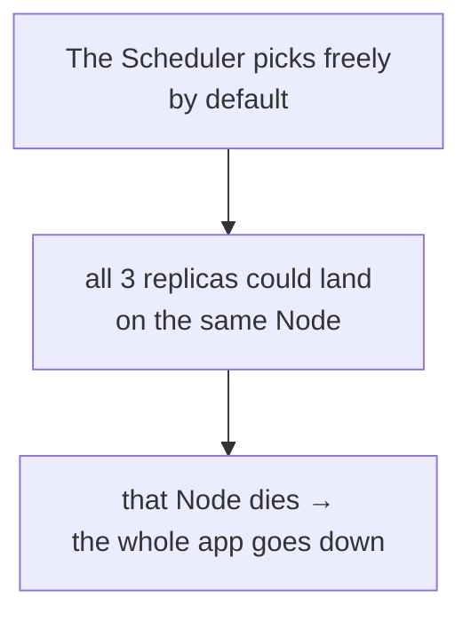
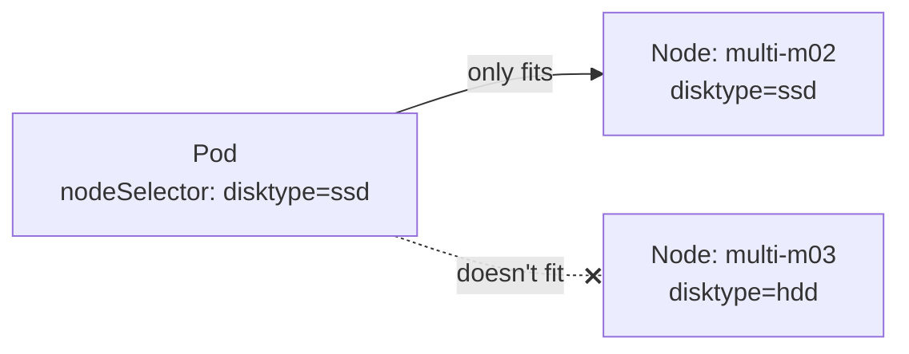
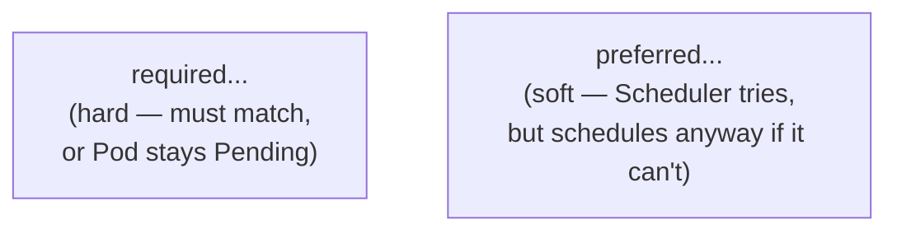
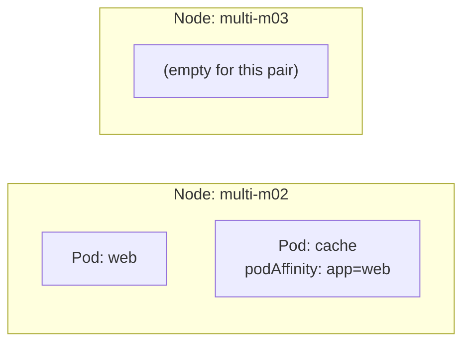
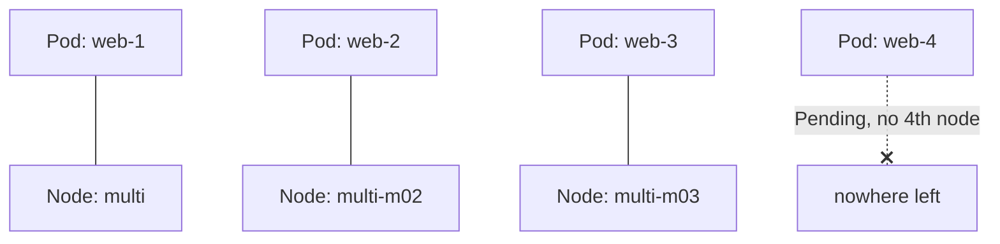
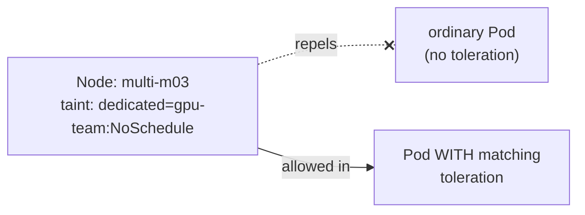
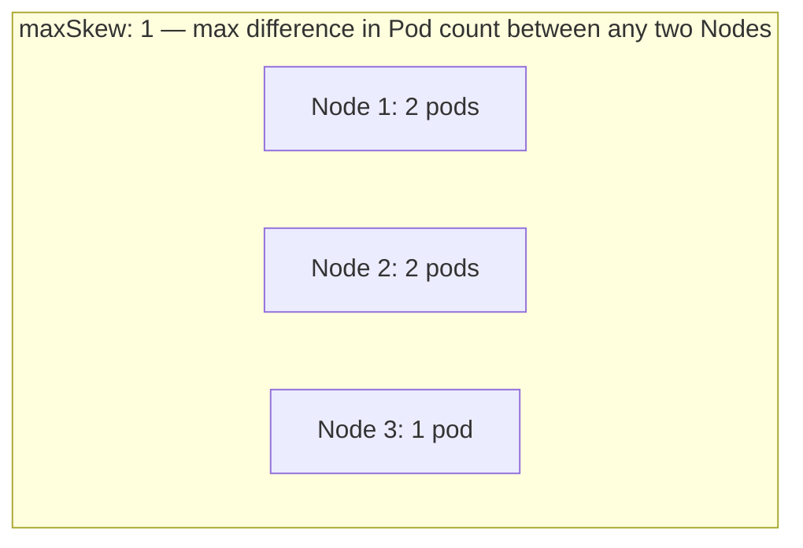

# Controlling Where Pods Run: Affinity, Anti-Affinity, Taints, Spread

Builds on the multi-node setup in
[cluster-and-nodes.md](../kubernetes-intro/cluster-and-nodes.md) — this is
about steering the Scheduler's node choice instead of leaving it
unconstrained.

---

## Why this matters



By default the Scheduler only checks "does this Node have enough
resources" — nothing stops it from putting every replica of a Deployment
on one Node, which quietly defeats the whole point of running 3 replicas
for resilience. Every mechanism below exists to add more opinions to that
decision.

---

## Setup: a 3-node minikube cluster

```bash
minikube start --nodes 3 -p multi
kubectl get nodes
# multi           Ready   control-plane
# multi-m02       Ready   <none>
# multi-m03       Ready   <none>
```

Label each worker so the examples below have something concrete to
target — substitute your actual node names from `kubectl get nodes`:

```bash
kubectl label node multi-m02 disktype=ssd zone=a
kubectl label node multi-m03 disktype=hdd zone=b
kubectl get nodes --show-labels
```

---

## Mechanism 1: `nodeSelector` — the simple case

The most basic tool: schedule only onto Nodes matching an exact
label — no operators, no soft preference, just yes/no.

```yaml
apiVersion: apps/v1
kind: Deployment
metadata:
  name: web
spec:
  replicas: 1
  selector:
    matchLabels: { app: web }
  template:
    metadata:
      labels: { app: web }
    spec:
      nodeSelector:
        disktype: ssd
      containers:
        - name: nginx
          image: nginx
```



```bash
kubectl apply -f web-nodeselector.yaml
kubectl get pods -o wide
# confirms it landed on multi-m02
```

---

## Mechanism 2: Node Affinity — the expressive version

Same idea as `nodeSelector`, but supports operators (`In`, `NotIn`,
`Exists`, `Gt`, `Lt`) and, critically, a **soft** ("preferred") mode that
`nodeSelector` doesn't have at all.

```yaml
spec:
  affinity:
    nodeAffinity:
      requiredDuringSchedulingIgnoredDuringExecution:   # hard rule
        nodeSelectorTerms:
          - matchExpressions:
              - key: disktype
                operator: In
                values: ["ssd"]
      preferredDuringSchedulingIgnoredDuringExecution:   # soft preference
        - weight: 80
          preference:
            matchExpressions:
              - key: zone
                operator: In
                values: ["a"]
```



"IgnoredDuringExecution" in both names is the same nuance as labels
elsewhere in Kubernetes: if a Node's label changes *after* the Pod is
already running there, nothing evicts the Pod retroactively — affinity is
only evaluated at scheduling time.

```bash
kubectl apply -f web-affinity.yaml
kubectl describe pod <pod-name> | grep -A5 Events
# if required rule can't be met anywhere: "0/3 nodes are available: 2 node(s) didn't match node affinity"
```

---

## Mechanism 3: Pod Affinity — stick close to another Pod

Schedules a Pod onto a Node that's **already running** another Pod
matching a label — useful for co-locating a cache next to the app that
uses it, to avoid a network hop.

```yaml
spec:
  affinity:
    podAffinity:
      requiredDuringSchedulingIgnoredDuringExecution:
        - labelSelector:
            matchLabels:
              app: web
          topologyKey: "kubernetes.io/hostname"   # same Node specifically
```



`topologyKey` controls the granularity — `kubernetes.io/hostname` means
"the exact same Node"; using a zone label instead (e.g. `zone`) would mean
"anywhere in the same zone," a looser constraint.

---

## Mechanism 4: Pod Anti-Affinity — spread replicas apart

The opposite: never put two Pods matching this label on the **same**
Node — the standard fix for "all 3 replicas landed on one Node."

```yaml
apiVersion: apps/v1
kind: Deployment
metadata:
  name: web
spec:
  replicas: 3
  selector:
    matchLabels: { app: web }
  template:
    metadata:
      labels: { app: web }
    spec:
      affinity:
        podAntiAffinity:
          requiredDuringSchedulingIgnoredDuringExecution:
            - labelSelector:
                matchLabels:
                  app: web
              topologyKey: "kubernetes.io/hostname"
      containers:
        - name: nginx
          image: nginx
```

```bash
kubectl apply -f web-antiaffinity.yaml
kubectl get pods -o wide
# each "web" Pod on a DIFFERENT node — a 4th replica stays Pending
# once all 3 nodes already have one (hard rule, no 4th node available)
```



With only 3 Nodes, a `required` anti-affinity caps you at 3 replicas —
switch to `preferred` if you want the Scheduler to spread when possible
but still schedule extra replicas by doubling up as a fallback.

---

## Mechanism 5: Taints & Tolerations — the Node's side of the decision

Everything above is the **Pod** expressing a preference. A taint is the
**Node** actively repelling Pods — the opposite direction, useful for
dedicating a Node to a specific workload (e.g. a Node with a GPU, reserved
for ML jobs only).

```bash
kubectl taint node multi-m03 dedicated=gpu-team:NoSchedule
```



```yaml
spec:
  tolerations:
    - key: "dedicated"
      operator: "Equal"
      value: "gpu-team"
      effect: "NoSchedule"
  containers:
    - name: ml-job
      image: busybox
```

A toleration doesn't **attract** a Pod to the tainted Node — it just
*permits* scheduling there; pair it with node affinity if you actually
want the Pod to specifically prefer that Node too.

Taint effects:

| Effect | Behavior |
| --- | --- |
| `NoSchedule` | new Pods without a matching toleration won't be scheduled here |
| `PreferNoSchedule` | soft version — avoided, but not forbidden |
| `NoExecute` | new Pods are blocked **and** existing non-tolerating Pods already here get evicted |

```bash
kubectl describe node multi-m03 | grep Taints
kubectl taint node multi-m03 dedicated=gpu-team:NoSchedule-   # trailing "-" removes it
```

---

## Mechanism 6: Topology Spread Constraints — even distribution, properly

Anti-affinity answers "never together"; it doesn't answer "spread evenly
across whatever Nodes/zones exist." Topology Spread Constraints are the
purpose-built tool for that:

```yaml
spec:
  topologySpreadConstraints:
    - maxSkew: 1
      topologyKey: "kubernetes.io/hostname"
      whenUnsatisfiable: DoNotSchedule
      labelSelector:
        matchLabels:
          app: web
```



```bash
kubectl create deployment web --image=nginx --replicas=5
kubectl patch deployment web --type=json -p='[{"op":"add","path":"/spec/template/spec/topologySpreadConstraints","value":[{"maxSkew":1,"topologyKey":"kubernetes.io/hostname","whenUnsatisfiable":"DoNotSchedule","labelSelector":{"matchLabels":{"app":"web"}}}]}]'
kubectl get pods -o wide
# 5 pods across 3 nodes: roughly 2/2/1 — never 5/0/0 or even 3/2/0
```

`whenUnsatisfiable: DoNotSchedule` makes it a hard rule (like `required`
affinity); `ScheduleAnyway` makes it a best-effort preference instead.
This is the modern, more precise replacement for using anti-affinity to
achieve "even spread" — anti-affinity only guarantees "not the exact same
Node," not an actual even count.

---

## All six, side by side

| Mechanism | Direction | Hard or soft? | Best for |
| --- | --- | --- | --- |
| `nodeSelector` | Pod → Node | hard only | simple, exact-match placement |
| Node affinity | Pod → Node | either | same as above, with operators + soft mode |
| Pod affinity | Pod → Pod | either | co-locate tightly-coupled Pods |
| Pod anti-affinity | Pod → Pod | either | keep replicas off the same Node/zone |
| Taints + tolerations | Node → Pod | either (via effect) | reserve/dedicate Nodes for specific workloads |
| Topology spread constraints | Pod → topology | either | precise, even distribution across Nodes/zones |

---

## Cleanup

```bash
kubectl delete deployment web ml-job
kubectl taint node multi-m03 dedicated=gpu-team:NoSchedule-
minikube delete -p multi
```

---

## Takeaway

`nodeSelector` and node affinity control *which* Node a Pod can land on;
pod affinity/anti-affinity control placement *relative to other Pods*;
taints let a Node refuse Pods unless they explicitly tolerate it; topology
spread constraints are the precise tool for "evenly distributed," where
anti-affinity only gives you "not doubled-up." Combine them — e.g. taints
to reserve a Node plus affinity so the right Pods actually land there —
rather than treating them as alternatives to each other.
