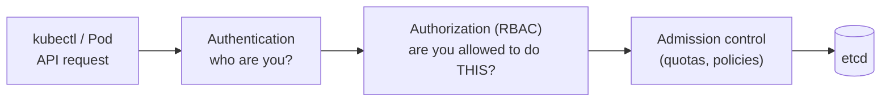
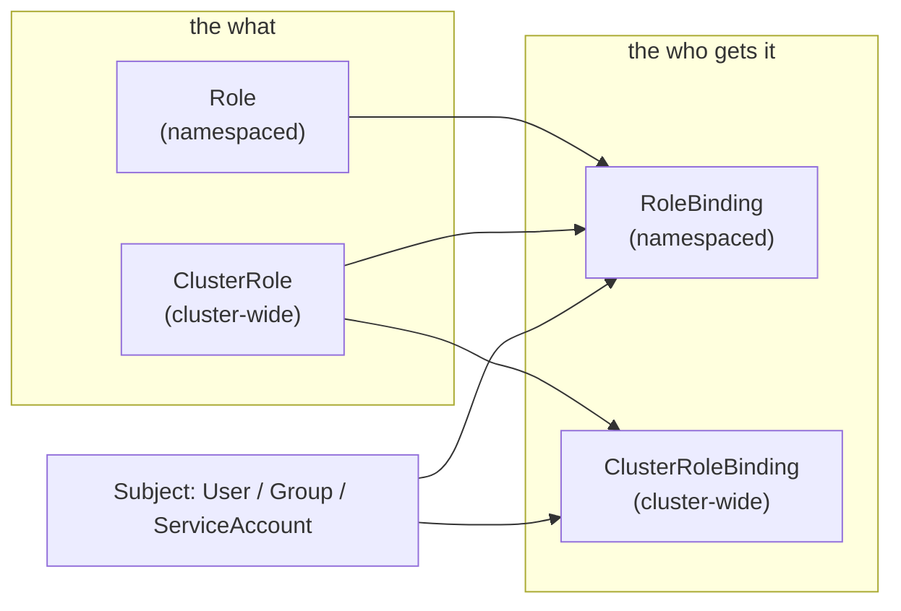
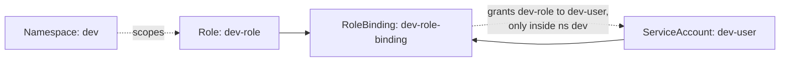
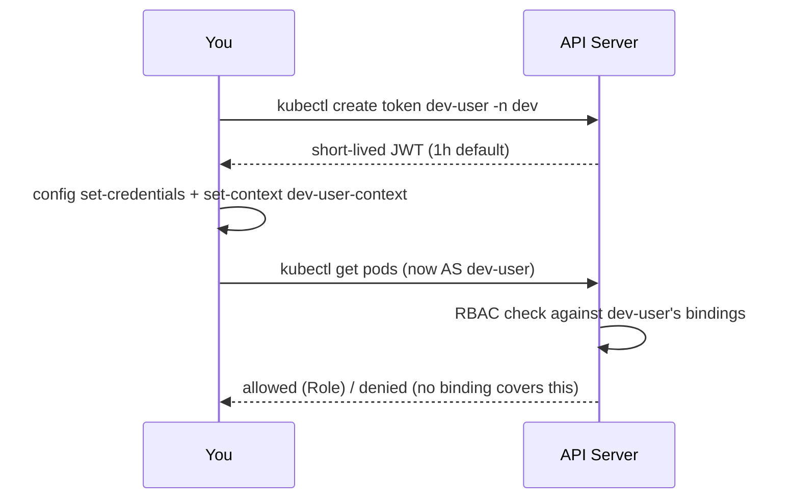
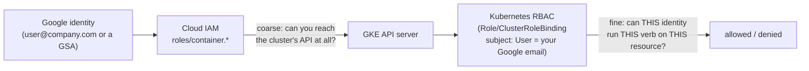
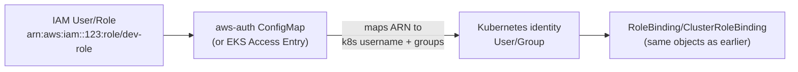

# RBAC — who can do what, to which resources

Every object so far has been created as whoever your kubeconfig says you
are, with no limits. RBAC (Role-Based Access Control) is the API server's
authorization layer that makes "no limits" the exception rather than the
rule — and, once you leave a local cluster for
[EKS/GKE](07-kubernetes-on-cloud.md), the thing that decides whether your
cloud identity can touch the cluster at all.

---

## Where RBAC sits in a request's lifecycle



Authentication answers "who" (a cert, a token, a ServiceAccount);
authorization — RBAC — answers "is this identity allowed to `verb` this
`resource`." Every API request passes through both, in that order, before
it ever touches storage.

---

## The four RBAC objects, and how they pair up



| | `Role` | `ClusterRole` |
| --- | --- | --- |
| Scope | one namespace | cluster-wide |
| Can grant access to | namespaced resources only (Pods, Services) | namespaced **and** cluster-scoped resources (Nodes, Namespaces, PVs — see [namespaces.md](../kubernetes-intro/10.namespaces.md)) |
| Bound with | `RoleBinding` | `ClusterRoleBinding` **or** `RoleBinding` (scopes a cluster-wide Role down to one namespace) |

| | `RoleBinding` | `ClusterRoleBinding` |
| --- | --- | --- |
| Scope | one namespace | cluster-wide |
| Can bind | `Role` or `ClusterRole` | `ClusterRole` only |

The "`ClusterRole` + `RoleBinding`" row is the pattern worth remembering:
define a role once (`view`, `edit`, a custom `cluster-viewer`), then grant
it namespace-by-namespace without duplicating the rule set.

Permissions are **additive only** — there is no `deny` rule. Access is the
union of every `Role`/`ClusterRole` bound to an identity; if nothing
grants a verb, it's implicitly denied.

---

## Anatomy of a rule: apiGroup + resource + verb

```yaml
rules:
  - apiGroups: [""]                # "" = the core API group
    resources: ["pods"]
    verbs: ["get", "list", "watch"]
  - apiGroups: ["apps"]
    resources: ["deployments"]
    verbs: ["get", "list", "create", "update", "delete"]
```

| apiGroup | Resources |
| --- | --- |
| `""` (core) | pods, services, configmaps, secrets, namespaces, nodes |
| `apps` | deployments, statefulsets, daemonsets, replicasets |
| `batch` | jobs, cronjobs |
| `rbac.authorization.k8s.io` | roles, rolebindings, clusterroles, clusterrolebindings |
| `networking.k8s.io` | ingresses, [networkpolicies](04-networking-policy.md) |

| Verb | HTTP method | Effect |
| --- | --- | --- |
| `get` / `list` / `watch` | GET | read one / read all / stream changes |
| `create` | POST | create a resource |
| `update` / `patch` | PUT / PATCH | replace / partially modify |
| `delete` / `deletecollection` | DELETE | delete one / delete all matching |
| `*` | — | wildcard, every verb — avoid outside break-glass roles |

`kubectl api-resources` lists every valid `resources` value; `kubectl
explain <resource>` shows which `apiGroup` it belongs to if the table
above doesn't cover it.

---

## Worked example: scoping a `dev-user` to one namespace

Five objects, applied together, that let a ServiceAccount manage Pods and
Deployments in `dev` and nothing else:

```yaml
# namespace-dev.yaml
apiVersion: v1
kind: Namespace
metadata:
  name: dev
  labels:
    env: dev
```

```yaml
# service-account.yaml
apiVersion: v1
kind: ServiceAccount
metadata:
  name: dev-user
  namespace: dev
```

```yaml
# dev-role.yaml
apiVersion: rbac.authorization.k8s.io/v1
kind: Role
metadata:
  name: dev-role
  namespace: dev
rules:
  - apiGroups: [""]
    resources: ["pods", "services", "configmaps", "secrets"]
    verbs: ["get", "list", "watch", "create", "update", "delete"]
  - apiGroups: ["apps"]
    resources: ["deployments"]
    verbs: ["get", "list", "watch", "create", "update", "delete"]
```

```yaml
# rolebinding.yaml
apiVersion: rbac.authorization.k8s.io/v1
kind: RoleBinding
metadata:
  name: dev-role-binding
  namespace: dev
subjects:
  - kind: ServiceAccount
    name: dev-user
    namespace: dev
roleRef:
  kind: Role
  name: dev-role
  apiGroup: rbac.authorization.k8s.io
```

```bash
kubectl apply -f namespace-dev.yaml -f service-account.yaml \
  -f dev-role.yaml -f rolebinding.yaml
```



---

## Layering in a cluster-wide read-only grant

Bind a `ClusterRole` to the same `ServiceAccount` with a
`ClusterRoleBinding`, and its access extends beyond `dev` — additive to
everything already granted by the `RoleBinding` above:

```yaml
# cluster-role.yaml
apiVersion: rbac.authorization.k8s.io/v1
kind: ClusterRole
metadata:
  name: cluster-viewer
rules:
  - apiGroups: ["", "apps", "batch"]
    resources: ["pods", "deployments", "services", "nodes", "namespaces", "configmaps"]
    verbs: ["get", "list", "watch"]
```

```yaml
# cluster-role-binding.yaml
apiVersion: rbac.authorization.k8s.io/v1
kind: ClusterRoleBinding
metadata:
  name: cluster-viewer-binding
subjects:
  - kind: ServiceAccount
    name: dev-user
    namespace: dev
roleRef:
  kind: ClusterRole
  name: cluster-viewer
  apiGroup: rbac.authorization.k8s.io
```

`dev-user` now has full read/write on Pods/Deployments **inside `dev`**
(from the `Role`), plus read-only visibility of Pods/Deployments/Nodes
**cluster-wide** (from the `ClusterRole`) — two different grants, unioned.

---

## The built-in ClusterRoles

Every cluster ships four pre-made ones — reach for these before writing a
custom `Role`:

| ClusterRole | Access |
| --- | --- |
| `view` | read-only on most namespaced resources |
| `edit` | read/write most namespaced resources, cannot touch RBAC objects |
| `admin` | `edit`, plus can manage Roles/RoleBindings within the namespace |
| `cluster-admin` | full control, cluster-wide — never bind this to an application workload |

```bash
# grant "edit", but scoped down to one namespace via a RoleBinding
kubectl create rolebinding alice-edit \
  --clusterrole=edit --user=alice --namespace=dev
```

---

## Testing what an identity can actually do

```bash
kubectl auth can-i delete pods

kubectl auth can-i list deployments \
  --as=system:serviceaccount:dev:dev-user --namespace=dev

# the full picture for one identity, one command
kubectl auth can-i --list \
  --as=system:serviceaccount:dev:dev-user --namespace=dev
```

`kubectl auth can-i` asks the API server to run the same authorization
check it would run for a real request — no need to actually attempt the
action (and risk the `delete`) just to find out if it's allowed.

---

## Acting as that ServiceAccount from kubectl

```bash
kubectl create token dev-user -n dev
```

```bash
kubectl config set-credentials dev-user \
  --token=$(kubectl create token dev-user -n dev)

kubectl config set-context dev-user-context \
  --cluster=$(kubectl config view --minify -o jsonpath='{.clusters[0].name}') \
  --user=dev-user --namespace=dev

kubectl config use-context dev-user-context
```



```bash
kubectl config use-context dev-user-context
kubectl get pods            # works — covered by dev-role
kubectl get nodes           # works — covered by cluster-viewer (read-only)
kubectl delete deployment anything -n other-namespace   # denied
```

`kubectl create token` mints a token scoped to that `ServiceAccount`'s
existing bindings — it doesn't grant anything new, it just lets you
authenticate *as* that identity to verify the RBAC objects actually
behave the way you wrote them.

---

## How this maps onto GKE

GKE layers Kubernetes RBAC **under** Google Cloud IAM — two separate
checks, both must pass:



```bash
# IAM layer: can this principal reach the cluster at all
gcloud projects add-iam-policy-binding my-project \
  --member="user:alice@company.com" \
  --role="roles/container.developer"

# wires kubectl using your gcloud identity
gcloud container clusters get-credentials demo-cluster --zone us-central1-a

# RBAC layer: what can that identity do once inside — same objects as above,
# just pointed at a real Google identity instead of a ServiceAccount
kubectl create rolebinding alice-edit \
  --clusterrole=edit --user=alice@company.com --namespace=dev
```

`roles/container.admin`/`.developer`/`.viewer` at the IAM level control
whether an identity can call the GKE/API-server endpoint at all;
Kubernetes RBAC bindings (same `Role`/`RoleBinding` objects from earlier
in this note) then control what it can do once it's in — losing either
one blocks access, having both is required. Workload Identity is the
Pod-side equivalent of this same idea: it lets a `ServiceAccount` assume a
Google service account's IAM permissions to call **other** GCP APIs
(Cloud Storage, Pub/Sub), which is a separate concern from the in-cluster
RBAC covered here.

---

## How this maps onto EKS

EKS has no separate "IAM role for the cluster" layer inside Kubernetes
itself — instead, it maps an AWS IAM principal (a user or role ARN)
directly onto a Kubernetes `User`/`Group`, which ordinary RBAC objects
then bind against.



The older, still-common mechanism — a ConfigMap the API server reads on
every authentication:

```yaml
# kube-system/aws-auth ConfigMap (excerpt)
apiVersion: v1
kind: ConfigMap
metadata:
  name: aws-auth
  namespace: kube-system
data:
  mapRoles: |
    - rolearn: arn:aws:iam::123456789012:role/dev-team-role
      username: dev-user
      groups:
        - dev-editors
```

```yaml
# then an ordinary RBAC object binds the mapped group
apiVersion: rbac.authorization.k8s.io/v1
kind: RoleBinding
metadata:
  name: dev-editors-binding
  namespace: dev
subjects:
  - kind: Group
    name: dev-editors            # matches the aws-auth "groups" entry, not an IAM group
    apiGroup: rbac.authorization.k8s.io
roleRef:
  kind: ClusterRole
  name: edit
  apiGroup: rbac.authorization.k8s.io
```

The newer, recommended replacement — EKS **access entries**, managed via
API/CLI instead of hand-editing a ConfigMap:

```bash
aws eks create-access-entry \
  --cluster-name my-cluster \
  --principal-arn arn:aws:iam::123456789012:role/dev-team-role \
  --kubernetes-groups dev-editors

aws eks associate-access-policy \
  --cluster-name my-cluster \
  --principal-arn arn:aws:iam::123456789012:role/dev-team-role \
  --access-scope type=namespace,namespaces=dev \
  --policy-arn arn:aws:eks::aws:cluster-access-policy/AmazonEKSEditPolicy
```

Access entries can either map straight to an AWS-managed access policy
(`AmazonEKSEditPolicy`/`AmazonEKSViewPolicy`, skipping RBAC objects
entirely for common cases) or, as above, map to a plain Kubernetes group
that your own `RoleBinding` still governs — same underlying RBAC model as
everywhere else in this note, just a different front door for wiring
identities in.

---

## GKE vs EKS, side by side

| | GKE | EKS |
| --- | --- | --- |
| Layer above RBAC | Cloud IAM (`roles/container.*`) | IAM principal → k8s identity mapping |
| Where the mapping lives | implicit — your gcloud identity *is* the k8s `User` | `aws-auth` ConfigMap, or `aws eks create-access-entry` |
| In-cluster objects | same `Role`/`RoleBinding`/`ClusterRole`/`ClusterRoleBinding` | same `Role`/`RoleBinding`/`ClusterRole`/`ClusterRoleBinding` |
| Fully-managed shortcut | predefined IAM roles like `roles/container.developer` | AWS-managed access policies like `AmazonEKSEditPolicy` |

Neither cloud replaces Kubernetes RBAC — both just add a layer on top
that decides which cloud identity gets to show up as which Kubernetes
`User`/`Group` in the first place. Everything from
[07-kubernetes-on-cloud.md](07-kubernetes-on-cloud.md) about wiring
`kubectl` still applies unchanged; this is what happens *after* that
wiring, on every single request.

---

## Cleanup

```bash
kubectl config use-context <your-original-context>
kubectl delete rolebinding dev-role-binding -n dev
kubectl delete clusterrolebinding cluster-viewer-binding
kubectl delete role dev-role -n dev
kubectl delete clusterrole cluster-viewer
kubectl delete serviceaccount dev-user -n dev
kubectl delete namespace dev
kubectl config delete-context dev-user-context
```

---

## Takeaway

RBAC is additive-only authorization checked on every API request: a
`Role`/`ClusterRole` defines the "what," a `RoleBinding`/
`ClusterRoleBinding` grants it to a "who" (`User`, `Group`, or
`ServiceAccount`), and `kubectl auth can-i` lets you verify the result
without risking the real action. On a managed cloud cluster this is only
half the picture — GKE and EKS both add an identity-mapping layer (Cloud
IAM roles, or `aws-auth`/access entries) that decides which cloud
principal gets to appear as which Kubernetes subject before RBAC ever
gets a chance to evaluate a rule.
