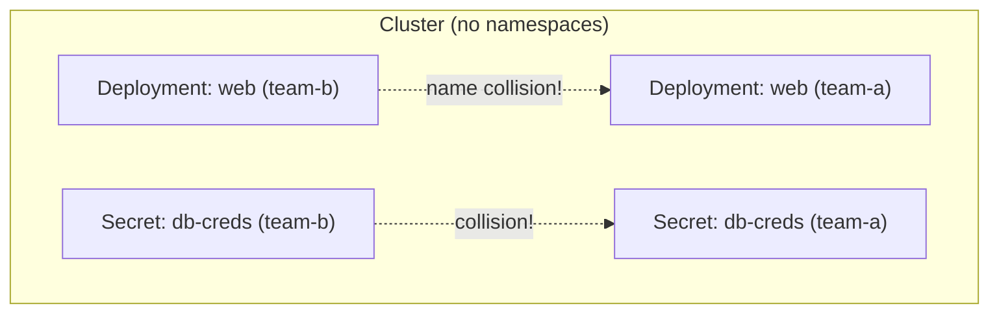
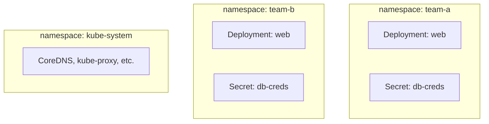
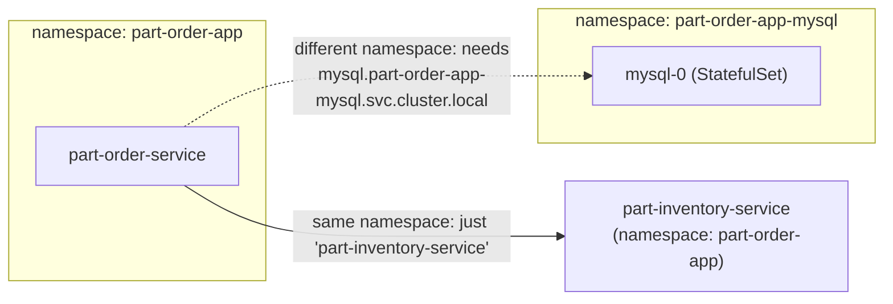

# Namespaces — dividing one cluster into virtual clusters

A `Namespace` doesn't isolate compute or network by default — it's a
**naming scope** for object names, plus a place to hang RBAC, quotas, and
policy. Everything you've deployed so far (`kubectl create deployment`,
`kubectl expose`) landed in one namespace: `default`.

---

## The problem: one flat pool of names



Every object name inside a namespace must be unique, but the same name is
free to reuse **across** namespaces. Two teams, two `Deployments` both
called `web`, no conflict — as long as they live in different namespaces.

---

## The fix: namespaces as scoping boundaries



Same cluster, same nodes, same API server — just partitioned so names,
RBAC rules, and resource quotas can be scoped per team, per environment
(`dev`/`staging`/`prod`), or per application, without needing separate
clusters.

---

## Not everything is namespaced

This is the detail that trips people up: some resource kinds are
**cluster-scoped** — they exist once, cluster-wide, with no namespace at
all.

```bash
# namespaced resources — need -n / apply within a namespace
kubectl api-resources --namespaced=true | head

# cluster-scoped resources — no namespace, ever
kubectl api-resources --namespaced=false
```

| Namespaced | Cluster-scoped |
| --- | --- |
| `Pod`, `Deployment`, `Service`, `ConfigMap`, `Secret` | `Node`, `Namespace` itself |
| `Ingress`, `PersistentVolumeClaim`, `Job`/`CronJob` | `PersistentVolume`, `StorageClass` |
| `Role`, `RoleBinding` | `ClusterRole`, `ClusterRoleBinding` |

A `Pod` in `team-a` and a `Pod` in `team-b` are unrelated objects; there's
only ever **one** `Node` named `worker-1` in the whole cluster, no matter
how many namespaces exist.

---

## Default namespaces every cluster ships with

```bash
kubectl get namespaces
```

| Namespace | Purpose |
| --- | --- |
| `default` | where objects land if you don't specify one — fine for learning, avoid in real clusters |
| `kube-system` | control plane / cluster add-ons: CoreDNS, kube-proxy, metrics-server |
| `kube-public` | readable by all users (even unauthenticated), rarely used directly |
| `kube-node-lease` | one `Lease` object per Node, used for node heartbeats |

---

## Creating and using a namespace

```bash
kubectl create namespace team-a
# or declaratively:
```

```yaml
# namespace.yaml
apiVersion: v1
kind: Namespace
metadata:
  name: team-a
```

```bash
kubectl apply -f namespace.yaml

# one-off: target a namespace per-command
kubectl create deployment web --image=nginx -n team-a
kubectl get pods -n team-a

# persistent: stop typing -n every time
kubectl config set-context --current --namespace=team-a
kubectl config view --minify | grep namespace:   # confirm it stuck
kubectl get pods                                  # now implicitly -n team-a
```

`-n team-a` in your kubeconfig's current context is convenience only — it
doesn't change what you're authorized to do, just what you don't have to
type.

---

## Cross-namespace DNS: the part in every note before this one

Every Service gets a DNS name of the form
`<service>.<namespace>.svc.cluster.local` (see
[05-services.md](05-services.md)). Same-namespace callers can use the
short name; cross-namespace callers need the full one.



This is exactly why the two stacks in `part-order-app-java/k8s/` and
`part-order-app-java/k8s-with-mysql/` use **different namespaces**
(`part-order-app` vs `part-order-app-mysql`) — it lets both be applied to
the same cluster simultaneously without any name collisions, at the cost
of needing fully-qualified names for anything crossing that boundary.

```bash
kubectl run debug --rm -it --image=busybox -n part-order-app -- \
  nslookup part-inventory-service                                  # short name works
kubectl run debug --rm -it --image=busybox -n part-order-app -- \
  nslookup mysql.part-order-app-mysql.svc.cluster.local             # needs full name
```

---

## What a namespace does *not* give you for free


A brand-new namespace with no other config applied has **no network
isolation** — any Pod can reach any other Pod's IP across namespace
boundaries unless a `NetworkPolicy` says otherwise, and **no resource
limits** — one namespace can consume all cluster CPU/memory unless a
`ResourceQuota`/`LimitRange` caps it. Namespaces are an organizational
boundary first; isolation is something you opt into on top.

---

## Adding real limits: ResourceQuota

```yaml
# resourcequota.yaml
apiVersion: v1
kind: ResourceQuota
metadata:
  name: team-a-quota
  namespace: team-a
spec:
  hard:
    requests.cpu: "2"
    requests.memory: 2Gi
    limits.cpu: "4"
    limits.memory: 4Gi
    pods: "10"
```

```bash
kubectl apply -f resourcequota.yaml
kubectl describe resourcequota team-a-quota -n team-a

# push past it — this Pod creation is rejected
kubectl create deployment overload --image=nginx --replicas=20 -n team-a
kubectl get events -n team-a | grep -i quota
```

Once a `ResourceQuota` exists in a namespace, every Pod created there
**must** specify `requests`/`limits` (see
[07-configmap-and-secrets.md](07-configmap-and-secrets.md) for another
case where an object's presence changes what's required elsewhere) — the
API server rejects Pods with none, since it can't check an unbounded
request against a hard cap.

---

## Cleanup

```bash
kubectl delete namespace team-a team-b
# deleting a namespace deletes EVERY namespaced object inside it — cascading, no per-object confirmation
```

---

## Takeaway

A `Namespace` is a naming and policy scope, not a security boundary —
Pods in different namespaces can still reach each other over the network
by default, and cluster-scoped resources (`Node`, `PersistentVolume`,
`ClusterRole`) ignore namespaces entirely. Use namespaces to avoid name
collisions and to attach `ResourceQuota`/RBAC/`NetworkPolicy` per team or
environment — exactly the pattern this repo's own
[k8s/](../../part-order-app-java/k8s/) and
[k8s-with-mysql/](../../part-order-app-java/k8s-with-mysql/) stacks use to
coexist on one cluster.
