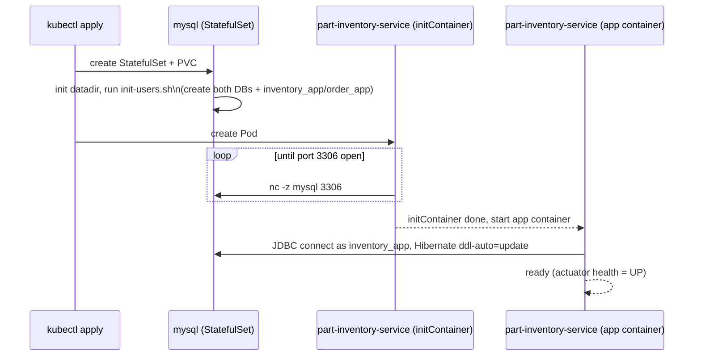

# part-order-app-java on Kubernetes (MySQL / prod-profile)

MySQL-backed variant of [`../k8s`](../k8s/NOTES.md). Same two services, same
REST call between them, but each service runs the `prod` Spring profile
against MySQL instead of an in-memory H2 database. One shared MySQL
instance backs both services, each with its own database and its own
scoped user. Lives in its own namespace (`part-order-app-mysql`) so it can
be applied alongside the H2 stack without colliding.

## What's different from the H2 (`../k8s`) stack

| | `../k8s` (dev / H2) | `k8s-with-mysql` (prod / MySQL) |
| --- | --- | --- |
| Namespace | `part-order-app` | `part-order-app-mysql` |
| Spring profile | `dev` | `prod` |
| Datastore | H2, in-memory, per-pod | One shared MySQL `StatefulSet`, two databases (`part_inventory_db`, `part_order_db`), one `PersistentVolumeClaim` |
| Seed data | `schema.sql` + `data.sql` run on every boot | none — `sql.init.mode: never` in `prod`, Hibernate `ddl-auto: update` creates empty tables |
| App replicas | 1 (state is per-pod, can't scale) | 2 (state lives in MySQL, safe to scale) |
| part-order-service NodePort | `30080` | `30081` (kept distinct so both stacks can run at once) |
| Credentials | none needed | one `Secret` (root + two per-service app passwords) shared by MySQL and both apps |

## Architecture

```mermaid
flowchart TB
    User(["Browser"])

    subgraph ns["Namespace: part-order-app-mysql"]
        direction TB

        subgraph db["mysql (shared)"]
            direction LR
            MSec["Secret: mysql-secret\nMYSQL_ROOT_PASSWORD\nINVENTORY_DB_PASSWORD\nORDER_DB_PASSWORD"]
            MInit["ConfigMap: mysql-init-scripts\ncreates both DBs + users\n(runs once, on first PVC init)"]
            MSvc["Service (headless)\nmysql :3306"]
            MSts["StatefulSet\nmysql, replicas: 1"]
            MPvc[("PVC\n2Gi\npart_inventory_db + part_order_db")]

            MSec -. envFrom .-> MSts
            MInit -. mounted at\n/docker-entrypoint-initdb.d .-> MSts
            MSvc --> MSts --> MPvc
        end

        subgraph order["part-order-service"]
            direction TB
            OCfg["ConfigMap\nSPRING_PROFILES_ACTIVE=prod\nMYSQL_HOST=mysql\nMYSQL_DATABASE=part_order_db\nMYSQL_USER=order_app\nINVENTORY_SERVICE_URL"]
            OSvc["Service\nNodePort :30081 to 8080"]
            ODep["Deployment\nreplicas: 2\ninitContainer: wait-for-mysql"]

            OCfg -. envFrom .-> ODep
            MSec -. ORDER_DB_PASSWORD .-> ODep
            OSvc --> ODep
        end

        subgraph inventory["part-inventory-service"]
            direction TB
            ICfg["ConfigMap\nSPRING_PROFILES_ACTIVE=prod\nMYSQL_HOST=mysql\nMYSQL_DATABASE=part_inventory_db\nMYSQL_USER=inventory_app"]
            ISvc["Service\nClusterIP :8080"]
            IDep["Deployment\nreplicas: 2\ninitContainer: wait-for-mysql"]

            ICfg -. envFrom .-> IDep
            MSec -. INVENTORY_DB_PASSWORD .-> IDep
            ISvc --> IDep
        end

        ODep -- "MYSQL_HOST:3306, as order_app" --> MSvc
        IDep -- "MYSQL_HOST:3306, as inventory_app" --> MSvc
        ODep -- "Feign client\nGET/POST /api/parts/*" --> ISvc
    end

    User -- "NodePort :30081" --> OSvc

    style ns fill:transparent,stroke:#8888aa,stroke-dasharray: 4 3
```

One MySQL server, two databases, two scoped users (`inventory_app` only has
privileges on `part_inventory_db`, `order_app` only on `part_order_db`) — so
even though the instance is shared, neither service can read or write the
other's tables. Each app pod only ever sees its own password (pulled from a
single key in `mysql-secret`), never the root password or the other
service's password.

## Startup ordering

The `mysql` StatefulSet has no startup dependency and comes up on its own —
on first boot it also runs `mysql/init-configmap.yaml`'s script once (only
while its data directory is empty) to create both databases and both users.
App Deployments need MySQL reachable and initialized before Spring Boot's
datasource connects, so each app Pod runs an `initContainer` that polls the
`mysql` Service's port 3306 with `nc -z` before the main container starts —
this avoids a noisy `CrashLoopBackOff` while MySQL is still initializing.



## Layout

```text
k8s-with-mysql/
  namespace.yaml
  mysql/
    secret.yaml
    init-configmap.yaml
    service.yaml
    statefulset.yaml
  part-inventory-service/
    configmap.yaml
    deployment.yaml
    service.yaml
  part-order-service/
    configmap.yaml
    deployment.yaml
    service.yaml
```

## Quick reference

| | part-inventory-service | part-order-service |
| --- | --- | --- |
| App image | `ram1uj/part-inventory-service:latest` | `ram1uj/part-order-service:latest` |
| App replicas | 2 | 2 |
| App Service type | ClusterIP | NodePort (`30081`) |
| MySQL database | `part_inventory_db` | `part_order_db` |
| MySQL app user | `inventory_app` | `order_app` |
| Health path | `/actuator/health/{liveness,readiness}` | `/actuator/health/{liveness,readiness}` |

MySQL itself: one `mysql` StatefulSet (headless Service `mysql`, :3306),
1 replica, 2Gi PVC, shared by both services above.

## Applying

```bash
kubectl apply -f k8s-with-mysql/namespace.yaml
kubectl apply -f k8s-with-mysql/mysql/
kubectl apply -f k8s-with-mysql/part-inventory-service/
kubectl apply -f k8s-with-mysql/part-order-service/
```

Give MySQL a minute on first boot (it's initializing a fresh datadir and
running the init script); the app Pods will sit in `Init:0/1` until their
`wait-for-mysql` initContainer succeeds — that's expected, not a failure.

Check status:

```bash
kubectl -n part-order-app-mysql get pods,svc,statefulset,deploy
kubectl -n part-order-app-mysql logs -f deploy/part-order-service
kubectl -n part-order-app-mysql logs mysql-0
```

## Reaching the app

- **minikube**: `minikube service part-order-service -n part-order-app-mysql`
- **kind / Docker Desktop**: `kubectl -n part-order-app-mysql port-forward svc/part-order-service 8080:8080`
  then open `http://localhost:8080`
- Direct NodePort access (`http://<node-ip>:30081`).

To inspect a database directly:

```bash
kubectl -n part-order-app-mysql exec -it mysql-0 -- \
  mysql -uinventory_app -p"$(kubectl -n part-order-app-mysql get secret mysql-secret -o jsonpath='{.data.INVENTORY_DB_PASSWORD}' | base64 -d)" part_inventory_db
```

## Iterating on code

```bash
./build-commands-mac.sh   # rebuilds and pushes both images
kubectl -n part-order-app-mysql rollout restart deploy/part-inventory-service
kubectl -n part-order-app-mysql rollout restart deploy/part-order-service
```

## Resetting the data

The PVC outlives `kubectl delete -f`, since `StatefulSet` deletion doesn't
remove its `volumeClaimTemplates`-created PVC. Deleting it wipes both
databases (they share the one volume) and re-runs the init script on next
boot:

```bash
kubectl -n part-order-app-mysql delete pvc data-mysql-0
```

## Deliberately left out (learning scope)

| Left out | Why / what changes to add it |
| --- | --- |
| MySQL HA / replication | Single-instance `StatefulSet`; a real prod setup would use replicas + a proxy (or a managed MySQL service) instead of a bare Pod |
| Backups | No `CronJob`/snapshot for the PVC data — add one before treating this as durable |
| TLS on the MySQL connection | JDBC URL uses `useSSL=false` (from `application-prod.yml`); fine on a private cluster network, not for anything crossing a trust boundary |
| A real secret manager | `Secret` objects here are plaintext `stringData` committed to git, meant only for spinning this up locally — swap for Sealed Secrets / External Secrets / Vault before this goes anywhere real |
| NetworkPolicy | Nothing currently stops other namespaces from reaching the `mysql` Service directly; add a `NetworkPolicy` restricting port 3306 to this namespace's app Pods if the cluster is shared |
