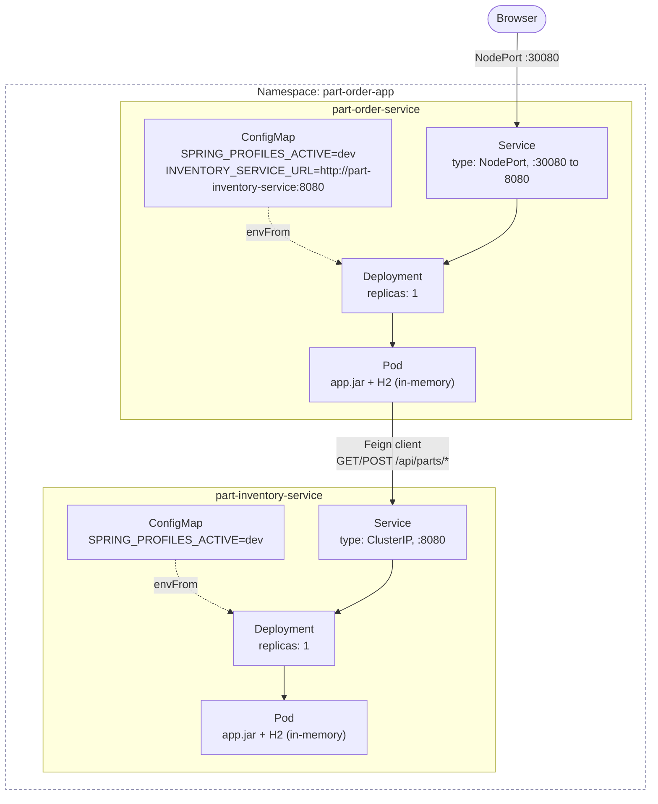
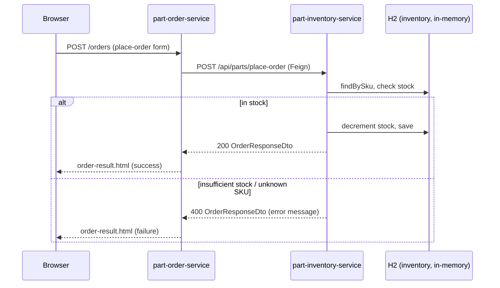

# part-order-app-java on Kubernetes (dev)

Manifests for running `part-inventory-service` and `part-order-service` on a
local dev cluster (minikube / kind / Docker Desktop), talking to each other
over REST via Kubernetes Service DNS. No MySQL — both services run with the
`dev` Spring profile, which uses an in-memory H2 database.

## Architecture



`part-inventory-service` has no external Service — the order service is its
only caller, so it stays `ClusterIP`-only inside the namespace.

## Request flow: placing an order



## Layout

```
k8s/
  namespace.yaml
  part-inventory-service/
    configmap.yaml
    deployment.yaml
    service.yaml
  part-order-service/
    configmap.yaml
    deployment.yaml
    service.yaml
```

## Quick reference

| | part-inventory-service | part-order-service |
| --- | --- | --- |
| Image | `ram1uj/part-inventory-service:latest` | `ram1uj/part-order-service:latest` |
| Replicas | 1 | 1 |
| Service type | ClusterIP | NodePort (`30080`) |
| Port | 8080 | 8080 |
| Profile | `dev` (H2 in-memory) | `dev` (H2 in-memory) |
| Health path | `/actuator/health/{liveness,readiness}` | `/actuator/health/{liveness,readiness}` |
| Talks to | — | `part-inventory-service:8080` (Feign) |

## How the pieces fit together

- **Images**: `ram1uj/part-inventory-service:latest` and
  `ram1uj/part-order-service:latest`, already built/pushed by
  `build-commands-mac.sh` in the repo root. `imagePullPolicy: Always` is set
  so re-running `docker buildx ... --push` + restarting the deployment picks
  up new code (with a `:latest` tag there's no digest change to trigger a
  rollout automatically — see "Iterating on code" below).
- **Namespace**: everything lives in `part-order-app`.
- **Service discovery**: `part-order-service` calls `part-inventory-service`
  through its `@FeignClient` (`InventoryServiceClient.java`), which reads the
  base URL from `INVENTORY_SERVICE_URL`. The order service's ConfigMap sets
  that to `http://part-inventory-service:8080` — the inventory Service's
  short DNS name, resolvable because both Deployments run in the same
  namespace.
- **No database config needed**: `application.yml` on both services defaults
  `spring.profiles.active` to `dev`, and `application-dev.yml` wires up
  `jdbc:h2:mem:...` with `schema.sql`/`data.sql` auto-run on startup. The
  ConfigMaps set `SPRING_PROFILES_ACTIVE=dev` explicitly so this doesn't
  depend on the image's baked-in default. The `prod` profile (MySQL via
  `MYSQL_HOST`/`MYSQL_USER`/etc.) is left untouched for later.
- **Config server import is optional**: `application.yml` has
  `spring.config.import: optional:configserver:...` — since it's `optional:`,
  neither service will fail to start without a config server present, so
  none is deployed here.
- **Replicas = 1 for both services**: H2 is in-memory and per-pod, so a
  second replica of either service would have its own disconnected copy of
  the data (parts/stock on inventory, order history on order-service).
  Scaling past 1 only makes sense once there's a real shared database.
- **Health probes**: both services expose actuator with
  `management.endpoint.health.probes.enabled: true`, which — once running
  inside a real Kubernetes pod — publishes `/actuator/health/liveness` and
  `/actuator/health/readiness`. The Deployments point `livenessProbe` /
  `readinessProbe` at those paths.
- **Exposure**: `part-inventory-service` is `ClusterIP` (internal only —
  `part-order-service` is its only consumer). `part-order-service` is
  `NodePort` (port `30080`) since it serves the human-facing UI
  (`home.html`, `place-order.html`, `orders.html`).

## Applying

```bash
kubectl apply -f k8s/namespace.yaml
kubectl apply -f k8s/part-inventory-service/
kubectl apply -f k8s/part-order-service/
```

(Apply order doesn't matter much beyond the namespace going first — Feign
calls fail/retry per-request rather than at startup, so it's fine if
part-order-service's pod comes up before part-inventory-service's.)

Check status:

```bash
kubectl -n part-order-app get pods,svc,deploy
kubectl -n part-order-app logs -f deploy/part-order-service
```

## Reaching the app

- **minikube**: `minikube service part-order-service -n part-order-app`
- **kind / Docker Desktop**: `kubectl -n part-order-app port-forward svc/part-order-service 8080:8080`
  then open `http://localhost:8080`
- Direct NodePort access (`http://<node-ip>:30080`) also works if the
  cluster's nodes are reachable (e.g. minikube's node IP via `minikube ip`).

To hit the inventory service directly for debugging (it has no
externally-facing Service):

```bash
kubectl -n part-order-app port-forward svc/part-inventory-service 8081:8080
curl http://localhost:8081/api/parts
```

## Iterating on code

Since both images are tagged `:latest`, changing code requires forcing a
fresh pull + restart after re-pushing the image:

```bash
./build-commands-mac.sh   # rebuilds and pushes both images
kubectl -n part-order-app rollout restart deploy/part-inventory-service
kubectl -n part-order-app rollout restart deploy/part-order-service
```

## Deliberately left out (dev scope)

| Left out | Why / what changes to add it |
| --- | --- |
| MySQL (Deployment/StatefulSet, PVC, Secret) | `prod` profile in both services already expects `MYSQL_HOST`, `MYSQL_USER`, `MYSQL_PASSWORD`, etc. — wire those up when moving off `dev` |
| Ingress | NodePort is enough for local dev; add an Ingress + controller once this targets a real cluster |
| Tuned resource requests/limits | Current values (100m/256Mi requests, 500m/512Mi limits) are conservative placeholders, not load-tested |
| HPA / PodDisruptionBudget | Not meaningful at 1 replica with in-memory, per-pod state |
